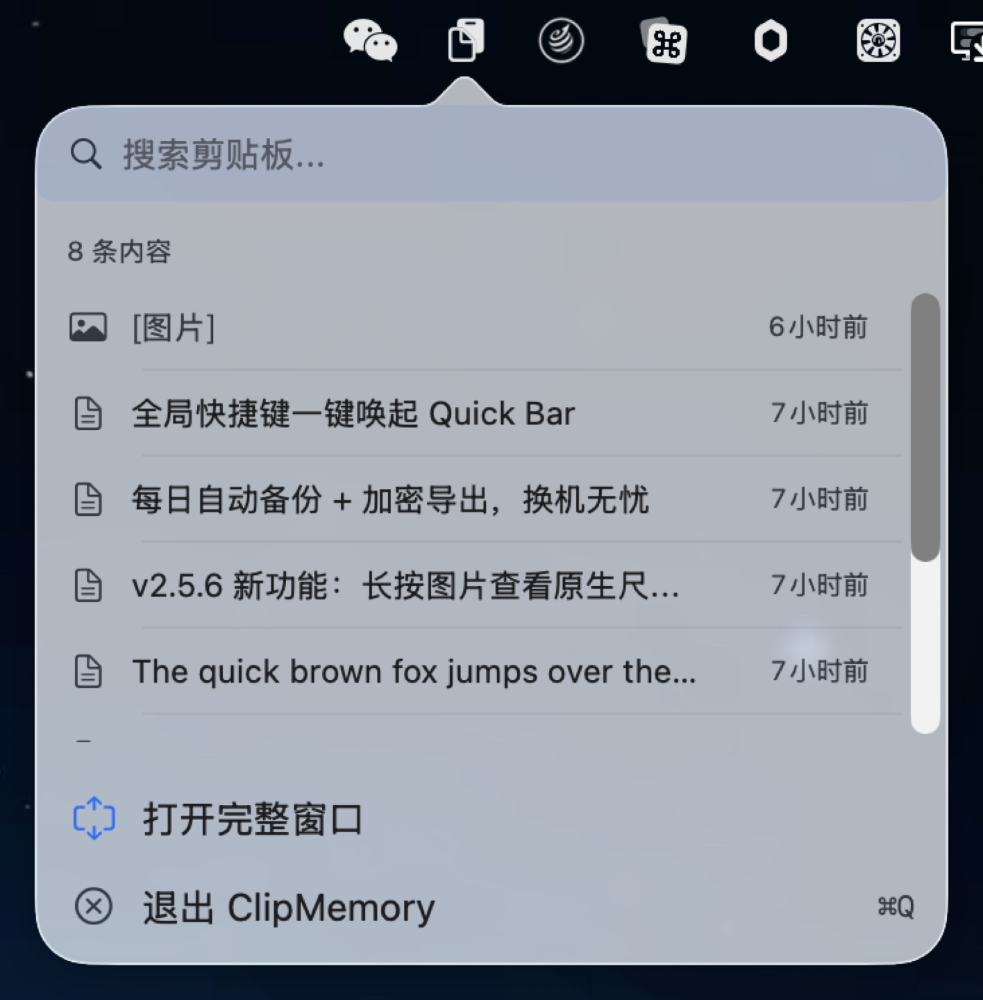
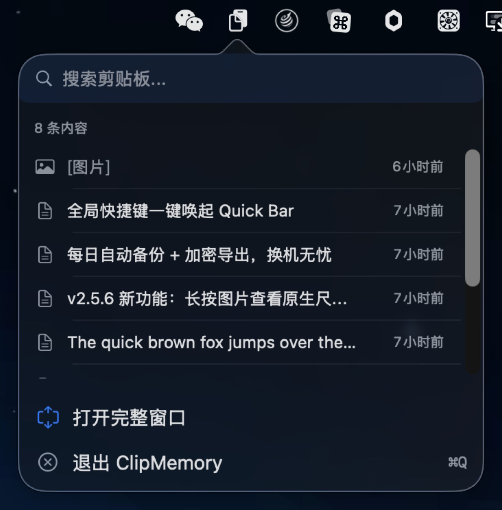
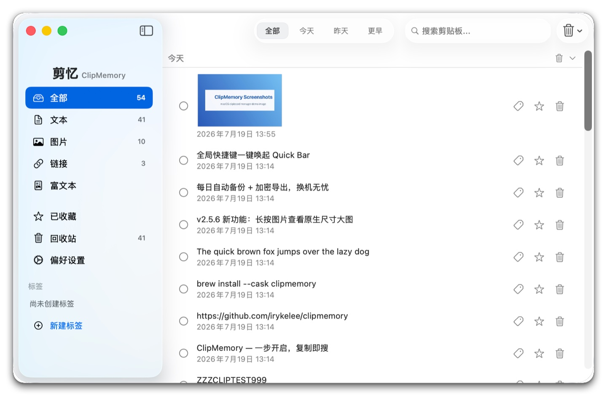
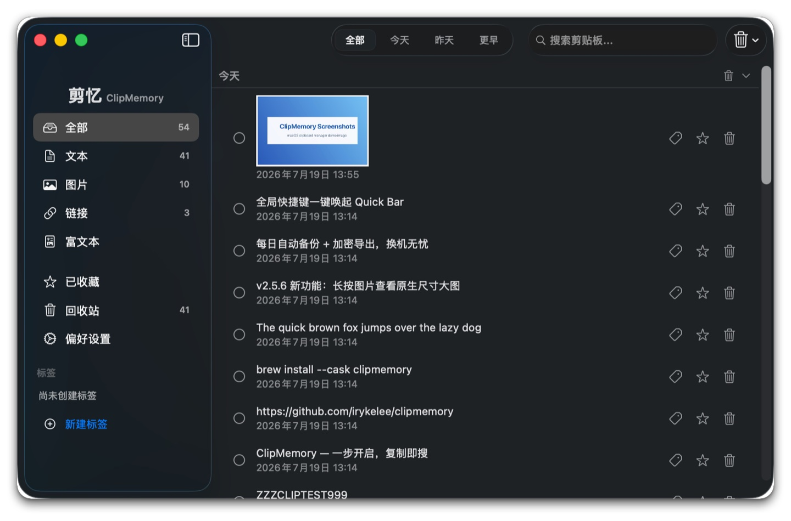

# 剪忆 ClipMemory v2.8.1

**新一代 macOS 剪贴板管理器 — 一步开启，复制即搜**

[English](./docs/lang/README_EN.md) · [简体中文](./README.md) · [繁體中文](./docs/lang/README_ZH-HANT.md) · [日本語](./docs/lang/README_JA.md) · [한국어](./docs/lang/README_KO.md) · [Español](./docs/lang/README_ES.md) · [Português](./docs/lang/README_PT.md)

---

<p align="center">
  <br>
  <em>菜单栏一键唤起 Quick Bar — 最近 8 条，即搜即复制（浅色）</em>
</p>

<p align="center">
  <br>
  <em>菜单栏一键唤起 Quick Bar — 最近 8 条，即搜即复制（深色）</em>
</p>

<p align="center">
  <br>
  <em>主窗口：类型侧边栏 × 时间分组 × 搜索高亮（浅色）</em>
</p>

<p align="center">
  <br>
  <em>主窗口：类型侧边栏 × 时间分组 × 搜索高亮（深色）</em>
</p>

---

## v1 → v2 核心升级

| 维度 | v1 | v2 |
|------|----|----|
| **交互入口** | 菜单 → 菜单 → 窗口（三步） | Quick Bar 弹窗（一步） |
| **主界面** | 固定宽度，无侧边栏 | 固定侧边栏，随时切换类型 |
| **全局快捷键** | 仅 Cmd+Ctrl+V | 支持自定义录制 |
| **Quick Bar** | 无 | 最近 8 条弹窗，即搜即复制 |
| **搜索高亮** | 文本覆盖高亮 | 不区分大小写，不乱码 |
| **长按预览** | 无 | 0.4s 揭示全文 / 敏感 / 图片原图 |
| **时间分组** | 无 | 今天 / 昨天 / 更早，可折叠 |
| **标签系统** | 无 | 创建 / 删除 / 自定义颜色，侧边栏过滤 + 智能建议 |
| **回收站** | 删除即销毁 | 删除进回收站可恢复，保留期可配 |
| **自动更新** | 手动下载 | 后台自动检查，一键安装重启 |
| **本地备份** | 无 | 每日自动备份 + 加密备份包导出 / 导入 |

---

## 📋 更新日志

### v2.8.1 (2026-08-08) — 修复 saveItems 静默失败 + 5 项审计加固

- **� 修复 saveItems 静默吞错导致剪贴板数据丢失（ID-SILENT-0021 HIGH）** — `ClipboardStore.flushSave()` 现在捕获 `saveItems()` 抛错并 `needsSave = true` 保留重试状态 + post `.clipboardSaveFailed` 通知 UI 通道；之前磁盘满 / 权限错 / iCloud 冲突持续 ≥ 500ms debounce 窗口 + 用户退出前无后续 mutation 时，本次 session 的剪贴板捕获会**永久丢失**（用户不可重建）。触发条件严格化（不是每次失败都丢）：磁盘错持续 + 500ms 窗口 + 期间无 mutation 触发 `saveImmediately` 重存 + 用户退出 → 4 个条件全部成立才真丢；任一不满足被掩盖。新增 `Notification.Name.clipboardSaveFailed` 兜底 UI 通道。
- **🛠 修复 key re-ready 后 session 内永久空白行（ID-SILENT-0019 MEDIUM）** — `handleCryptoKeyPrepared(success:)` 分支现在除清 `pendingFailedIDs` 外，额外重置所有 `items[].decryptionFailed = false`；之前 `mergePendingDecryptionFailures` 把 flag 写下去后即使用户后续收到 key 就绪通知，session 内一直空白、必须重启 app 才恢复。配合 v2.8.0 (ID-STORE-0010) 形成完整对称：负缓存清 + pendingFailedIDs 清 + decryptionFailed flag 重置 = cold-start key-not-ready 窗口的数据丢失彻底闭环。
- **🛠 修复 release-config XCTest 隔离失效（ID-SYNC-0006 MEDIUM）** — `NoOpFeedProbeEngine` class + `_sharedDefault` 的 `if isRunningTests` guard 移出 `#if DEBUG`。XCTest framework 设置 `XCTestConfigurationFilePath` env var 与 build config 无关，release-config XCTest 跑测试时 guard 之前会被 `#if DEBUG` 编译掉、真实 `SPUStandardUpdaterController` 启动 + 真实 appcast HTTP probe → 重新触发 NEW-3 想阻止的污染路径。class 安全（`@unchecked Sendable` + 无 mutable state）移出 DEBUG 后 release production 零成本。
- **🛠 7 项 LOW doc/log 收紧（MISC-0008/0009/0013 + SHELL-0001/0002 + SECURITY-0008 + SILENT-0022）**
- **🛠 7 处 XCTest notification test 改 observer-driven 等待（ID-TEST-0001）** — `CryptoKeyPreparedNotificationTests` + `ClipboardStoreDecryptionFlagResetTests` 共 7 个 case 把 `DispatchQueue.main.asyncAfter(deadline: .now() + 0.1) { exp.fulfill() }` 的 100ms 时间等待换成 `NotificationCenter.addObserver(forName:object:queue:.main) { exp.fulfill() }` + `defer { removeObserver }` 的 observer-driven 模式。CI 负载下 100ms 窗口可能不够 → flaky；idle 机器 100ms 是浪费。observer 注册同步 → wait 在 observer 触发的瞬间返回（典型 <1ms）。
- 完整 changelog: https://github.com/irykelee/clipmemory/releases/tag/v2.8.1

### v2.8.0 (2026-08-07) — 新增 Gitee 镜像通道 + 测试与质量硬化

- **🆕 设置页新增 Gitee 镜像通道** — 国内下载加速：设置 → 更新源 → Gitee（中国镜像），与 jsDelivr 双轨可用；国内 Sparkle 推送路径首次完整
- **🛡 加密安全加固** — 启动期 `.cryptoKeyPrepared(success)` 时新增清空 `pendingFailedIDs`，与既有 `negativeCache` 清空对齐（ID-STORE-0010 HIGH）— 修复 cryptoKey 重 ready 后旧条目被永久压制
- **🛠 测试基础设施硬化 (NEW-1..9 + CI 闸门)** — 生产 UserDefaults 隔离 + UpdateService hermetic + ZZZ canary 校准 + CI 最低测试数强制
- **🛠 更新源 fallback 正确性 (NEW-5/6/7)** — `latestVersionString` 取末项 + `FeedProbeEngine` fallback 按 id 绑定 + 繁體中文 5 处镜像术语修正
- **🛠 Release 工具链硬化** — `Scripts/release.sh` `grep -c` 算术错修复 + `Scripts/rollback-release.sh` Confirm gate 防 agent 挂死

- 完整 changelog: https://github.com/irykelee/clipmemory/releases/tag/v2.8.0

### v2.7.9 (2026-08-05) — 设置页新增版本对照

- **🆕 设置页更新源新增「当前版本 vs 最新版本」对照** — 一眼看出是否需要升级；尚未完成首次更新检查时仅显示当前版本，不显示"已是最新"标记，避免假绿
- **🛠 发布流程加固（REL-24..28 五轮优化）** — AI agent 5 条硬规则脚本头注释、`--yes` 非 TTY 双因子护栏、发布回滚工具（`Scripts/rollback-release.sh`）、发布后手动步骤确认 gate、release notes 默认描述自动填、bash 5.3 全角括号 unbound 变量 bug 修复
- **🛠 Homebrew tap CI 上线** — `irykelee/homebrew-clipmemory` 新增 `cask-audit.yml`（brew audit + brew style），从此 Cask 缩进 / stanza 顺序 / 格式错误能在发版前抓出，避免重复"tap Cask 不合规"事故
- **🛠 发布工具链实体化进主仓库** — `Scripts/release.sh` + `Scripts/rollback-release.sh` + `Scripts/README-release.md` + `Scripts/test/test_release.sh` 现已正式 git 跟踪（原先是 symlink 指向本地平行仓库 `ClipMemory-local`，任何人 clone 主仓库会得到断链的 symlink；该平行仓库于 2026-08-05 归档）
- **🛠 Tap Cask 模板化** — 新增 `Scripts/cask-template.rb`（rubocop-clean），Release workflow 用模板 + 占位符生成 tap Cask，告别内联 heredoc 引发的 YAML 缩进泄漏
- **🌏 国内用户可切换 Gitee 镜像源** — 设置 → 更新与关于 → 更新源 → 镜像 (Gitee)；Gitee 镜像完整托管 appcast + 安装包，国内网络无需翻墙即可检查更新

- 完整 changelog: https://github.com/irykelee/clipmemory/releases/tag/v2.7.9

### v2.7.8 (2026-08-04) — 搜索与设置体验优化

- **设置页 6 处新增使用说明（热键、历史、OCR、排除应用、备份、升级源），不再靠截图猜操作** — Settings pages now have 6 in-context explanations so users don't need to guess
- **主窗口最小尺寸提升到 850×600，搜索框样式贴近 macOS 26 系统默认** — Min window size raised to 850×600; search box matches macOS 26 system default
- **品牌 Logo 字号统一为 sz(18)，跨语种视觉一致** — Brand logo unified at sz(18) across all locales
- **侧边栏搜索搬到主窗口、工具栏加 macOS 风格、整体高度提升** — Sidebar search promoted to main window; macOS-style toolbar with taller min height
- **设置窗口居于主窗口中央，避免看不见** — Settings window now centers on the main window when visible
- 完整 changelog: https://github.com/irykelee/clipmemory/releases/tag/v2.7.8

### v2.7.7 (2026-08-01) — 搜索体验与可靠性修复

- **搜索不再卡顿** — 搜索含富文本的历史时，此前会在主线程逐条解密导致明显卡顿；现在冷缓存条目先跳过、后台预热完成后自动出现在结果中
- **QuickBar 搜索更完整** — 搜索时未解密的条目此前会被静默漏掉且不会补全；现在预热完成后结果自动刷新补全
- **重复条目自动合并** — 启动密钥就绪后，历史中的重复条目（含此前启动窗口期漏网积累的）现在会自动合并清理
- **图片浏览更快** — 图片读取不再被后台的旧格式迁移任务阻塞
- **修复回收站条目整会话空白** — 登录自启动且密钥链尚未解锁时，回收站的文本/链接条目此前一直空白且不自愈
- 完整 changelog: https://github.com/irykelee/clipmemory/releases/tag/v2.7.7

### v2.7.6 (2026-08-01) — 稳定性与数据安全加固

- **过期自动清理改为进回收站，置顶条目永久豁免** — 达到保留上限的自动清理此前会永久删除条目；现在改为移入回收站（可随时找回），且置顶（收藏）条目不再被自动清理
- **加密链路加固** — 密钥链读取出错时不再误覆盖根密钥（避免极端情况下全部历史无法解密）；废弃密钥文件改为安全覆写后删除；备份目录权限收紧为仅本人可读
- **OCR 更健壮** — 图片文字识别遇到瞬时失败（如系统资源紧张）时，下次启动自动重试，不再永久跳过
- **修复解密失败条目偶发显示「无法读取」并被缓存** — 密钥就绪晚于界面加载时的偶发空白/误报，现在会自动重试恢复显示
- **修复 QuickBar 搜索框键盘死区** — 搜索框聚焦时 Enter（复制选中项）与 Esc（关闭）此前无效，现已恢复
- 完整 changelog: https://github.com/irykelee/clipmemory/releases/tag/v2.7.6

### v2.7.5 (2026-07-31) — 紧急修复

- **修复图片预览右侧空白条** — 竖屏上打开接近屏幕高度的长截图时，预览面板右侧出现大片空白区域，现已按图片实际宽度自适应显示
- **修复自动更新检测器死代码** — v2.7.4 的 Sparkle 自动更新检测器未启动，导致该版本**无法收到本版本的自动更新推送**。已在 v2.7.5 修复，后续版本自动更新恢复正常
- **修复回收站操作崩溃** — 删除或恢复回收站内项目时可能触发崩溃（或静默操作到错误的项目），现已修复
- **修复防抖保存定时器静默失效** — 标签编辑、回收站操作等非即时落盘路径的防抖保存，在首次触发后会停止工作；崩溃或强制退出将丢失上一次启动后的全部标签/回收站变更
- **修复含回收站条目的备份无法导入** — 任何包含非空回收站的备份文件在导入时都会失败，现已兼容
- 完整 changelog: https://github.com/irykelee/clipmemory/releases/tag/v2.7.5

### v2.7.4 (2026-07-31) — 宽图预览白屏修复 + 6 项 OCR 优化 + 性能提升

- **🔍 6 项 OCR 优化（CJK / 去重 / 超时 / 内存）** — CJK 识别降级时新增通知与 userLocale 日志、图片去重后旧 UUID 的 OCR 结果不丢、Vision 调用 15 秒自动取消、6K HEIC 预览内存从 ~100 MB 降至 ~16 MB（`thumbnailMaxPixelSize=2048`）
- **⚡️ 搜索 / 复制性能提升（多项后台优化）** — UUID→索引字典 O(1) 查找、拼音结果按内容缓存（1000 次匹配从 1340 ms 降至 77 ms）、JSONEncoder 复用、cleanup 单遍扫描、cold-start AES-GCM 预填
- **🖼️ 宽图长按预览不再白屏** — 主屏旋转为 portrait 时复制 16:9 截图，1 像素超出 cap 宽度的边界情况不再产生 2000+ 像素白底（panel 自动贴合图片尺寸）
- **🔇 OCR 路径加最小文字高度阈值** — `minimumTextHeight = 0.01`（默认 0.02 是为印刷文档调校的），小字号终端截图 / 12-pt 视网膜截图现在能被识别
- **🌐 7 语言本地化补完** — 标签徽章无障碍、tag picker 添加建议、加密失败提示等多种数 L10n 修复
- 完整 changelog: https://github.com/irykelee/clipmemory/releases/tag/v2.7.4

### v2.7.3 (2026-07-30) — 审计驱动修复 + 7 语言 VoiceOver 无障碍

- **🚀 性能提升（多项后台优化）** — JSONEncoder 复用、缓存预热并发上限、清理任务单遍扫描、冷启动 AES-GCM 解密预填；数千条历史下粘贴与搜索明显更顺
- **🌐 7 语言 VoiceOver 无障碍** — 主菜单 / 搜索框 / 欢迎页 / 标签 chip / 应用排除列表 / 日期过滤按钮 / 剪贴板项类型标签全部本地化；非英语用户首次可用 VoiceOver 流畅使用
- **🧹 生命周期加固** — 关闭欢迎/设置窗口不再内存泄漏；TrashStore / FeedProbeEngine 在 deinit 时正确清理后台任务；ImageStorage 在 App 退出前 flush 未完成写入
- **🔇 沉默错误改为可见** — 10 处 `try?` 吞错点现在记录到日志并通知 UI（图片迁移写失败、孤儿文件残留、备份暂存目录清理失败等），便于排查
- **AES-GCM 解密失败不再永久污染条目** — Keychain 瞬态锁定时触发的解密失败，现在 key 恢复后会自动重试（旧 bug 会永久标记条目不可解密）
- 完整 changelog: https://github.com/irykelee/clipmemory/releases/tag/v2.7.3

### v2.7.2 (2026-07-29) — 模糊搜索 + 图片完整性扫描 + 加密安全加固

- **拼音感知模糊搜索** — 「zhongwen」也能匹配「中文文档」；空格分隔的多个词必须全部命中，同时忽略大小写和音调符号
- **启动时图片完整性扫描** — App 启动后异步扫描所有图片条目，标记缺失/损坏文件，列表项立即显示状态
- **加密失败诊断** — Keychain 锁定时搜索页显示黄色诊断横幅说明原因，不再静默空结果
- **缓存预热** — 主线程不再同步解密；预热覆盖 App 唤醒、新条目捕获、列表首次显示
- **Keychain 临时锁定不再永久标记条目** — 修了一个潜伏 bug：临时锁定后条目曾被永久标记为「不可解密」，现在 key 恢复后可自动重试
- 完整 changelog: https://github.com/irykelee/clipmemory/releases/tag/v2.7.2

### v2.7.0 (2026-07-28) — F-1 @MainActor migration

- **启动时语言 picker 与 UI 文案一致性修复** — 之前如果保存的是非英语语言，启动后 Settings 窗口内的 UI 文案仍然是英文（Language picker 显示正确）。v2.7.0 修复后，启动即生效。
- **核心类全面 Swift 并发兼容** — `LanguageManager` / `TrashStore` / `ClipboardStore` 三个核心类加 `@MainActor`，由类型系统保护 main-thread contract，避免未来回归。
- **657 个测试全过，0 失败** — 内部架构加固无功能回归。
- **启动时非英语语言 UI 文案仍显示英文** — Swift `didSet` 在 `init()` 内不触发，新增的 `currentLanguageCode` 镜像需显式 seed 才能从启动时刻起可用。
- **`LanguageManager` 改用 `nonisolated` 镜像** — `L10n.string()` 等 off-main reader（来自 `CryptoService.prepareKey` failure handler 等 `Task.detached`）读语言代码不再跨 main-actor 边界。
- 完整 changelog: https://github.com/irykelee/clipmemory/releases/tag/v2.7.0

### v2.6.2 (2026-07-27) — 图片搜索高亮与标签筛选

- **图片搜索结果直接显示 OCR 文字**：主列表和快速弹出框中，截图条目下方会出现青色高亮的识别片段，匹配搜索词的部分醒目可见。设置 → 历史记录中可关闭（仅关闭显示，过滤仍生效）。
- **标签筛选改为「同时包含」语义**：勾选多个标签时（如「中国大陆」+「2026」），只显示同时被打上这两个标签的条目，不再是任一标签即命中。
- **标签筛选时主列表顶部出现提示条**：当前激活的标签以胶囊形式列出，每个胶囊右侧 × 可单独移除，右侧「全部清除」可一键清空；同时显示「显示 X / 共 Y 条」数量，一眼看出过滤生效。
- **搜索框右侧增加 × 一键清空按钮**：搜完一个关键词后点 × 直接清空，无需逐字删除；搜索框自动获得焦点，可立即输入下一个关键词。
- **回收站删除后列表即时刷新**：之前删除回收站条目后需要触发其他操作才能看到列表刷新，现在点完「永久删除」/「清空」立即生效。
- 完整 changelog: https://github.com/irykelee/clipmemory/releases/tag/v2.6.2

### v2.6.1 (2026-07-26) — Audit Fixes & QuickBar Repair

- 修复了快捷栏「打开完整窗口」按钮第二次点击无反应的问题，菜单栏体验恢复流畅
- 全面代码审计后修复了 15 项潜在问题：加密密钥故障弹窗不再侵入底层服务、回收站独立模块化、OCR 错误可诊断、设置页视觉回归有守护
- **快捷栏「打开完整窗口」第二次无反应** — 窗口关闭后 @State 被重置，现在窗口实例保持稳定，每次点击都能正常打开
- **全新安装时加密密钥就绪前捕获的内容可能跨线程崩溃** — 极端情况下（首次启动的数毫秒内复制）不再触发并发异常
- **标签和回收站保存每次新建后台队列** — 批量操作（导入 100 个标签、清空回收站）不再产生资源抖动
- 完整 changelog: https://github.com/irykelee/clipmemory/releases/tag/v2.6.1

### v2.6.0 (2026-07-25) — 独立设置窗口

- **⚙️ 全新独立设置窗口** — 设置从主窗口侧边栏迁出，改为独立窗口，顶部按「常规 / 历史与捕获 / 备份 / 更新与关于」四组分页；`⌘,`、菜单栏图标、Quick Bar 菜单均可直达，窗口不再随主窗口开关而丢失
- **🖥 全面适配 macOS 26 Tahoe** — 主窗口标题栏恢复与侧边栏融合的磨砂质感（不再是突兀的白色条带）；修复 Tahoe 上设置下拉菜单选项全部显示 `(null)` 的系统 stringsdict 渲染问题
- **🔤 字号设置即时生效** — 小/中/大切换后所有列表、标签、弹窗文字立即重排，不再需要重启 App
- **🛡 34 项审计修复落地** — 全新安装首次复制不再因密钥初始化竞态丢条目；OCR 识别结果改为随保存节奏落盘，断电不再整批丢失；备份导入在合并数据前先校验清单，损坏包更早报错
- **独立设置窗口（4 组分页）** — 设置项按主题分组，页面不再无限变长；支持 `⌘,` 快捷键与菜单栏入口
- 完整 changelog: https://github.com/irykelee/clipmemory/releases/tag/v2.6.0

### v2.5.13 (2026-07-25) — 审计修复扫尾

- **🛡 历史数据更抗损** — 未来版本新增条目类型后，旧版本打开不再整个清空历史（未知类型降级为纯文本保留）；备份包清单新增计数/盐长度/版本下限校验，损坏包明确报错而不是静默导入一半
- **🔒 密码管理器内容不再被捕获** — 识别 `ConcealedType`/`TransientType` 剪贴板标记，1Password 等应用复制的内容按系统约定直接跳过
- **⚡ 复制图片不再卡顿** — 复制未缓存图片时磁盘读取与解密移到后台，主线程不再被阻塞
- **🌐 更新源状态面板说人话** — 「最近切换」不再显示英文枚举原文，改为 7 语言本地化文案，且只有真正发生切换时才记录
- **🇰🇷 韩语 README 修正** — 两处混入的日语残句改回韩语
- 完整 changelog: https://github.com/irykelee/clipmemory/releases/tag/v2.5.13

### v2.5.12 (2026-07-24) — 稳定性与数据安全大修

- **🛡 数据安全集中修复** — 全面代码审查后的 30+ 项修复：剪贴板历史不再因密钥初始化竞态整会话静默丢失（STOR-1）；更新源探测不再自我取消导致镜像容灾完全失效（UPD-1）；富文本条目恢复按内容搜索（CLIP-1）；图片条目支持去重，同一张截图重复复制不再产生重复文件和列表项
- **🖼 OCR 文字不再丢失** — 复制图片条目、导入备份、旧版图片迁移都不再清掉已识别的 OCR 文字（STOR-2）
- **⚡ 启动与操作更流畅** — 旧版图片迁移移出启动主线程；QuickBar 搜索结果缓存不再每次渲染重复过滤；标签面板打开只跑一遍分词管线；JSON 持久化编码移入后台队列
- **🔔 错误提示不再刷屏** — 加密失败弹窗按来源 60 秒聚合计数，OCR 回填失败时不再连环弹窗
- **💾 备份导入更安全** — 备份包解压校验符号链接与路径越界、JSON 读取加 100 MB 上限；`.incomplete` 标记删除失败不再静默吞错
- 完整 changelog: https://github.com/irykelee/clipmemory/releases/tag/v2.5.12

### v2.5.11 (2026-07-23) — ContentView 拆分 + 16 项 bug 修复

- **🏗 ContentView 拆分 (NEW-7 Phase 4)** — 主列表 / 选择 / 批量操作 / 删除 alerts 全部从 ContentView 抽出到独立 `ItemListView`（287 行）；ContentView 1178 → 995 行（-15.5%）
- **🛡 数据安全 4 件套** — `maxItems` setter clamp 1...10_000；`backupNow()` 串行化（NSLock）；`addTag()` trim 空白；`ClipboardItemRow` observe LanguageManager
- **🌐 i18n plural support (F-7)** — 6 个 %d keys 走 `.stringsdict`（batch.selected / quickbar.recent / trash.emptyConfirm.message / alert.clear.message / settings.max.items.count / clear.conditional.confirm）
- **🛡 Settings "Back Up Now" 错误可见 (F-4)** — `try?` 改 do/catch + onShowBackupError callback
- **🛡 QuickBar ⌘F (F-9)** — popover 环境下也能 focus search field
- 完整 changelog: https://github.com/irykelee/clipmemory/releases/tag/v2.5.11
### v2.5.10 (2026-07-22) — 备份错误可见 + UI 重构 + SwiftUI 警告修复

- **🛡 备份包损坏可见（BUG-024）** — 损坏的 items.json / trash.json / tags.json / 图片文件不再静默导入 0 条；现在导入失败会 throw `corruptedData` 并在设置页弹窗提示
- **⚡ SidebarView 抽取（NEW-7 Phase 3）** — ContentView 从 1162 行减至 1123 行；侧边栏独立的 11 参数显式接口，单测 + 手动验证 7/7 通过
- **🛡 SwiftUI @State 警告修复（BUG-009）** — `ClipboardItemRow` 高亮缓存从 `@State` 字典迁移到 `NSCache`；不再触发"Modifying state during view update"运行时警告，缓存 countLimit=500 上限防内存泄漏

### v2.5.9 (2026-07-21) — 卡死检测 + 全量审计修复

- **🛡 卡死检测（HangDetector）** — 主线程心跳 + 30s 探针；首次检测到主线程 60s 不响应即记 stack + 自动恢复；避免 UI 真正卡死后无声无息
- **🛡 备份包 PBKDF2 升级** — 600k 轮 PBKDF2-SHA256 取代单轮 HKDF，弱口令离线暴力破解成本提升 ~10⁵ 倍（OWASP 2023 合规）；老包透明兼容
- **⚡ RTF 复制缓存桥接** — `copyToClipboard` RTF 分支命中 cache 后 < 1ms（之前每次重解析 20-100ms 阻塞主线程）；cache 跨 list/quickbar 自动桥接
- **🛡 UI 状态不丢失** — search bar 输入不再因 `@State didSet` 不经 Binding 触发导致键盘高亮残留；sidebar 标签 badge 不再因 tag 增减 stale
- **🛡 主线程 IO 后台化** — `copyToClipboard` image/RTF 路径不再阻塞剪贴板轮询；备份导出 50MB size guard 防 OOM

### v2.5.8 (2026-07-20) — 稳定性审计 + 23 项修复

- **🛡 备份导出 / 导入加固** — 卡住的 `ditto` 不再无限阻塞 UI（30s 超时 + SIGKILL 升级）；HKDF 盐用 OS CSPRNG 失败时显式报错，不再静默用零填充
- **⚡ RTF 解析移到后台队列** — 大体积富文本粘贴不再让剪贴板轮询卡顿；OCR/图片识别也走后台，主线程更顺
- **🛡 SwiftUI 渲染警告修复** — 列表项数变化触发的「Modifying state during view update」警告消除，无多余重复渲染
- **🔧 内存存储线程安全** — 测试与未来多线程 caller 不再因 `MemoryStorageBackend` 数组 mutation 崩溃 / 丢数据
- **🏷 标签色 fallback 修复** — 无效 hex 颜色回退到主题色，浅色 / 深色模式下都可见

### v2.5.7 (2026-07-20) — HangDetector 观测 + 关键 bugfix

- **🛰️ HangDetector 观测模块** — 后台 watchdog 自动检测主线程卡死 >60s 并记录完整堆栈 + 恢复时间，方便事后定位疑难 bug
- **🛡️ 修复 HMAC 失败时静默丢数据** — Keychain 异常时复制内容不再被当重复项丢弃
- **🛡️ 修复 QuickBar 键盘导航崩溃** — 选中项被外部删除后按 ↑↓ 不再 OOB crash
- **🧪 测试 force-unwrap crash 修复** — XCTAssertNotNil + `!` 模式改为 `guard let ... XCTFail(...) return`，测试失败优雅记录
- **🖼️ 图片加载并发竞态修复** — legacy 图片迁移多线程并发，写串行化避免数据竞争
- **🛡️ Excluded-app 配置 TOCTOU 修复** — 增原子 `updateExcludedBundleIds` API
- **🧹 主窗口批量选择工具栏状态残留修复** — 单行删除后工具栏正确消失

### v2.5.6 (2026-07-19) — 密钥入钥匙串 + 原图预览 + 启动加固

- **🔐 密钥迁至钥匙串** — 加密根密钥从明文文件迁入 macOS 钥匙串（仅本机、不同步 iCloud），brew 卸载（zap）时一并清除
- **🖼 图片原图预览** — 长按图片弹出原生尺寸浮窗，超宽/超长截图可滚动查看，文字清晰可辨（取代原 300px 行内放大）
- **🛡 启动加固** — 密钥损坏或无法保存时不再直接崩溃，改为清晰弹窗：可退出、重试或重置（重置会清空历史）
- **🌐 镜像源需确认** — GitHub 更新服务器不可达时，首次切换 jsDelivr 镜像前征求同意并记住选择；镜像内容过旧自动拒绝

### v2.5.5 (2026-07-18) — 分类删除 + 稳定性加固

- **🗑 按条件删除** — 顶栏 🗑 新增「按条件删除」：类型 × 时间组合（如只删更早的图片、保留今天的）；文本/图片/链接/富文本 tab 右键一键删全部该类型；每个时间组 header 新增组删除按钮
- **🏷️ 删标签选项** — 删除标签时可选「仅删除标签」或「标签和内容一起进回收站」
- **🔧 备份导入加固** — 跨机导入时标签名正确解密（不再乱码）；修复包内重复条目重复导入、解密失败条目误导入、大包导入卡顿、备份清理误删非备份文件等问题

### v2.5.0 (2026-07-18) — 本地备份 + 导入导出

- **💾 本地自动备份** — 每天首次启动自动备份剪贴历史（含标签、回收站、图片）到本地 Backups 目录，默认保留 7 份（3/7/14/30 可选），数据丢失兜底
- **📦 备份导出 / 导入** — 一键导出 .clipmemory 加密备份包（密码保护），换机或重装后导入即可恢复；导入自动与现有数据合并去重，不覆盖现有内容
- **⚙️ 设置页新增「备份」** — 自动备份开关、保留份数、立即备份、打开备份目录、导出/导入入口

### v2.4.2 (2026-07-18) — 稳定性修复 + 更新双渠道

- **🌐 更新渠道双保险** — GitHub 不可达时自动切换 jsDelivr 镜像检查更新；有更新时 App 自动来到前台并显示 Dock 角标（gentle reminders），不再静默错过
- **💾 数据安全** — 新剪贴内容即时落盘：此前 500ms 防抖窗口内 kill -9 / 断电会丢失最新内容
- **🐛 稳定性修复** — SwiftUI「Modifying state during view update」告警刷屏（每秒数十次 → 0）；热键被占用时每次启动重复刷 -9878 错误日志

### v2.4.1 (2026-07-18) — 更新源修复

- **🌐 修复「检查更新」报错** — 更新源从 raw.githubusercontent.com（部分网络不可达）迁移到 GitHub Release 资产，检查更新秒回。v2.4.0 用户如遇「更新错误」提示，请手动下载一次 v2.4.1，之后恢复自动更新

### v2.4.0 (2026-07-18) — 回收站

- **🗑️ 回收站** — 删除条目不再直接销毁，而是先进入回收站保留 7 天（可在设置中调整），期间可随时恢复或彻底删除；清空回收站带确认弹窗；自动清理过期条目
- **✨ 自动更新（Sparkle 2）** — 应用内自动检查更新：后台每日检查 + 设置页手动检查；更新包经 EdDSA 签名校验后一键安装重启；Homebrew Cask 已声明 auto_updates
- **数据安全** — 图片文件随回收站条目保留，彻底清除时才删除；自动清理（trim/expire）不进入回收站，避免误留垃圾
- **UI 更新** — 侧边栏新增「回收站」入口（badge 显示数量）；删除确认弹窗文案更新为「移至回收站」；回收站条目显示删除时间
- **测试** — 新增 12 项回收站专项测试，全部通过

### v2.3.0 (2026-07-17) — 标签系统与数据完整性

- **🏷️ 标签系统（Tag System）** — 完整标签生命周期：创建 / 删除 / 自定义颜色；侧边栏 tag section + 跨 section AND / in-section OR 过滤；智能 tag 建议（基于 NLTagger：代码 / 邮箱 / 凭据 / 敏感）；TagPicker sheet（行内 chips + 长按弹选择器）；删除确认对话框
- **6 个数据完整性严重修复** — saveTimer 线程竞争 UB；FileStorageBackend 同步落盘；flushPendingSaves 同步 flush tag；legacy image items 错误加密标记修复；contentHash backfill；ImageStorage 部分失败 recovery
- **UI 改进** — Welcome window dedupe；Esc 取消 hotkey recording（返回 event 给 responder）；跨午夜自动刷新 currentDate；Search 模式 force-expand groups（键盘导航同步）；pendingMaxItemsReduction typo 修复
- **重构 + 性能** — RTF NSCache；L10n bundle cache；WindowManager 状态稳定化（@State 跨 close/reopen 保持）；windowDidMove/Resize debounce 0.5s；+9 net new tests（241 → 250）

### v2.2.4 (2026-07-16) — 发布卫生修复

- **版本号与发布标签同步** — `project.yml` 的 `MARKETING_VERSION` 与 `CURRENT_PROJECT_VERSION` 升级到 `2.2.4`，重新生成 `project.pbxproj`。修正 v2.2.3 切标签但未同步版本号导致下游 cask 拿到旧版本的问题
- **Quick Bar 标签修正** — 移除 Quick Bar「打开完整窗口」项上误导性的 `⌘⌃V` 快捷键标签。全局快捷键打开的是完整主窗口，Quick Bar 由菜单栏 📋 图标左键打开
- **文档快捷键说明更正** — 8 种语言 README 中关于 `Cmd+Ctrl+V` 的描述重写，明确该快捷键打开主窗口而非 Quick Bar
- **打包脚本安全加固** — `Scripts/package.sh` 默认版本号改为从 `project.yml` 读取 `MARKETING_VERSION`（含读取失败的防护），避免在不带参数调用时静默打包一个旧版本号的 tarball

### v2.2.1 (2026-05-19) — 图片敏感逻辑修复

- **图片敏感判断修复** — 图片不再按大小（50KB）自动标记敏感，存储由 maxItems 和手动清理控制
- **组件拆分重构** — ContentView 拆分为 FlowLayout、LogoView、DateFilterButton、AppPickerRow、ClipboardItemRow
- **共享工具类** — 提取 FontScaling.swift（sz()）和 DateHelpers.swift（日期格式化）
- **NSCache 内存压力处理** — 添加系统内存警告监听，触发缓存清理

### v2.2.0 (2026-05-15) — 富文本支持

- **RTF 剪贴板捕获** — 自动识别并保存富文本内容
- **富文本渲染** — 支持 NSAttributedString → AttributedString 转换
- **复制回粘** — 同时写入 .rtf 和 .string 两种剪贴板类型
- **侧边栏标签** — 新增「富文本」分类，含图标、计数徽章和类型筛选
- **Quick Bar 展示** — 富文本图标 + 纯文本预览
- **敏感内容遮罩** — 富文本条目同样支持敏感信息掩码
- **85 项测试** — 含 4 项富文本往返测试
- **搜索优化** — 修复富文本搜索功能

### v2.1.5 (2026-05-11) — 协议抽象与交互优化

- **协议抽象** — StorageBackend 协议 + MemoryStorageBackend 测试后端
- **81 项测试** — 完整测试基础设施
- **最大条数裁剪对话框** — 超出历史上限时弹窗确认
- **图片占位符** — 加载失败时显示优雅的占位图
- **分组操作** — 支持分组级别取消固定/清空

### v2.1.0 (2026-05-09) — Liquid Glass UI

- Liquid Glass 设计语言 — NavigationSplitView 侧边栏 + QuickBar 玻璃弹窗
- 键盘导航优化 — 滚动和搜索框方向键处理修复

---

## 🌏 国内用户镜像源

设置 → 更新与关于 → 更新源 → **镜像 (Gitee)** — GitHub 不可达时，国内网络环境也能正常检查更新和下载。Gitee 镜像完整托管 appcast + 安装包（不同于 jsDelivr 仅镜像 appcast），不需要翻墙、不需要镜像 URL 维护。所有功能与 GitHub 源完全一致，EdDSA 签名验证同样有效。

---

## 功能亮点

### Quick Bar — 一步即达

点击菜单栏图标 → NSPopover 弹出最近 8 条 → 点击复制 / 搜索 / 打开完整窗口

### 长按 0.4s — 预览无限制

| 内容类型 | 默认显示 | 长按后 |
|---------|---------|--------|
| 普通文本 | 前 200 字符，3 行 | 全文显示 |
| 敏感内容 | 遮罩 `ab••••••yz` | 揭示原文 |
| 图片 | 缩略图 80px | 原生尺寸浮窗（超屏可滚动）|

### 智能安全 — 加密 + 敏感检测

- AES-256-GCM 加密（v2），兼容旧版 AES-CBC+HMAC-SHA256
- 35 条规则自动识别敏感内容（密码 / API 密钥 / Slack/Discord/OpenAI 等 token / 身份证号等）
- 密码管理器在前台时自动暂停，不从 App 内复制
- 加密失败时内容不落地，拒绝明文存储

---

## 功能列表

- 📋 剪贴板历史（文本 / 图片 / 链接 / **富文本 RTF**）
- ⭐ 收藏重要条目，不自动清理
- 💾 图片加密存储，单张上限 50MB
- 🔍 实时搜索，所有语言高亮（含中日韩等多字节字符）
- ⚡ 智能去重，相同内容只更新时间戳
- 🔄 复制循环拦截，从 App 内复制自动跳过
- 🧹 孤立文件清理，启动时自动清理无引用图片
- 🌍 7 种语言（简体中文 / 繁體中文 / English / 日本語 / 한국어 / Español / Português）
- ☑️ 多选批量收藏 / 删除
- ✅ 复制成功绿色闪烁反馈
- ⚙️ 首次启动自动检测快捷键冲突
- ⌨️ 全局快捷键 `Cmd+Ctrl+V`
- 🖥 开机自启（设置中开启）
- 📐 字体缩放（小 / 中 / 大）
- 🎨 外观（浅色 / 深色 / 跟随系统）
- 🗂️ 类型筛选（全部 / 文本 / 图片 / 链接 / 富文本）
- ⌨️ 键盘导航优化（方向键滚动、搜索框焦点处理）

---

## 使用方法

| 操作 | 方式 |
|------|------|
| 弹出 Quick Bar | 左键点击菜单栏 📋 图标 |
| 复制条目 | 点击条目 / 键盘 ↑↓ + Enter |
| 打开完整窗口 | `Cmd+Ctrl+V`（全局快捷键）/ Quick Bar → "打开完整窗口" |
| 搜索 | 输入关键词，匹配处高亮 |
| 收藏 / 取消收藏 | 点击 ⭐ 或双击条目 |
| 删除 | 点击 🗑 或右键菜单 |
| 预览全文 / 敏感内容 / 图片 | 按住 0.4s，松开恢复 |
| 多选批量操作 | 单击复选框进入多选模式 |
| 清空历史 | 顶栏 🗑（保留收藏条目） |
| 按条件删除 | 顶栏 🗑 →「按条件删除」，类型 × 时间组合；类型 tab 右键删全部该类型 |
| 切换类型筛选 | 侧边栏点击「文本/图片/链接/富文本」 |

> 💡 收藏的条目不会被自动清理。复制相同内容不重复记录，只更新时间戳。

---

## 安全特性

- **AES-256-GCM（v2）+ 兼容旧版 AES-CBC+HMAC-SHA256** — 所有文本和图片存入磁盘前自动加密
- **智能检测** — 35 条规则（关键词 + 正则），自动识别密码、API 密钥、Slack/Discord/OpenAI 等 token、私钥、身份证号、银行卡号等
- **自动清理** — 敏感内容可设置 1 小时 / 24 小时 / 48 小时 / 7 天后自动清除，或不自动清除

---

## 偏好设置

- 历史记录最大条数（50 / 100 / 200 / 500 条）
- 敏感信息清除策略（1 小时 / 24 小时 / 48 小时 / 7 天 / 不自动清除）
- 语言切换（7 种语言）
- 全局快捷键录制
- 外观（浅色 / 深色 / 跟随系统）
- 排除应用（自定义不监控的 App）
- 富文本捕获开关
- 字体缩放（小 / 中 / 大）
- 开机自启
- 回收站保留期（3 / 7 / 14 / 30 天）
- 备份（每天自动备份 / 保留份数 / 导出 / 导入）
- 自动更新（自动检查 / 立即检查）

---

## 系统要求

- macOS 13.0 (Ventura) 或更高版本

---

## 数据迁移

历史记录（含加密密钥）位于 ~/Library/Application Support/ClipMemory/。
推荐通过 设置 → 备份 → 导出备份 生成 .clipmemory 加密备份包，在新 Mac 上导入即可迁移；也可以直接备份此目录手动迁移。
删除 App 前，可点击主窗口顶栏 🗑 按钮清除历史记录。

---

## 安装

```bash
brew tap irykelee/clipmemory
brew trust irykelee/clipmemory
brew install --cask clipmemory
```

安装后 App 在 `/Applications/ClipMemory.app`。启动后看**屏幕右上角菜单栏**的 📋 图标，点击即可使用。

或从 [GitHub Releases](https://github.com/irykelee/clipmemory/releases) 下载 `.tar.gz` 手动解压到 `/Applications/`。

> **首次打开若提示「Apple 无法验证…」**：这是 macOS 对未公证应用的常规拦截，不是病毒。任选一种：① 右键点 App →「打开」→ 再点「打开」；② 系统设置 → 隐私与安全性 → 找到 ClipMemory 点「仍要打开」。仅需操作一次，之后正常。（通过 `brew install` 安装不会遇到此提示）

---

## 开发

```bash
brew install swiftlint xcodegen
xcodegen generate
xcodebuild -scheme ClipMemory -configuration Release
```

---

## 联系方式

- GitHub: https://github.com/irykelee/clipmemory
- 反馈：偏好设置 → 关于 → 发送反馈 → GitHub Issues
