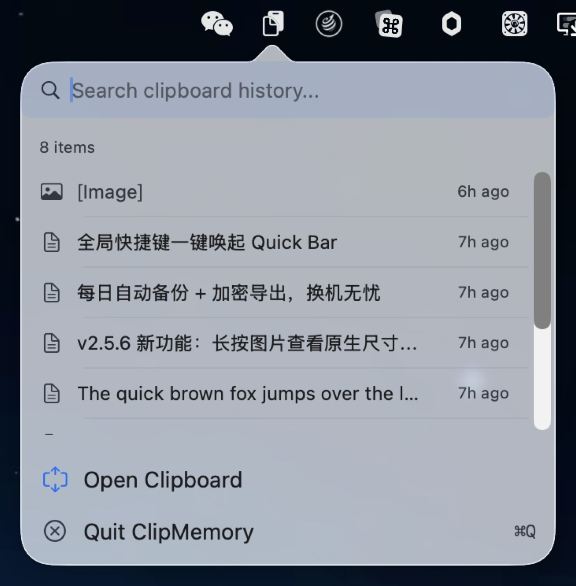
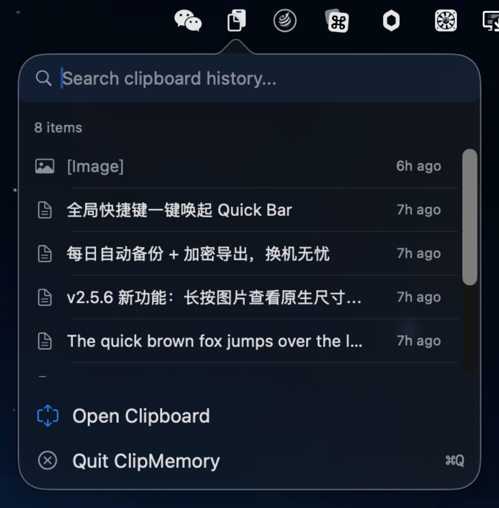
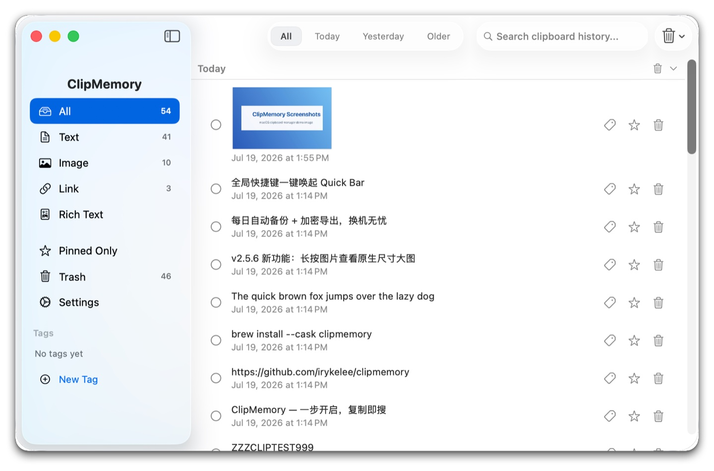
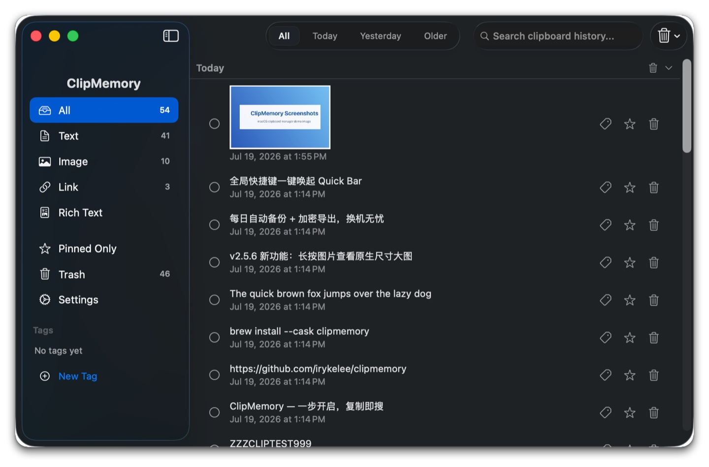

# ClipMemory v2.5.11

**Next-generation macOS clipboard manager — one tap to search, instant to copy**

[English](./README_EN.md) · [简体中文](./README.md) · [繁體中文](./README_ZH-HANT.md) · [日本語](./README_JA.md) · [한국어](./README_KO.md) · [Español](./README_ES.md) · [Português](./README_PT.md)

---

<p align="center">
  <br>
  <em>One-tap Quick Bar from menu bar — 8 recent items, search and copy instantly (light)</em>
</p>

<p align="center">
  <br>
  <em>One-tap Quick Bar from menu bar — 8 recent items, search and copy instantly (dark)</em>
</p>

<p align="center">
  <br>
  <em>Main window: type sidebar × time grouping × search highlighting (light)</em>
</p>

<p align="center">
  <br>
  <em>Main window: type sidebar × time grouping × search highlighting (dark)</em>
</p>

---

## v1 → v2 Key Upgrades

| Aspect | v1 | v2 |
|--------|----|----|
| **Interaction** | Menu → menu → window (3 steps) | Quick Bar popup (1 step) |
| **Main interface** | Fixed width, no sidebar | Fixed sidebar, switch types anytime |
| **Global hotkey** | Cmd+Ctrl+V only | Custom recording supported |
| **Quick Bar** | None | 8 recent items popup, search & copy instantly |
| **Search highlight** | Text overlay highlight | Case-insensitive, no garbled text |
| **Long-press preview** | None | 0.4s reveals full text / sensitive / image |
| **Time grouping** | None | Today / Yesterday / Older, collapsible |
| **Tags** | None | Create / delete / custom colors, sidebar filtering + smart suggestions |
| **Trash** | Deleted forever | Restorable trash with configurable retention |
| **Auto-update** | Manual downloads | Background checks, one-click install & relaunch |
| **Local backup** | None | Daily auto-backups + encrypted export / import |

---

## 📋 Changelog

### v2.5.11 (2026-07-23) — ContentView split + 16 bug fixes

### Highlights

- **🏗 ContentView split (NEW-7 Phase 4)** — Main list / selection / batch operations / delete alerts all extracted from ContentView into a standalone `ItemListView` (287 lines); ContentView 1178 → 995 lines (-15.5%). Decouples list render + list-related state, but retains view-layer search / filter / scroll cache in ContentView (to avoid one-shot refactor risk). Subsequent Phase 6+ ViewModel collapse will consolidate `@State` into `@StateObject`, then `ItemListView` snapshot baseline can be opened
- **🛡 Data safety 4-piece set** — `maxItems` setter clamped to `1...10_000` to prevent negative/oversized values; `backupNow()` serialized via `NSLock` to prevent double-click + auto-backup race; `addTag()` trims leading/trailing whitespace to prevent "  Work  " and "Work" from being stored as duplicates; `ClipboardItemRow` observes `LanguageManager` to immediately re-render dates when language switches
- **🌐 i18n plural support (F-7)** — 6 `%d` plural keys now use `.stringsdict` (`batch.selected` / `quickbar.recent` / `trash.emptyConfirm.message` / `alert.clear.message` / `settings.max.items.count` / `clear.conditional.confirm`); English "1 item" / "5 items" no longer both display as "1 items"; new `Scripts/generate_stringsdict.py` for one-click regeneration across 7 languages
- **🛡 Settings "Back Up Now" errors no longer silently swallowed (F-4)** — Previously `try?` discarded every `backupNow()` failure; now uses `do/catch` + `onShowBackupError` callback → `ContentView` displays `L10n.settingsBackupError` `NSAlert` (consistent with export/import/pre-import snapshot failure paths)
- **🛡 QuickBar ⌘F now reliably focuses search (F-9)** — Previously relied solely on `KeyCaptureView`'s `NSEvent` local monitor (unreliable in popover window context); now adds `.cmdFFindAction` notification as fallback, following the same path as `ContentView`

### Fixes

Sorted by impact (high → medium → low):

**High impact (Architecture / Data / UX critical path)**

- **NEW-7 Phase 4 ItemListView extraction** — Main list / selection / batch operations / delete alerts all extracted from `ContentView` (287 lines); `ContentView` 1178 → 995 lines (-15.5%)
- **E-1 maxItems setter clamp** — Range `1...10_000`; `UserDefaults` no longer polluted by -1 / 999_999_999; new `minMaxItems` / `maxMaxItems` constants are the single source of truth
- **E-2 backupNow() serialization** — Wrapped with `NSLock`; double-click "Back Up Now" + auto-backup triggered on the same frame no longer race on `createDirectory` + `copyItem(Images)`
- **E-13 ClipboardItemRow observes LanguageManager** — `@ObservedObject private var languageManager = LanguageManager.shared`; date format immediately re-renders when switching Settings → Language (no longer requires scrolling off+on)
- **F-9 QuickBar ⌘F fix** — `.onReceive(NotificationCenter.default.publisher(for: .cmdFFindAction))` added to `QuickBarView` root `VStack`; ⌘F now focuses the search field in popover environments
- **F-4 Settings Back Up Now error alert** — `onShowBackupError` callback wired to `ContentView`'s `showBackupInfo(L10n.settingsBackupError)`; failures are now visible

**Medium impact (UX consistency / a11y / i18n)**

- **F-10 Welcome Enter bound to default button** — `.keyboardShortcut(.defaultAction)` added to `getStartedButton`; pressing Enter in the Welcome popup now directly triggers `onComplete`
- **F-13 TipsView ↑↓ label** — `L10n.quickbarRecent(8)` changed to `L10n.tipsKeyUpdown` = "Navigate items"; natively translated in all 6 languages (zh-Hans 切换条目 / zh-Hant 切換條目 / ja 項目を移動 / ko 항목 이동 / es Navegar por los elementos / pt Navegar pelos itens)
- **F-3 TrashItemRow button keyboard visibility** — `@FocusState private var isFocused: Bool` + `.focusable()` + `.focused($isFocused)`; buttons are now visible when the row is focused (previously only on hover)
- **F-16 TagPickerSheet keyboard deletion** — `.contextMenu` + `.onDeleteCommand`; ⌫ / Forward Delete keys or right-click menu can now trigger delete confirmation (previously only long-press)
- **F-20 pin/delete accessibilityLabel** — Image-only buttons now have `.accessibilityLabel(...)` reusing existing `L10n.tooltip*` keys; VoiceOver no longer reads "button" without context

**Low impact (Cleanup / Performance / Boundary correctness / i18n polish)**

- **E-6 addTag trim whitespace** — `tag.name.trimmingCharacters(in: .whitespacesAndNewlines)` at the `addTag(_:)` entry point; "  Work  " and "Work" are no longer stored as duplicates
- **BUG-007 ItemListView header toggle skip during search** — `onTapGesture` is a no-op when `!searchText.isEmpty`; under force-expand display rules, mutating `collapsedGroups` could cause unexpected collapsed states when clearing search
- **F-25 UpdateStatusPanelView DateFormatter cached** — `static let dateFormatter`; no longer creates a new `DateFormatter` on every body re-render
- **F-7 extend .stringsdict 3 plural keys** — `alert.clear.message` / `settings.max.items.count` / `clear.conditional.confirm`; 3 multi-arg keys (`alert.trim` 2x `%d` / `tagPicker` & `sidebar.deleteTag` with `%@`) deferred to the next round

### Upgrade Note

- For versions with the built-in auto-update module (Sparkle) since v2.4.0: wait for in-app auto-update, or run `brew upgrade --cask clipmemory`
- No data migration, no one-time popup
- **i18n improvements**: When switching to Chinese/Japanese/Korean interface, "Recent 1 item" / "Recent 5 items" now display according to plural forms

### v2.5.11

### Highlights

- **🏗 ContentView split (NEW-7 Phase 4)** — Main list / selection / batch operations / delete alerts all extracted from ContentView into a standalone `ItemListView` (287 lines); ContentView 1178 → 995 lines (-15.5%). Decouples list render + list-related state, but retains view-layer search / filter / scroll cache in ContentView (to avoid one-shot refactor risk). Subsequent Phase 6+ ViewModel collapse will consolidate `@State` into `@StateObject`, then `ItemListView` snapshot baseline can be opened
- **🛡 Data safety 4-piece set** — `maxItems` setter clamped to `1...10_000` to prevent negative/oversized values; `backupNow()` serialized via `NSLock` to prevent double-click + auto-backup race; `addTag()` trims leading/trailing whitespace to prevent "  Work  " and "Work" from being stored as duplicates; `ClipboardItemRow` observes `LanguageManager` to immediately re-render dates when language switches
- **🌐 i18n plural support (F-7)** — 6 `%d` plural keys now use `.stringsdict` (`batch.selected` / `quickbar.recent` / `trash.emptyConfirm.message` / `alert.clear.message` / `settings.max.items.count` / `clear.conditional.confirm`); English "1 item" / "5 items" no longer both display as "1 items"; new `Scripts/generate_stringsdict.py` for one-click regeneration across 7 languages
- **🛡 Settings "Back Up Now" errors no longer silently swallowed (F-4)** — Previously `try?` discarded every `backupNow()` failure; now uses `do/catch` + `onShowBackupError` callback → `ContentView` displays `L10n.settingsBackupError` `NSAlert` (consistent with export/import/pre-import snapshot failure paths)
- **🛡 QuickBar ⌘F now reliably focuses search (F-9)** — Previously relied solely on `KeyCaptureView`'s `NSEvent` local monitor (unreliable in popover window context); now adds `.cmdFFindAction` notification as fallback, following the same path as `ContentView`

### Fixes

Sorted by impact (high → medium → low):

**High impact (Architecture / Data / UX critical path)**

- **NEW-7 Phase 4 ItemListView extraction** — Main list / selection / batch operations / delete alerts all extracted from `ContentView` (287 lines); `ContentView` 1178 → 995 lines (-15.5%)
- **E-1 maxItems setter clamp** — Range `1...10_000`; `UserDefaults` no longer polluted by -1 / 999_999_999; new `minMaxItems` / `maxMaxItems` constants are the single source of truth
- **E-2 backupNow() serialization** — Wrapped with `NSLock`; double-click "Back Up Now" + auto-backup triggered on the same frame no longer race on `createDirectory` + `copyItem(Images)`
- **E-13 ClipboardItemRow observes LanguageManager** — `@ObservedObject private var languageManager = LanguageManager.shared`; date format immediately re-renders when switching Settings → Language (no longer requires scrolling off+on)
- **F-9 QuickBar ⌘F fix** — `.onReceive(NotificationCenter.default.publisher(for: .cmdFFindAction))` added to `QuickBarView` root `VStack`; ⌘F now focuses the search field in popover environments
- **F-4 Settings Back Up Now error alert** — `onShowBackupError` callback wired to `ContentView`'s `showBackupInfo(L10n.settingsBackupError)`; failures are now visible

**Medium impact (UX consistency / a11y / i18n)**

- **F-10 Welcome Enter bound to default button** — `.keyboardShortcut(.defaultAction)` added to `getStartedButton`; pressing Enter in the Welcome popup now directly triggers `onComplete`
- **F-13 TipsView ↑↓ label** — `L10n.quickbarRecent(8)` changed to `L10n.tipsKeyUpdown` = "Navigate items"; natively translated in all 6 languages (zh-Hans 切换条目 / zh-Hant 切換條目 / ja 項目を移動 / ko 항목 이동 / es Navegar por los elementos / pt Navegar pelos itens)
- **F-3 TrashItemRow button keyboard visibility** — `@FocusState private var isFocused: Bool` + `.focusable()` + `.focused($isFocused)`; buttons are now visible when the row is focused (previously only on hover)
- **F-16 TagPickerSheet keyboard deletion** — `.contextMenu` + `.onDeleteCommand`; ⌫ / Forward Delete keys or right-click menu can now trigger delete confirmation (previously only long-press)
- **F-20 pin/delete accessibilityLabel** — Image-only buttons now have `.accessibilityLabel(...)` reusing existing `L10n.tooltip*` keys; VoiceOver no longer reads "button" without context

**Low impact (Cleanup / Performance / Boundary correctness / i18n polish)**

- **E-6 addTag trim whitespace** — `tag.name.trimmingCharacters(in: .whitespacesAndNewlines)` at the `addTag(_:)` entry point; "  Work  " and "Work" are no longer stored as duplicates
- **BUG-007 ItemListView header toggle skip during search** — `onTapGesture` is a no-op when `!searchText.isEmpty`; under force-expand display rules, mutating `collapsedGroups` could cause unexpected collapsed states when clearing search
- **F-25 UpdateStatusPanelView DateFormatter cached** — `static let dateFormatter`; no longer creates a new `DateFormatter` on every body re-render
- **F-7 extend .stringsdict 3 plural keys** — `alert.clear.message` / `settings.max.items.count` / `clear.conditional.confirm`; 3 multi-arg keys (`alert.trim` 2x `%d` / `tagPicker` & `sidebar.deleteTag` with `%@`) deferred to the next round

### Upgrade Note

- For versions with the built-in auto-update module (Sparkle) since v2.4.0: wait for in-app auto-update, or run `brew upgrade --cask clipmemory`
- No data migration, no one-time popup
- **i18n improvements**: When switching to Chinese/Japanese/Korean interface, "Recent 1 item" / "Recent 5 items" now display according to plural forms

### v2.5.10 (2026-07-22) — Backup errors surfaced + UI refactor + SwiftUI warning fix

- **🛡 Backup corruption visible (BUG-024)** — Corrupt items.json / trash.json / tags.json / image files no longer silently import 0 items; failures now throw `corruptedData` and surface in Settings alert
- **⚡ SidebarView extraction (NEW-7 Phase 3)** — ContentView trimmed from 1162 to 1123 lines; sidebar has dedicated 11-param explicit interface, snapshot tests + manual 7/7 verification passed
- **🛡 SwiftUI @State warning fix (BUG-009)** — `ClipboardItemRow` highlight cache migrated from `@State` dictionaries to `NSCache`; no more "Modifying state during view update" runtime warning; cache bounded at 500 entries to prevent unbounded growth

### v2.5.9 (2026-07-21) — Hang detection + comprehensive audit fixes

- **🛡 Hang detection (HangDetector)** — Main-thread heartbeat + 30s probe; first hang after 60s of no response records stack and auto-recovers; prevents silent UI freezes
- **🛡 Backup PBKDF2 upgrade** — 600k-round PBKDF2-SHA256 replaces single-round HKDF; offline brute-force cost ~10⁵× higher (OWASP 2023 compliant); old packages transparently compatible
- **⚡ RTF copy cache bridge** — `copyToClipboard` RTF branch hits cache in < 1ms (previously 20-100ms sync parse blocking main thread); cache auto-bridges across list/quickbar
- **🛡 UI state preservation** — Search bar input no longer leaves stale keyboard highlight due to `@State didSet` bypassing via Binding; sidebar tag badges no longer stale on tag add/remove
- **🛡 Main-thread I/O offload** — `copyToClipboard` image/RTF paths no longer block clipboard poll; backup export 50MB size guard prevents OOM

### v2.5.8 (2026-07-20) — Stability audit + 23 fixes

- **🛡 Backup export/import hardening** — Stuck `ditto` no longer blocks UI forever (30s timeout + SIGKILL escalation); HKDF salt now errors explicitly on CSPRNG failure instead of silently using zero-fill
- **⚡ RTF parse moved off the clipboard poll queue** — Large rich-text pastes no longer stall the 0.5s poll; OCR/image recognition also background
- **🛡 SwiftUI rendering warning fixed** — "Modifying state during view update" warnings on item-count changes eliminated, no more spurious extra renders
- **🔧 In-memory storage thread-safe** — Tests and future multi-thread callers no longer crash or lose data from `MemoryStorageBackend` array mutation
- **🏷 Tag color fallback fixed** — Invalid hex colors now fall back to accent color, visible in both light/dark mode

### v2.5.7 (2026-07-20) — HangDetector observability + key bug fixes

- **🛰️ HangDetector observability module** — Background watchdog auto-detects main-thread hangs >60s and logs full call stack + recovery time. Helpful for post-mortem debugging.
- **🛡️ Fix silent data loss when HMAC fails** — On rare Keychain-access errors, clipboard content was being dropped as duplicate. Now retained.
- **🛡️ Fix QuickBar keyboard navigation crash** — When the selected item was deleted externally, ↑↓ no longer traps on OOB subscript.
- **🧪 Fix test force-unwrap crash** — Replaced `XCTAssertNotNil + !` pattern with `guard let ... XCTFail(...) return`.
- **🖼️ Fix image load concurrency race** — Serialized legacy image migration writes via dedicated DispatchQueue.
- **🛡️ Fix excluded-app config TOCTOU** — Added atomic `updateExcludedBundleIds { ... }` API to ClipboardMonitor.
- **🧹 Fix bulk-select toolbar stale state** — Main window toolbar now correctly dismisses after per-row delete.

### v2.5.6 (2026-07-19) — Keychain key storage + full-size preview + hardening

- **🔐 Key moved to the Keychain** — the root encryption key migrated from a plaintext file to the macOS Keychain (this device only, never iCloud-synced); brew uninstall --zap removes it too
- **🖼 Full-size image preview** — long-press an image for a native-resolution floating panel; oversized screenshots scroll, so text stays readable (replaces the 300px in-row zoom)
- **🛡 Startup hardening** — key corruption or storage failure no longer crashes the app; a clear alert offers quit, retry, or reset (reset erases history)
- **🌐 Mirror feed by consent** — when the GitHub update server is unreachable, the jsDelivr mirror now asks once and remembers your choice; a stale mirror is refused automatically

### v2.5.5 (2026-07-18) — Conditional clear + hardening

- **🗑 Clear by condition** — new "Clear by Condition" in the toolbar 🗑 menu: type × time range (e.g. delete only older images, keep today's); right-click a type tab to delete all of that type; new per-group trash buttons on time-group headers
- **🏷️ Tag deletion options** — deleting a tag now offers "Delete tag only" or "Delete tag & items (to Trash)"
- **🔧 Import hardening** — tag names decrypt correctly on cross-machine import (no more garbled text); fixed duplicate imports from one package, unreadable entries imported on decrypt failure, UI freeze on large imports, and backup pruning touching stray files

### v2.5.0 (2026-07-18) — Local backup + export/import

- **💾 Local automatic backups** — clipboard history (including tags, trash, images) is backed up daily on first launch to a local Backups folder, keeping 7 copies by default (3/7/14/30 configurable) — a safety net against data loss
- **📦 Export / Import** — one-click export to a passphrase-protected .clipmemory package; restore after moving to a new Mac or reinstalling. Import merges and dedupes with existing data instead of overwriting it
- **⚙️ New Backup section in Settings** — auto-backup toggle, retention, Back Up Now, open folder, export/import

### v2.4.2 (2026-07-18) — Stability fixes + dual update channels

- **🌐 Dual update channels** — automatically falls back to a jsDelivr mirror when GitHub is unreachable; update alerts bring the app to the foreground with a Dock badge (gentle reminders) instead of staying hidden
- **💾 Data safety** — new clipboard items are written to disk immediately; previously they could be lost to kill -9 / power loss inside a 500ms debounce window
- **🐛 Stability fixes** — eliminated SwiftUI "Modifying state during view update" warning spam (dozens per second → 0); stopped repeated -9878 hotkey error logs on every launch when the shortcut is taken

### v2.4.1 (2026-07-18) — Update feed fix

- **🌐 Fix "update error" on check** — the appcast feed moved from raw.githubusercontent.com (unreachable on some networks) to a GitHub Release asset, so update checks respond instantly. If v2.4.0 shows an update error, download v2.4.1 manually once; auto-update resumes afterwards

### v2.4.0 (2026-07-18) — Recycle Bin

- **🗑️ Recycle Bin** — Deleted items are no longer destroyed immediately. They move to a Recycle Bin and stay for 7 days (configurable in Settings), during which you can restore or permanently delete them. Emptying the bin requires confirmation; expired items are cleaned up automatically.
- **✨ Auto-update (Sparkle 2)** — In-app update checks: daily background checks plus a manual check in Settings. Update packages are verified with EdDSA signatures before one-click install and relaunch; the Homebrew Cask declares auto_updates.
- **Data safety** — Image files are kept while their items remain in the bin; they are only deleted on permanent removal. Automatic cleanup (trim/expiry) bypasses the bin entirely.
- **UI updates** — New "Recycle Bin" sidebar entry with a badge count; deletion confirmation text changed to "Move to Recycle Bin"; trashed items show their deletion time.
- **Tests** — 12 new Recycle Bin tests, all passing.

### v2.3.0 (2026-07-17) — Tag System & Data Integrity

- **🏷️ Tag System** — Complete tag lifecycle: create / delete / custom colors; sidebar tag section with cross-section AND / in-section OR filtering; smart tag suggestions (NLTagger-based: code / email / credential / sensitive); TagPicker sheet (inline chips + long-press picker); deletion confirmation dialog
- **6 critical data-integrity fixes** — saveTimer thread-safety race (UB); FileStorageBackend synchronous writes; flushPendingSaves now also flushes tags; legacy image items incorrectly-flagged-as-encrypted repair; contentHash backfill; ImageStorage partial-failure recovery
- **UI improvements** — Welcome window dedupe; Esc cancels hotkey recording (event returned to responder); cross-midnight currentDate refresh; search-mode force-expand groups (keyboard nav sync); pendingMaxItemsReduction variable typo fix
- **Refactor + performance** — RTF NSCache; L10n bundle cache; WindowManager state stability (@State preserved across close/reopen); windowDidMove/Resize debounced 0.5s; +9 net new tests (241 → 250)

### v2.2.4 (2026-07-16) — Release Hygiene

- **Version stamp synced with release tag** — `MARKETING_VERSION` and `CURRENT_PROJECT_VERSION` bumped to `2.2.4` in `project.yml` and regenerated `project.pbxproj`. Resolves the v2.2.3 lesson where the tag was cut without bumping these fields.
- **Quick Bar label fix** — Removed misleading `⌘⌃V` shortcut label on the Quick Bar "open full window" item. The global hotkey opens the full main window; the Quick Bar is opened via left-click on the menu-bar 📋 icon.
- **Documentation hotkey correction** — The `Cmd+Ctrl+V` row in 8 language READMEs rewritten to clarify it opens the main window, not the Quick Bar.
- **Packaging safety** — `Scripts/package.sh` default version now reads `MARKETING_VERSION` from `project.yml` (with a guard if reading fails), preventing the pre-v2.2.4 footgun of packaging a stale-stamped tarball when invoked without an explicit version argument.

### v2.2.1 (2026-05-19) — Image Sensitivity Fix

- **Image sensitivity fix** — Images no longer auto-marked sensitive by size (50KB threshold removed), storage controlled by maxItems and manual clearing
- **Component extraction** — ContentView split into FlowLayout, LogoView, DateFilterButton, AppPickerRow, ClipboardItemRow
- **Shared utilities** — Extracted FontScaling.swift (sz()) and DateHelpers.swift (date formatters)
- **NSCache memory pressure** — Added system memory warning observer to clear cache on pressure

### v2.2.0 (2026-05-15) — Rich Text Support

- **RTF Clipboard Capture** — Automatically recognizes and saves rich text content
- **Rich Text Rendering** — NSAttributedString → AttributedString conversion
- **Copy Back** — Writes both .rtf and .string pasteboard types
- **Sidebar Tab** — New "Rich Text" category with icon, count badge, and type filter
- **Quick Bar Display** — Rich text icon + plain text preview
- **Sensitive Masking** — Rich text items support sensitive content masking
- **85 Tests** — Including 4 rich text round-trip tests
- **Search Fix** — Fixed rich text search functionality

### v2.1.5 (2026-05-11) — Protocol Abstraction & UX

- **Protocol Abstraction** — StorageBackend protocol + MemoryStorageBackend test backend
- **81 Tests** — Complete test infrastructure
- **Max Trim Dialog** — Confirmation dialog when history exceeds limit
- **Image Placeholder** — Elegant placeholder on load failure
- **Group Operations** — Unpin/clear at group level

### v2.1.0 (2026-05-09) — Liquid Glass UI

- Liquid Glass design — NavigationSplitView sidebar + QuickBar frosted glass popup
- Keyboard navigation fixes — Scroll and search box arrow key handling

---

## Feature Highlights

### Quick Bar — One Tap Away

Click menu bar icon → NSPopover shows 8 recent items → click to copy / search / open full window

### Long Press 0.4s — Unlimited Preview

| Content type | Default | After long press |
|-------------|---------|-----------------|
| Plain text | First 200 chars, 3 lines | Full text |
| Sensitive content | Masked `ab••••••yz` | Revealed text |
| Image | Thumbnail 80px | Native-size floating panel (scrollable if larger than screen) |

### Smart Security — Encryption + Detection

- AES-256-GCM encryption (v2), compatible with legacy AES-CBC+HMAC-SHA256
- 35 rules auto-detect sensitive data (credentials / API keys / Slack/Discord/OpenAI tokens / ID numbers / etc.)
- Auto-pauses when password manager is in foreground, no copying from the app itself
- Content never saved as plaintext if encryption fails

---

## Feature List

- 📋 Clipboard history (text / images / links / **rich text RTF**)
- ⭐ Pin important items, never auto-deleted
- 💾 Encrypted image storage, up to 50MB per image
- 🔍 Real-time search, all languages highlighted (CJK multibyte supported)
- ⚡ Smart deduplication, identical content updates timestamp only
- 🔄 Copy loop prevention, auto-skips copying from the app itself
- 🧹 Orphan file cleanup, auto-cleans unreferenced images on launch
- 🌍 7 languages (简体中文 / 繁體中文 / English / 日本語 / 한국어 / Español / Português)
- ☑️ Multi-select batch pin / delete
- ✅ Green flash feedback on successful copy
- ⚙️ Auto-detects hotkey conflicts on first launch
- ⌨️ Global hotkey `Cmd+Ctrl+V`
- 🖥 Launch at login (enable in Settings)
- 📐 Font scaling (Small / Medium / Large)
- 🎨 Appearance (Light / Dark / Follow system)
- 🗂️ Type filters (All / Text / Image / Link / Rich Text)
- ⌨️ Keyboard navigation (arrow key scroll, search box focus handling)

---

## How to Use

| Action | How |
|--------|-----|
| Open Quick Bar | Left-click menu bar 📋 icon |
| Copy item | Click item / keyboard ↑↓ + Enter |
| Open full window | `Cmd+Ctrl+V` (global hotkey) / Quick Bar → "Open Clipboard" |
| Search | Type keyword, matches highlighted |
| Pin / Unpin | Click ⭐ or double-click item |
| Delete | Click 🗑 or right-click menu |
| Preview full / sensitive / image | Hold 0.4s, release to hide |
| Multi-select mode | Click checkbox |
| Clear history | Top bar 🗑 (pinned items preserved) |
| Clear by condition | Top bar 🗑 → "Clear by Condition" (type × time range); right-click a type tab to delete all of that type |
| Switch type filter | Click "Text/Image/Link/Rich Text" in sidebar |

> 💡 Pinned items are never auto-deleted. Copying identical content doesn't create duplicates, only updates the timestamp.

---

## Security

- **AES-256-GCM (v2) + legacy AES-CBC+HMAC-SHA256** — All text and images encrypted before disk storage
- **Smart detection** — 35 rules (keywords + regex) auto-identify credentials, API keys, Slack/Discord/OpenAI tokens, private keys, ID numbers, bank card numbers, etc.
- **Auto-clear** — Sensitive content configurable to auto-delete after 1h / 24h / 48h / 7 days, or never

---

## Settings

- Max history items (50 / 100 / 200 / 500)
- Sensitive auto-clear policy (1h / 24h / 48h / 7d / never)
- Language (7 languages)
- Global hotkey recording
- Appearance (Light / Dark / Follow system)
- Excluded apps (custom apps to skip monitoring)
- Rich text capture toggle
- Font size (Small / Medium / Large)
- Launch at login
- Recycle bin retention (3 / 7 / 14 / 30 days)
- Backup (daily auto-backup / retention / export / import)
- Updates (automatic checks / check now)

---

## Requirements

- macOS 13.0 (Ventura) or later

---

## Data Migration

History (including the encryption key) is stored at `~/Library/Application Support/ClipMemory/`.
The recommended way to migrate is Settings → Backup → Export Backup, which creates a passphrase-protected .clipmemory package you can import on the new Mac; backing up this directory manually also works.
Before removing the app, click the 🗑 button in the top toolbar to clear history.

---

## Installation

```bash
brew tap irykelee/clipmemory
brew trust irykelee/clipmemory
brew install --cask clipmemory
```

After install, App is at `/Applications/ClipMemory.app`. Launch and find the 📋 icon in the **menu bar** (top right corner).

Or download `.tar.gz` from [GitHub Releases](https://github.com/irykelee/clipmemory/releases) and extract to `/Applications/`.

> **If macOS blocks the first launch with "Apple cannot verify…"**: this is the standard prompt for non-notarized apps, not malware. Either: ① right-click the app → **Open** → **Open** again; or ② System Settings → Privacy & Security → **Open Anyway**. Only needed once. (Users who installed via `brew install` won't see this.)

---

## Development

```bash
brew install swiftlint xcodegen
xcodegen generate
xcodebuild -scheme ClipMemory -configuration Release
```

---

## Contact

- GitHub: https://github.com/irykelee/clipmemory
- Feedback: Settings → About → Send Feedback → GitHub Issues
