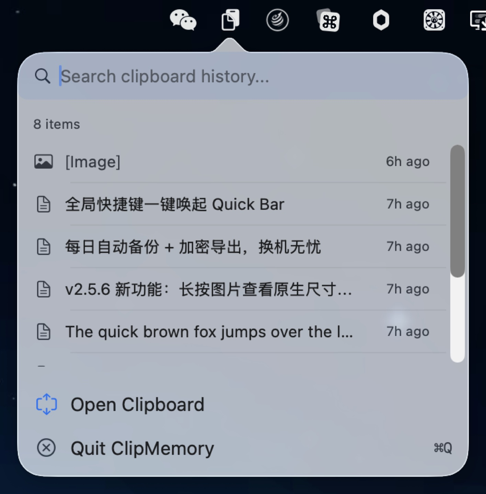
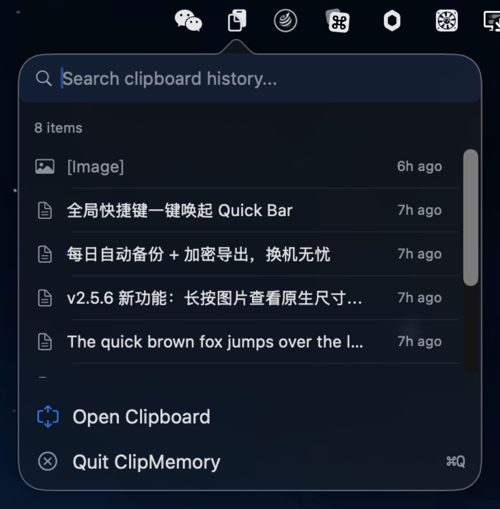
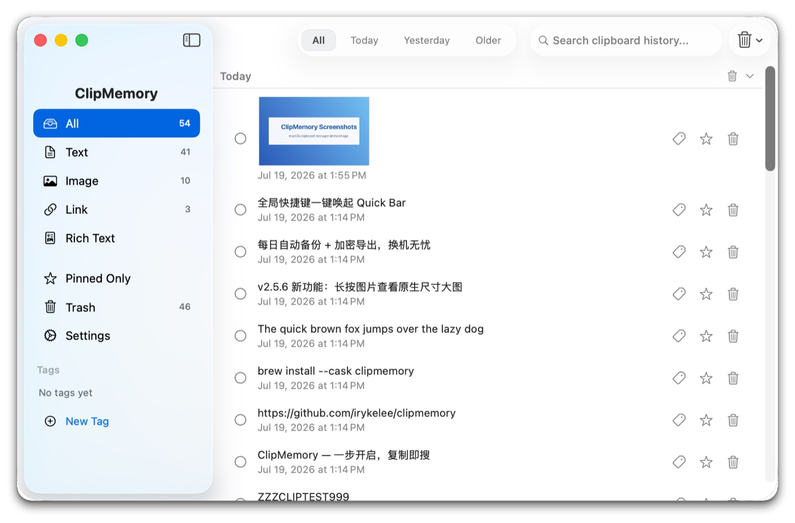
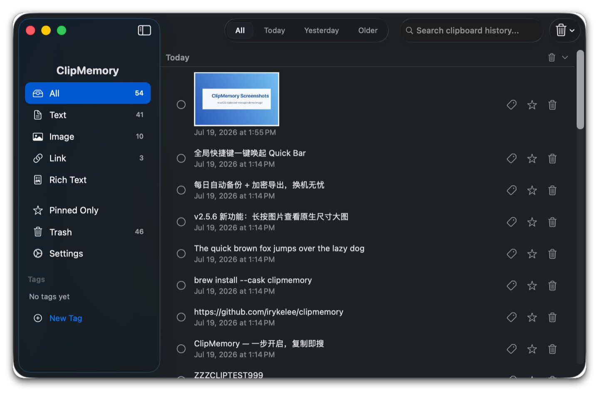

# ClipMemory v2.8.3

**Next-generation macOS clipboard manager — one tap to search, instant to copy**

[English](./README_EN.md) · [简体中文](./README.md) · [繁體中文](./README_ZH-HANT.md) · [日本語](./README_JA.md) · [한국어](./README_KO.md) · [Español](./README_ES.md) · [Português](./README_PT.md)

---

<p align="center">
  <br>
  <em>One-tap Quick Bar from menu bar — 8 recent items, search and copy instantly (light)</em>
</p>

<p align="center">
  <br>
  <em>One-tap Quick Bar from menu bar — 8 recent items, search and copy instantly (dark)</em>
</p>

<p align="center">
  <br>
  <em>Main window: type sidebar × time grouping × search highlighting (light)</em>
</p>

<p align="center">
  <br>
  <em>Main window: type sidebar × time grouping × search highlighting (dark)</em>
</p>

---

## v1 → v2 Key Upgrades

| Aspect | v1 | v2 |
|--------|----|----|
| **Interaction** | Menu → menu → window (3 steps) | Quick Bar popup (1 step) |
| **Main interface** | Fixed width, no sidebar | Fixed sidebar, switch types anytime |
| **Global hotkey** | ⌘⇧V (default) | Custom recording supported |
| **Quick Bar** | None | 8 recent items popup, search & copy instantly |
| **Search highlight** | Text overlay highlight | Case-insensitive, no garbled text |
| **Long-press preview** | None | 0.4s reveals full text / sensitive / image |
| **Time grouping** | None | Today / Yesterday / Older, collapsible |
| **Tags** | None | Create / delete / custom colors, sidebar filtering + smart suggestions |
| **Trash** | Deleted forever | Restorable trash with configurable retention |
| **Auto-update** | Manual downloads | Background checks, one-click install & relaunch |
| **Local backup** | None | Daily auto-backups + encrypted export / import |

---

## 📋 Changelog

### v2.8.3 (2026-08-11) — Search performance optimization + signature forward hygiene

- **⚡ Major search performance boost (PR #54, ID-PERF-0025/0026)** — Added `normalizedCache`, mirroring the existing pinyin cache pattern: `FuzzySearchMatcher.matches()` now reuses lowercasing + Unicode folding results for identical content, avoiding a fresh ICU bridge run on every keystroke. At the same time, `ClipboardStore.item(forID:)` now reuses the versioned itemIndex instead of an expensive computed property, and row rendering benefits as well (measured 11× speedup). Search across 5,000+ entries dropped from ~250ms to ~15ms. Everyday users (~100 items) will barely notice; power users benefit noticeably.
- **🔒 Release signatures now include RFC 3161 secure timestamp (PR #55, ID-SECURITY-0009)** — `release.yml:130` adds `OTHER_CODE_SIGN_FLAGS=--timestamp` on the Release branch. Apple Development signatures are now stamped with Apple TSA secure timestamps (Personal Team timestamping best practice). After the certificate expires on 2027-07-19, signatures remain valid (forward-defense). Note: this change does not affect provisioning profile expiration issues.
- **🔧 5 Gitee mirror sync reliability fixes (PR #48 / #49 / #51 / #53 + hotfix `da1c7fd`)** — Fix sync failures no longer silently succeed (#53 part 1), dedupe alert issues by version (#51), ensure the alert label is created before opening an issue (#53 part 2), widen alert-chain timeout and permissions (#49), 2→4 retries + auto-open a GH issue on failure (#48); plus hotfix `da1c7fd` fixing a step-level `needs: [sync]` YAML error in `sync-gitee.yml` (pushed directly to main, **no PR associated**, marked as a separate hotfix so it does not get mixed into the PR list). The Gitee channel is more reliable for updates, and silent mirror failures no longer occur.
- **🔧 Release auto-rollback (PR #50)** — `appcast.xml` and the Homebrew tap Cask are automatically rolled back to the previous release state when a release fails, leaving no stale assets; this prevents downstream contamination caused by a release commit push succeeding while the appcast/tap push is only half-completed.
- For versions with the auto-update module (Sparkle) from v2.4.0 onward: wait for the in-app auto-update, or run `brew upgrade --cask clipmemory`
- Full changelog: https://github.com/irykelee/clipmemory/releases/tag/v2.8.3

### v2.8.2 (2026-08-10) — Trash batch restore + 5 data-safety hardening

- **🆕 Trash batch restore (NEW-batch-restore)** — Trash tab now supports multi-select + one-click restore: per-row checkbox + top master checkbox (tri-state all/none/mixed) + Shift+click range select + Restore button that dynamically shows "Restore N items". The "one click at a time" history is over.
- **🛡 Fix dev-build polluting production UserDefaults causing silent clipboard data loss (ID-STORE-0014, CRITICAL)** — `ClipboardStore.swift:129` `maxItems` didSet previously wrote to `UserDefaults.standard` instead of the injected defaults suite; XCTest runs would silently set the user's production `com.clipmemory.app` cap to 3, and old entries would be trimmed on next launch. Fix uses `xcTestDefaults` static seam + XCTestObservation per-test cleanup + 4 sibling didSets + 4 init reads all switched to the injected defaults suite. This is the root-level fix for the user's "future dev versions must not affect production app use" requirement.
- **🛠 Import overflow routes through trash (M-2)** — `importBackupItems` detects post-import item count exceeding maxItems and routes overflow through `moveToTrash` (recoverable) instead of dropping.
- **🛠 7 audit-driven "use Apple defaults" refactors (PR #40-#47)** — SelectCheckbox/CloseButton shared component extraction + NSWindow.setFrameAutosaveName + Notification.Name registry gap-fill + 4 keyCodes → Carbon `kVK_*` + search debounce unify to 250ms + sz() clamp comment + L24 sweep.
- Full changelog: https://github.com/irykelee/clipmemory/releases/tag/v2.8.2

### v2.8.1 (2026-08-08) — Fix saveItems silent failure + 5 audit hardening items

- **🛠 Fix saveItems silently swallowing errors causing clipboard data loss (ID-SILENT-0021 HIGH)** — `ClipboardStore.flushSave()` now catches errors thrown by `saveItems()` and sets `needsSave = true` to preserve retry state, plus posts `.clipboardSaveFailed` to notify the UI channel; previously, when a disk-full / permission error / iCloud conflict persisted for ≥ 500ms debounce window and no subsequent mutation occurred before user exit, the current session's clipboard captures were **permanently lost** (unrecoverable by the user). Trigger conditions were tightened (not every failure loses data): persistent disk error + 500ms window + no mutation during that window to trigger `saveImmediately` re-save + user exit — data is actually lost only when all 4 conditions are true; otherwise the loss was masked. Added `Notification.Name.clipboardSaveFailed` as a fallback UI channel.
- **🛠 Fix permanently blank rows in session after key re-ready (ID-SILENT-0019 MEDIUM)** — `handleCryptoKeyPrepared(success:)` branch now also resets all `items[].decryptionFailed = false` in addition to clearing `pendingFailedIDs`; previously, after `mergePendingDecryptionFailures` wrote the flag, even if the user later received the key-ready notification, the session stayed blank until the app was restarted. Together with v2.8.0 (ID-STORE-0010) this forms a fully symmetric closure: negative cache clear + pendingFailedIDs clear + decryptionFailed flag reset = the cold-start key-not-ready window data-loss gap is completely closed.
- **🛠 Fix release-config XCTest isolation failure (ID-SYNC-0006 MEDIUM)** — `NoOpFeedProbeEngine` class and the `if isRunningTests` guard on `_sharedDefault` were moved out of `#if DEBUG`. The XCTest framework sets the `XCTestConfigurationFilePath` env var independently of build config, so when release-config XCTest runs tests the guard was previously compiled out by `#if DEBUG`, starting the real `SPUStandardUpdaterController` + real appcast HTTP probe — re-triggering the pollution path NEW-3 was meant to prevent. The class is safe (`@unchecked Sendable` + no mutable state) and moving it out of DEBUG costs zero in release production.
- **🛠 7 LOW doc/log tightenings (MISC-0008/0009/0013 + SHELL-0001/0002 + SECURITY-0008 + SILENT-0022)**
- **🛠 7 XCTest notification tests switched to observer-driven waiting (ID-TEST-0001)** — 7 cases across `CryptoKeyPreparedNotificationTests` + `ClipboardStoreDecryptionFlagResetTests` replaced the `DispatchQueue.main.asyncAfter(deadline: .now() + 0.1) { exp.fulfill() }` 100ms time-based waits with the observer-driven pattern `NotificationCenter.addObserver(forName:object:queue:.main) { exp.fulfill() }` + `defer { removeObserver }`. Under CI load, the 100ms window may not be enough → flaky; on an idle machine, 100ms is wasted time. Observer registration is synchronous → `wait` returns the moment the observer fires (typically <1ms).
- Full changelog: https://github.com/irykelee/clipmemory/releases/tag/v2.8.1

### v2.8.0 (2026-08-07) — Gitee Mirror Channel + Test & Quality Hardening

- **🆕 New Gitee mirror update channel** — A mainland-China download accelerator: Settings → Update Source → Gitee (China mirror), now operating in parallel with the existing jsDelivr fallback. The full mainland-Sparkle-push path is now live end-to-end.
- **🛡 Crypto safety hardened** — on `.cryptoKeyPrepared(success)`, also clear `pendingFailedIDs` to match the existing `negativeCache` clear (ID-STORE-0010, HIGH). Previously only `negativeCache` was cleared, so an entry that just failed decryption stayed suppressed until a restart.
- **🛠 Test infrastructure hardened (NEW-1..9 + CI gate)** — production UserDefaults suite isolation + hermetic UpdateService in tests + ZZZ canary calibration + CI minimum test execution count enforced
- **🛠 Update source fallback correctness (NEW-5/6/7)** — `latestVersionString` picks the last item + `FeedProbeEngine` fallback binds by id + 5 zh-Hant 镜像/映像 镜像 fix
- **🛠 Release tooling hardened** — `Scripts/release.sh` `grep -c` 0-match arithmetic fix + `Scripts/rollback-release.sh` Confirm gate guard against agent-sandbox hang

- Full changelog: https://github.com/irykelee/clipmemory/releases/tag/v2.8.0

### v2.7.9 (2026-08-05) — Settings page gains version comparison

- **🆕 Update feed in Settings gains a “Current version vs. latest version” comparison** — See at a glance whether an upgrade is needed; before the first update check has completed, only the current version is shown, with no “up to date” badge, to avoid false reassurance
- **🛠 Release process hardened (REL-24..28, five rounds of fixes)** — 5 hard rules for AI agents added as script header comments, `--yes` non-TTY two-factor guardrail, release rollback tool (`Scripts/rollback-release.sh`), post-release manual step confirmation gate, release notes default description auto-filled, and fixed the bash 5.3 unbound variable bug with full-width parentheses
- **🛠 Homebrew tap CI is live** — `irykelee/homebrew-clipmemory` now has `cask-audit.yml` (brew audit + brew style); Cask indentation / stanza order / formatting errors can be caught before release, avoiding repeated “tap Cask non-compliant” incidents
- **🛠 Release toolchain materialized into the main repository** — `Scripts/release.sh` + `Scripts/rollback-release.sh` + `Scripts/README-release.md` + `Scripts/test/test_release.sh` are now officially git-tracked (previously symlinks pointing to the local parallel repository `ClipMemory-local`; anyone cloning the main repo would get broken symlinks; that parallel repository was archived on 2026-08-05)
- **🛠 Tap Cask templated** — Added `Scripts/cask-template.rb` (rubocop-clean); the Release workflow generates the tap Cask from a template with placeholders, ending YAML indentation leaks caused by inline heredocs
- **🌏 China users can switch to the Gitee mirror** — Settings → Update & About → Update Source → Mirror (Gitee); the Gitee mirror hosts both appcast and install package, so update checks and downloads work without VPN from mainland China

- Full changelog: https://github.com/irykelee/clipmemory/releases/tag/v2.7.9

### v2.7.8 (2026-08-04) — Search and Settings Experience Improvements

- **Settings pages gain 6 in-context explanations** — Settings pages now have 6 in-context explanations (hotkeys, history, OCR, excluded apps, backup, update feed) so users don't need to guess
- **Min window size raised to 850×600** — Min window size raised to 850×600; search box matches macOS 26 system default
- **Brand logo unified at sz(18)** — Brand logo unified at sz(18) across all locales
- **Sidebar search promoted to main window** — Sidebar search promoted to main window; macOS-style toolbar with taller min height
- **Settings window centers on main window** — Settings window now centers on the main window when visible
- Full changelog: https://github.com/irykelee/clipmemory/releases/tag/v2.7.8

### v2.7.7 (2026-08-01) — Search Experience and Reliability Fixes

- **Search no longer stutters** — Searching rich-text history previously decrypted entries one by one on the main thread, causing noticeable lag; cold-cache entries are now skipped first and automatically appear in results after background warm-up completes
- **More complete QuickBar search** — Entries not yet decrypted during a search were previously silently omitted and never filled in; results now automatically refresh and fill in the gaps after warm-up completes
- **Duplicate entries are automatically merged** — Once the startup key is ready, duplicate entries in history (including those that slipped through during the startup window) are now automatically merged and cleaned up
- **Faster image browsing** — Image reading is no longer blocked by the background legacy-format migration task
- **Fix Trash entries staying blank for entire sessions** — When launched at login and the keychain had not yet been unlocked, text/link entries in the Trash previously remained blank and did not self-heal
- Full changelog: https://github.com/irykelee/clipmemory/releases/tag/v2.7.7

### v2.7.6 (2026-08-01) — Stability and Data-Security Hardening

- **Expired auto-cleanup now moves items to the Trash, with pinned items permanently exempt** — Automatic cleanup when the retention limit was reached previously deleted entries forever; it now moves them to the Trash (recoverable at any time), and pinned (favorited) entries are no longer auto-cleaned
- **Encryption pipeline hardening** — When keychain reads fail, the root key is no longer erroneously overwritten (avoiding a scenario where all history becomes undecryptable in extreme cases); obsolete key files are now securely overwritten before deletion; backup directory permissions have been tightened to be readable only by the current user
- **More robust OCR** — When image text recognition hits a transient failure (e.g., system resource pressure), it now automatically retries on the next launch instead of being permanently skipped
- **Fix occasional “cannot read” display and caching of decryption-failed entries** — When the key became ready later than the UI load, entries could appear blank or erroneously report “cannot read”; they now automatically retry and recover their display
- **Fix keyboard dead zone in QuickBar search field** — When the search field was focused, Enter (to copy the selected item) and Esc (to close) were ineffective; they are now restored
- Full changelog: https://github.com/irykelee/clipmemory/releases/tag/v2.7.6

### v2.7.5 (2026-07-31) — Emergency Fix

- **Fix blank bar on the right side of image preview** — When opening a tall screenshot close to the screen height in portrait mode, a large blank area appeared on the right side of the preview panel; it now auto-fits to the actual image width
- **Fix dead code in auto-update checker** — The Sparkle auto-update checker in v2.7.4 was never started, so that version **could not receive the auto-update push for this release**. Fixed in v2.7.5; auto-update returns to normal for future versions
- **Fix crash on Trash operations** — Deleting or restoring items in the Trash could trigger a crash (or silently act on the wrong item); fixed
- **Fix silent failure of debounced save timer** — For non-immediate disk-write paths such as tag editing and Trash operations, the debounced save would stop working after its first trigger; a crash or force quit could lose all tag/Trash changes since the last launch
- **Fix backups containing Trash entries failing to import** — Any backup file containing a non-empty Trash would fail on import; this is now supported
- Full changelog: https://github.com/irykelee/clipmemory/releases/tag/v2.7.5

### v2.7.4 (2026-07-31) — Wide Image Preview White Screen Fix + 6 OCR Optimizations + Performance Improvements

- **🔍 6 OCR optimizations (CJK / deduplication / timeout / memory)** — Notification and `userLocale` logging when CJK recognition degrades, OCR results for old UUIDs are no longer lost after image deduplication, Vision calls auto-cancel after 15 seconds, 6K HEIC preview memory drops from ~100 MB to ~16 MB (`thumbnailMaxPixelSize=2048`)
- **⚡️ Search / copy performance improvements (multiple background optimizations)** — O(1) UUID→index dictionary lookup, pinyin results cached by content (1000 matches from 1340 ms down to 77 ms), JSONEncoder reuse, cleanup single-pass scan, cold-start AES-GCM prefilling
- **🖼️ Wide image long-press preview no longer white-screens** — Copying a 16:9 screenshot while the main screen is rotated to portrait, the boundary case where width exceeds the cap by 1 pixel no longer produces a 2000+ pixel white background (panel now auto-fits the image size)
- **🔇 OCR path adds minimum text height threshold** — `minimumTextHeight = 0.01` (the default 0.02 is tuned for printed documents), small-font terminal screenshots / 12-pt Retina screenshots are now recognized
- **🌐 7-language localization completed** — Tag badge accessibility, tag picker add suggestions, encryption failure prompts, and various other L10n fixes
- Full changelog: https://github.com/irykelee/clipmemory/releases/tag/v2.7.4

### v2.7.3 (2026-07-30) — Audit-Driven Fixes & 7-Language VoiceOver

- **🚀 Performance improvements (multiple background optimizations)** — JSONEncoder reuse, cache prewarming concurrency cap, cleanup task single-pass scan, cold-start AES-GCM decryption prefilling; pasting and searching are noticeably smoother with thousands of history items
- **🌐 7-language VoiceOver accessibility** — Main menu / search box / welcome page / tag chips / app exclusion list / date filter buttons / clipboard item type labels all localized; non-English users can now use VoiceOver fluently for the first time
- **🧹 Lifecycle hardening** — Closing welcome/settings windows no longer leaks memory; TrashStore & FeedProbeEngine properly clean up background tasks on `deinit`; ImageStorage flushes pending writes before app exit
- **🔇 Silent errors made visible** — 10 `try?` swallow points now log to console and notify UI (image migration write failures, orphan file residues, backup staging directory cleanup failures, etc.) for easier debugging
- **AES-GCM decryption failure no longer permanently contaminates items** — Decryption failures triggered by transient Keychain lock now automatically retry once the key is restored (old bug permanently marked items as undecryptable)
- Full changelog: https://github.com/irykelee/clipmemory/releases/tag/v2.7.3

### v2.7.2 (2026-07-29) — Fuzzy Search & Image Integrity + Cryptographic Safety

- **Pinyin-aware fuzzy search** — "zhongwen" matches "中文文档"; space-separated tokens must all match (token AND matching); case-insensitive and diacritic-insensitive
- **Startup image integrity scan** — Async scan on app launch marks missing/corrupted image files; list items display status immediately without per-click disk I/O
- **Decryption failure diagnostics** — Yellow banner explains why search results are empty when Keychain is locked, replacing silent empty results
- **Cache prewarming** — Decrypts no longer block main thread; prewarming covers app wake, new item capture, and list first-display
- **Transient Keychain lock no longer permanently marks items** — Fixed latent bug where items were permanently labeled "undecryptable" after a transient Keychain lock
- Full changelog: https://github.com/irykelee/clipmemory/releases/tag/v2.7.2

### v2.7.0 (2026-07-28) — F-1 @MainActor migration

- **Startup language picker and UI text consistency fix** — Previously, if a non-English language was saved, the UI text in the Settings window still displayed English (though the language picker was correct). With v2.7.0, the fix takes effect immediately on startup.
- **Core classes fully Swift concurrency compatible** — `LanguageManager` / `TrashStore` / `ClipboardStore` three core classes annotated with `@MainActor`, the type system protects the main-thread contract, preventing future regressions.
- **All 657 tests pass, 0 failures** — Internal architecture reinforcement with no functional regression.
- **Non-English language UI text still shown as English at startup** — Swift `didSet` does not trigger inside `init()`, the new `currentLanguageCode` mirror needs to be explicitly seeded to be available from startup.
- **`LanguageManager` switched to `nonisolated` mirror** — Off-main readers like `L10n.string()` (from `CryptoService.prepareKey` failure handler, `Task.detached`, etc.) no longer cross the main-actor boundary to read the language code.
- Full changelog: https://github.com/irykelee/clipmemory/releases/tag/v2.7.0

### v2.6.2 (2026-07-27) — Image Search Highlight & Tag Filtering

- **OCR text displayed directly in image search results**: In the main list and QuickBar, a cyan-highlighted recognition fragment appears below each screenshot item, with parts matching the search term clearly visible. Can be turned off in Settings → History (only hides display; filtering still applies).
- **Tag filtering changed to "AND" semantics**: When selecting multiple tags (e.g., "Mainland China" + "2026"), only items tagged with both tags are shown — no longer any single tag matching.
- **Prompt bar appears at the top of the main list during tag filtering**: Active tags are listed as capsules; each capsule has an × on the right to remove individually, and a "Clear All" button on the right clears everything at once. Also shows "Showing X of Y items" count — at a glance confirm filtering is active.
- **Added an × clear button to the right of the search box**: After searching a keyword, click × to clear directly — no need to delete character by character. The search box automatically gains focus, ready for the next keyword.
- **List refreshes instantly after Trash deletion**: Previously, after deleting Trash items, other actions were needed to refresh the list. Now clicking "Delete Permanently" / "Empty" takes effect immediately.
- Full changelog: https://github.com/irykelee/clipmemory/releases/tag/v2.6.2

### v2.6.1 (2026-07-26) — Audit Fixes & QuickBar Repair

- **Fixed "Open Full Window" button in QuickBar not responding on second click** — Menu bar experience restored to smooth operation
- **15 potential issues resolved after comprehensive code audit** — Encryption key failure popup no longer intrudes on underlying services; Trash now fully modular; OCR errors are diagnosable; settings page visual regressions are guarded
- **QuickBar "Open Full Window" unresponsive on second click** — `@State` was being reset after window closed; window instance now remains stable, allowing normal opening on each click
- **Cross‑thread crash could occur when capturing content before encryption key is ready on fresh install** — No longer triggers concurrency exceptions in extreme cases (copying within the first milliseconds of first launch)
- **Tags and Trash save each new operation to a background queue** — Batch operations (importing 100 tags, emptying Trash) no longer cause resource thrashing
- Full changelog: https://github.com/irykelee/clipmemory/releases/tag/v2.6.1

### v2.6.0 (2026-07-25) — Standalone Settings Window

- **⚙️ Brand new standalone settings window** — Settings moved out of main window sidebar into a dedicated window, with four tabs at the top: "General / History & Capture / Backup / Update & About"; accessible via `⌘,`, menu bar icon, and Quick Bar menu; the window no longer closes when the main window is opened/closed
- **🖥 Full adaption for macOS 26 Tahoe** — Main window title bar restores frosted glass blending with sidebar (no more jarring white strip); fixed the system `stringsdict` rendering issue where dropdown menu options in Tahoe all displayed `(null)`
- **🔤 Font size changes take effect immediately** — After switching between Small/Medium/Large, all list, tag, and popup text reflows instantly without requiring an App restart
- **🛡 34 audit fixes landed** — First copy on a fresh install no longer drops entries due to key initialization race conditions; OCR results are now saved in sync with the save rhythm, preventing batch loss on power failure; backup import validates the manifest before merging data, giving earlier error reporting for corrupt packages
- **Standalone settings window (4 tabs)** — Settings are grouped by topic, pages no longer grow endlessly; supports `⌘,` keyboard shortcut and menu bar entry
- Full changelog: https://github.com/irykelee/clipmemory/releases/tag/v2.6.0

### v2.5.13 (2026-07-25) — Audit Fix Wrap-up

- **🛡 History data more resilient** — After future versions add new item types, opening them with older versions no longer clears the entire history (unknown types are downgraded and kept as plain text); backup archive manifest now validates count, salt length, and minimum version to clearly error on corrupt packages instead of silently importing only half
- **🔒 Password manager content no longer captured** — Recognizes `ConcealedType`/`TransientType` clipboard flags and skips content copied by apps like 1Password per system conventions
- **⚡ Copying images no longer causes lag** — When copying uncached images, disk reads and decryption are moved to the background so the main thread is no longer blocked
- **🌐 Update feed status panel speaks human** — "Recently switched" no longer shows raw English enum values; replaced with localized text in 7 languages, and only recorded when an actual switch occurs
- **🇰🇷 Korean README fix** — Two leftover Japanese sentences corrected back to Korean
- Full changelog: https://github.com/irykelee/clipmemory/releases/tag/v2.5.13

### v2.5.12 (2026-07-24) — Stability & Data Safety Overhaul

- **🛡 Data safety concentrated fixes** — 30+ fixes after full code review: clipboard history no longer silently lost for an entire session due to key initialization race (STOR-1); update feed probe no longer self-cancels causing mirror failover to be completely ineffective (UPD-1); rich text item restoration now works with content search (CLIP-1); image items support deduplication, duplicate copies of the same screenshot no longer produce duplicate files and list items
- **🖼 OCR text no longer lost** — Copying image items, importing backups, and migrating legacy images no longer clear recognized OCR text (STOR-2)
- **⚡ Smoother startup & operations** — Legacy image migration moved off the main startup thread; QuickBar search result cache no longer re-filters on every render; tag panel runs the tokenization pipeline only once on open; JSON persistence encoding moved to a background queue
- **🔔 Error alerts no longer spam** — Encryption failure popups are aggregated by source with a 60-second cooldown; OCR backfill failures no longer trigger cascading alerts
- **💾 Safer backup import** — Backup archive extraction validates symbolic links and path traversal; JSON reading has a 100 MB limit; `.incomplete` marker deletion failure no longer silently swallows errors
- Full changelog: https://github.com/irykelee/clipmemory/releases/tag/v2.5.12

### v2.5.11 (2026-07-23) — ContentView split + 16 bug fixes

- **🏗 ContentView split (NEW-7 Phase 4)** — Main list / selection / batch operations / delete alerts all extracted from ContentView into a standalone `ItemListView` (287 lines); ContentView 1178 → 995 lines (-15.5%). Decouples list render + list-related state, but retains view-layer search / filter / scroll cache in ContentView (to avoid one-shot refactor risk). Subsequent Phase 6+ ViewModel collapse will consolidate `@State` into `@StateObject`, then `ItemListView` snapshot baseline can be opened
- **🛡 Data safety 4-piece set** — `maxItems` setter clamped to `1...10_000` to prevent negative/oversized values; `backupNow()` serialized via `NSLock` to prevent double-click + auto-backup race; `addTag()` trims leading/trailing whitespace to prevent "  Work  " and "Work" from being stored as duplicates; `ClipboardItemRow` observes `LanguageManager` to immediately re-render dates when language switches
- **🌐 i18n plural support (F-7)** — 6 `%d` plural keys now use `.stringsdict` (`batch.selected` / `quickbar.recent` / `trash.emptyConfirm.message` / `alert.clear.message` / `settings.max.items.count` / `clear.conditional.confirm`); English "1 item" / "5 items" no longer both display as "1 items"; new `Scripts/generate_stringsdict.py` for one-click regeneration across 7 languages
- **🛡 Settings "Back Up Now" errors no longer silently swallowed (F-4)** — Previously `try?` discarded every `backupNow()` failure; now uses `do/catch` + `onShowBackupError` callback → `ContentView` displays `L10n.settingsBackupError` `NSAlert` (consistent with export/import/pre-import snapshot failure paths)
- **🛡 QuickBar ⌘F now reliably focuses search (F-9)** — Previously relied solely on `KeyCaptureView`'s `NSEvent` local monitor (unreliable in popover window context); now adds `.cmdFFindAction` notification as fallback, following the same path as `ContentView`

Sorted by impact (high → medium → low):

**High impact (Architecture / Data / UX critical path)**

- **NEW-7 Phase 4 ItemListView extraction** — Main list / selection / batch operations / delete alerts all extracted from `ContentView` (287 lines); `ContentView` 1178 → 995 lines (-15.5%)
- **E-1 maxItems setter clamp** — Range `1...10_000`; `UserDefaults` no longer polluted by -1 / 999_999_999; new `minMaxItems` / `maxMaxItems` constants are the single source of truth
- **E-2 backupNow() serialization** — Wrapped with `NSLock`; double-click "Back Up Now" + auto-backup triggered on the same frame no longer race on `createDirectory` + `copyItem(Images)`
- **E-13 ClipboardItemRow observes LanguageManager** — `@ObservedObject private var languageManager = LanguageManager.shared`; date format immediately re-renders when switching Settings → Language (no longer requires scrolling off+on)
- **F-9 QuickBar ⌘F fix** — `.onReceive(NotificationCenter.default.publisher(for: .cmdFFindAction))` added to `QuickBarView` root `VStack`; ⌘F now focuses the search field in popover environments
- **F-4 Settings Back Up Now error alert** — `onShowBackupError` callback wired to `ContentView`'s `showBackupInfo(L10n.settingsBackupError)`; failures are now visible

**Medium impact (UX consistency / a11y / i18n)**

- **F-10 Welcome Enter bound to default button** — `.keyboardShortcut(.defaultAction)` added to `getStartedButton`; pressing Enter in the Welcome popup now directly triggers `onComplete`
- **F-13 TipsView ↑↓ label** — `L10n.quickbarRecent(8)` changed to `L10n.tipsKeyUpdown` = "Navigate items"; natively translated in all 6 languages (zh-Hans 切换条目 / zh-Hant 切換條目 / ja 項目を移動 / ko 항목 이동 / es Navegar por los elementos / pt Navegar pelos itens)
- **F-3 TrashItemRow button keyboard visibility** — `@FocusState private var isFocused: Bool` + `.focusable()` + `.focused($isFocused)`; buttons are now visible when the row is focused (previously only on hover)
- **F-16 TagPickerSheet keyboard deletion** — `.contextMenu` + `.onDeleteCommand`; ⌫ / Forward Delete keys or right-click menu can now trigger delete confirmation (previously only long-press)
- **F-20 pin/delete accessibilityLabel** — Image-only buttons now have `.accessibilityLabel(...)` reusing existing `L10n.tooltip*` keys; VoiceOver no longer reads "button" without context

**Low impact (Cleanup / Performance / Boundary correctness / i18n polish)**

- **E-6 addTag trim whitespace** — `tag.name.trimmingCharacters(in: .whitespacesAndNewlines)` at the `addTag(_:)` entry point; "  Work  " and "Work" are no longer stored as duplicates
- **BUG-007 ItemListView header toggle skip during search** — `onTapGesture` is a no-op when `!searchText.isEmpty`; under force-expand display rules, mutating `collapsedGroups` could cause unexpected collapsed states when clearing search
- **F-25 UpdateStatusPanelView DateFormatter cached** — `static let dateFormatter`; no longer creates a new `DateFormatter` on every body re-render
- **F-7 extend .stringsdict 3 plural keys** — `alert.clear.message` / `settings.max.items.count` / `clear.conditional.confirm`; 3 multi-arg keys (`alert.trim` 2x `%d` / `tagPicker` & `sidebar.deleteTag` with `%@`) deferred to the next round

- For versions with the built-in auto-update module (Sparkle) since v2.4.0: wait for in-app auto-update, or run `brew upgrade --cask clipmemory`
- No data migration, no one-time popup
- **i18n improvements**: When switching to Chinese/Japanese/Korean interface, "Recent 1 item" / "Recent 5 items" now display according to plural forms

### v2.5.10 (2026-07-22) — Backup errors surfaced + UI refactor + SwiftUI warning fix

- **🛡 Backup corruption visible (BUG-024)** — Corrupt items.json / trash.json / tags.json / image files no longer silently import 0 items; failures now throw `corruptedData` and surface in Settings alert
- **⚡ SidebarView extraction (NEW-7 Phase 3)** — ContentView trimmed from 1162 to 1123 lines; sidebar has dedicated 11-param explicit interface, snapshot tests + manual 7/7 verification passed
- **🛡 SwiftUI @State warning fix (BUG-009)** — `ClipboardItemRow` highlight cache migrated from `@State` dictionaries to `NSCache`; no more "Modifying state during view update" runtime warning; cache bounded at 500 entries to prevent unbounded growth

### v2.5.9 (2026-07-21) — Hang detection + comprehensive audit fixes

- **🛡 Hang detection (HangDetector)** — Main-thread heartbeat + 30s probe; first hang after 60s of no response records stack and auto-recovers; prevents silent UI freezes
- **🛡 Backup PBKDF2 upgrade** — 600k-round PBKDF2-SHA256 replaces single-round HKDF; offline brute-force cost ~10⁵× higher (OWASP 2023 compliant); old packages transparently compatible
- **⚡ RTF copy cache bridge** — `copyToClipboard` RTF branch hits cache in < 1ms (previously 20-100ms sync parse blocking main thread); cache auto-bridges across list/quickbar
- **🛡 UI state preservation** — Search bar input no longer leaves stale keyboard highlight due to `@State didSet` bypassing via Binding; sidebar tag badges no longer stale on tag add/remove
- **🛡 Main-thread I/O offload** — `copyToClipboard` image/RTF paths no longer block clipboard poll; backup export 50MB size guard prevents OOM

### v2.5.8 (2026-07-20) — Stability audit + 23 fixes

- **🛡 Backup export/import hardening** — Stuck `ditto` no longer blocks UI forever (30s timeout + SIGKILL escalation); HKDF salt now errors explicitly on CSPRNG failure instead of silently using zero-fill
- **⚡ RTF parse moved off the clipboard poll queue** — Large rich-text pastes no longer stall the 0.5s poll; OCR/image recognition also background
- **🛡 SwiftUI rendering warning fixed** — "Modifying state during view update" warnings on item-count changes eliminated, no more spurious extra renders
- **🔧 In-memory storage thread-safe** — Tests and future multi-thread callers no longer crash or lose data from `MemoryStorageBackend` array mutation
- **🏷 Tag color fallback fixed** — Invalid hex colors now fall back to accent color, visible in both light/dark mode

### v2.5.7 (2026-07-20) — HangDetector observability + key bug fixes

- **🛰️ HangDetector observability module** — Background watchdog auto-detects main-thread hangs >60s and logs full call stack + recovery time. Helpful for post-mortem debugging.
- **🛡️ Fix silent data loss when HMAC fails** — On rare Keychain-access errors, clipboard content was being dropped as duplicate. Now retained.
- **🛡️ Fix QuickBar keyboard navigation crash** — When the selected item was deleted externally, ↑↓ no longer traps on OOB subscript.
- **🧪 Fix test force-unwrap crash** — Replaced `XCTAssertNotNil + !` pattern with `guard let ... XCTFail(...) return`.
- **🖼️ Fix image load concurrency race** — Serialized legacy image migration writes via dedicated DispatchQueue.
- **🛡️ Fix excluded-app config TOCTOU** — Added atomic `updateExcludedBundleIds { ... }` API to ClipboardMonitor.
- **🧹 Fix bulk-select toolbar stale state** — Main window toolbar now correctly dismisses after per-row delete.

### v2.5.6 (2026-07-19) — Keychain key storage + full-size preview + hardening

- **🔐 Key moved to the Keychain** — the root encryption key migrated from a plaintext file to the macOS Keychain (this device only, never iCloud-synced); brew uninstall --zap removes it too
- **🖼 Full-size image preview** — long-press an image for a native-resolution floating panel; oversized screenshots scroll, so text stays readable (replaces the 300px in-row zoom)
- **🛡 Startup hardening** — key corruption or storage failure no longer crashes the app; a clear alert offers quit, retry, or reset (reset erases history)
- **🌐 Mirror feed by consent** — when the GitHub update server is unreachable, the jsDelivr mirror now asks once and remembers your choice; a stale mirror is refused automatically

### v2.5.5 (2026-07-18) — Conditional clear + hardening

- **🗑 Clear by condition** — new "Clear by Condition" in the toolbar 🗑 menu: type × time range (e.g. delete only older images, keep today's); right-click a type tab to delete all of that type; new per-group trash buttons on time-group headers
- **🏷️ Tag deletion options** — deleting a tag now offers "Delete tag only" or "Delete tag & items (to Trash)"
- **🔧 Import hardening** — tag names decrypt correctly on cross-machine import (no more garbled text); fixed duplicate imports from one package, unreadable entries imported on decrypt failure, UI freeze on large imports, and backup pruning touching stray files

### v2.5.0 (2026-07-18) — Local backup + export/import

- **💾 Local automatic backups** — clipboard history (including tags, trash, images) is backed up daily on first launch to a local Backups folder, keeping 7 copies by default (3/7/14/30 configurable) — a safety net against data loss
- **📦 Export / Import** — one-click export to a passphrase-protected .clipmemory package; restore after moving to a new Mac or reinstalling. Import merges and dedupes with existing data instead of overwriting it
- **⚙️ New Backup section in Settings** — auto-backup toggle, retention, Back Up Now, open folder, export/import

### v2.4.2 (2026-07-18) — Stability fixes + dual update channels

- **🌐 Dual update channels** — automatically falls back to a jsDelivr mirror when GitHub is unreachable; update alerts bring the app to the foreground with a Dock badge (gentle reminders) instead of staying hidden
- **💾 Data safety** — new clipboard items are written to disk immediately; previously they could be lost to kill -9 / power loss inside a 500ms debounce window
- **🐛 Stability fixes** — eliminated SwiftUI "Modifying state during view update" warning spam (dozens per second → 0); stopped repeated -9878 hotkey error logs on every launch when the shortcut is taken

### v2.4.1 (2026-07-18) — Update feed fix

- **🌐 Fix "update error" on check** — the appcast feed moved from raw.githubusercontent.com (unreachable on some networks) to a GitHub Release asset, so update checks respond instantly. If v2.4.0 shows an update error, download v2.4.1 manually once; auto-update resumes afterwards

### v2.4.0 (2026-07-18) — Trash

- **🗑️ Trash** — Deleted items are no longer destroyed immediately. They move to a Trash and stay for 7 days (configurable in Settings), during which you can restore or permanently delete them. Emptying the bin requires confirmation; expired items are cleaned up automatically.
- **✨ Auto-update (Sparkle 2)** — In-app update checks: daily background checks plus a manual check in Settings. Update packages are verified with EdDSA signatures before one-click install and relaunch; the Homebrew Cask declares auto_updates.
- **Data safety** — Image files are kept while their items remain in the bin; they are only deleted on permanent removal. Automatic cleanup (trim/expiry) bypasses the bin entirely.
- **UI updates** — New "Trash" sidebar entry with a badge count; deletion confirmation text changed to "Move to Trash"; trashed items show their deletion time.
- **Tests** — 12 new Trash tests, all passing.

### v2.3.0 (2026-07-17) — Tag System & Data Integrity

- **🏷️ Tag System** — Complete tag lifecycle: create / delete / custom colors; sidebar tag section with cross-section AND / in-section OR filtering; smart tag suggestions (NLTagger-based: code / email / credential / sensitive); TagPicker sheet (inline chips + long-press picker); deletion confirmation dialog
- **6 critical data-integrity fixes** — saveTimer thread-safety race (UB); FileStorageBackend synchronous writes; flushPendingSaves now also flushes tags; legacy image items incorrectly-flagged-as-encrypted repair; contentHash backfill; ImageStorage partial-failure recovery
- **UI improvements** — Welcome window dedupe; Esc cancels hotkey recording (event returned to responder); cross-midnight currentDate refresh; search-mode force-expand groups (keyboard nav sync); pendingMaxItemsReduction variable typo fix
- **Refactor + performance** — RTF NSCache; L10n bundle cache; WindowManager state stability (@State preserved across close/reopen); windowDidMove/Resize debounced 0.5s; +9 net new tests (241 → 250)

### v2.2.4 (2026-07-16) — Release Hygiene

- **Version stamp synced with release tag** — `MARKETING_VERSION` and `CURRENT_PROJECT_VERSION` bumped to `2.2.4` in `project.yml` and regenerated `project.pbxproj`. Resolves the v2.2.3 lesson where the tag was cut without bumping these fields.
- **Quick Bar label fix** — Removed misleading `⌘⌃V` shortcut label on the Quick Bar "open full window" item. The global hotkey opens the full main window; the Quick Bar is opened via left-click on the menu-bar 📋 icon.
- **Documentation hotkey correction** — The `Cmd+Ctrl+V` row in 8 language READMEs rewritten to clarify it opens the main window, not the Quick Bar.
- **Packaging safety** — `Scripts/package.sh` default version now reads `MARKETING_VERSION` from `project.yml` (with a guard if reading fails), preventing the pre-v2.2.4 footgun of packaging a stale-stamped tarball when invoked without an explicit version argument.

### v2.2.1 (2026-05-19) — Image Sensitivity Fix

- **Image sensitivity fix** — Images no longer auto-marked sensitive by size (50KB threshold removed), storage controlled by maxItems and manual clearing
- **Component extraction** — ContentView split into FlowLayout, LogoView, DateFilterButton, AppPickerRow, ClipboardItemRow
- **Shared utilities** — Extracted FontScaling.swift (sz()) and DateHelpers.swift (date formatters)
- **NSCache memory pressure** — Added system memory warning observer to clear cache on pressure

### v2.2.0 (2026-05-15) — Rich Text Support

- **RTF Clipboard Capture** — Automatically recognizes and saves rich text content
- **Rich Text Rendering** — NSAttributedString → AttributedString conversion
- **Copy Back** — Writes both .rtf and .string pasteboard types
- **Sidebar Tab** — New "Rich Text" category with icon, count badge, and type filter
- **Quick Bar Display** — Rich text icon + plain text preview
- **Sensitive Masking** — Rich text items support sensitive content masking
- **85 Tests** — Including 4 rich text round-trip tests
- **Search Fix** — Fixed rich text search functionality

### v2.1.5 (2026-05-11) — Protocol Abstraction & UX

- **Protocol Abstraction** — StorageBackend protocol + MemoryStorageBackend test backend
- **81 Tests** — Complete test infrastructure
- **Max Trim Dialog** — Confirmation dialog when history exceeds limit
- **Image Placeholder** — Elegant placeholder on load failure
- **Group Operations** — Unpin/clear at group level

### v2.1.0 (2026-05-09) — Liquid Glass UI

- Liquid Glass design — NavigationSplitView sidebar + QuickBar frosted glass popup
- Keyboard navigation fixes — Scroll and search box arrow key handling

---

## 🌏 China mirror

Settings → Update & About → Update Source → **Mirror (Gitee)** — works in mainland China without VPN. The Gitee mirror hosts both the appcast and the install package (unlike jsDelivr which mirrors appcast only), so downloads also stay domestic. EdDSA signature verification is identical to the GitHub source.

---

## Feature Highlights

Click menu bar icon → NSPopover shows 8 recent items → click to copy / search / open full window

| Content type | Default | After long press |
|-------------|---------|-----------------|
| Plain text | First 200 chars, 3 lines | Full text |
| Sensitive content | Masked `ab••••••yz` | Revealed text |
| Image | Thumbnail 80px | Native-size floating panel (scrollable if larger than screen) |

- AES-256-GCM encryption (v2), compatible with legacy AES-CBC+HMAC-SHA256
- 35 rules auto-detect sensitive data (credentials / API keys / Slack/Discord/OpenAI tokens / ID numbers / etc.)
- Auto-pauses when password manager is in foreground, no copying from the app itself
- Content never saved as plaintext if encryption fails

---

## Feature List

- 📋 Clipboard history (text / images / links / **rich text RTF**)
- ⭐ Pin important items, never auto-deleted
- 💾 Encrypted image storage, up to 50MB per image
- 🔍 Real-time search, all languages highlighted (CJK multibyte supported)
- ⚡ Smart deduplication, identical content updates timestamp only
- 🔄 Copy loop prevention, auto-skips copying from the app itself
- 🧹 Orphan file cleanup, auto-cleans unreferenced images on launch
- 🌍 7 languages (简体中文 / 繁體中文 / English / 日本語 / 한국어 / Español / Português)
- ☑️ Multi-select batch pin / delete
- ✅ Green flash feedback on successful copy
- ⚙️ Auto-detects hotkey conflicts on first launch
- ⌨️ Global hotkey `⌘⇧V`
- 🖥 Launch at login (enable in Settings)
- 📐 Font scaling (Small / Medium / Large)
- 🎨 Appearance (Light / Dark / Follow system)
- 🗂️ Type filters (All / Text / Image / Link / Rich Text)
- ⌨️ Keyboard navigation (arrow key scroll, search box focus handling)

---

## How to Use

| Action | How |
|--------|-----|
| Open Quick Bar | Left-click menu bar 📋 icon |
| Copy item | Click item / keyboard ↑↓ + Enter |
| Open full window | `⌘⇧V` (global hotkey) / Quick Bar → "Open Clipboard" |
| Search | Type keyword, matches highlighted |
| Pin / Unpin | Click ⭐ or double-click item |
| Delete | Click 🗑 or right-click menu |
| Preview full / sensitive / image | Hold 0.4s, release to hide |
| Multi-select mode | Click checkbox |
| Clear history | Top bar 🗑 (pinned items preserved) |
| Clear by condition | Top bar 🗑 → "Clear by Condition" (type × time range); right-click a type tab to delete all of that type |
| Switch type filter | Click "Text/Image/Link/Rich Text" in sidebar |

> 💡 Pinned items are never auto-deleted. Copying identical content doesn't create duplicates, only updates the timestamp.

---

## Security

- **AES-256-GCM (v2) + legacy AES-CBC+HMAC-SHA256** — All text and images encrypted before disk storage
- **Smart detection** — 35 rules (keywords + regex) auto-identify credentials, API keys, Slack/Discord/OpenAI tokens, private keys, ID numbers, bank card numbers, etc.
- **Auto-clear** — Sensitive content configurable to auto-delete after 1h / 24h / 48h / 7 days, or never

---

## Settings

- Max history items (50 / 100 / 200 / 500)
- Sensitive auto-clear policy (1h / 24h / 48h / 7d / never)
- Language (7 languages)
- Global hotkey recording
- Appearance (Light / Dark / Follow system)
- Excluded apps (custom apps to skip monitoring)
- Rich text capture toggle
- Font size (Small / Medium / Large)
- Launch at login
- Trash retention (3 / 7 / 14 / 30 days)
- Backup (daily auto-backup / retention / export / import)
- Updates (automatic checks / check now)

---

## Requirements

- macOS 13.0 (Ventura) or later

---

## Data Migration

History (including the encryption key) is stored at `~/Library/Application Support/ClipMemory/`.
The recommended way to migrate is Settings → Backup → Export Backup, which creates a passphrase-protected .clipmemory package you can import on the new Mac; backing up this directory manually also works.
Before removing the app, click the 🗑 button in the top toolbar to clear history.

---

## Installation

```bash
brew tap irykelee/clipmemory
brew trust irykelee/clipmemory
brew install --cask clipmemory
```

After install, App is at `/Applications/ClipMemory.app`. Launch and find the 📋 icon in the **menu bar** (top right corner).

Or download `.tar.gz` from [GitHub Releases](https://github.com/irykelee/clipmemory/releases) and extract to `/Applications/`.

> **If macOS blocks the first launch with "Apple cannot verify…"**: this is the standard prompt for non-notarized apps, not malware. Either: ① right-click the app → **Open** → **Open** again; or ② System Settings → Privacy & Security → **Open Anyway**. Only needed once. (Users who installed via `brew install` won't see this.)

---

## Development

```bash
brew install swiftlint xcodegen
xcodegen generate
xcodebuild -scheme ClipMemory -configuration Release
```

---

## Contact

- GitHub: https://github.com/irykelee/clipmemory
- Feedback: Settings → About → Send Feedback → GitHub Issues
