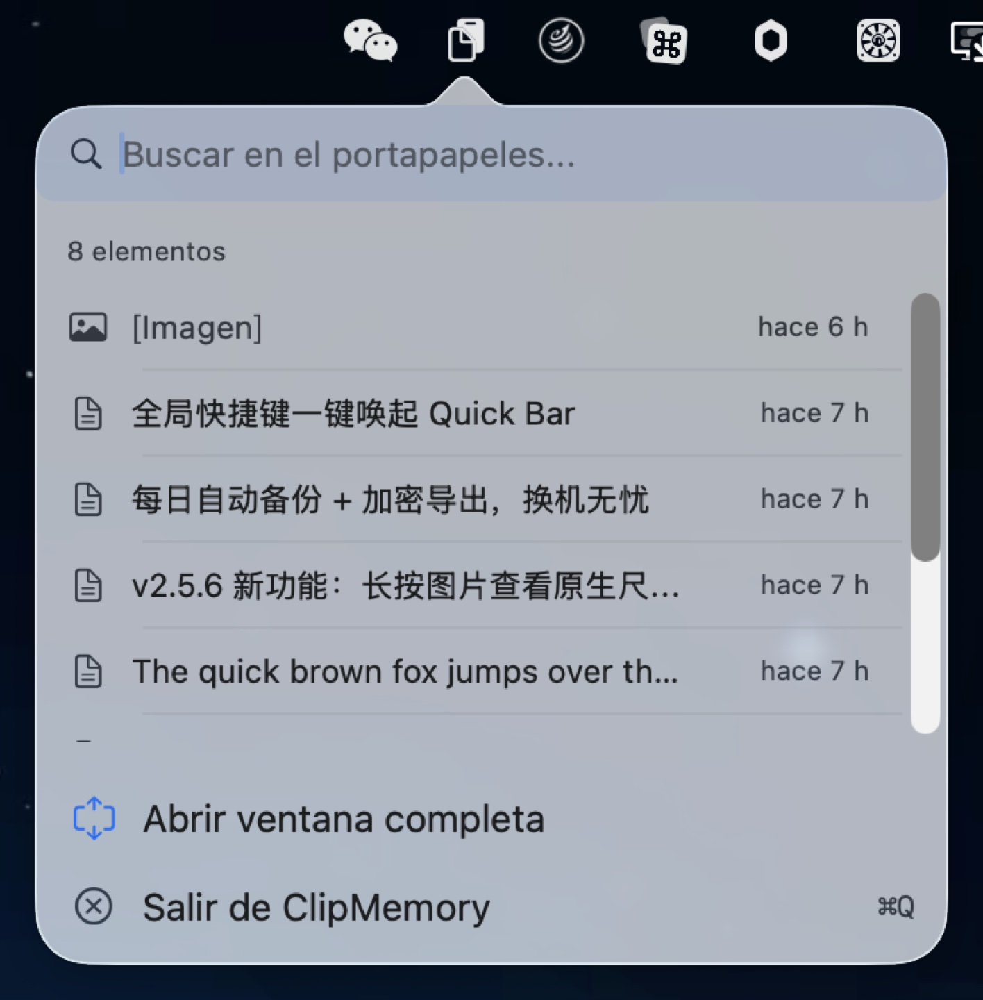
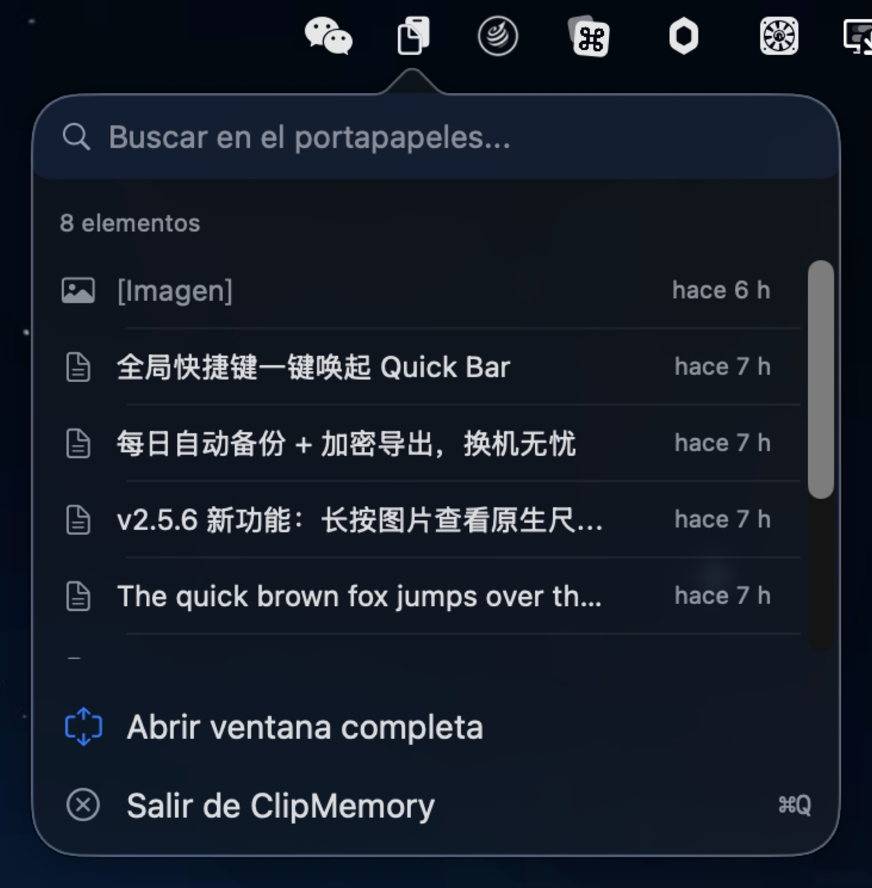
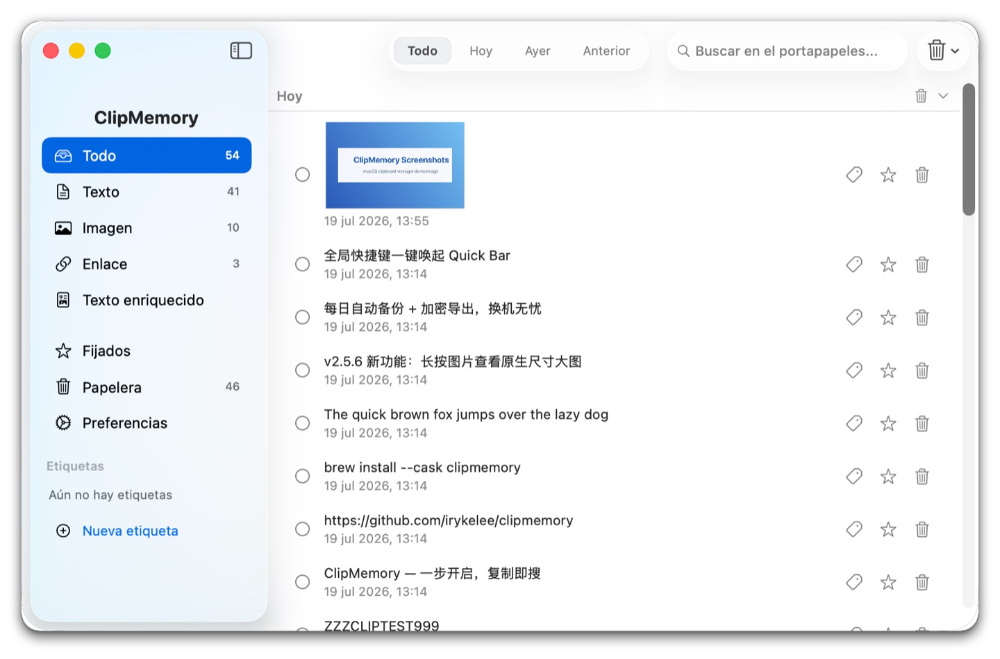
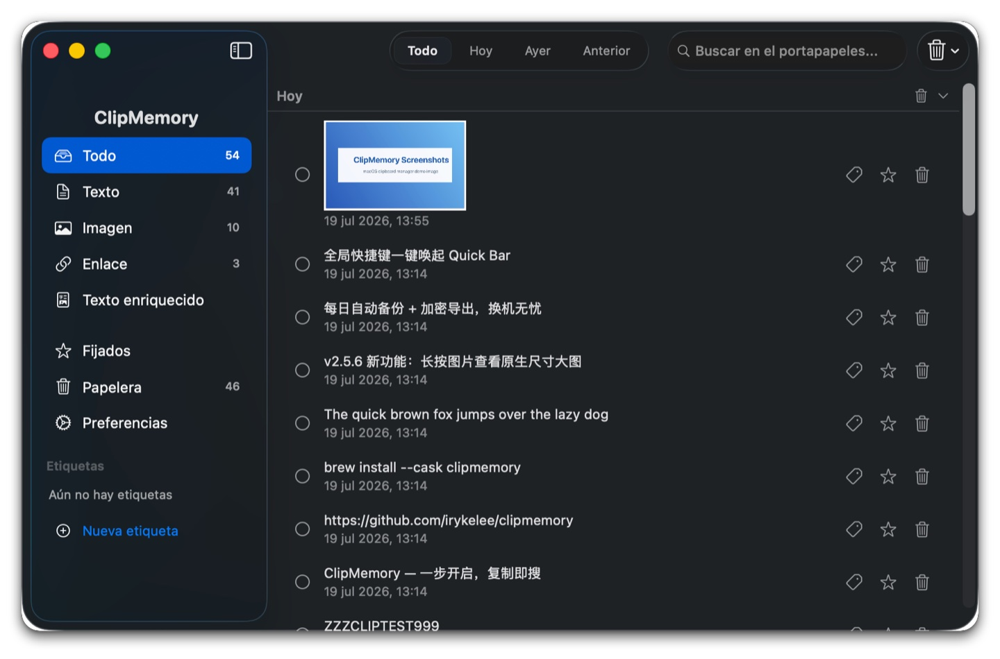

# ClipMemory v2.5.11

**Gestor de portapapeles de nueva generación para macOS — Un toque para buscar, instantánea para copiar**

[English](./README_EN.md) · [简体中文](./README.md) · [繁體中文](./README_ZH-HANT.md) · [日本語](./README_JA.md) · [한국어](./README_KO.md) · [Español](./README_ES.md) · [Português](./README_PT.md)

---

<p align="center">
  <br>
  <em>Quick Bar desde la barra de menús — 8 elementos recientes, búsqueda y copia al instante (claro)</em>
</p>

<p align="center">
  <br>
  <em>Quick Bar desde la barra de menús — 8 elementos recientes, búsqueda y copia al instante (oscuro)</em>
</p>

<p align="center">
  <br>
  <em>Ventana principal: barra lateral por tipo × agrupación por tiempo × resaltado de búsqueda (claro)</em>
</p>

<p align="center">
  <br>
  <em>Ventana principal: barra lateral por tipo × agrupación por tiempo × resaltado de búsqueda (oscuro)</em>
</p>

---

## v1 → v2 Mejoras principales

| Aspecto | v1 | v2 |
|---------|----|----|
| **Interacción** | Menú → menú → ventana (3 pasos) | Quick Bar emergente (1 paso) |
| **Ventana principal** | Ancho fijo, sin barra lateral | Barra lateral fija, cambia tipo libremente |
| **Atajo global** | Solo Cmd+Ctrl+V | Grabación personalizada soportada |
| **Quick Bar** | Ninguna | 8 elementos recientes, buscar y copiar al instante |
| **Resalte de búsqueda** | Resalte sobre texto | Sin distinción de mayúsculas/minúsculas, sin caracteres rotos |
| **Vista previa larga** | Ninguna | 0.4s revela texto completo / sensible / imagen |
| **Agrupación por tiempo** | Ninguna | Hoy / Ayer / Anterior, plegable |
| **Etiquetas** | Ninguna | Crear / eliminar / colores personalizados, filtrado en barra lateral + sugerencias inteligentes |
| **Papelera** | Eliminado para siempre | Papelera recuperable con retención configurable |
| **Actualización automática** | Descargas manuales | Comprobación en segundo plano, instalación y reinicio con un clic |
| **Copia local** | Ninguna | Copias diarias automáticas + exportación / importación cifrada |

---

## 📋 Registro de cambios

### v2.5.11 (2026-07-23) — División de ContentView + 16 correcciones de errores

### Principales actualizaciones (Highlights)

- **🏗 División de ContentView (NEW-7 Phase 4)** — Lista principal / selección / operaciones por lotes / alertas de eliminación, todo extraído de ContentView a un `ItemListView` independiente (287 líneas); ContentView 1178 → 995 líneas (-15.5%). Desacopla el renderizado de la lista + el estado relacionado con la lista, pero mantiene la búsqueda / filtro / caché de desplazamiento de la capa de vista en ContentView (evitando el riesgo de una refactorización única). La fase 6+ posterior (ViewModel collapse) convertirá `@State` en `@StateObject` para poder abrir la línea base de snapshot de ItemListView.
- **🛡 Paquete cuádruple de seguridad de datos** — El setter `maxItems` ahora limita a 1...10_000 para evitar valores negativos/extragrandes; `backupNow()` serializado (NSLock) para evitar condiciones de carrera por doble clic + copia de seguridad automática; `addTag()` recorta espacios al inicio/final para evitar duplicados como "  Work  " y "Work"; `ClipboardItemRow` observa LanguageManager para re-renderizar la fecha inmediatamente al cambiar de idioma.
- **🌐 Soporte de plurales i18n (F-7)** — 6 claves plurales con %d ahora usan `.stringsdict` (batch.selected / quickbar.recent / trash.emptyConfirm.message / alert.clear.message / settings.max.items.count / clear.conditional.confirm); en inglés "1 item" / "5 items" ya no son ambos "1 items"; nuevo script `Scripts/generate_stringsdict.py` para regenerar 7 idiomas con un solo comando.
- **🛡 Los errores de "Back Up Now" en Ajustes ya no se silencian (F-4)** — Antes `try?` descartaba cada fallo de `backupNow()`; ahora do/catch + callback `onShowBackupError` → ContentView muestra `L10n.settingsBackupError` NSAlert (consistente con las rutas de fallo de exportación/importación/snapshot previo a importación).
- **🛡 QuickBar ⌘F realmente enfoca la búsqueda (F-9)** — Antes solo dependía del monitor local NSEvent de KeyCaptureView (poco fiable en contexto de popover); ahora se añade notificación `.cmdFFindAction` como respaldo, siguiendo la misma ruta que ContentView.

### Correcciones (Fixes)

Ordenadas por impacto (alto → medio → bajo):

**Alto impacto (ruta crítica de arquitectura / datos / UX)**

- **NEW-7 Phase 4 Extracción de ItemListView** — Lista principal / selección / operaciones por lotes / alertas de eliminación, todo extraído de ContentView (287 líneas); ContentView 1178 → 995 líneas (-15.5%).
- **E-1 Limitación del setter maxItems** — Rango `1...10_000`; UserDefaults ya no se contamina con -1 / 999_999_999; las nuevas constantes `minMaxItems` / `maxMaxItems` son la única fuente de verdad.
- **E-2 Serialización de backupNow()** — Envuelto con `NSLock`; doble clic en "Back Up Now" + copia de seguridad automática en el mismo fotograma ya no causan condiciones de carrera en `createDirectory` + `copyItem(Images)`.
- **E-13 ClipboardItemRow observa LanguageManager** — `@ObservedObject private var languageManager = LanguageManager.shared`; al cambiar Idioma en Ajustes, el formato de fecha se re-renderiza inmediatamente (ya no espera a desplazar fuera y dentro de la vista).
- **F-9 Corrección de ⌘F en QuickBar** — `.onReceive(NotificationCenter.default.publisher(for: .cmdFFindAction))` añadido al VStack raíz de QuickBarView; en entorno popover, ⌘F también enfoca el campo de búsqueda.
- **F-4 Alerta de error de "Back Up Now" en Ajustes** — Callback `onShowBackupError` conectado a `showBackupInfo(L10n.settingsBackupError)` en ContentView; los fallos ahora son visibles.

**Impacto medio (consistencia UX / a11y / i18n)**

- **F-10 Enter en Welcome vinculado al botón por defecto** — `.keyboardShortcut(.defaultAction)` añadido a `getStartedButton`; al presionar Enter en la ventana de Welcome se ejecuta directamente onComplete.
- **F-13 Etiqueta ↑↓ en TipsView** — `L10n.quickbarRecent(8)` cambiado a `L10n.tipsKeyUpdown` = "Navigate items"; traducciones nativas en 6 idiomas (zh-Hans 切换条目 / zh-Hant 切換條目 / ja 項目を移動 / ko 항목 이동 / es Navegar por los elementos / pt Navegar pelos itens).
- **F-3 Botones de TrashItemRow visibles con teclado** — `@FocusState private var isFocused: Bool` + `.focusable()` + `.focused($isFocused)`; en estado de foco de la fila, la opacidad también muestra los botones (antes solo se mostraban al pasar el ratón).
- **F-16 Eliminación por teclado en TagPickerSheet** — `.contextMenu` + `.onDeleteCommand`; las teclas ⌫ / Forward Delete o el menú contextual pueden activar la confirmación de eliminación (antes solo con pulsación larga).
- **F-20 accessibilityLabel para pin/delete** — Botones solo con imagen añaden `.accessibilityLabel(...)` reutilizando claves `L10n.tooltip*` existentes; VoiceOver ya no lee "button" sin contexto.

**Bajo impacto (limpieza / rendimiento / corrección de límites / mejora i18n)**

- **E-6 Recorte de espacios en addTag** — `tag.name.trimmingCharacters(in: .whitespacesAndNewlines)` en la entrada de `addTag(_:)`; "  Work  " y "Work" ya no se duplican.
- **BUG-007 Omisión de toggle de encabezado en ItemListView durante búsqueda** — `onTapGesture` no-op cuando `!searchText.isEmpty`; bajo reglas de visualización force-expand, mutar `collapsedGroups` provocaba estados colapsados inesperados al limpiar la búsqueda.
- **F-25 DateFormatter en UpdateStatusPanelView en caché** — `static let dateFormatter`; cada re-renderizado del body ya no crea un nuevo DateFormatter.
- **F-7 Extensión de .stringsdict con 3 claves plurales** — `alert.clear.message` / `settings.max.items.count` / `clear.conditional.confirm`; 3 claves multi-argumento (alert.trim con 2x %d / tagPicker & sidebar.deleteTag con %@) se posponen a la siguiente ronda.

### Nota de actualización (Upgrade Note)

- Versiones con módulo de actualización automática (Sparkle) desde v2.4.0: esperar la actualización automática en la app, o `brew upgrade --cask clipmemory`.
- Sin migración de datos, sin ventanas emergentes únicas.
- **Mejora i18n**: al cambiar a interfaz en chino, japonés o coreano, "Recent 1 item" / "Recent 5 items" ahora se muestran según la forma plural correspondiente.

### v2.5.11

### Principales actualizaciones (Highlights)

- **🏗 División de ContentView (NEW-7 Phase 4)** — Lista principal / selección / operaciones por lotes / alertas de eliminación, todo extraído de ContentView a un `ItemListView` independiente (287 líneas); ContentView 1178 → 995 líneas (-15.5%). Desacopla el renderizado de la lista + el estado relacionado con la lista, pero mantiene la búsqueda / filtro / caché de desplazamiento de la capa de vista en ContentView (evitando el riesgo de una refactorización única). La fase 6+ posterior (ViewModel collapse) convertirá `@State` en `@StateObject` para poder abrir la línea base de snapshot de ItemListView.
- **🛡 Paquete cuádruple de seguridad de datos** — El setter `maxItems` ahora limita a 1...10_000 para evitar valores negativos/extragrandes; `backupNow()` serializado (NSLock) para evitar condiciones de carrera por doble clic + copia de seguridad automática; `addTag()` recorta espacios al inicio/final para evitar duplicados como "  Work  " y "Work"; `ClipboardItemRow` observa LanguageManager para re-renderizar la fecha inmediatamente al cambiar de idioma.
- **🌐 Soporte de plurales i18n (F-7)** — 6 claves plurales con %d ahora usan `.stringsdict` (batch.selected / quickbar.recent / trash.emptyConfirm.message / alert.clear.message / settings.max.items.count / clear.conditional.confirm); en inglés "1 item" / "5 items" ya no son ambos "1 items"; nuevo script `Scripts/generate_stringsdict.py` para regenerar 7 idiomas con un solo comando.
- **🛡 Los errores de "Back Up Now" en Ajustes ya no se silencian (F-4)** — Antes `try?` descartaba cada fallo de `backupNow()`; ahora do/catch + callback `onShowBackupError` → ContentView muestra `L10n.settingsBackupError` NSAlert (consistente con las rutas de fallo de exportación/importación/snapshot previo a importación).
- **🛡 QuickBar ⌘F realmente enfoca la búsqueda (F-9)** — Antes solo dependía del monitor local NSEvent de KeyCaptureView (poco fiable en contexto de popover); ahora se añade notificación `.cmdFFindAction` como respaldo, siguiendo la misma ruta que ContentView.

### Correcciones (Fixes)

Ordenadas por impacto (alto → medio → bajo):

**Alto impacto (ruta crítica de arquitectura / datos / UX)**

- **NEW-7 Phase 4 Extracción de ItemListView** — Lista principal / selección / operaciones por lotes / alertas de eliminación, todo extraído de ContentView (287 líneas); ContentView 1178 → 995 líneas (-15.5%).
- **E-1 Limitación del setter maxItems** — Rango `1...10_000`; UserDefaults ya no se contamina con -1 / 999_999_999; las nuevas constantes `minMaxItems` / `maxMaxItems` son la única fuente de verdad.
- **E-2 Serialización de backupNow()** — Envuelto con `NSLock`; doble clic en "Back Up Now" + copia de seguridad automática en el mismo fotograma ya no causan condiciones de carrera en `createDirectory` + `copyItem(Images)`.
- **E-13 ClipboardItemRow observa LanguageManager** — `@ObservedObject private var languageManager = LanguageManager.shared`; al cambiar Idioma en Ajustes, el formato de fecha se re-renderiza inmediatamente (ya no espera a desplazar fuera y dentro de la vista).
- **F-9 Corrección de ⌘F en QuickBar** — `.onReceive(NotificationCenter.default.publisher(for: .cmdFFindAction))` añadido al VStack raíz de QuickBarView; en entorno popover, ⌘F también enfoca el campo de búsqueda.
- **F-4 Alerta de error de "Back Up Now" en Ajustes** — Callback `onShowBackupError` conectado a `showBackupInfo(L10n.settingsBackupError)` en ContentView; los fallos ahora son visibles.

**Impacto medio (consistencia UX / a11y / i18n)**

- **F-10 Enter en Welcome vinculado al botón por defecto** — `.keyboardShortcut(.defaultAction)` añadido a `getStartedButton`; al presionar Enter en la ventana de Welcome se ejecuta directamente onComplete.
- **F-13 Etiqueta ↑↓ en TipsView** — `L10n.quickbarRecent(8)` cambiado a `L10n.tipsKeyUpdown` = "Navigate items"; traducciones nativas en 6 idiomas (zh-Hans 切换条目 / zh-Hant 切換條目 / ja 項目を移動 / ko 항목 이동 / es Navegar por los elementos / pt Navegar pelos itens).
- **F-3 Botones de TrashItemRow visibles con teclado** — `@FocusState private var isFocused: Bool` + `.focusable()` + `.focused($isFocused)`; en estado de foco de la fila, la opacidad también muestra los botones (antes solo se mostraban al pasar el ratón).
- **F-16 Eliminación por teclado en TagPickerSheet** — `.contextMenu` + `.onDeleteCommand`; las teclas ⌫ / Forward Delete o el menú contextual pueden activar la confirmación de eliminación (antes solo con pulsación larga).
- **F-20 accessibilityLabel para pin/delete** — Botones solo con imagen añaden `.accessibilityLabel(...)` reutilizando claves `L10n.tooltip*` existentes; VoiceOver ya no lee "button" sin contexto.

**Bajo impacto (limpieza / rendimiento / corrección de límites / mejora i18n)**

- **E-6 Recorte de espacios en addTag** — `tag.name.trimmingCharacters(in: .whitespacesAndNewlines)` en la entrada de `addTag(_:)`; "  Work  " y "Work" ya no se duplican.
- **BUG-007 Omisión de toggle de encabezado en ItemListView durante búsqueda** — `onTapGesture` no-op cuando `!searchText.isEmpty`; bajo reglas de visualización force-expand, mutar `collapsedGroups` provocaba estados colapsados inesperados al limpiar la búsqueda.
- **F-25 DateFormatter en UpdateStatusPanelView en caché** — `static let dateFormatter`; cada re-renderizado del body ya no crea un nuevo DateFormatter.
- **F-7 Extensión de .stringsdict con 3 claves plurales** — `alert.clear.message` / `settings.max.items.count` / `clear.conditional.confirm`; 3 claves multi-argumento (alert.trim con 2x %d / tagPicker & sidebar.deleteTag con %@) se posponen a la siguiente ronda.

### Nota de actualización (Upgrade Note)

- Versiones con módulo de actualización automática (Sparkle) desde v2.4.0: esperar la actualización automática en la app, o `brew upgrade --cask clipmemory`.
- Sin migración de datos, sin ventanas emergentes únicas.
- **Mejora i18n**: al cambiar a interfaz en chino, japonés o coreano, "Recent 1 item" / "Recent 5 items" ahora se muestran según la forma plural correspondiente.

### v2.5.10 (2026-07-22) — Errores de copia visibles + refactorización UI + corrección de advertencia SwiftUI

- **🛡 Corrupción de copia visible (BUG-024)** — Archivos items.json / trash.json / tags.json / de imagen corruptos ya no se importan silenciosamente como 0 elementos; los fallos ahora lanzan `corruptedData` y aparecen en alerta de Ajustes
- **⚡ Extracción de SidebarView (NEW-7 Fase 3)** — ContentView reducido de 1162 a 1123 líneas; barra lateral con interfaz explícita de 11 parámetros, pruebas snapshot + verificación manual 7/7 aprobada
- **🛡 Corrección de advertencia @State de SwiftUI (BUG-009)** — Caché de resaltado de `ClipboardItemRow` migrada de diccionarios `@State` a `NSCache`; sin más advertencia en tiempo de ejecución "Modifying state during view update"; caché limitada a 500 entradas para evitar crecimiento ilimitado

### v2.5.9 (2026-07-21) — Detección de cuelgues + correcciones de auditoría completas

- **🛡 Detección de cuelgues (HangDetector)** — Latido del hilo principal + sonda de 30s; primer cuelgue tras 60s sin respuesta registra el stack y se recupera automáticamente; evita congelamientos silenciosos de la UI
- **🛡 Mejora PBKDF2 del paquete de copia** — PBKDF2-SHA256 de 600k rondas reemplaza HKDF de una sola ronda; coste de fuerza bruta offline ~10⁵× mayor (cumple OWASP 2023); paquetes antiguos compatibles transparentemente
- **⚡ Puente de caché para copia RTF** — Rama RTF de `copyToClipboard` con caché < 1ms (antes 20-100ms de análisis síncrono bloqueando el hilo principal); caché puente automático entre lista y quickbar
- **🛡 Estado de UI preservado** — Entrada en barra de búsqueda ya no deja resaltado de teclado obsoleto por bypass de `@State didSet` vía Binding; insignias de etiquetas en sidebar ya no quedan obsoletas al añadir/quitar etiquetas
- **🛡 E/S del hilo principal descarga** — Rutas image/RTF de `copyToClipboard` ya no bloquean el sondeo del portapapeles; exportación de copia de seguridad con guarda de tamaño 50MB evita OOM

### v2.5.8 (2026-07-20) — Auditoría de estabilidad + 23 correcciones

- **🛡 Refuerzo de exportación/importación de copia de seguridad** — `ditto` atascado ya no bloquea la UI indefinidamente (timeout 30s + escalada SIGKILL); sal HKDF ahora falla explícitamente si CSPRNG de OS falla, sin relleno silencioso con ceros
- **⚡ Análisis RTF movido a cola en segundo plano** — Pegar texto enriquecido grande ya no atasca el sondeo del portapapeles; OCR/reconocimiento de imagen también en segundo plano, hilo principal más fluido
- **🛡 Corrección de advertencia de renderizado SwiftUI** — "Modifying state during view update" en cambios de conteo de ítems eliminado, sin renders extra
- **🔧 Almacenamiento en memoria seguro para hilos** — Pruebas y futuros llamadores multi-hilo ya no crashean o pierden datos por mutación de array en `MemoryStorageBackend`
- **🏷 Corrección de fallback de color de etiqueta** — Hex inválido ahora cae al color de acento, visible en modo claro/oscuro

### v2.5.7 (2026-07-20) — HangDetector observabilidad + correcciones críticas

- **🛰️ Módulo de observabilidad HangDetector** — El watchdog en segundo plano detecta automáticamente bloqueos del hilo principal >60s y registra la pila completa + tiempo de recuperación
- **🛡️ Corrige pérdida silenciosa de datos cuando falla HMAC** — En errores raros de Keychain, el contenido se descartaba como duplicado
- **🛡️ Corrige crash de navegación QuickBar** — Al pulsar ↑↓ con el elemento seleccionado borrado externamente ya no crashea
- **🧪 Corrige crash de force-unwrap en tests** — Patrón `XCTAssertNotNil + !` reemplazado por `guard let ... XCTFail(...) return`
- **🖼️ Corrige condición de carga de imágenes en paralelo** — Escrituras serializadas vía DispatchQueue
- **🛡️ Corrige TOCTOU de config Excluded-app** — Añadida API atómica `updateExcludedBundleIds`
- **🧹 Corrige estado residual de la barra de selección** — Se cierra correctamente tras eliminar fila

### v2.5.6 (2026-07-19) — Clave en el Llavero + vista a tamaño real + endurecimiento

- **🔐 Clave migrada al Llavero** — la clave raíz de cifrado pasa de un archivo en texto plano al Llavero de macOS (solo este dispositivo, sin iCloud); brew uninstall --zap también la elimina
- **🖼 Vista de imagen a tamaño real** — pulsación larga para un panel flotante a resolución nativa; las capturas grandes se recorren con scroll y el texto sigue legible (sustituye al zoom de 300px en la fila)
- **🛡 Arranque endurecido** — la corrupción o el fallo al guardar la clave ya no cierran la app; una alerta clara permite salir, reintentar o restablecer (borra el historial)
- **🌐 Espejo con consentimiento** — si el servidor de GitHub no responde, el espejo de jsDelivr ahora pregunta una vez y recuerda tu elección; un espejo desactualizado se rechaza automáticamente

### v2.5.5 (2026-07-18) — Eliminación por condición + endurecimiento

- **🗑 Eliminar por condición** — nueva opción en el menú 🗑 de la barra: tipo × periodo (p. ej. borrar solo imágenes antiguas y conservar las de hoy); clic derecho en una pestaña de tipo para eliminar todo ese tipo; nuevos botones de borrado en las cabeceras de grupo
- **🏷️ Opciones al eliminar etiquetas** — al eliminar una etiqueta puedes elegir «Eliminar solo etiqueta» o «Eliminar etiqueta y contenido (a la Papelera)»
- **🔧 Importación reforzada** — los nombres de etiquetas se descifran correctamente entre máquinas (sin texto corrupto); corregidos duplicados dentro de un mismo paquete, entradas ilegibles importadas al fallar el descifrado, congelamiento de la UI con paquetes grandes y la limpieza de copias borrando archivos ajenos

### v2.5.0 (2026-07-18) — Copia local + exportar/importar

- **💾 Copias locales automáticas** — el historial del portapapeles (incluidas etiquetas, papelera e imágenes) se respalda a diario al primer inicio en una carpeta local de copias, conservando 7 por defecto (3/7/14/30 configurable): un seguro contra la pérdida de datos
- **📦 Exportar / Importar** — exporta con un clic un paquete .clipmemory cifrado (protegido con contraseña); restaura tras cambiar de Mac o reinstalar. La importación fusiona y elimina duplicados con los datos existentes sin sobrescribirlos
- **⚙️ Nueva sección «Copia de seguridad» en Ajustes** — interruptor de copia automática, cantidad a conservar, Copiar ahora, abrir carpeta, exportar/importar

### v2.4.2 (2026-07-18) — Correcciones de estabilidad + canales duales de actualización

- **🌐 Canales duales de actualización** — cambia automáticamente al espejo jsDelivr cuando GitHub no es accesible; las alertas de actualización traen la app al frente con insignia en el Dock (gentle reminders)
- **💾 Seguridad de datos** — los nuevos elementos del portapapeles se escriben en disco de inmediato; antes podían perderse con kill -9 / apagón dentro de la ventana de 500ms
- **🐛 Correcciones de estabilidad** — eliminado el spam del aviso SwiftUI "Modifying state during view update" (decenas por segundo → 0); se detuvieron los errores -9878 repetidos al iniciar cuando el atajo está ocupado

### v2.4.1 (2026-07-18) — Corrección del feed de actualización

- **🌐 Corregido el "error de actualización"** — el feed appcast se migró de raw.githubusercontent.com (inalcanzable en algunas redes) a un activo de GitHub Release; la comprobación responde al instante. Si v2.4.0 muestra un error, descarga v2.4.1 manualmente una vez; la actualización automática se reanuda después

### v2.4.0 (2026-07-18) — Papelera

- **🗑️ Papelera (Recycle Bin)** — Los elementos eliminados ya no se destruyen de inmediato. Pasan a una Papelera donde permanecen 7 días (configurable en Ajustes), durante los cuales puedes restaurarlos o eliminarlos permanentemente. Vaciar la papelera requiere confirmación; los elementos caducados se limpian automáticamente.
- **✨ Actualización automática (Sparkle 2)** — Comprobación de actualizaciones dentro de la app: diaria en segundo plano y manual desde Ajustes. Los paquetes se verifican con firma EdDSA antes de instalarse con un clic y reiniciar; el Cask de Homebrew declara auto_updates.
- **Seguridad de datos** — Los archivos de imagen se conservan mientras su elemento siga en la papelera; solo se eliminan al borrarlo permanentemente. La limpieza automática (trim/expiración) omite la papelera por completo.
- **Actualizaciones de la interfaz** — Nueva entrada «Papelera» en la barra lateral con contador; el texto de confirmación de eliminación cambia a «Mover a la papelera»; los elementos en papelera muestran su fecha de eliminación.
- **Pruebas** — 12 pruebas nuevas para la Papelera, todas superadas.

### v2.3.0 (2026-07-17) — Sistema de Etiquetas e Integridad de Datos

- **🏷️ Sistema de Etiquetas (Tag System)** — Ciclo de vida completo de etiquetas: crear / eliminar / colores personalizados; sección de etiquetas en barra lateral con filtrado AND entre secciones / OR dentro de sección; sugerencias inteligentes (basado en NLTagger: código / email / credencial / sensible); hoja TagPicker (chips en línea + selector de pulsación larga); diálogo de confirmación de eliminación
- **6 correcciones críticas de integridad de datos** — carrera de hilo saveTimer (UB); escrituras síncronas de FileStorageBackend; flushPendingSaves ahora también flushea etiquetas; reparación de marca de cifrado incorrecta en image items legacy; backfill de contentHash; recuperación de fallo parcial de ImageStorage
- **Mejoras de UI** — Dedupe de ventana de bienvenida; Esc cancela grabación de hotkey (evento devuelto al responder); actualización automática de currentDate al cruzar medianoche; expansión forzada de grupos en modo búsqueda (sincronización de navegación por teclado); corrección de typo en pendingMaxItemsReduction
- **Refactor + rendimiento** — RTF NSCache; caché de bundle L10n; estabilización del estado de WindowManager (@State preservado entre cerrar/reabrir); windowDidMove/Resize con debounce 0.5s; +9 net new tests (241 → 250)

### v2.2.4 (2026-07-16) — Higiene de Lanzamiento

- **Versión sincronizada con la etiqueta de release** — `MARKETING_VERSION` y `CURRENT_PROJECT_VERSION` actualizadas a `2.2.4` en `project.yml` y `project.pbxproj` regenerado. Resuelve la lección de v2.2.3 donde se cortó la etiqueta sin incrementar la versión.
- **Corrección de etiqueta en Quick Bar** — Eliminada la etiqueta de atajo engañosa `⌘⌃V` en el elemento "abrir ventana completa" de Quick Bar. El atajo global abre la ventana principal completa; Quick Bar se abre con clic izquierdo en el icono 📋 de la barra de menú.
- **Corrección de documentación sobre atajos** — La fila de `Cmd+Ctrl+V` en 8 README reescrita para aclarar que abre la ventana principal, no Quick Bar.
- **Seguridad del script de empaquetado** — `Scripts/package.sh` ahora lee la versión por defecto de `MARKETING_VERSION` en `project.yml` (con guarda si falla la lectura), evitando el problema de empaquetar un tarball con versión antigua cuando se invoca sin argumento.

### v2.2.1 (2026-05-19) — Corrección de Sensibilidad de Imagen

- **Corrección de sensibilidad de imagen** — Las imágenes ya no se marcan automáticamente por tamaño (umbral de 50KB eliminado), almacenamiento controlado por maxItems y limpieza manual
- **Extracción de componentes** — ContentView dividido en FlowLayout, LogoView, DateFilterButton, AppPickerRow, ClipboardItemRow
- **Utilidades compartidas** — Extraídos FontScaling.swift (sz()) y DateHelpers.swift (formatos de fecha)
- **Manejo de presión de memoria NSCache** — Añadido observador de advertencia de memoria del sistema para borrar caché bajo presión

### v2.2.0 (2026-05-15) — Soporte Rich Text

- **Captura de Portapapeles RTF** — Reconoce y guarda automáticamente contenido Rich Text
- **Renderizado Rich Text** — Conversión NSAttributedString → AttributedString
- **Copiar y Pegar** — Escribe ambos tipos de portapapeles .rtf y .string
- **Pestaña de Barra Lateral** — Nueva categoría "Rich Text" con icono, insignia de contador y filtro de tipo
- **Pantalla Quick Bar** — Icono Rich Text + Vista previa de texto plano
- **Enmascaramiento de Contenido Sensible** — Los elementos Rich Text también soportan enmascaramiento
- **85 Pruebas** — Incluyendo 4 pruebas de ida y vuelta Rich Text
- **Búsqueda Mejorada** — Funcionalidad de búsqueda Rich Text corregida

### v2.1.5 (2026-05-11) — Abstracción de Protocolo y Mejoras UX

- **Abstracción de Protocolo** — Protocolo StorageBackend + Backend de prueba MemoryStorageBackend
- **81 Pruebas** — Infraestructura de pruebas completa
- **Diálogo de Recorte Máximo** — Confirmación cuando el historial excede el límite
- **Marcador de Posición de Imagen** — Marcador elegante en fallo de carga
- **Operaciones de Grupo** — Desfijar/limpiar a nivel de grupo

### v2.1.0 (2026-05-09) — Liquid Glass UI

- Lenguaje de diseño Liquid Glass — Barra lateral NavigationSplitView + Pop-up QuickBar
- Correcciones de navegación de teclado — Manejo de teclas de flecha de desplazamiento y búsqueda

---

## Destacados

### Quick Bar — Un toque

Clic en icono de menú → NSPopover con 8 elementos recientes → clic para copiar / buscar / abrir ventana completa

### Pulsación larga 0.4s — Vista previa ilimitada

| Tipo de contenido | Predeterminado | Tras pulsación larga |
|------------------|---------------|---------------------|
| Texto normal | Primeros 200 caracteres, 3 líneas | Texto completo |
| Contenido sensible | Enmascarado `ab••••••yz` | Texto revelado |
| Imagen | Miniatura 80px | Panel flotante a tamaño nativo (con scroll si excede la pantalla) |

### Seguridad inteligente — Cifrado + Detección

- Cifrado AES-256-GCM (v2), compatible con AES-CBC+HMAC-SHA256 heredado
- 35 reglas de detección automática de datos sensibles (contraseñas / claves API / tokens Slack/Discord/OpenAI / números de identificación etc.)
- Pausa automática cuando el gestor de contraseñas está en primer plano, sin copiar desde la App
- Contenido nunca guardado en texto plano si falla el cifrado

---

## Lista de funciones

- 📋 Historial del portapapeles (texto / imágenes / enlaces /**Rich Text RTF**)
- ⭐ Fijar elementos importantes, no se eliminan automáticamente
- 💾 Imágenes almacenadas cifradas, hasta 50MB por imagen
- 🔍 Búsqueda en tiempo real con resalte multilingüe (incluidos caracteres CJK)
- ⚡ Deduplicación inteligente, contenido idéntico solo actualiza marca de tiempo
- 🔄 Prevención de bucle de copia, salta automáticamente la captura desde la App
- 🧹 Limpieza de huérfanos, elimina imágenes no referenciadas al iniciar
- 🌍 7 idiomas (简体中文 / 繁體中文 / English / 日本語 / 한국어 / Español / Português)
- ☑️ Selección múltiple para fijar / eliminar en lote
- ✅ Retroalimentación visual verde al copiar
- ⚙️ Detección automática de conflicto de atajo en el primer inicio
- ⌨️ Atajo global `Cmd+Ctrl+V`
- 🖥 Iniciar con la sesión (activar en Ajustes)
- 📐 Tamaño de fuente (Pequeño / Mediano / Grande)
- 🎨 Apariencia (Claro / Oscuro / Seguir sistema)
- 🗂️ Filtros de tipo (Todo / Texto / Imagen / Enlace / Rich Text)
- ⌨️ Navegación de teclado (desplazamiento con teclas de flecha, manejo de foco de búsqueda)

---

## Guía de uso

| Acción | Cómo |
|--------|------|
| Abrir Quick Bar | Clic en 📋 de barra menú |
| Copiar elemento | Clic en elemento / ↑↓ + Enter |
| Abrir ventana completa | `Cmd+Ctrl+V` (atajo global) / Quick Bar → "Abrir portapapeles" |
| Buscar | Escribir para filtrar, coincidencias resaltadas |
| Fijar / Desfijar | Clic ⭐ o doble clic en fila |
| Eliminar | Clic 🗑 o menú contextual |
| Vista previa completa / sensible / imagen | Mantener 0.4s, soltar para ocultar |
| Modo de selección múltiple | Clic en casilla |
| Limpiar historial | Barra superior 🗑 (fijados se conservan) |
| Eliminar por condición | Barra superior 🗑 → «Eliminar por condición» (tipo × periodo); clic derecho en la pestaña de tipo para eliminar todo ese tipo |
| Cambiar filtro de tipo | Clic en "Texto/Imagen/Enlace/Rich Text" en barra lateral |

> 💡 Los elementos fijados nunca se eliminan automáticamente. Copiar el mismo contenido no crea duplicados, solo actualiza la marca de tiempo.

---

## Seguridad

- **AES-256-GCM (v2) + compatibilidad heredada AES-CBC+HMAC-SHA256** — Todo texto e imagen se cifra automáticamente antes de guardar en disco
- **Detección inteligente** — 35 reglas (palabras clave + expresiones regulares) para contraseñas, claves API, tokens Slack/Discord/OpenAI, claves privadas, números de identificación, etc.
- **Borrado automático** — Contenido sensible configurable para borrar tras 1h / 24h / 48h / 7d, o nunca

---

## Ajustes

- Máximo de elementos históricos (50 / 100 / 200 / 500)
- Política de borrado automático sensible (1h / 24h / 48h / 7d / nunca)
- Cambio de idioma (7 idiomas)
- Grabación de atajo global
- Apariencia (Claro / Oscuro / Seguir sistema)
- Apps excluidas (apps personalizadas para excluir del monitoreo)
- Alternancia de captura Rich Text
- Tamaño de fuente (Pequeño / Mediano / Grande)
- Iniciar al arrancar
- Retención de la papelera (3 / 7 / 14 / 30 días)
- Copia de seguridad (diaria automática / cantidad / exportar / importar)
- Actualizaciones (comprobación automática / comprobar ahora)

---

## Requisitos

- macOS 13.0 (Ventura) o superior

---

## Migración de datos

El historial (incluida la clave de cifrado) se almacena en `~/Library/Application Support/ClipMemory/`.
La forma recomendada de migrar es Ajustes → Copia de seguridad → Exportar copia, que crea un paquete .clipmemory cifrado listo para importar en el nuevo Mac; copiar este directorio manualmente también funciona.
Antes de eliminar la app, haz clic en el botón 🗑 de la barra de herramientas superior para borrar el historial.

---

## Instalación

```bash
brew tap irykelee/clipmemory
brew trust irykelee/clipmemory
brew install --cask clipmemory
```

Tras instalar, la App está en `/Applications/ClipMemory.app`. Busque el icono 📋 en la **barra de menú** (esquina superior derecha) para empezar.

O descargue `.tar.gz` desde [GitHub Releases](https://github.com/irykelee/clipmemory/releases) y extraiga manualmente en `/Applications/`.

> **Si macOS bloquea el primer inicio con "Apple no puede verificar…"**: es el aviso habitual para apps sin notarización, no un virus. ① Clic derecho en la app → **Abrir** → **Abrir** de nuevo; o ② Ajustes del Sistema → Privacidad y seguridad → **Abrir de todos modos**. Solo la primera vez. (Quienes instalan con `brew install` no verán este aviso.)

---

## Desarrollo

```bash
brew install swiftlint xcodegen
xcodegen generate
xcodebuild -scheme ClipMemory -configuration Release
```

---

## Contacto

- GitHub: https://github.com/irykelee/clipmemory
- Comentarios: Ajustes → Acerca de → Enviar comentarios → GitHub Issues
