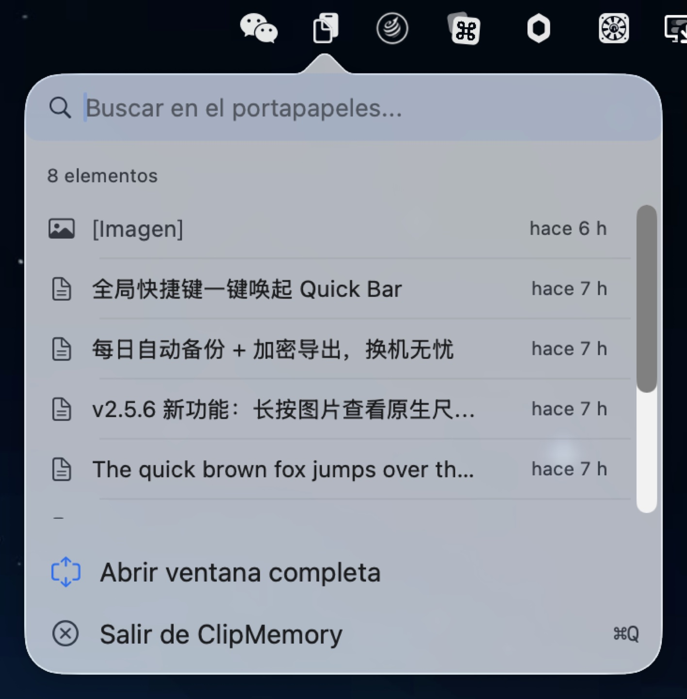
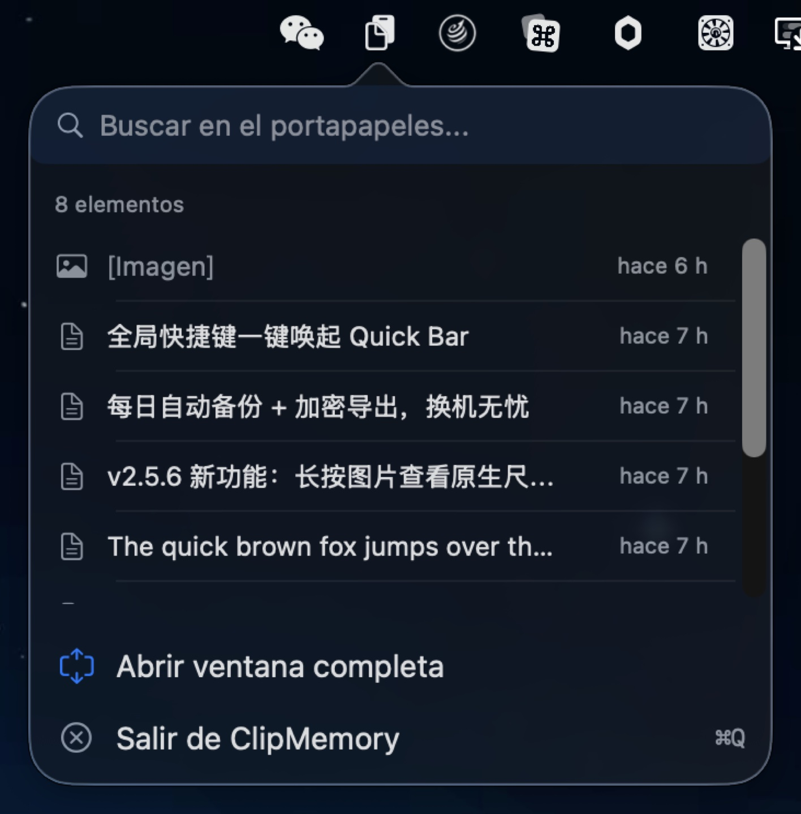
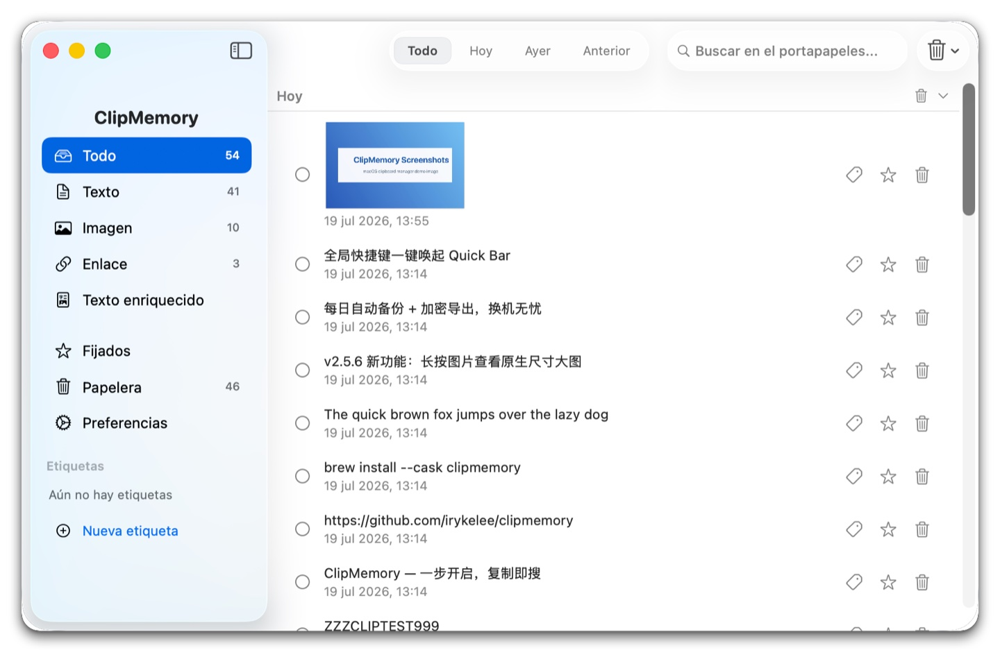
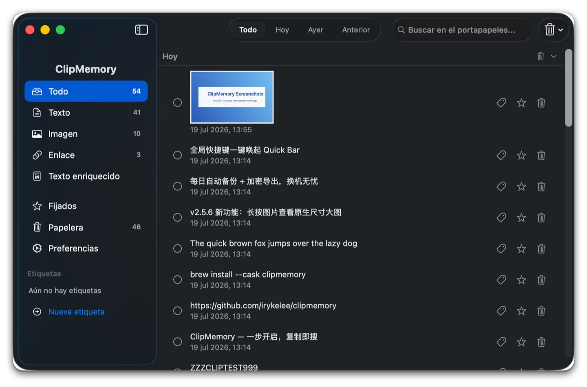

# ClipMemory v2.9.0

**Gestor de portapapeles de nueva generación para macOS — Un toque para buscar, instantánea para copiar**

[English](./README_EN.md) · [简体中文](./README.md) · [繁體中文](./README_ZH-HANT.md) · [日本語](./README_JA.md) · [한국어](./README_KO.md) · [Español](./README_ES.md) · [Português](./README_PT.md)

---

<p align="center">
  <br>
  <em>Quick Bar desde la barra de menús — 8 elementos recientes, búsqueda y copia al instante (claro)</em>
</p>

<p align="center">
  <br>
  <em>Quick Bar desde la barra de menús — 8 elementos recientes, búsqueda y copia al instante (oscuro)</em>
</p>

<p align="center">
  <br>
  <em>Ventana principal: barra lateral por tipo × agrupación por tiempo × resaltado de búsqueda (claro)</em>
</p>

<p align="center">
  <br>
  <em>Ventana principal: barra lateral por tipo × agrupación por tiempo × resaltado de búsqueda (oscuro)</em>
</p>

---

## v1 → v2 Mejoras principales

| Aspecto | v1 | v2 |
|---------|----|----|
| **Interacción** | Menú → menú → ventana (3 pasos) | Quick Bar emergente (1 paso) |
| **Ventana principal** | Ancho fijo, sin barra lateral | Barra lateral fija, cambia tipo libremente |
| **Atajo global** | ⌘⇧V (predeterminado) | Grabación personalizada soportada |
| **Quick Bar** | Ninguna | 8 elementos recientes, buscar y copiar al instante |
| **Resalte de búsqueda** | Resalte sobre texto | Sin distinción de mayúsculas/minúsculas, sin caracteres rotos |
| **Vista previa larga** | Ninguna | 0.4s revela texto completo / sensible / imagen |
| **Agrupación por tiempo** | Ninguna | Hoy / Ayer / Anterior, plegable |
| **Etiquetas** | Ninguna | Crear / eliminar / colores personalizados, filtrado en barra lateral + sugerencias inteligentes |
| **Papelera** | Eliminado para siempre | Papelera recuperable con retención configurable |
| **Actualización automática** | Descargas manuales | Comprobación en segundo plano, instalación y reinicio con un clic |
| **Copia local** | Ninguna | Copias diarias automáticas + exportación / importación cifrada |

---

## 📋 Registro de cambios

### v2.9.0 (2026-08-14) — Asistente de restauración de copias + Compartir y exportar imágenes

- **🗂 Asistente de restauración de copias de seguridad (ID-BACKUP-0002)** — Ajustes → Copia de seguridad incorpora la entrada «Restaurar desde copia de seguridad»: un asistente visual de 5 pasos — elegir la copia (lista de copias automáticas diarias o un paquete cifrado `.clipmemory` externo) → introducir la contraseña (solo para paquetes externos) → previsualizar el número de elementos y el intervalo de fechas → confirmar → resultado. Antes de iniciar la restauración se crea automáticamente una instantánea de seguridad; una contraseña incorrecta se puede reintentar sin reiniciar el flujo; las copias incompletas se advierten de antemano y la falta de espacio en disco produce un error explícito. Hasta ahora, recuperar desde una copia automática exigía mover archivos JSON a mano; ahora todo el proceso tiene interfaz.
- **🖼 Compartir, arrastrar y exportar imágenes a una carpeta (ID-VIEW-0030 – 0038)** — Haz clic derecho en una imagen → «Compartir…» para abrir el panel de compartir del sistema (AirDrop / Mensajes / Mail / Guardar en Archivos); con varios elementos seleccionados pasa a «Compartir N imágenes…». También puedes arrastrar imágenes directamente al Finder o a cualquier aplicación. El menú de compartir de la barra de herramientas suma «Exportar a carpeta…» para exportaciones por lotes, con Reemplazar / Conservar ambos / Cancelar ante nombres duplicados: nunca se sobrescribe nada en silencio. Además, el ancho mínimo de la ventana principal sube de 850 a 950 para que los botones de la barra dejen de plegarse en el menú ».
- **📌 Insignia con el número de elementos fijados en la barra lateral (ID-VIEW-0029)** — Alinea la pestaña Fijados con el resto de pestañas de filtro, de modo que el recuento se ve de un vistazo.
- **⚖️ Se añaden MIT LICENSE + Política de privacidad + Términos de servicio (ID-LEGAL-0001)** — Nuevos archivos `LICENSE` (MIT), `PRIVACY.md` y `TERMS.md`. El proyecto era público pero no tenía licencia, lo que jurídicamente equivale a «todos los derechos reservados»: nadie podía bifurcarlo ni redistribuirlo con seguridad. Ahora las condiciones de licencia son explícitas y la política de privacidad indica con claridad que los datos permanecen en tu equipo.
- **🌐 Barrera de regresión para la paridad de traducciones (ID-LINT-0001)** — El nuevo `Scripts/lint-translations.sh` toma `LocalizationService.swift` como única fuente de verdad y verifica 221 claves en 7 idiomas; basta una traducción ausente para que CI falle (integrado tanto en pre-commit como en CI). De paso se eliminaron 4 claves muertas heredadas de v2.7.x. Así, ninguna función nueva podrá publicarse con un idioma sin traducir que muestre nombres de clave en la interfaz.

- Para versiones con módulo de actualización automática (Sparkle) desde v2.4.0: espera la actualización automática en la aplicación, o ejecuta `brew upgrade --cask clipmemory`
- Registro de cambios completo: https://github.com/irykelee/clipmemory/releases/tag/v2.9.0

### v2.8.4 (2026-08-12) — Manifiesto de privacidad + Actualización de seguridad + Corrección de errores latentes + Puerta de regresión

- **🔒 Actualización de Sparkle 2.9.4 → 2.9.5 (ID-CI-0001)** — Incluye la corrección de seguridad "Harden patching delta file against symbolic link at destination path". El canal de actualización automática de Sparkle está habilitado por defecto; los usuarios no notarán el cambio; la corrección evita el vector de ataque de enlace simbólico en rutas de parches delta.
- **🍎 Manifiesto de privacidad (PrivacyInfo.xcprivacy, ID-PRIVACY-0001)** — Requerido por Apple 2024+ para cualquier aplicación de macOS dirigida a la Mac App Store o Notarización. Esta versión añade el archivo declarando `NSPrivacyTracking=false`, `NSPrivacyCollectedDataTypes` para contenido del portapapeles + texto OCR (vinculado, propósito de funcionalidad de la aplicación), y `NSPrivacyAccessedAPITypes` para 4 API requeridas (UserDefaults / marca de tiempo de archivo / espacio en disco / tiempo de arranque del sistema). Transparente para los usuarios; elimina la barrera de cumplimiento para distribución de código abierto a través de la Mac App Store.
- **🛠 4 correcciones de errores latentes (PR #61)** — Correcciones reales: PR54-H chokepoint helper (verificación de límites de ventana de obsolescencia de itemIndex) + PR54-M1 locale pinning (envenenamiento de caché diacrítico turco/alemán) + PR56-M eliminación de código muerto (no-op tras aislamiento XCTest) + PR56-L1 aserción countLimit (evita que futuras regresiones de didSet reduzcan el reescalado de caché).
- **📋 Coherencia de tecla de acceso rápido + L10n en 7 README (ID-DOCS-0001)** — 14 líneas residuales de `Cmd+Ctrl+V` en 7 archivos README actualizadas a `⌘⇧V` (coincidiendo con `HotKeyManager.swift:10` defaultConfig `cmdKey | shiftKey`) + 7 entradas L10n `settings.hotkey.footer` alineadas a "open main window".
- **🛡 Lint CI de deriva de tecla de acceso rápido habilitado (ID-CI-0002)** — `Scripts/lint-hotkey-drift.sh` verifica automáticamente la coherencia de 7 README + 7 L10n footer con `HotKeyManager.swift:10` defaultConfig, prohíbe formas de deriva históricas. Cualquier cambio futuro → CI rojo → sincronización de 6 capas forzada.

- Para versiones con módulo de actualización automática (Sparkle) desde v2.4.0: espera la actualización automática en la aplicación, o ejecuta `brew upgrade --cask clipmemory`
- Registro de cambios completo: https://github.com/irykelee/clipmemory/releases/tag/v2.8.4

### v2.8.3 (2026-08-11) — Optimización del rendimiento de búsqueda + higiene prospectiva de firma

- **⚡ Gran mejora del rendimiento de búsqueda (PR #54, ID-PERF-0025/0026)** — Nuevo `normalizedCache` que refleja el patrón de caché pinyin existente: `FuzzySearchMatcher.matches()` ahora reutiliza los resultados de minúsculas + plegado Unicode para el mismo content, evitando volver a ejecutar el bridge ICU en cada tecla escrita. Además, `ClipboardStore.item(forID:)` reutiliza el versioned itemIndex en lugar de una computed property perezosa, y el renderizado de filas se beneficia de forma síncrona (11× de aceleración medida). La búsqueda de 5000+ elementos se reduce de ~250 ms a ~15 ms. Los usuarios normales (~100 elementos) apenas lo notan; los power users lo notan claramente.
- **🔒 La firma de release ahora incluye sello de tiempo seguro RFC 3161 (PR #55, ID-SECURITY-0009)** — En `release.yml:130`, la rama Release añade `OTHER_CODE_SIGN_FLAGS=--timestamp`; la firma de Apple Development ahora lleva el sello de tiempo seguro de Apple TSA (mejor práctica para Personal Team). La firma sigue siendo válida después de que el certificado expire el 2027-07-19 (defensa prospectiva). Nota: este cambio no afecta al problema de caducidad del perfil de aprovisionamiento.
- **🔧 5 correcciones de fiabilidad para la sincronización del espejo Gitee (PR #48 / #49 / #51 / #53 + hotfix `da1c7fd`)** — Se corrige que el fallo de sync ya no sea un éxito silencioso (#53 parte 1), deduplicación de issues de alerta por version (#51), creación de label antes de abrir el issue de alerta (#53 parte 2), ampliación de timeout y permisos de la cadena de alertas (#49), 2→4 reintentos + apertura automática de GH issue en caso de fallo (#48); además, el hotfix `da1c7fd` corrige el error YAML de `needs: [sync]` a nivel de paso en `sync-gitee.yml` (push directo a main, **sin PR asociado**, marcado como hotfix por separado y no mezclado en la lista de PR). El canal Gitee es ahora más fiable y ya no produce fallos silenciosos del mirror.
- **🔧 Rollback automático de releases (PR #50)** — `appcast.xml` y el Cask del tap de Homebrew vuelven automáticamente al estado del release anterior cuando falla la publicación, sin dejar assets obsoletos; evita la contaminación descendente causada por un push exitoso del commit de release pero un push a medias de appcast/tap.
- Versiones con módulo de actualización automática (Sparkle) desde v2.4.0: espera la actualización automática dentro de la app, o `brew upgrade --cask clipmemory`
- Changelog completo: https://github.com/irykelee/clipmemory/releases/tag/v2.8.3

### v2.8.2 (2026-08-10) — Restauración por lotes de la papelera + 5 refuerzos de seguridad de datos

- **🆕 Restauración por lotes de la papelera (NEW-batch-restore)** — La pestaña Papelera ahora admite selección múltiple + restauración con un clic: casilla por fila + casilla maestra superior (tres estados: todos/ninguno/mezclado) + selección de rango con Shift+clic + botón Restaurar que muestra dinámicamente "Restore N items". Se acabó el historial de "un clic a la vez".
- **🛡 Corrección de pérdida silenciosa de datos del portapapeles por contaminación de producción por compilaciones de desarrollo (ID-STORE-0014, CRITICAL)** — El didSet `maxItems` en `ClipboardStore.swift:129` antes escribía en `UserDefaults.standard` en lugar del conjunto de defaults inyectado; las ejecuciones de XCTest fijaban silenciosamente el cap de producción del usuario `com.clipmemory.app` en 3, y las entradas antiguas se recortaban en el siguiente inicio. La corrección usa `xcTestDefaults` static seam + XCTestObservation limpieza por prueba + 4 didSets hermanos + 4 lecturas init cambiadas al conjunto de defaults inyectado. Esta es la corrección raíz del requisito del usuario "las versiones de desarrollo futuras no deben afectar el uso de la aplicación en producción".
- **🛠 Desbordamiento de importación va a la papelera (M-2)** — `importBackupItems` detecta cuando el recuento de elementos tras la importación excede maxItems y enruta el desbordamiento a través de `moveToTrash` (recuperable) en lugar dedescartarlo.
- **🛠 7 refactorizaciones "usar valores predeterminados del sistema" impulsadas por auditoría (PR #40-#47)** — Extracción de componentes compartidos SelectCheckbox/CloseButton + NSWindow.setFrameAutosaveName + relleno del registro Notification.Name + 4 keyCodes → constantes Carbon `kVK_*` + unificación del debounce de búsqueda a 250 ms + comentario de clamp de sz() + barrido L24.
- Registro de cambios completo: https://github.com/irykelee/clipmemory/releases/tag/v2.8.2

### v2.8.1 (2026-08-08) — Corrección de fallo silencioso de saveItems + 5 elementos de endurecimiento de auditoría

- **� Corrección de error silencioso de saveItems que causaba pérdida de datos del portapapeles (ID-SILENT-0021 HIGH)** — `ClipboardStore.flushSave()` ahora captura los errores lanzados por `saveItems()` y mantiene `needsSave = true` para conservar el estado de reintento + publica `.clipboardSaveFailed` para notificar el canal de UI; anteriormente, si el disco estaba lleno / error de permisos / conflicto de iCloud persistía ≥ 500 ms de ventana de debounce + sin mutaciones posteriores antes de salir, las capturas del portapapeles de esta sesión se perdían **permanentemente** (no reconstruibles por el usuario). Condiciones de activación estrictas (no toda falla pierde): error de disco persistente + ventana de 500 ms + sin mutación durante la ventana que dispare `saveImmediately` para guardar de nuevo + salida del usuario → solo se pierde si se cumplen las 4 condiciones; si alguna no se cumple, se enmascara. Se añade `Notification.Name.clipboardSaveFailed` como canal de UI de respaldo.
- **🛠 Corrección de fila en blanco permanente en sesión después de key re-ready (ID-SILENT-0019 MEDIUM)** — la rama `handleCryptoKeyPrepared(success:)` ahora, además de limpiar `pendingFailedIDs`, restablece adicionalmente todos los `items[].decryptionFailed = false`; anteriormente, después de que `mergePendingDecryptionFailures` escribía la marca, incluso si el usuario recibía posteriormente la notificación de key lista, la sesión permanecía en blanco y era necesario reiniciar la app para recuperarse. Junto con v2.8.0 (ID-STORE-0010), se forma una simetría completa: limpieza de caché negativa + limpieza de `pendingFailedIDs` + restablecimiento de la marca `decryptionFailed` = cierre completo del bucle de pérdida de datos en la ventana de key-no-lista en arranque en frío.
- **🛠 Corrección de aislamiento XCTest roto en release-config (ID-SYNC-0006 MEDIUM)** — la clase `NoOpFeedProbeEngine` + el guard `if isRunningTests` de `_sharedDefault` se mueven fuera de `#if DEBUG`. El framework XCTest establece la variable de entorno `XCTestConfigurationFilePath` independientemente de la configuración de build; cuando se ejecutan pruebas XCTest en release-config, el guard anteriormente se compilaba fuera con `#if DEBUG`, provocando que el `SPUStandardUpdaterController` real arrancara + `appcast` HTTP probe real → reactivando la ruta de contaminación que NEW-3 quería bloquear. La clase es segura (`@unchecked Sendable` + sin estado mutable) y moverla fuera de DEBUG tiene costo cero en producción release.
- **🛠 7 elementos LOW de ajuste de doc/log (MISC-0008/0009/0013 + SHELL-0001/0002 + SECURITY-0008 + SILENT-0022)**
- **🛠 7 pruebas XCTest de notificación cambiadas a espera dirigida por observer (ID-TEST-0001)** — `CryptoKeyPreparedNotificationTests` + `ClipboardStoreDecryptionFlagResetTests` en total 7 casos reemplazan la espera temporal `DispatchQueue.main.asyncAfter(deadline: .now() + 0.1) { exp.fulfill() }` de 100 ms por el patrón dirigido por observer: `NotificationCenter.addObserver(forName:object:queue:.main) { exp.fulfill() }` + `defer { removeObserver }`. Bajo carga de CI, la ventana de 100 ms puede no ser suficiente → flaky; en máquinas idle, 100 ms es un desperdicio. El registro del observer es síncrono → la espera regresa en el momento en que el observer se dispara (típicamente <1 ms).
- Changelog completo: https://github.com/irykelee/clipmemory/releases/tag/v2.8.1

### v2.8.0 (2026-08-07) — Canal de espejo Gitee + Endurecimiento de pruebas y calidad

- **🆕 Nuevo canal de actualización por espejo Gitee** — Un acelerador de descargas para China continental: Ajustes → Fuente de actualización → Gitee (espejo de China), ahora operando en paralelo con el respaldo existente de jsDelivr. La ruta completa de envío de Sparkle para China continental ya está activa de extremo a extremo.
- **🛡 Seguridad criptográfica endurecida** — al recibir `.cryptoKeyPrepared(success)`, también se limpia `pendingFailedIDs` para alinearse con la limpieza existente de `negativeCache` (ID-STORE-0010, ALTA). Anteriormente solo se limpiaba `negativeCache`, por lo que una entrada que acababa de fallar en el descifrado permanecía suprimida hasta reiniciar.
- **🛠 Infraestructura de pruebas endurecida (NEW-1..9 + puerta CI)** — aislamiento de UserDefaults de producción + UpdateService hermético en pruebas + calibración de canario ZZZ + recuento mínimo de ejecución de pruebas impuesto en CI
- **🛠 Corrección del respaldo de fuentes de actualización (NEW-5/6/7)** — `latestVersionString` toma el último elemento + el respaldo de `FeedProbeEngine` se vincula por id + corrección de 5 términos de espejo en zh-Hant
- **🛠 Herramientas de lanzamiento endurecidas** — corrección del error aritmético de `grep -c` con 0 coincidencias en `Scripts/release.sh` + protección de la puerta Confirm en `Scripts/rollback-release.sh` contra bloqueos del sandbox del agente

- Notas de la versión completas: https://github.com/irykelee/clipmemory/releases/tag/v2.8.0

### v2.7.9 (2026-08-05) — Nueva comparación de versiones en la página de configuración

- **🆕 El feed de actualización de la página de configuración agrega una comparación de «versión actual vs versión más reciente»** — Para ver de un vistazo si es necesario actualizar; cuando la primera comprobación de actualización no se ha completado, solo se muestra la versión actual, sin mostrar la marca "actualizado", evitando falsos positivos.
- **🛠 Refuerzo del proceso de publicación (cinco rondas de optimización REL-24..28)** — Comentarios de cabecera con 5 reglas estrictas para agentes de IA, salvaguarda de doble factor `--yes` para no-TTY, herramienta de reversión de publicación (`Scripts/rollback-release.sh`), confirmación de pasos manuales posteriores a la publicación, descripción predeterminada de notas de lanzamiento autocompletada, corrección del error de unbound variable con paréntesis de ancho completo en bash 5.3.
- **🛠 CI de Homebrew tap en línea** — Se agregó `cask-audit.yml` a `irykelee/homebrew-clipmemory` (brew audit + brew style); desde entonces, los errores de sangría de Cask / orden de stanzas / formato pueden detectarse antes del lanzamiento, evitando el incidente recurrente de "tap Cask no cumple con la normativa".
- **🛠 La cadena de herramientas de publicación se incorporó al repositorio principal** — `Scripts/release.sh` + `Scripts/rollback-release.sh` + `Scripts/README-release.md` + `Scripts/test/test_release.sh` ahora tienen seguimiento oficial de git (anteriormente eran enlaces simbólicos que apuntaban al repositorio paralelo local `ClipMemory-local`; cualquiera que clonara el repositorio principal obtendría enlaces simbólicos rotos; dicho repositorio paralelo se archivó el 2026-08-05).
- **🛠 Plantilla de Tap Cask** — Se agregó `Scripts/cask-template.rb` (rubocop-clean); el flujo de trabajo de Release utiliza plantilla + marcadores de posición para generar el tap Cask, eliminando la fuga de indentación YAML causada por heredoc en línea.
- **🌏 Los usuarios en China pueden cambiar al espejo Gitee** — Ajustes → Actualización y acerca de → Fuente de actualización → Espejo (Gitee); el espejo de Gitee aloja tanto el appcast como el paquete de instalación, por lo que las comprobaciones de actualización y las descargas funcionan sin VPN desde China continental

- Changelog completo: https://github.com/irykelee/clipmemory/releases/tag/v2.7.9

### v2.7.8 (2026-08-04) — Mejoras en la búsqueda y la experiencia de configuración

- **Se agregaron 6 explicaciones de uso en la página de configuración (atajos de teclado, historial, OCR, exclusión de aplicaciones, copia de seguridad, feed de actualización); ya no es necesario adivinar cómo funcionan mirando capturas de pantalla** — Las páginas de configuración ahora incluyen 6 explicaciones contextuales para que los usuarios no tengan que adivinar
- **El tamaño mínimo de la ventana principal aumentó a 850×600; el estilo del cuadro de búsqueda se asemeja al predeterminado del sistema macOS 26** — El tamaño mínimo de la ventana se elevó a 850×600; el cuadro de búsqueda coincide con el valor predeterminado del sistema macOS 26
- **El tamaño de fuente del logotipo de la marca se unificó a sz(18), con una apariencia coherente en todos los idiomas** — El logotipo de la marca se unificó en sz(18) para todas las configuraciones regionales
- **La búsqueda de la barra lateral se trasladó a la ventana principal; la barra de herramientas adopta el estilo macOS y la altura general aumentó** — La búsqueda de la barra lateral se promovió a la ventana principal; barra de herramientas con estilo macOS y altura mínima mayor
- **La ventana de configuración ahora se centra en la ventana principal, para que no pase desapercibida** — La ventana de configuración ahora se centra en la ventana principal cuando está visible
- Changelog completo: https://github.com/irykelee/clipmemory/releases/tag/v2.7.8

### v2.7.7 (2026-08-01) — Mejoras en la experiencia de búsqueda y correcciones de fiabilidad

- **La búsqueda ya no se bloquea** — Antes, al buscar en el historial con texto enriquecido, se descifraban los elementos uno a uno en el hilo principal, lo que causaba bloqueos notables; ahora las entradas de caché fría se omiten primero y aparecen automáticamente en los resultados después de que se complete el calentamiento en segundo plano
- **Búsqueda de QuickBar más completa** — Antes, los elementos sin descifrar se omitían silenciosamente al buscar y no se completaban; ahora, tras el calentamiento, los resultados se actualizan y completan automáticamente
- **Fusión automática de entradas duplicadas** — Una vez que la clave de inicio está lista, las entradas duplicadas en el historial (incluidas las que se acumularon sin detectar durante la ventana de inicio) ahora se fusionan y limpian automáticamente
- **Visualización de imágenes más rápida** — La lectura de imágenes ya no se bloquea por las tareas de migración de formatos antiguos en segundo plano
- **Corregido el problema de las entradas de la Papelera en blanco durante toda la sesión** — Al iniciar sesión con autoarranque y cuando el llavero aún no estaba desbloqueado, las entradas de texto/enlace de la Papelera se quedaban en blanco y no se recuperaban automáticamente
- Changelog completo: https://github.com/irykelee/clipmemory/releases/tag/v2.7.7

### v2.7.6 (2026-08-01) — Refuerzo de estabilidad y seguridad de datos

- **La limpieza automática caducada ahora va a la Papelera, y los elementos fijados quedan exentos permanentemente** — Antes, la limpieza automática al alcanzar el límite de retención eliminaba permanentemente los elementos; ahora se mueven a la Papelera (se pueden recuperar en cualquier momento), y los elementos fijados (favoritos) ya no se eliminan automáticamente
- **Refuerzo de la cadena de cifrado** — Los errores de lectura del llavero ya no sobrescriben por error la clave raíz (evitando que en casos extremos todo el historial quede sin descifrar); los archivos de clave obsoletos ahora se sobrescriben de forma segura antes de eliminarse; los permisos del directorio de copias de seguridad se han restringido a solo lectura para el usuario
- **OCR más robusto** — Si el reconocimiento de texto en imágenes falla momentáneamente (p. ej., por falta de recursos del sistema), se reintentará automáticamente en el próximo inicio, sin omitirlo permanentemente
- **Corregida la visualización ocasional de «no se puede leer» en elementos con fallo de descifrado, que además quedaban en caché** — Los fallos esporádicos de visualización en blanco o avisos erróneos cuando la clave está lista más tarde que la carga de la interfaz; ahora se reintenta automáticamente hasta recuperar la visualización
- **Corregida la zona muerta del teclado en el campo de búsqueda de QuickBar** — Cuando el campo de búsqueda tenía el foco, Enter (copiar elemento seleccionado) y Esc (cerrar) no funcionaban; ya se ha restablecido
- Changelog completo: https://github.com/irykelee/clipmemory/releases/tag/v2.7.6

### v2.7.5 (2026-07-31) — Corrección urgente

- **Corregida la franja blanca en el lado derecho de la vista previa de imágenes** — Al abrir capturas de pantalla largas casi de la altura de la pantalla en orientación vertical, aparecía una gran franja vacía en el lado derecho del panel de vista previa; ahora se ajusta automáticamente al ancho real de la imagen
- **Corregido el código muerto del detector de actualización automática** — El detector de actualización automática Sparkle de v2.7.4 no se iniciaba, por lo que esa versión **no podía recibir la notificación de actualización automática de esta versión**. Ya corregido en v2.7.5, las actualizaciones automáticas vuelven a funcionar con normalidad en versiones posteriores
- **Corregido el fallo al operar con la Papelera** — Al eliminar o restaurar elementos de la Papelera podía producirse un fallo (o una operación silenciosa sobre el elemento equivocado); ya está corregido
- **Corregido el temporizador de guardado con debounce que fallaba silenciosamente** — El guardado con debounce en rutas que no escriben inmediatamente en disco (edición de etiquetas, operaciones con la Papelera, etc.) dejaba de funcionar tras la primera activación; un fallo o cierre forzado podía perder todos los cambios de etiquetas/Papelera realizados desde el último inicio
- **Corregida la imposibilidad de importar copias de seguridad que contienen elementos de la Papelera** — Cualquier archivo de copia de seguridad con una Papelera no vacía fallaba al importarse; ahora es compatible
- Changelog completo: https://github.com/irykelee/clipmemory/releases/tag/v2.7.5

### v2.7.4 (2026-07-31) — Corrección de pantalla blanca en vista previa de imágenes anchas + 6 optimizaciones de OCR + mejoras de rendimiento

- **🔍 6 optimizaciones de OCR (CJK / deduplicación / tiempo de espera / memoria)** — Nueva notificación y registro de `userLocale` al degradar el reconocimiento CJK, los resultados de OCR de UUID antiguos no se pierden tras la deduplicación de imágenes, cancelación automática de la llamada a Vision a los 15 segundos, memoria de vista previa de HEIC de 6K reducida de ~100 MB a ~16 MB (`thumbnailMaxPixelSize=2048`)
- **⚡️ Mejoras de rendimiento en búsqueda / copiado (múltiples optimizaciones en segundo plano)** — Búsqueda O(1) en el diccionario UUID→índice, resultados pinyin cacheados por contenido (1000 coincidencias de 1340 ms a 77 ms), reutilización de `JSONEncoder`, escaneo único en cleanup, precarga de AES-GCM en inicio en frío
- **🖼️ La vista previa de imágenes anchas tras pulsación larga ya no muestra pantalla blanca** — Al copiar capturas 16:9 con la pantalla principal en portrait, el caso límite de 1 píxel que excedía el ancho máximo ya no genera un fondo blanco de más de 2000 píxeles (el panel se ajusta automáticamente al tamaño de la imagen)
- **🔇 Umbral mínimo de altura de texto añadido en la ruta de OCR** — `minimumTextHeight = 0.01` (el valor predeterminado de 0.02 está ajustado para documentos impresos); ahora se reconocen capturas de terminal con fuente pequeña y capturas Retina de 12 pt
- **🌐 Localización completada en 7 idiomas** — Accesibilidad de insignias de etiqueta, sugerencias en el selector de etiquetas, avisos de error de cifrado y varias correcciones de L10n
- Registro de cambios completo: https://github.com/irykelee/clipmemory/releases/tag/v2.7.4

### v2.7.3 (2026-07-30) — Correcciones impulsadas por auditoría y VoiceOver en 7 idiomas

- **🚀 Mejoras de rendimiento (múltiples optimizaciones en segundo plano)** — Reutilización de `JSONEncoder`, límite de concurrencia en el precalentamiento de caché, escaneo único en tareas de limpieza, precarga de descifrado AES-GCM en inicio en frío; pegado y búsqueda notablemente más fluidos con miles de entradas históricas
- **🌐 Accesibilidad VoiceOver en 7 idiomas** — Menú principal, campo de búsqueda, página de bienvenida, chips de etiqueta, lista de exclusión de aplicaciones, botones de filtro por fecha y etiquetas de tipo de elemento del portapapeles, todo localizado; los usuarios no angloparlantes pueden usar VoiceOver sin problemas por primera vez
- **🧹 Refuerzo del ciclo de vida** — Cerrar la ventana de bienvenida/configuración ya no produce fugas de memoria; `TrashStore` / `FeedProbeEngine` limpian correctamente las tareas en segundo plano en `deinit`; `ImageStorage` vacía las escrituras pendientes antes de que la App salga
- **🔇 Errores silenciosos ahora visibles** — 10 puntos de `try?` que antes ignoraban errores ahora registran en el log y notifican a la UI (fallos de escritura en migración de imágenes, archivos huérfanos residuales, fallos de limpieza del directorio temporal de copia de seguridad, etc.), facilitando la depuración
- **El fallo de descifrado AES-GCM ya no contamina permanentemente las entradas** — Los fallos de descifrado provocados por un bloqueo transitorio del llavero ahora se reintentan automáticamente cuando la clave se recupera (error antiguo que marcaba permanentemente las entradas como no descifrables)
- Registro de cambios completo: https://github.com/irykelee/clipmemory/releases/tag/v2.7.3

### v2.7.2 (2026-07-29) — Búsqueda Difusa e Integridad de Imágenes + Seguridad Criptográfica

- **Búsqueda difusa con soporte de pinyin** — "zhongwen" coincide con "中文文档"; los tokens separados por espacios deben coincidir todos (token AND matching); sin distinción de mayúsculas ni diacríticos
- **Escaneo de integridad de imágenes al inicio** — Escaneo asíncrono al iniciar la App que marca archivos de imagen faltantes o corruptos; las filas de la lista muestran el estado inmediatamente, sin I/O por clic
- **Diagnóstico de fallos de cifrado** — Banner amarillo en la página de búsqueda que explica la causa cuando el Keychain está bloqueado
- **Precalentamiento de caché** — El hilo principal ya no descifra sincrónicamente; cubre activación de la App, captura de nuevas entradas y primera visualización de la lista
- **Bloqueo transitorio de Keychain ya no marca permanentemente las entradas** — Reintento automático al recuperar la clave
- Registro de cambios completo: https://github.com/irykelee/clipmemory/releases/tag/v2.7.2

### v2.7.0 (2026-07-28) — F-1 @MainActor migration

- **Corrección de consistencia entre el selector de idioma al inicio y el texto de la interfaz** — Anteriormente, si se guardaba un idioma no inglés, después del inicio el texto de la interfaz dentro de la ventana de Ajustes seguía siendo inglés (el selector de idioma se mostraba correctamente). En v2.7.0 se ha corregido para que surta efecto desde el inicio.
- **Compatibilidad integral con concurrencia de Swift para las clases principales** — Se ha añadido `@MainActor` a las tres clases principales `LanguageManager` / `TrashStore` / `ClipboardStore`, protegiendo el contrato del hilo principal mediante el sistema de tipos, evitando regresiones futuras.
- **657 pruebas superadas, 0 fallos** — Refuerzo de la arquitectura interna sin regresiones funcionales.
- **El texto de la interfaz en idioma no inglés seguía mostrándose en inglés al inicio** — Swift `didSet` no se dispara dentro de `init()`, por lo que el espejo `currentLanguageCode` recién añadido necesitaba una inicialización explícita para estar disponible desde el arranque.
- **`LanguageManager` ahora utiliza un espejo `nonisolated`** — Los lectores fuera del hilo principal (off-main) de `L10n.string()` (procedentes del manejador de error de `CryptoService.prepareKey` en `Task.detached`, etc.) leen el código de idioma sin cruzar el límite del actor principal.
- Registro de cambios completo: https://github.com/irykelee/clipmemory/releases/tag/v2.7.0

### v2.6.2 (2026-07-27) — Resaltado de búsqueda de imágenes y filtrado por etiquetas

- **Los resultados de búsqueda de imágenes muestran directamente el texto OCR**: en la lista principal y en la ventana emergente rápida, debajo de cada captura de pantalla aparecen fragmentos de reconocimiento resaltados en cian; las partes que coinciden con el término de búsqueda son visibles de forma destacada. Se puede desactivar en Configuración → Historial (solo se oculta la visualización, el filtrado sigue funcionando).
- **El filtrado por etiquetas ahora usa la semántica «contiene todas»**: al seleccionar varias etiquetas (por ejemplo, «China continental» + «2026»), solo se muestran los elementos que tienen ambas etiquetas, en lugar de cualquier etiqueta que coincida.
- **Al filtrar por etiquetas aparece una barra informativa en la parte superior de la lista principal**: las etiquetas activas se muestran en formato de cápsula, cada una con una × a la derecha para eliminar individualmente, y un botón «Borrar todo» a la derecha para limpiar de una vez; también se muestra «Mostrando X / Y total» para ver de un vistazo el efecto del filtro.
- **Se añadió un botón × de limpieza rápida al lado derecho del campo de búsqueda**: después de buscar una palabra clave, pulse × para borrar al instante sin necesidad de eliminar carácter por carácter; el campo de búsqueda recupera automáticamente el foco para escribir la siguiente palabra clave de inmediato.
- **La lista se actualiza al instante después de eliminar elementos de la Papelera**: antes, al eliminar elementos de la Papelera era necesario realizar otra acción para ver la lista actualizada; ahora, al pulsar «Eliminar permanentemente» / «Vaciar», el cambio se aplica de inmediato.
- Changelog completo: https://github.com/irykelee/clipmemory/releases/tag/v2.6.2

### v2.6.1 (2026-07-26) — Correcciones de auditoría y reparación de QuickBar

- Se corrigió el problema de que el botón «Abrir ventana completa» de la Quick Bar no respondía al segundo clic, la experiencia de la barra de menú vuelve a ser fluida
- Tras una auditoría completa del código, se corrigieron 15 problemas potenciales: las ventanas emergentes de fallos de clave de cifrado ya no interfieren con los servicios subyacentes, la Papelera se ha modularizado de forma independiente, los errores de OCR ahora son diagnosticables y se ha añadido protección contra regresiones visuales en la página de configuración
- **El botón «Abrir ventana completa» de la Quick Bar no responde la segunda vez** — Después de cerrar la ventana, @State se restablece; ahora la instancia de la ventana se mantiene estable y cada clic abre correctamente
- **El contenido capturado antes de que la clave de cifrado esté lista en una instalación nueva podría provocar un bloqueo entre hilos** — En casos extremos (copiar en los primeros milisegundos del primer inicio) ya no se desencadena una excepción de concurrencia
- **La creación de etiquetas y la Papelera se guardan en una cola en segundo plano cada vez** — Las operaciones por lotes (importar 100 etiquetas, vaciar la Papelera) ya no causan inestabilidad de recursos
- Changelog completo: https://github.com/irykelee/clipmemory/releases/tag/v2.6.1

### v2.6.0 (2026-07-25) — Ventana de configuración independiente

- **⚙️ Nueva ventana de configuración independiente** — La configuración se ha trasladado de la barra lateral de la ventana principal a una ventana independiente, dividida en cuatro pestañas en la parte superior: «General / Historial y captura / Copia de seguridad / Actualización y acerca de»; se puede acceder directamente mediante `⌘,`, el icono de la barra de menú o el menú de Quick Bar, y la ventana ya no se pierde al cerrar la ventana principal.
- **🖥 Adaptación completa a macOS 26 Tahoe** — La barra de título de la ventana principal recupera el aspecto esmerilado fusionado con la barra lateral (ya no es una franja blanca discordante); se corrige el problema de renderizado de `stringsdict` en Tahoe que mostraba `(null)` en todas las opciones de los menús desplegables de configuración.
- **🔤 El cambio de tamaño de fuente se aplica al instante** — Al alternar entre pequeño/mediano/grande, todas las listas, etiquetas y textos de ventanas emergentes se reorganizan inmediatamente, sin necesidad de reiniciar la aplicación.
- **🛡 34 correcciones de auditoría implementadas** — La primera copia tras una instalación nueva ya no pierde entradas debido a condiciones de carrera en la inicialización de claves; los resultados del OCR ahora se guardan en disco según el ritmo de guardado, evitando pérdidas masivas ante cortes de energía; la importación de copias de seguridad ahora verifica el manifiesto antes de fusionar los datos, mostrando errores más tempranos para paquetes dañados.
- **Ventana de configuración independiente (4 pestañas)** — Los elementos de configuración se agrupan por tema, la página ya no se extiende infinitamente; admite el acceso directo `⌘,` y entrada desde la barra de menú.
- Changelog completo: https://github.com/irykelee/clipmemory/releases/tag/v2.6.0

### v2.5.13 (2026-07-25) — Correcciones finales de la auditoría

- **🛡 Los datos históricos son más resistentes a la corrupción** — Cuando las versiones futuras añaden nuevos tipos de elementos, las versiones anteriores ya no vacían todo el historial al abrirlas (los tipos desconocidos se degradan a texto plano y se conservan); el manifiesto de la copia de seguridad ahora incluye validaciones de recuento, longitud del salt y versión mínima, y los paquetes dañados muestran un error claro en lugar de importar la mitad silenciosamente.
- **🔒 El contenido de los gestores de contraseñas ya no se captura** — Se reconocen las marcas de portapapeles `ConcealedType` y `TransientType`, y el contenido copiado por aplicaciones como 1Password se omite directamente según las convenciones del sistema.
- **⚡ Copiar imágenes ya no causa bloqueos** — La lectura de disco y el descifrado de imágenes no almacenadas en caché se han movido a segundo plano, por lo que el hilo principal ya no se bloquea.
- **🌐 El panel de estado del feed de actualización ahora es comprensible** — «Cambiado recientemente» ya no muestra el valor de enumeración en inglés; ahora se muestra texto localizado en 7 idiomas, y solo se registra cuando realmente ocurre un cambio.
- **🇰🇷 Corrección del README en coreano** — Dos fragmentos de texto en japonés que se habían colado se han revertido al coreano.
- Changelog completo: https://github.com/irykelee/clipmemory/releases/tag/v2.5.13

### v2.5.12 (2026-07-24) — Revisión de estabilidad y seguridad de datos

- **🛡 Correcciones concentradas de seguridad de datos** — Más de 30 correcciones tras una revisión completa del código: el historial del portapapeles ya no se pierde silenciosamente durante toda la sesión debido a una condición de carrera en la inicialización de claves (STOR-1); el feed de actualización ya no se cancela a sí mismo, lo que inhabilitaba por completo la conmutación por error del espejo (UPD-1); los elementos de texto enriquecido se restauran para buscar por contenido (CLIP-1); los elementos de imagen admiten deduplicación, por lo que copiar la misma captura de pantalla repetidamente ya no genera archivos y elementos de lista duplicados.
- **🖼 El texto OCR ya no se pierde** — Copiar elementos de imagen, importar copias de seguridad y migrar imágenes de versiones anteriores ya no elimina el texto OCR reconocido (STOR-2).
- **⚡ Inicio y operaciones más fluidos** — La migración de imágenes de versiones anteriores se ha sacado del hilo principal de inicio; la caché de resultados de búsqueda de QuickBar ya no filtra repetidamente en cada renderizado; el panel de etiquetas solo ejecuta el pipeline de tokenización una vez al abrirse; la codificación JSON persistente se ha movido a una cola en segundo plano.
- **🔔 Las notificaciones de error ya no saturan la pantalla** — Las ventanas emergentes de error de cifrado se agregan por origen cada 60 segundos; los fallos de relleno de OCR ya no provocan ventanas emergentes en cadena.
- **💾 La importación de copias de seguridad es más segura** — La extracción del paquete de copia de seguridad verifica enlaces simbólicos y desbordamiento de ruta; la lectura de JSON tiene un límite de 100 MB; los fallos de eliminación marcados como `.incomplete` ya no se silencian.
- Changelog completo: https://github.com/irykelee/clipmemory/releases/tag/v2.5.12

### v2.5.11 (2026-07-23) — División de ContentView + 16 correcciones de errores

- **🏗 División de ContentView (NEW-7 Phase 4)** — Lista principal / selección / operaciones por lotes / alertas de eliminación, todo extraído de ContentView a un `ItemListView` independiente (287 líneas); ContentView 1178 → 995 líneas (-15.5%). Desacopla el renderizado de la lista + el estado relacionado con la lista, pero mantiene la búsqueda / filtro / caché de desplazamiento de la capa de vista en ContentView (evitando el riesgo de una refactorización única). La fase 6+ posterior (ViewModel collapse) convertirá `@State` en `@StateObject` para poder abrir la línea base de snapshot de ItemListView.
- **🛡 Paquete cuádruple de seguridad de datos** — El setter `maxItems` ahora limita a 1...10_000 para evitar valores negativos/extragrandes; `backupNow()` serializado (NSLock) para evitar condiciones de carrera por doble clic + copia de seguridad automática; `addTag()` recorta espacios al inicio/final para evitar duplicados como "  Work  " y "Work"; `ClipboardItemRow` observa LanguageManager para re-renderizar la fecha inmediatamente al cambiar de idioma.
- **🌐 Soporte de plurales i18n (F-7)** — 6 claves plurales con %d ahora usan `.stringsdict` (batch.selected / quickbar.recent / trash.emptyConfirm.message / alert.clear.message / settings.max.items.count / clear.conditional.confirm); en inglés "1 item" / "5 items" ya no son ambos "1 items"; nuevo script `Scripts/generate_stringsdict.py` para regenerar 7 idiomas con un solo comando.
- **🛡 Los errores de "Back Up Now" en Ajustes ya no se silencian (F-4)** — Antes `try?` descartaba cada fallo de `backupNow()`; ahora do/catch + callback `onShowBackupError` → ContentView muestra `L10n.settingsBackupError` NSAlert (consistente con las rutas de fallo de exportación/importación/snapshot previo a importación).
- **🛡 QuickBar ⌘F realmente enfoca la búsqueda (F-9)** — Antes solo dependía del monitor local NSEvent de KeyCaptureView (poco fiable en contexto de popover); ahora se añade notificación `.cmdFFindAction` como respaldo, siguiendo la misma ruta que ContentView.

Ordenadas por impacto (alto → medio → bajo):

**Alto impacto (ruta crítica de arquitectura / datos / UX)**

- **NEW-7 Phase 4 Extracción de ItemListView** — Lista principal / selección / operaciones por lotes / alertas de eliminación, todo extraído de ContentView (287 líneas); ContentView 1178 → 995 líneas (-15.5%).
- **E-1 Limitación del setter maxItems** — Rango `1...10_000`; UserDefaults ya no se contamina con -1 / 999_999_999; las nuevas constantes `minMaxItems` / `maxMaxItems` son la única fuente de verdad.
- **E-2 Serialización de backupNow()** — Envuelto con `NSLock`; doble clic en "Back Up Now" + copia de seguridad automática en el mismo fotograma ya no causan condiciones de carrera en `createDirectory` + `copyItem(Images)`.
- **E-13 ClipboardItemRow observa LanguageManager** — `@ObservedObject private var languageManager = LanguageManager.shared`; al cambiar Idioma en Ajustes, el formato de fecha se re-renderiza inmediatamente (ya no espera a desplazar fuera y dentro de la vista).
- **F-9 Corrección de ⌘F en QuickBar** — `.onReceive(NotificationCenter.default.publisher(for: .cmdFFindAction))` añadido al VStack raíz de QuickBarView; en entorno popover, ⌘F también enfoca el campo de búsqueda.
- **F-4 Alerta de error de "Back Up Now" en Ajustes** — Callback `onShowBackupError` conectado a `showBackupInfo(L10n.settingsBackupError)` en ContentView; los fallos ahora son visibles.

**Impacto medio (consistencia UX / a11y / i18n)**

- **F-10 Enter en Welcome vinculado al botón por defecto** — `.keyboardShortcut(.defaultAction)` añadido a `getStartedButton`; al presionar Enter en la ventana de Welcome se ejecuta directamente onComplete.
- **F-13 Etiqueta ↑↓ en TipsView** — `L10n.quickbarRecent(8)` cambiado a `L10n.tipsKeyUpdown` = "Navigate items"; traducciones nativas en 6 idiomas (zh-Hans 切换条目 / zh-Hant 切換條目 / ja 項目を移動 / ko 항목 이동 / es Navegar por los elementos / pt Navegar pelos itens).
- **F-3 Botones de TrashItemRow visibles con teclado** — `@FocusState private var isFocused: Bool` + `.focusable()` + `.focused($isFocused)`; en estado de foco de la fila, la opacidad también muestra los botones (antes solo se mostraban al pasar el ratón).
- **F-16 Eliminación por teclado en TagPickerSheet** — `.contextMenu` + `.onDeleteCommand`; las teclas ⌫ / Forward Delete o el menú contextual pueden activar la confirmación de eliminación (antes solo con pulsación larga).
- **F-20 accessibilityLabel para pin/delete** — Botones solo con imagen añaden `.accessibilityLabel(...)` reutilizando claves `L10n.tooltip*` existentes; VoiceOver ya no lee "button" sin contexto.

**Bajo impacto (limpieza / rendimiento / corrección de límites / mejora i18n)**

- **E-6 Recorte de espacios en addTag** — `tag.name.trimmingCharacters(in: .whitespacesAndNewlines)` en la entrada de `addTag(_:)`; "  Work  " y "Work" ya no se duplican.
- **BUG-007 Omisión de toggle de encabezado en ItemListView durante búsqueda** — `onTapGesture` no-op cuando `!searchText.isEmpty`; bajo reglas de visualización force-expand, mutar `collapsedGroups` provocaba estados colapsados inesperados al limpiar la búsqueda.
- **F-25 DateFormatter en UpdateStatusPanelView en caché** — `static let dateFormatter`; cada re-renderizado del body ya no crea un nuevo DateFormatter.
- **F-7 Extensión de .stringsdict con 3 claves plurales** — `alert.clear.message` / `settings.max.items.count` / `clear.conditional.confirm`; 3 claves multi-argumento (alert.trim con 2x %d / tagPicker & sidebar.deleteTag con %@) se posponen a la siguiente ronda.

- Versiones con módulo de actualización automática (Sparkle) desde v2.4.0: esperar la actualización automática en la app, o `brew upgrade --cask clipmemory`.
- Sin migración de datos, sin ventanas emergentes únicas.
- **Mejora i18n**: al cambiar a interfaz en chino, japonés o coreano, "Recent 1 item" / "Recent 5 items" ahora se muestran según la forma plural correspondiente.

### v2.5.10 (2026-07-22) — Errores de copia visibles + refactorización UI + corrección de advertencia SwiftUI

- **🛡 Corrupción de copia visible (BUG-024)** — Archivos items.json / trash.json / tags.json / de imagen corruptos ya no se importan silenciosamente como 0 elementos; los fallos ahora lanzan `corruptedData` y aparecen en alerta de Ajustes
- **⚡ Extracción de SidebarView (NEW-7 Fase 3)** — ContentView reducido de 1162 a 1123 líneas; barra lateral con interfaz explícita de 11 parámetros, pruebas snapshot + verificación manual 7/7 aprobada
- **🛡 Corrección de advertencia @State de SwiftUI (BUG-009)** — Caché de resaltado de `ClipboardItemRow` migrada de diccionarios `@State` a `NSCache`; sin más advertencia en tiempo de ejecución "Modifying state during view update"; caché limitada a 500 entradas para evitar crecimiento ilimitado

### v2.5.9 (2026-07-21) — Detección de cuelgues + correcciones de auditoría completas

- **🛡 Detección de cuelgues (HangDetector)** — Latido del hilo principal + sonda de 30s; primer cuelgue tras 60s sin respuesta registra el stack y se recupera automáticamente; evita congelamientos silenciosos de la UI
- **🛡 Mejora PBKDF2 del paquete de copia** — PBKDF2-SHA256 de 600k rondas reemplaza HKDF de una sola ronda; coste de fuerza bruta offline ~10⁵× mayor (cumple OWASP 2023); paquetes antiguos compatibles transparentemente
- **⚡ Puente de caché para copia RTF** — Rama RTF de `copyToClipboard` con caché < 1ms (antes 20-100ms de análisis síncrono bloqueando el hilo principal); caché puente automático entre lista y quickbar
- **🛡 Estado de UI preservado** — Entrada en barra de búsqueda ya no deja resaltado de teclado obsoleto por bypass de `@State didSet` vía Binding; insignias de etiquetas en sidebar ya no quedan obsoletas al añadir/quitar etiquetas
- **🛡 E/S del hilo principal descarga** — Rutas image/RTF de `copyToClipboard` ya no bloquean el sondeo del portapapeles; exportación de copia de seguridad con guarda de tamaño 50MB evita OOM

### v2.5.8 (2026-07-20) — Auditoría de estabilidad + 23 correcciones

- **🛡 Refuerzo de exportación/importación de copia de seguridad** — `ditto` atascado ya no bloquea la UI indefinidamente (timeout 30s + escalada SIGKILL); sal HKDF ahora falla explícitamente si CSPRNG de OS falla, sin relleno silencioso con ceros
- **⚡ Análisis RTF movido a cola en segundo plano** — Pegar texto enriquecido grande ya no atasca el sondeo del portapapeles; OCR/reconocimiento de imagen también en segundo plano, hilo principal más fluido
- **🛡 Corrección de advertencia de renderizado SwiftUI** — "Modifying state during view update" en cambios de conteo de ítems eliminado, sin renders extra
- **🔧 Almacenamiento en memoria seguro para hilos** — Pruebas y futuros llamadores multi-hilo ya no crashean o pierden datos por mutación de array en `MemoryStorageBackend`
- **🏷 Corrección de fallback de color de etiqueta** — Hex inválido ahora cae al color de acento, visible en modo claro/oscuro

### v2.5.7 (2026-07-20) — HangDetector observabilidad + correcciones críticas

- **🛰️ Módulo de observabilidad HangDetector** — El watchdog en segundo plano detecta automáticamente bloqueos del hilo principal >60s y registra la pila completa + tiempo de recuperación
- **🛡️ Corrige pérdida silenciosa de datos cuando falla HMAC** — En errores raros de Keychain, el contenido se descartaba como duplicado
- **🛡️ Corrige crash de navegación QuickBar** — Al pulsar ↑↓ con el elemento seleccionado borrado externamente ya no crashea
- **🧪 Corrige crash de force-unwrap en tests** — Patrón `XCTAssertNotNil + !` reemplazado por `guard let ... XCTFail(...) return`
- **🖼️ Corrige condición de carga de imágenes en paralelo** — Escrituras serializadas vía DispatchQueue
- **🛡️ Corrige TOCTOU de config Excluded-app** — Añadida API atómica `updateExcludedBundleIds`
- **🧹 Corrige estado residual de la barra de selección** — Se cierra correctamente tras eliminar fila

### v2.5.6 (2026-07-19) — Clave en el Llavero + vista a tamaño real + endurecimiento

- **🔐 Clave migrada al Llavero** — la clave raíz de cifrado pasa de un archivo en texto plano al Llavero de macOS (solo este dispositivo, sin iCloud); brew uninstall --zap también la elimina
- **🖼 Vista de imagen a tamaño real** — pulsación larga para un panel flotante a resolución nativa; las capturas grandes se recorren con scroll y el texto sigue legible (sustituye al zoom de 300px en la fila)
- **🛡 Arranque endurecido** — la corrupción o el fallo al guardar la clave ya no cierran la app; una alerta clara permite salir, reintentar o restablecer (borra el historial)
- **🌐 Espejo con consentimiento** — si el servidor de GitHub no responde, el espejo de jsDelivr ahora pregunta una vez y recuerda tu elección; un espejo desactualizado se rechaza automáticamente

### v2.5.5 (2026-07-18) — Eliminación por condición + endurecimiento

- **🗑 Eliminar por condición** — nueva opción en el menú 🗑 de la barra: tipo × periodo (p. ej. borrar solo imágenes antiguas y conservar las de hoy); clic derecho en una pestaña de tipo para eliminar todo ese tipo; nuevos botones de borrado en las cabeceras de grupo
- **🏷️ Opciones al eliminar etiquetas** — al eliminar una etiqueta puedes elegir «Eliminar solo etiqueta» o «Eliminar etiqueta y contenido (a la Papelera)»
- **🔧 Importación reforzada** — los nombres de etiquetas se descifran correctamente entre máquinas (sin texto corrupto); corregidos duplicados dentro de un mismo paquete, entradas ilegibles importadas al fallar el descifrado, congelamiento de la UI con paquetes grandes y la limpieza de copias borrando archivos ajenos

### v2.5.0 (2026-07-18) — Copia local + exportar/importar

- **💾 Copias locales automáticas** — el historial del portapapeles (incluidas etiquetas, papelera e imágenes) se respalda a diario al primer inicio en una carpeta local de copias, conservando 7 por defecto (3/7/14/30 configurable): un seguro contra la pérdida de datos
- **📦 Exportar / Importar** — exporta con un clic un paquete .clipmemory cifrado (protegido con contraseña); restaura tras cambiar de Mac o reinstalar. La importación fusiona y elimina duplicados con los datos existentes sin sobrescribirlos
- **⚙️ Nueva sección «Copia de seguridad» en Ajustes** — interruptor de copia automática, cantidad a conservar, Copiar ahora, abrir carpeta, exportar/importar

### v2.4.2 (2026-07-18) — Correcciones de estabilidad + canales duales de actualización

- **🌐 Canales duales de actualización** — cambia automáticamente al espejo jsDelivr cuando GitHub no es accesible; las alertas de actualización traen la app al frente con insignia en el Dock (gentle reminders)
- **💾 Seguridad de datos** — los nuevos elementos del portapapeles se escriben en disco de inmediato; antes podían perderse con kill -9 / apagón dentro de la ventana de 500ms
- **🐛 Correcciones de estabilidad** — eliminado el spam del aviso SwiftUI "Modifying state during view update" (decenas por segundo → 0); se detuvieron los errores -9878 repetidos al iniciar cuando el atajo está ocupado

### v2.4.1 (2026-07-18) — Corrección del feed de actualización

- **🌐 Corregido el "error de actualización"** — el feed appcast se migró de raw.githubusercontent.com (inalcanzable en algunas redes) a un activo de GitHub Release; la comprobación responde al instante. Si v2.4.0 muestra un error, descarga v2.4.1 manualmente una vez; la actualización automática se reanuda después

### v2.4.0 (2026-07-18) — Papelera

- **🗑️ Papelera** — Los elementos eliminados ya no se destruyen de inmediato. Pasan a una Papelera donde permanecen 7 días (configurable en Ajustes), durante los cuales puedes restaurarlos o eliminarlos permanentemente. Vaciar la papelera requiere confirmación; los elementos caducados se limpian automáticamente.
- **✨ Actualización automática (Sparkle 2)** — Comprobación de actualizaciones dentro de la app: diaria en segundo plano y manual desde Ajustes. Los paquetes se verifican con firma EdDSA antes de instalarse con un clic y reiniciar; el Cask de Homebrew declara auto_updates.
- **Seguridad de datos** — Los archivos de imagen se conservan mientras su elemento siga en la papelera; solo se eliminan al borrarlo permanentemente. La limpieza automática (trim/expiración) omite la papelera por completo.
- **Actualizaciones de la interfaz** — Nueva entrada «Papelera» en la barra lateral con contador; el texto de confirmación de eliminación cambia a «Mover a la papelera»; los elementos en papelera muestran su fecha de eliminación.
- **Pruebas** — 12 pruebas nuevas para la Papelera, todas superadas.

### v2.3.0 (2026-07-17) — Sistema de Etiquetas e Integridad de Datos

- **🏷️ Sistema de Etiquetas (Tag System)** — Ciclo de vida completo de etiquetas: crear / eliminar / colores personalizados; sección de etiquetas en barra lateral con filtrado AND entre secciones / OR dentro de sección; sugerencias inteligentes (basado en NLTagger: código / email / credencial / sensible); hoja TagPicker (chips en línea + selector de pulsación larga); diálogo de confirmación de eliminación
- **6 correcciones críticas de integridad de datos** — carrera de hilo saveTimer (UB); escrituras síncronas de FileStorageBackend; flushPendingSaves ahora también flushea etiquetas; reparación de marca de cifrado incorrecta en image items legacy; backfill de contentHash; recuperación de fallo parcial de ImageStorage
- **Mejoras de UI** — Dedupe de ventana de bienvenida; Esc cancela grabación de hotkey (evento devuelto al responder); actualización automática de currentDate al cruzar medianoche; expansión forzada de grupos en modo búsqueda (sincronización de navegación por teclado); corrección de typo en pendingMaxItemsReduction
- **Refactor + rendimiento** — RTF NSCache; caché de bundle L10n; estabilización del estado de WindowManager (@State preservado entre cerrar/reabrir); windowDidMove/Resize con debounce 0.5s; +9 net new tests (241 → 250)

### v2.2.4 (2026-07-16) — Higiene de Lanzamiento

- **Versión sincronizada con la etiqueta de release** — `MARKETING_VERSION` y `CURRENT_PROJECT_VERSION` actualizadas a `2.2.4` en `project.yml` y `project.pbxproj` regenerado. Resuelve la lección de v2.2.3 donde se cortó la etiqueta sin incrementar la versión.
- **Corrección de etiqueta en Quick Bar** — Eliminada la etiqueta de atajo engañosa `⌘⌃V` en el elemento "abrir ventana completa" de Quick Bar. El atajo global abre la ventana principal completa; Quick Bar se abre con clic izquierdo en el icono 📋 de la barra de menú.
- **Corrección de documentación sobre atajos** — La fila de `Cmd+Ctrl+V` en 8 README reescrita para aclarar que abre la ventana principal, no Quick Bar.
- **Seguridad del script de empaquetado** — `Scripts/package.sh` ahora lee la versión por defecto de `MARKETING_VERSION` en `project.yml` (con guarda si falla la lectura), evitando el problema de empaquetar un tarball con versión antigua cuando se invoca sin argumento.

### v2.2.1 (2026-05-19) — Corrección de Sensibilidad de Imagen

- **Corrección de sensibilidad de imagen** — Las imágenes ya no se marcan automáticamente por tamaño (umbral de 50KB eliminado), almacenamiento controlado por maxItems y limpieza manual
- **Extracción de componentes** — ContentView dividido en FlowLayout, LogoView, DateFilterButton, AppPickerRow, ClipboardItemRow
- **Utilidades compartidas** — Extraídos FontScaling.swift (sz()) y DateHelpers.swift (formatos de fecha)
- **Manejo de presión de memoria NSCache** — Añadido observador de advertencia de memoria del sistema para borrar caché bajo presión

### v2.2.0 (2026-05-15) — Soporte Rich Text

- **Captura de Portapapeles RTF** — Reconoce y guarda automáticamente contenido Rich Text
- **Renderizado Rich Text** — Conversión NSAttributedString → AttributedString
- **Copiar y Pegar** — Escribe ambos tipos de portapapeles .rtf y .string
- **Pestaña de Barra Lateral** — Nueva categoría "Rich Text" con icono, insignia de contador y filtro de tipo
- **Pantalla Quick Bar** — Icono Rich Text + Vista previa de texto plano
- **Enmascaramiento de Contenido Sensible** — Los elementos Rich Text también soportan enmascaramiento
- **85 Pruebas** — Incluyendo 4 pruebas de ida y vuelta Rich Text
- **Búsqueda Mejorada** — Funcionalidad de búsqueda Rich Text corregida

### v2.1.5 (2026-05-11) — Abstracción de Protocolo y Mejoras UX

- **Abstracción de Protocolo** — Protocolo StorageBackend + Backend de prueba MemoryStorageBackend
- **81 Pruebas** — Infraestructura de pruebas completa
- **Diálogo de Recorte Máximo** — Confirmación cuando el historial excede el límite
- **Marcador de Posición de Imagen** — Marcador elegante en fallo de carga
- **Operaciones de Grupo** — Desfijar/limpiar a nivel de grupo

### v2.1.0 (2026-05-09) — Liquid Glass UI

- Lenguaje de diseño Liquid Glass — Barra lateral NavigationSplitView + Pop-up QuickBar
- Correcciones de navegación de teclado — Manejo de teclas de flecha de desplazamiento y búsqueda

---

## 🌏 Espejo para usuarios en China

Ajustes → Actualización y acerca de → Fuente de actualización → **Espejo (Gitee)** — funciona en China continental sin VPN. El espejo de Gitee aloja tanto el appcast como el paquete de instalación (a diferencia de jsDelivr, que solo refleja el appcast), por lo que las descargas también se quedan en territorio doméstico. La verificación de firma EdDSA es idéntica a la fuente de GitHub.

---

## Destacados

Clic en icono de menú → NSPopover con 8 elementos recientes → clic para copiar / buscar / abrir ventana completa

| Tipo de contenido | Predeterminado | Tras pulsación larga |
|------------------|---------------|---------------------|
| Texto normal | Primeros 200 caracteres, 3 líneas | Texto completo |
| Contenido sensible | Enmascarado `ab••••••yz` | Texto revelado |
| Imagen | Miniatura 80px | Panel flotante a tamaño nativo (con scroll si excede la pantalla) |

- Cifrado AES-256-GCM (v2), compatible con AES-CBC+HMAC-SHA256 heredado
- 35 reglas de detección automática de datos sensibles (contraseñas / claves API / tokens Slack/Discord/OpenAI / números de identificación etc.)
- Pausa automática cuando el gestor de contraseñas está en primer plano, sin copiar desde la App
- Contenido nunca guardado en texto plano si falla el cifrado

---

## Lista de funciones

- 📋 Historial del portapapeles (texto / imágenes / enlaces /**Rich Text RTF**)
- ⭐ Fijar elementos importantes, no se eliminan automáticamente
- 💾 Imágenes almacenadas cifradas, hasta 50MB por imagen
- 🔍 Búsqueda en tiempo real con resalte multilingüe (incluidos caracteres CJK)
- ⚡ Deduplicación inteligente, contenido idéntico solo actualiza marca de tiempo
- 🔄 Prevención de bucle de copia, salta automáticamente la captura desde la App
- 🧹 Limpieza de huérfanos, elimina imágenes no referenciadas al iniciar
- 🌍 7 idiomas (简体中文 / 繁體中文 / English / 日本語 / 한국어 / Español / Português)
- ☑️ Selección múltiple para fijar / eliminar en lote
- ✅ Retroalimentación visual verde al copiar
- ⚙️ Detección automática de conflicto de atajo en el primer inicio
- ⌨️ Atajo global `⌘⇧V`
- 🖥 Iniciar con la sesión (activar en Ajustes)
- 📐 Tamaño de fuente (Pequeño / Mediano / Grande)
- 🎨 Apariencia (Claro / Oscuro / Seguir sistema)
- 🗂️ Filtros de tipo (Todo / Texto / Imagen / Enlace / Rich Text)
- ⌨️ Navegación de teclado (desplazamiento con teclas de flecha, manejo de foco de búsqueda)

---

## Guía de uso

| Acción | Cómo |
|--------|------|
| Abrir Quick Bar | Clic en 📋 de barra menú |
| Copiar elemento | Clic en elemento / ↑↓ + Enter |
| Abrir ventana completa | `⌘⇧V` (atajo global) / Quick Bar → "Abrir portapapeles" |
| Buscar | Escribir para filtrar, coincidencias resaltadas |
| Fijar / Desfijar | Clic ⭐ o doble clic en fila |
| Eliminar | Clic 🗑 o menú contextual |
| Vista previa completa / sensible / imagen | Mantener 0.4s, soltar para ocultar |
| Modo de selección múltiple | Clic en casilla |
| Limpiar historial | Barra superior 🗑 (fijados se conservan) |
| Eliminar por condición | Barra superior 🗑 → «Eliminar por condición» (tipo × periodo); clic derecho en la pestaña de tipo para eliminar todo ese tipo |
| Cambiar filtro de tipo | Clic en "Texto/Imagen/Enlace/Rich Text" en barra lateral |

> 💡 Los elementos fijados nunca se eliminan automáticamente. Copiar el mismo contenido no crea duplicados, solo actualiza la marca de tiempo.

---

## Seguridad

- **AES-256-GCM (v2) + compatibilidad heredada AES-CBC+HMAC-SHA256** — Todo texto e imagen se cifra automáticamente antes de guardar en disco
- **Detección inteligente** — 35 reglas (palabras clave + expresiones regulares) para contraseñas, claves API, tokens Slack/Discord/OpenAI, claves privadas, números de identificación, etc.
- **Borrado automático** — Contenido sensible configurable para borrar tras 1h / 24h / 48h / 7d, o nunca

---

## Ajustes

- Máximo de elementos históricos (50 / 100 / 200 / 500)
- Política de borrado automático sensible (1h / 24h / 48h / 7d / nunca)
- Cambio de idioma (7 idiomas)
- Grabación de atajo global
- Apariencia (Claro / Oscuro / Seguir sistema)
- Apps excluidas (apps personalizadas para excluir del monitoreo)
- Alternancia de captura Rich Text
- Tamaño de fuente (Pequeño / Mediano / Grande)
- Iniciar al arrancar
- Retención de la papelera (3 / 7 / 14 / 30 días)
- Copia de seguridad (diaria automática / cantidad / exportar / importar)
- Actualizaciones (comprobación automática / comprobar ahora)

---

## Requisitos

- macOS 13.0 (Ventura) o superior

---

## Migración de datos

El historial (incluida la clave de cifrado) se almacena en `~/Library/Application Support/ClipMemory/`.
La forma recomendada de migrar es Ajustes → Copia de seguridad → Exportar copia, que crea un paquete .clipmemory cifrado listo para importar en el nuevo Mac; copiar este directorio manualmente también funciona.
Antes de eliminar la app, haz clic en el botón 🗑 de la barra de herramientas superior para borrar el historial.

---

## Instalación

```bash
brew tap irykelee/clipmemory
brew trust irykelee/clipmemory
brew install --cask clipmemory
```

Tras instalar, la App está en `/Applications/ClipMemory.app`. Busque el icono 📋 en la **barra de menú** (esquina superior derecha) para empezar.

O descargue `.tar.gz` desde [GitHub Releases](https://github.com/irykelee/clipmemory/releases) y extraiga manualmente en `/Applications/`.

> **Si macOS bloquea el primer inicio con "Apple no puede verificar…"**: es el aviso habitual para apps sin notarización, no un virus. ① Clic derecho en la app → **Abrir** → **Abrir** de nuevo; o ② Ajustes del Sistema → Privacidad y seguridad → **Abrir de todos modos**. Solo la primera vez. (Quienes instalan con `brew install` no verán este aviso.)

---

## Desarrollo

```bash
brew install swiftlint xcodegen
xcodegen generate
xcodebuild -scheme ClipMemory -configuration Release
```

---

## Contacto

- GitHub: https://github.com/irykelee/clipmemory
- Comentarios: Ajustes → Acerca de → Enviar comentarios → GitHub Issues
