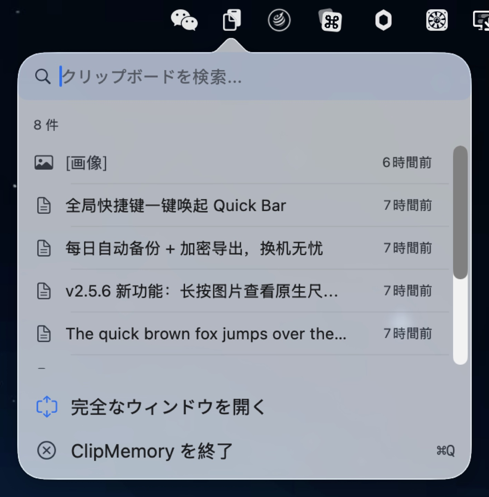
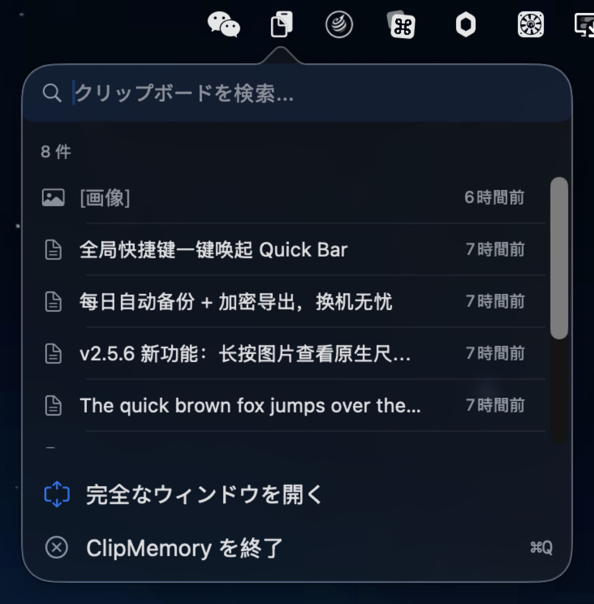
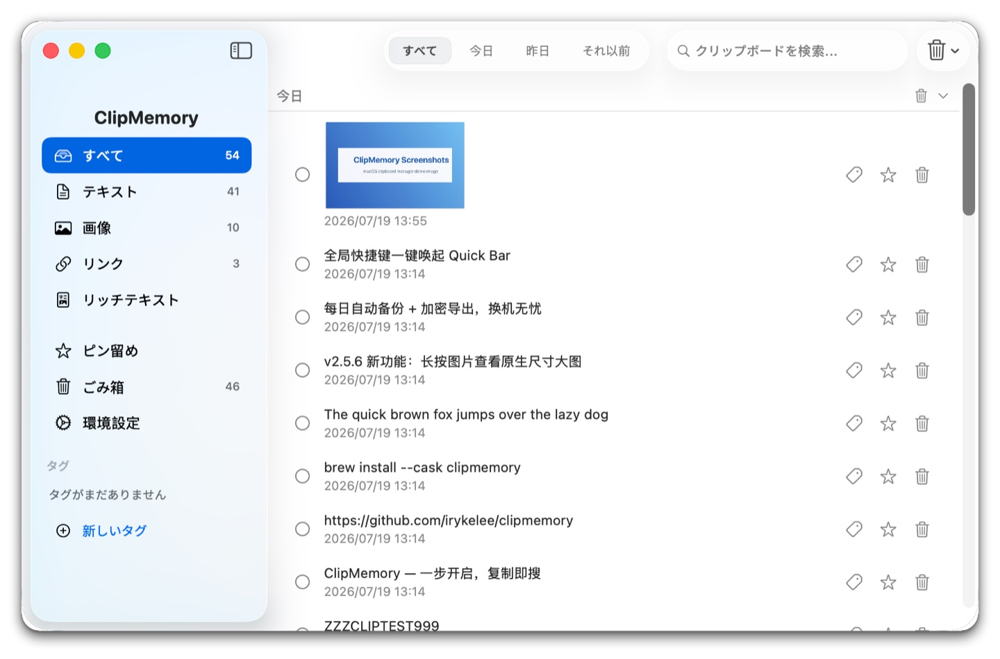
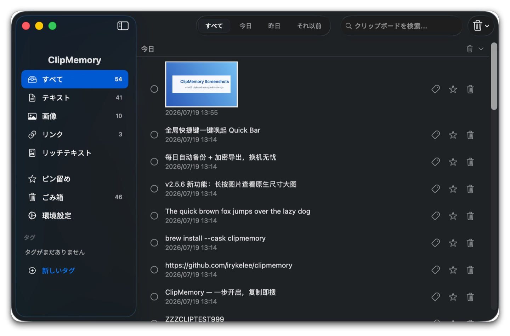

# ClipMemory v2.5.11

**次世代 macOS クリップボード管理 — ワンタップで起動、複製即検索**

[English](./README_EN.md) · [简体中文](./README.md) · [繁體中文](./README_ZH-HANT.md) · [日本語](./README_JA.md) · [한국어](./README_KO.md) · [Español](./README_ES.md) · [Português](./README_PT.md)

---

<p align="center">
  <br>
  <em>メニューバーから Quick Bar をワンタップ — 最近 8 件、瞬時に検索・コピー（ライト）</em>
</p>

<p align="center">
  <br>
  <em>メニューバーから Quick Bar をワンタップ — 最近 8 件、瞬時に検索・コピー（ダーク）</em>
</p>

<p align="center">
  <br>
  <em>メインウィンドウ：タイプサイドバー × 時間グループ × 検索ハイライト（ライト）</em>
</p>

<p align="center">
  <br>
  <em>メインウィンドウ：タイプサイドバー × 時間グループ × 検索ハイライト（ダーク）</em>
</p>

---

## v1 → v2 主な改良点

| 項目 | v1 | v2 |
|------|----|----|
| **操作入口** | メニュー → メニュー → ウィンドウ（3ステップ） | Quick Bar ポップアップ（1ステップ） |
| **メイン画面** | 固定幅、サイドバーなし | 固定サイドバー、タイプ随时切り替え |
| **グローバルホットキー** | Cmd+Ctrl+V のみ | カスタム録音対応 |
| **Quick Bar** | なし | 最近8件ポップアップで検索・複製 |
| **検索ハイライト** | テキスト上ハイライト | 大文字小文字を区別しない、文字化けなし |
| **長押しプレビュー** | なし | 0.4sで全文/機密/画像原図表示 |
| **時間グループ** | なし | 今日/昨日/それ以前、折りたたみ可能 |
| **タグ** | なし | 作成 / 削除 / カスタムカラー、サイドバー絞り込み + スマート提案 |
| **ごみ箱** | 削除は即消去 | ごみ箱から復元可能、保持期間は設定可 |
| **自動アップデート** | 手動ダウンロード | バックグラウンドで自動確認、ワンクリックでインストール＆再起動 |
| **ローカルバックアップ** | なし | 毎日自動バックアップ + 暗号化バックアップの書き出し / 読み込み |

---

## 📋 変更履歴

### v2.5.11 (2026-07-23) — ContentView 分割 + 16 件のバグ修正

### 主要更新 (Highlights)

- **🏗 ContentView 分割 (NEW-7 Phase 4)** — メインリスト / 選択 / 一括操作 / 削除アラートをすべて ContentView から独立した `ItemListView`（287 行）に抽出。ContentView は 1178 → 995 行（-15.5%）。リストレンダリングとリスト関連の状態を疎結合化。ただし、検索 / フィルター / スクロールキャッシュは ContentView に保持（一度にリファクタするリスクを回避）。後続の Phase 6+ ViewModel collapse で `@State` を `@StateObject` にまとめれば、ItemListView のスナップショットベースラインを取得可能
- **🛡 データ安全 4 点セット** — `maxItems` セッターを `1...10_000` にクランプ（負の値や巨大値を防止）。`backupNow()` を直列化（NSLock）し、ダブルクリック + 自動バックアップの競合を防止。`addTag()` で前後の空白をトリムし、"  Work  " と "Work" が重複保存されるのを防止。`ClipboardItemRow` が LanguageManager を監視し、言語切り替え時に日付を即時再レンダリング
- **🌐 i18n 複数形対応 (F-7)** — 6 つの %d 複数形キーを `.stringsdict` 化（batch.selected / quickbar.recent / trash.emptyConfirm.message / alert.clear.message / settings.max.items.count / clear.conditional.confirm）。英語で "1 item" / "5 items" がどちらも "1 items" と表示されなくなる。`Scripts/generate_stringsdict.py` を新規追加し、7 言語をワンキーで再生成可能
- **🛡 設定画面「今すぐバックアップ」のエラーを黙殺しない (F-4)** — 従来は `try?` ですべての backupNow() 失敗を破棄。現在は do/catch + onShowBackupError コールバック → ContentView が `L10n.settingsBackupError` NSAlert を表示（export/import/pre-import スナップショットの失敗パスと統一）
- **🛡 QuickBar ⌘F で本当に検索にフォーカスできるようになった (F-9)** — 従来は KeyCaptureView の NSEvent ローカルモニターのみに依存（ポップオーバーウィンドウコンテキストでは信頼性が低い）。現在は `.cmdFFindAction` 通知をフォールバックとして追加し、ContentView と同じパスを経由

### 修正 (Fixes)

影響度順（高 → 中 → 低）：

**High impact（アーキテクチャ / データ / UX クリティカルパス）**

- **NEW-7 Phase 4 ItemListView 抽出** — メインリスト / 選択 / 一括操作 / 削除アラートをすべて ContentView から抽出（287 行）。ContentView は 1178 → 995 行（-15.5%）
- **E-1 maxItems セッター クランプ** — `1...10_000` の範囲内。UserDefaults が -1 や 999_999_999 で汚染されなくなる。新しい `minMaxItems` / `maxMaxItems` 定数が唯一の信頼できる情報源
- **E-2 backupNow() 直列化** — `NSLock` でラップ。「今すぐバックアップ」のダブルクリック + 自動バックアップが同一フレームでトリガーされても、`createDirectory` + `copyItem(Images)` で競合しなくなる
- **E-13 ClipboardItemRow が LanguageManager を監視** — `@ObservedObject private var languageManager = LanguageManager.shared` を追加。設定 → 言語を切り替えると、日付形式が即座に再レンダリングされる（スクロールでオフ/オンにする必要がなくなった）
- **F-9 QuickBar ⌘F 修正** — `.onReceive(NotificationCenter.default.publisher(for: .cmdFFindAction))` を QuickBarView のルート VStack に追加。ポップオーバー環境でも ⌘F で検索フィールドにフォーカス可能
- **F-4 設定画面「今すぐバックアップ」エラーアラート** — `onShowBackupError` コールバックを ContentView の `showBackupInfo(L10n.settingsBackupError)` に接続。失敗が可視化される

**Medium impact（UX 一貫性 / a11y / i18n）**

- **F-10 Welcome Enter でデフォルトボタンにバインド** — `.keyboardShortcut(.defaultAction)` を `getStartedButton` に追加。Welcome ポップアップで Enter キーを押すと直接 onComplete が実行される
- **F-13 TipsView ↑↓ ラベル** — `L10n.quickbarRecent(8)` を `L10n.tipsKeyUpdown` = "Navigate items" に変更。6 言語すべてネイティブ翻訳（zh-Hans 切换条目 / zh-Hant 切換條目 / ja 項目を移動 / ko 항목 이동 / es Navegar por los elementos / pt Navegar pelos itens）
- **F-3 TrashItemRow ボタンのキーボード可視性** — `@FocusState private var isFocused: Bool` + `.focusable()` + `.focused($isFocused)` を追加。行がフォーカス状態のときは opacity に関わらずボタンを表示（従来はホバー時のみ表示）
- **F-16 TagPickerSheet キーボード削除** — `.contextMenu` + `.onDeleteCommand` を追加。⌫ / Forward Delete キーまたは右クリックメニューで削除確認をトリガー可能（従来は長押しのみ）
- **F-20 pin/delete accessibilityLabel** — 画像のみのボタンに `.accessibilityLabel(...)` を追加し、既存の `L10n.tooltip*` キーを再利用。VoiceOver が「button」と文脈のないラベルを読み上げなくなる

**Low impact（クリーンアップ / パフォーマンス / 境界値の正確性 / i18n 補完）**

- **E-6 addTag 空白トリム** — `tag.name.trimmingCharacters(in: .whitespacesAndNewlines)` を `addTag(_:)` の入口に追加。"  Work  " と "Work" が重複保存されなくなる
- **BUG-007 ItemListView ヘッダートグル、検索中はスキップ** — `onTapGesture` が `!searchText.isEmpty` のときは no-op。force-expand 表示ルール下で collapsedGroups を変更すると、検索クリア時に予期せぬ collapsed 状態が発生するのを防止
- **F-25 UpdateStatusPanelView DateFormatter キャッシュ** — `static let dateFormatter` を追加。body が再レンダリングされるたびに新しい DateFormatter が生成されなくなる
- **F-7 .stringsdict に 3 つの複数形キーを追加** — `alert.clear.message` / `settings.max.items.count` / `clear.conditional.confirm`。3 つの複数引数キー（alert.trim 2x %d / tagPicker & sidebar.deleteTag with %@）は次ラウンドに延期

### アップグレード注意事項 (Upgrade Note)

- v2.4.0 以降で自動アップデートモジュール（Sparkle）を搭載しているバージョン：アプリ内の自動アップデートを待つか、`brew upgrade --cask clipmemory` を実行
- データ移行や一度きりのポップアップはなし
- **i18n 改善**：中国語/日本語/韓国語のインターフェースに切り替えた際、"Recent 1 item" / "Recent 5 items" が複数形に従って表示されるようになった

### v2.5.11

### 主要更新 (Highlights)

- **🏗 ContentView 分割 (NEW-7 Phase 4)** — メインリスト / 選択 / 一括操作 / 削除アラートをすべて ContentView から独立した `ItemListView`（287 行）に抽出。ContentView は 1178 → 995 行（-15.5%）。リストレンダリングとリスト関連の状態を疎結合化。ただし、検索 / フィルター / スクロールキャッシュは ContentView に保持（一度にリファクタするリスクを回避）。後続の Phase 6+ ViewModel collapse で `@State` を `@StateObject` にまとめれば、ItemListView のスナップショットベースラインを取得可能
- **🛡 データ安全 4 点セット** — `maxItems` セッターを `1...10_000` にクランプ（負の値や巨大値を防止）。`backupNow()` を直列化（NSLock）し、ダブルクリック + 自動バックアップの競合を防止。`addTag()` で前後の空白をトリムし、"  Work  " と "Work" が重複保存されるのを防止。`ClipboardItemRow` が LanguageManager を監視し、言語切り替え時に日付を即時再レンダリング
- **🌐 i18n 複数形対応 (F-7)** — 6 つの %d 複数形キーを `.stringsdict` 化（batch.selected / quickbar.recent / trash.emptyConfirm.message / alert.clear.message / settings.max.items.count / clear.conditional.confirm）。英語で "1 item" / "5 items" がどちらも "1 items" と表示されなくなる。`Scripts/generate_stringsdict.py` を新規追加し、7 言語をワンキーで再生成可能
- **🛡 設定画面「今すぐバックアップ」のエラーを黙殺しない (F-4)** — 従来は `try?` ですべての backupNow() 失敗を破棄。現在は do/catch + onShowBackupError コールバック → ContentView が `L10n.settingsBackupError` NSAlert を表示（export/import/pre-import スナップショットの失敗パスと統一）
- **🛡 QuickBar ⌘F で本当に検索にフォーカスできるようになった (F-9)** — 従来は KeyCaptureView の NSEvent ローカルモニターのみに依存（ポップオーバーウィンドウコンテキストでは信頼性が低い）。現在は `.cmdFFindAction` 通知をフォールバックとして追加し、ContentView と同じパスを経由

### 修正 (Fixes)

影響度順（高 → 中 → 低）：

**High impact（アーキテクチャ / データ / UX クリティカルパス）**

- **NEW-7 Phase 4 ItemListView 抽出** — メインリスト / 選択 / 一括操作 / 削除アラートをすべて ContentView から抽出（287 行）。ContentView は 1178 → 995 行（-15.5%）
- **E-1 maxItems セッター クランプ** — `1...10_000` の範囲内。UserDefaults が -1 や 999_999_999 で汚染されなくなる。新しい `minMaxItems` / `maxMaxItems` 定数が唯一の信頼できる情報源
- **E-2 backupNow() 直列化** — `NSLock` でラップ。「今すぐバックアップ」のダブルクリック + 自動バックアップが同一フレームでトリガーされても、`createDirectory` + `copyItem(Images)` で競合しなくなる
- **E-13 ClipboardItemRow が LanguageManager を監視** — `@ObservedObject private var languageManager = LanguageManager.shared` を追加。設定 → 言語を切り替えると、日付形式が即座に再レンダリングされる（スクロールでオフ/オンにする必要がなくなった）
- **F-9 QuickBar ⌘F 修正** — `.onReceive(NotificationCenter.default.publisher(for: .cmdFFindAction))` を QuickBarView のルート VStack に追加。ポップオーバー環境でも ⌘F で検索フィールドにフォーカス可能
- **F-4 設定画面「今すぐバックアップ」エラーアラート** — `onShowBackupError` コールバックを ContentView の `showBackupInfo(L10n.settingsBackupError)` に接続。失敗が可視化される

**Medium impact（UX 一貫性 / a11y / i18n）**

- **F-10 Welcome Enter でデフォルトボタンにバインド** — `.keyboardShortcut(.defaultAction)` を `getStartedButton` に追加。Welcome ポップアップで Enter キーを押すと直接 onComplete が実行される
- **F-13 TipsView ↑↓ ラベル** — `L10n.quickbarRecent(8)` を `L10n.tipsKeyUpdown` = "Navigate items" に変更。6 言語すべてネイティブ翻訳（zh-Hans 切换条目 / zh-Hant 切換條目 / ja 項目を移動 / ko 항목 이동 / es Navegar por los elementos / pt Navegar pelos itens）
- **F-3 TrashItemRow ボタンのキーボード可視性** — `@FocusState private var isFocused: Bool` + `.focusable()` + `.focused($isFocused)` を追加。行がフォーカス状態のときは opacity に関わらずボタンを表示（従来はホバー時のみ表示）
- **F-16 TagPickerSheet キーボード削除** — `.contextMenu` + `.onDeleteCommand` を追加。⌫ / Forward Delete キーまたは右クリックメニューで削除確認をトリガー可能（従来は長押しのみ）
- **F-20 pin/delete accessibilityLabel** — 画像のみのボタンに `.accessibilityLabel(...)` を追加し、既存の `L10n.tooltip*` キーを再利用。VoiceOver が「button」と文脈のないラベルを読み上げなくなる

**Low impact（クリーンアップ / パフォーマンス / 境界値の正確性 / i18n 補完）**

- **E-6 addTag 空白トリム** — `tag.name.trimmingCharacters(in: .whitespacesAndNewlines)` を `addTag(_:)` の入口に追加。"  Work  " と "Work" が重複保存されなくなる
- **BUG-007 ItemListView ヘッダートグル、検索中はスキップ** — `onTapGesture` が `!searchText.isEmpty` のときは no-op。force-expand 表示ルール下で collapsedGroups を変更すると、検索クリア時に予期せぬ collapsed 状態が発生するのを防止
- **F-25 UpdateStatusPanelView DateFormatter キャッシュ** — `static let dateFormatter` を追加。body が再レンダリングされるたびに新しい DateFormatter が生成されなくなる
- **F-7 .stringsdict に 3 つの複数形キーを追加** — `alert.clear.message` / `settings.max.items.count` / `clear.conditional.confirm`。3 つの複数引数キー（alert.trim 2x %d / tagPicker & sidebar.deleteTag with %@）は次ラウンドに延期

### アップグレード注意事項 (Upgrade Note)

- v2.4.0 以降で自動アップデートモジュール（Sparkle）を搭載しているバージョン：アプリ内の自動アップデートを待つか、`brew upgrade --cask clipmemory` を実行
- データ移行や一度きりのポップアップはなし
- **i18n 改善**：中国語/日本語/韓国語のインターフェースに切り替えた際、"Recent 1 item" / "Recent 5 items" が複数形に従って表示されるようになった

### v2.5.10 (2026-07-22) — バックアップエラー可視化 + UI リファクタ + SwiftUI 警告修正

- **🛡 バックアップ破損可視化（BUG-024）** — 破損した items.json / trash.json / tags.json / 画像ファイルが黙って 0 件インポートされなくなる；失敗時は `corruptedData` を throw し設定画面でアラート表示
- **⚡ SidebarView 抽出（NEW-7 Phase 3）** — ContentView を 1162 行から 1123 行に削減；サイドバーは独立した 11 パラメータ明示インターフェース、単体テスト + 手動検証 7/7 合格
- **🛡 SwiftUI @State 警告修正（BUG-009）** — `ClipboardItemRow` のハイライトキャッシュを `@State` 辞書から `NSCache` に移行；「Modifying state during view update」ランタイム警告が解消、キャッシュ上限 countLimit=500 でメモリリーク防止

### v2.5.9 (2026-07-21) — ハング検出 + 全監査修正

- **🛡 ハング検出（HangDetector）** — メインスレッドのハートビート + 30秒プローブ；60秒無応答を最初に検出した時点でスタックを記録し自動回復；UI 凍結のサイレント化を防止
- **🛡 バックアップ PBKDF2 アップグレード** — 単一ラウンド HKDF を 600k ラウンド PBKDF2-SHA256 に置換；オフライン総当たりコストが約 10⁵ 倍（OWASP 2023 準拠）；旧パッケージは透過互換
- **⚡ RTF コピーキャッシュブリッジ** — `copyToClipboard` RTF 分岐がキャッシュヒット時 < 1ms（従来は毎回 20-100ms の同期解析でメインスレッドをブロック）；list / quickbar 間でキャッシュを自動ブリッジ
- **🛡 UI 状態保持** — 検索バー入力が `@State didSet` の Binding バイパスによりキーボードハイライトをスタックさせない；サイドバーのタグバッジがタグ増減で stale にならない
- **🛡 メインスレッド I/O オフロード** — `copyToClipboard` image / RTF 経路がクリップボードポーリングをブロックしない；バックアップエクスポートに 50MB サイズガードで OOM 防止

### v2.5.8 (2026-07-20) — 安定性監査 + 23 件の修正

- **🛡 バックアップ書き出し/取り込み強化** — スタックした `ditto` が UI を無限にブロックしなくなる（30s タイムアウト + SIGKILL エスカレーション）；HKDF ソルトが OS CSPRNG 失敗時に明示エラー、ゼロ埋め使用の沈黙なし
- **⚡ RTF 解析をバックグラウンドキューに移動** — 大きなリッチテキスト貼付でクリップボードポーリングが停滞しなくなる；OCR/画像認識もバックグラウンド、メインスレッドがスムーズに
- **🛡 SwiftUI レンダリング警告修正** — アイテム数変化時の「Modifying state during view update」警告解消、余分な再描画なし
- **🔧 メモリ保存のスレッドセーフ化** — テストと将来のマルチスレッド呼び出し元が `MemoryStorageBackend` 配列変更でクラッシュ/データ損失しない
- **🏷 タグ色フォールバック修正** — 無効な hex 色がアクセント色にフォールバック、ライト/ダーク両モードで見える

### v2.5.7 (2026-07-20) — HangDetector 監視 + 主要バグ修正

- **🛰️ HangDetector 観測モジュール** — バックグラウンドの watchdog がメインスレッドの 60 秒以上のハングを自動検出、コールスタック全体と回復時刻を記録。後日の障害解析に便利
- **🛡️ HMAC 失敗時のサイレントデータ損失を修正** — まれな Keychain アクセスエラー時、コピー内容が重複として破棄される問題を修正
- **🛡️ QuickBar キーボードナビゲーションのクラッシュを修正** — 選択項目が外部削除された後、↑↓ で OOB クラッシュしなくなった
- **🧪 テストの強制アンラップクラッシュを修正** — `XCTAssertNotNil + !` パターンを `guard let ... XCTFail(...) return` に置換
- **🖼️ 画像読み込みの並行性競合を修正** — レガシー画像マイグレーションの並列書き込みを直列化して競合を排除
- **🛡️ Excluded-app 設定の TOCTOU を修正** — 原子的な `updateExcludedBundleIds` API を追加
- **🧹 メインウィンドウの一括選択ツールバーの状態残留を修正** — 行削除後にツールバーが正しく消える

### v2.5.6 (2026-07-19) — キーチェーン移行 + 原寸プレビュー + 起動強化

- **🔐 キーをキーチェーンへ移行** — 暗号化ルートキーを平文ファイルから macOS キーチェーンへ（このデバイスのみ・iCloud 同期なし）。brew アンインストール（zap）時も削除されます
- **🖼 画像の原寸プレビュー** — 長押しで原寸大のフローティングパネルを表示。大きなスクリーンショットはスクロールでき、文字もはっきり読めます（300px の行内拡大を廃止）
- **🛡 起動の強化** — キーの破損や保存失敗でクラッシュしなくなり、終了/再試行/リセット（履歴は消去）を選べる明確なアラートに
- **🌐 ミラーは確認制** — GitHub 更新サーバーに繋がらない場合、jsDelivr ミラーへの切替は初回に確認し選択を記憶。古いミラーは自動的に拒否

### v2.5.5 (2026-07-18) — 条件削除 + 安定化

- **🗑 条件で削除** — ツールバー 🗑 に「条件で削除」を追加：タイプ × 期間の組み合わせ（例：昨日以前の画像だけ削除し今日の分は保持）。テキスト/画像/リンク/リッチテキストのタブ右クリックでそのタイプを一括削除。各時間グループのヘッダーに削除ボタンを追加
- **🏷️ タグ削除オプション** — タグ削除時に「タグのみ削除」か「タグと内容をごみ箱へ」を選択可能に
- **🔧 インポート強化** — 他マシンからの読み込みでタグ名を正しく復号（文字化け解消）。同一パッケージ内の重複インポート、復号失敗エントリの誤インポート、大きなパッケージでの UI フリーズ、バックアップ整理が非バックアップファイルを消す問題を修正

### v2.5.0 (2026-07-18) — ローカルバックアップ + 書き出し/読み込み

- **💾 ローカル自動バックアップ** — 毎日初回起動時にクリップボード履歴（タグ・ごみ箱・画像を含む）をローカルの Backups フォルダへ自動バックアップ。デフォルト 7 世代保持（3/7/14/30 から選択可）、データ喪失の最終防衛線に
- **📦 バックアップの書き出し / 読み込み** — ワンクリックで .clipmemory 暗号化バックアップ（パスワード保護）を書き出し。機種変更や再インストール後に読み込めば復元完了。読み込みは既存データとマージ＆重複排除し、上書きしません
- **⚙️ 設定に「バックアップ」追加** — 自動バックアップのオン/オフ、保持数、今すぐバックアップ、フォルダを開く、書き出し/読み込み

### v2.4.2 (2026-07-18) — 安定性修正 + 更新デュアルチャネル

- **🌐 更新デュアルチャネル** — GitHub にアクセスできない場合、jsDelivr ミラーへ自動切替。更新があるとアプリが前面に出て Dock バッジを表示（gentle reminders）
- **💾 データ安全** — 新しいクリップボード項目を即座にディスクへ書き込み。以前は 500ms のデバウンス中に kill -9 / 電源断で失われる可能性がありました
- **🐛 安定性修正** — SwiftUI「Modifying state during view update」警告の大量出力（毎秒数十件 → 0）を解消。ホットキー占有時に起動ごと繰り返された -9878 エラーログを停止

### v2.4.1 (2026-07-18) — 更新フィード修正

- **🌐 「アップデートエラー」を修正** — 更新フィードを raw.githubusercontent.com（一部ネットワークで到達不可）から GitHub Release アセットへ移行し、チェックが即応答になりました。v2.4.0 でエラーが出る場合は v2.4.1 を一度手動でダウンロードしてください。以降は自動更新が機能します

### v2.4.0 (2026-07-18) — ごみ箱

- **🗑️ ごみ箱（Recycle Bin）** — 削除したアイテムはすぐに破棄されず、ごみ箱に移動して 7 日間保持されます（設定で変更可能）。期間内であれば復元または完全削除が可能です。ごみ箱を空にする際は確認ダイアログが表示され、期限切れアイテムは自動でクリーンアップされます。
- **✨ 自動アップデート（Sparkle 2）** — アプリ内で更新を自動チェック：バックグラウンドで毎日確認 + 設定から手動確認も可能。更新パッケージは EdDSA 署名で検証され、ワンクリックでインストール・再起動します。Homebrew Cask は auto_updates を宣言済み。
- **データの安全性** — 画像ファイルはごみ箱内のアイテムと共に保持され、完全削除時のみ削除されます。自動クリーンアップ（trim/期限切れ）はごみ箱を経由しません。
- **UI 更新** — サイドバーに「ごみ箱」入口を追加（バッジで件数を表示）；削除確認ダイアログの文言を「ごみ箱に移動」に更新；ごみ箱内のアイテムに削除日時を表示
- **テスト** — ごみ箱向けの新規テスト 12 件を追加し、すべてパス

### v2.3.0 (2026-07-17) — タグシステムとデータ整合性

- **🏷️ タグシステム（Tag System）** — 完全なタグライフサイクル：作成 / 削除 / カスタムカラー；サイドバー tag section + セクション間 AND / セクション内 OR フィルタリング；スマートタグ提案（NLTagger ベース：コード / メール / 認証情報 / 機密）；TagPicker sheet（インライン chips + 長押しピッカー）；削除確認ダイアログ
- **6 件のデータ整合性重大修正** — saveTimer スレッド競合 UB；FileStorageBackend 同期書き込み；flushPendingSaves のタグ同期フラッシュ；legacy image items 誤暗号化フラグ修正；contentHash backfill；ImageStorage 部分失敗リカバリ
- **UI 改善** — Welcome window dedupe；Esc による hotkey recording キャンセル（responder に event 返却）；日付を跨ぐ currentDate 自動更新；Search モードでのグループ強制展開（キーボードナビゲーション同期）；pendingMaxItemsReduction typo 修正
- **リファクタ + パフォーマンス** — RTF NSCache；L10n bundle cache；WindowManager 状態安定化（@State が close/reopen 間で保持）；windowDidMove/Resize debounce 0.5s；+9 net new tests（241 → 250）

### v2.2.4 (2026-07-16) — リリース衛生管理

- **バージョンティックとリリースタグの同期** — `project.yml` の `MARKETING_VERSION` と `CURRENT_PROJECT_VERSION` を `2.2.4` に更新し、`project.pbxproj` を再生成。v2.2.3 でタグは切ったがバージョン番号の同期を忘れた問題を解決
- **Quick Bar ラベルの修正** — Quick Bar「ウィンドウ全体を開く」項目から誤解を招く `⌘⌃V` ショートカットラベルを削除。グローバルホットキーが開くのはメインナビゲーションウィンドウで、Quick Bar はメニューーバーの 📋 アイコンの左クリックで開く
- **ドキュメントのホットキー説明の更正** — 8言語の README における `Cmd+Ctrl+V` の説明を書き直し、Quick Barではなくメインナビゲーションウィンドウを開くことを明確化
- **パッケージスクリプトの安全強化** — `Scripts/package.sh` のデフォルトバージョン引数を `project.yml` の `MARKETING_VERSION` を読み取る方式に変更（読み取り失敗時のガード付き）。引数なしで呼び出したときに旧バージョンの tarball をパッケージングする問題を防ぎます

### v2.2.1 (2026-05-19) — 画像敏感ロジック修正

- **画像敏感判断修正** — 画像がサイズ（50KB）で自動マークされることを防止、保存はmaxItemsと手動清理で制御
- **コンポーネント抽出** — ContentViewをFlowLayout、LogoView、DateFilterButton、AppPickerRow、ClipboardItemRowに分割
- **共有ユーティリティ** — FontScaling.swift（sz()）とDateHelpers.swift（日付フォーマット）を抽出
- **NSCacheメモリ圧力を処理** — システムメモリ警告オブザーバーを追加、圧力時にキャッシュをクリア

### v2.2.0 (2026-05-15) — リッチテキスト対応

- **RTF クリップボードキャプチャ** — リッチテキスト内容を自動認識・保存
- **リッチテキスト描画** — NSAttributedString → AttributedString 変換
- **コピー貼り付け** — .rtf と .string 両方のクリップボードタイプに書き込み
- **サイドバータブ** — 新規「Rich Text」カテゴリ、アイコン・カウンター・タイプフィルター付き
- **Quick Bar 表示** — リッチテキストアイコン + プレーンテキストプレビュー
- **機密コンテンツマスク** — リッチテキストアイテムも機密情報マスク対応
- **85 テスト** — 4件のリッチテキスト往復テストを含む
- **検索修正** — リッチテキスト検索機能を修正

### v2.1.5 (2026-05-11) — プロトコル抽象とUX改善

- **プロトコル抽象** — StorageBackend プロトコル + MemoryStorageBackend テストバックエンド
- **81 テスト** — テストインフラストラクチャ完成
- **最大トリムダイアログ** — 履歴上限超過時に確認ダイアログ表示
- **画像プレースホルダー** — 読み込み失敗時にエレガントなプレースホルダー表示
- **グループ操作** — グループレベルのピン解除/クリア対応

### v2.1.0 (2026-05-09) — Liquid Glass UI

- Liquid Glass デザイン言語 — NavigationSplitView サイドバー + QuickBar 磨りガラスポップアップ
- キーボードナビゲーション修正 — スクロールと検索ボックス方向キー処理の修正

---

## 機能ハイライト

### Quick Bar — ワンタップ

メニューバーをクリック → NSPopoverで最近8件表示 → クリックでコピー/検索/フルウィンドウ表示

### ロングプレス 0.4s — 無制限プレビュー

| コンテンツ | デフォルト | ロングプレス後 |
|-----------|----------|------------|
| 通常テキスト | 最初の200文字、3行 | 全文表示 |
| 機密コンテンツ | マスク `ab••••••yz` | 原文表示 |
| 画像 | サムネイル 80px | 原寸大フローティングパネル（画面を超える場合はスクロール）|

### スマートセキュリティ — 暗号化 + 検出

- AES-256-GCM暗号化（v2）、旧式AES-CBC+HMAC-SHA256互換
- 35ルールの自動機密検出（パスワード/APIキー/Slack/Discord/OpenAIトークン/身分証明書番号など）
- パスワードマネージャーが前台にある時自動一時停止、App内からのコピーを防止
- 暗号化失敗時は内容を保存せず，平文保存を拒否

---

## 機能一覧

- 📋 クリップボード履歴（テキスト/画像/リンク/**Rich Text RTF**）
- ⭐ 大切なアイテムをピン留め、自动削除されない
- 💾 画像は暗号化ファイルとして保存、1枚あたり最大50MB
- 🔍 リアルタイム検索、全言語ハイライト対応（中日韓等多バイト文字）
- ⚡ スマート重複排除、相同内容はタイムスタンプのみ更新
- 🔄 コピーサイクル防止、App内からのコピーを自動スキップ
- 🧹 孤立ファイルクリーンアップ、起動時に参照されていない画像を削除
- 🌍 7言語対応（简体中文/繁體中文/English/日本語/한국어/Español/Português）
- ☑️ 複数選択で一括ピン留め/削除
- ✅ コピー成功時の緑のフラッシュフィードバック
- ⚙️ 初回起動時にホットキー衝突を自動検出
- ⌨️ グローバルホットキー `Cmd+Ctrl+V`
- 🖥 ログイン時起動（設定で有効化）
- 📐 フォントサイズ（小/中/大）
- 🎨 外観（ライト/ダーク/システム連動）
- 🗂️ タイプフィルター（すべて/テキスト/画像/リンク/Rich Text）
- ⌨️ キーボードナビゲーション（矢印キースクロール、検索ボックスフォーカス処理）

---

## 使い方

| 操作 | 方法 |
|------|------|
| Quick Barを開く | メニューバー 📋 アイコンをクリック |
| アイテムをコピー | アイテムをクリック / キー ↑↓ + Enter |
| フルウィンドウを開く | `Cmd+Ctrl+V`（グローバルホットキー）/ Quick Bar → "クリップボードを開く" |
| 検索 | キーワードを入力、マッチ箇所をハイライト |
| ピン留め/解除 | ⭐ をクリック、またはアイテムをダブルクリック |
| 削除 | 🗑 をクリック、または右クリックメニュー |
| 全文/機密/画像プレビュー | 0.4s長押し、離すと元に戻る |
| 複数選択モード | チェックボックスをクリック |
| 履歴をクリア | 上部ツールバーの 🗑（ピン留めは保持）|
| 条件で削除 | ツールバー 🗑 →「条件で削除」（タイプ × 期間）。タイプタブの右クリックでそのタイプを全削除 |
| タイプフィルター切替 | サイドバーで「テキスト/画像/リンク/Rich Text」をクリック |

> 💡 ピン留めしたアイテムは自動削除されません。同じ内容を再コピーすると重複せずタイムスタンプのみ更新されます。

---

## セキュリティ

- **AES-256-GCM (v2) + 旧式 AES-CBC+HMAC-SHA256** — すべてのテキストと画像をディスク保存前に自動暗号化
- **スマート検出** — 35ルール（キーワード + 正規表現）でパスワード、APIキー、Slack/Discord/OpenAIトークン、秘密鍵、身分証明書番号などを自動識別
- **自動クリア** — 機密コンテンツを1時間/24時間/48時間/7日後に自動削除、または削除しない設定も可能

---

## 設定

- 最大履歴件数（50 / 100 / 200 / 500件）
- 機密情報自動クリア（1時間/24時間/48時間/7日/なし）
- 言語切替（7言語）
- グローバルホットキー録音
- 外観（ライト/ダーク/システム連動）
- 除外アプリ（クリップボード監視から除外するアプリ）
- Rich Text キャプチャ トグル
- フォントサイズ（小 / 中 / 大）
- ログイン時に起動
- ごみ箱の保持期間（3 / 7 / 14 / 30 日）
- バックアップ（毎日自動 / 保持数 / 書き出し / 読み込み）
- 自動アップデート（自動確認 / 今すぐ確認）

---

## システム要件

- macOS 13.0 (Ventura) 以降

---

## データ移行

履歴（暗号化キーを含む）は `~/Library/Application Support/ClipMemory/` に保存されています。
移行は 設定 → バックアップ → バックアップを書き出す で .clipmemory 暗号化パッケージを作成し、新しいMacで読み込むのがおすすめです。このディレクトリをそのままバックアップする手動移行も可能です。
アプリを削除する前に、上部ツールバーの 🗑 ボタンで履歴をクリアできます。

---

## インストール

```bash
brew tap irykelee/clipmemory
brew trust irykelee/clipmemory
brew install --cask clipmemory
```

インストール後、Appは `/Applications/ClipMemory.app` に配置されます。起動後、**画面右上のメニューバー**にある 📋 アイコンをクリックして使用開始。

または [GitHub Releases](https://github.com/irykelee/clipmemory/releases) から `.tar.gz` をダウンロードして `/Applications/` に手動配置。

> **初回起動時に「Apple は検証できません…」と表示された場合**：これは未公証アプリへの標準的な警告で、ウイルスではありません。① App を右クリック →「開く」→ 再度「開く」、または ② システム設定 → プライバシーとセキュリティ → ClipMemory の「このまま開く」。一度だけの操作です。（`brew install` でインストールした場合は表示されません）

---

## 開発

```bash
brew install swiftlint xcodegen
xcodegen generate
xcodebuild -scheme ClipMemory -configuration Release
```

---

## お問い合わせ

- GitHub: https://github.com/irykelee/clipmemory
- フィードバック: 設定 → このAppについて → フィードバック → GitHub Issues
