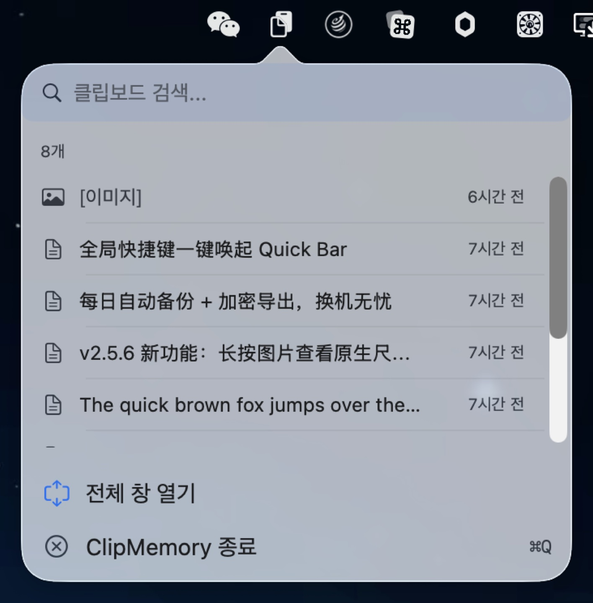
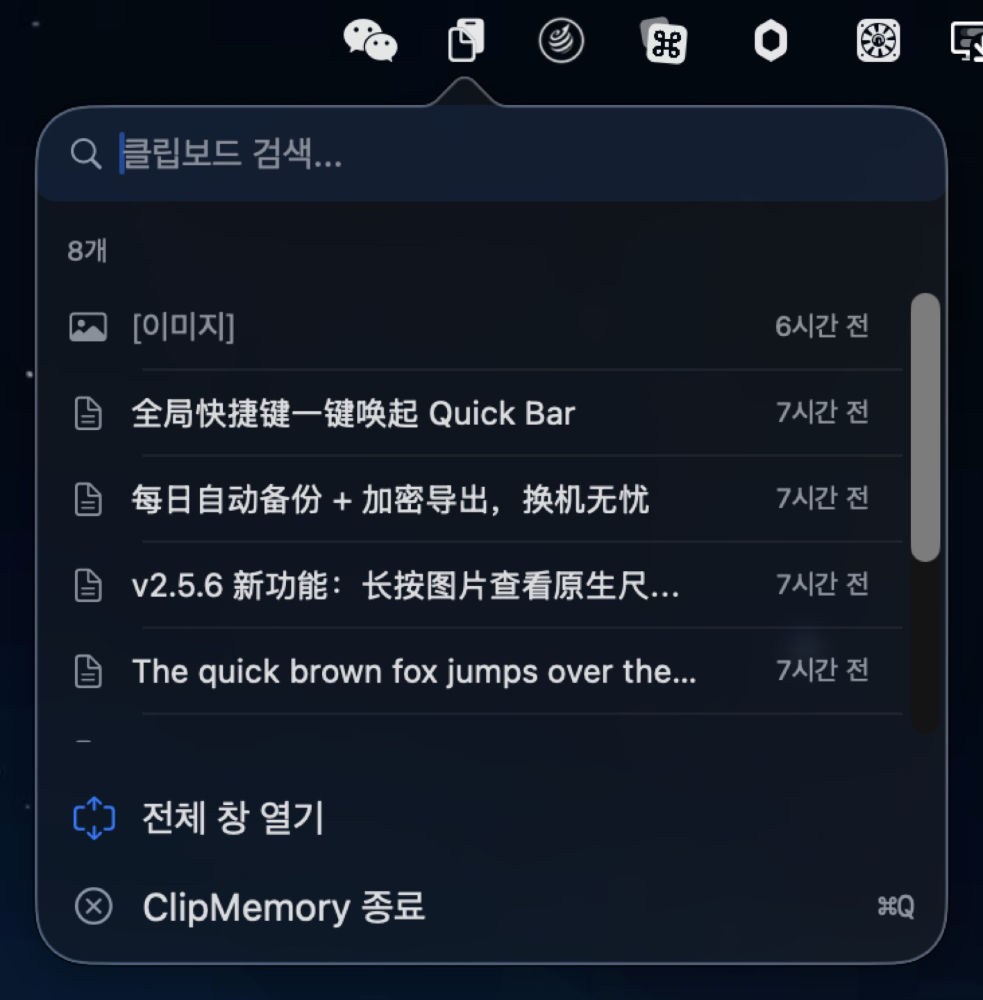
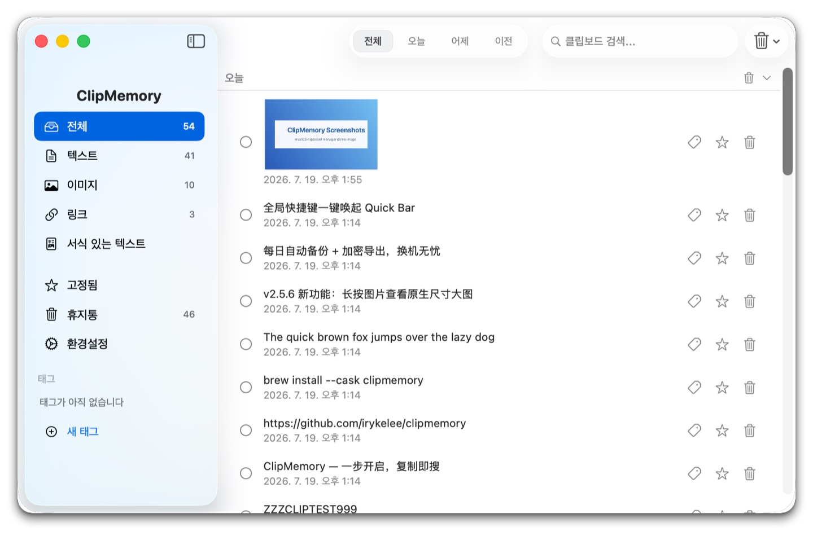
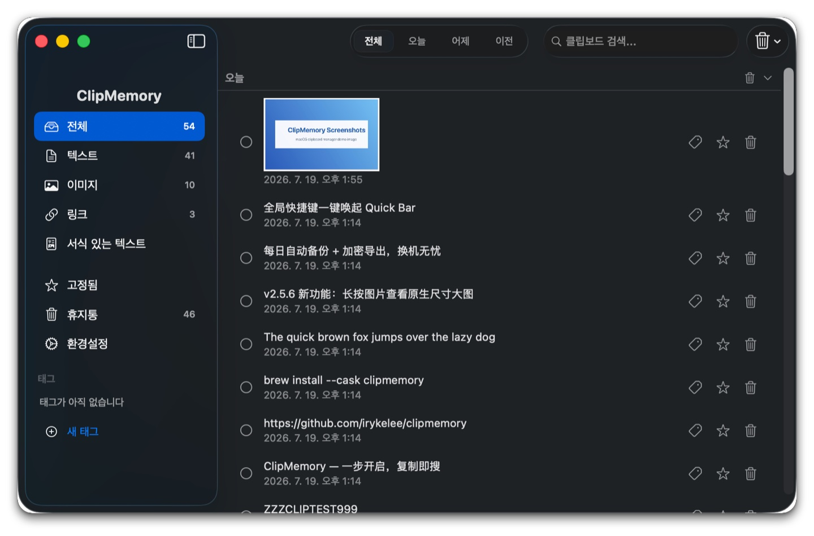

# ClipMemory v2.7.9

**차세대 macOS 클립보드 관리자 — 원 탭으로 실행, 복사 즉시 검색**

[English](./README_EN.md) · [简体中文](./README.md) · [繁體中文](./README_ZH-HANT.md) · [日本語](./README_JA.md) · [한국어](./README_KO.md) · [Español](./README_ES.md) · [Português](./README_PT.md)

---

<p align="center">
  <br>
  <em>메뉴바에서 Quick Bar 한 번에 실행 — 최근 8개, 즉시 검색·복사 (라이트)</em>
</p>

<p align="center">
  <br>
  <em>메뉴바에서 Quick Bar 한 번에 실행 — 최근 8개, 즉시 검색·복사 (다크)</em>
</p>

<p align="center">
  <br>
  <em>메인 창: 유형 사이드바 × 시간 그룹 × 검색 강조 (라이트)</em>
</p>

<p align="center">
  <br>
  <em>메인 창: 유형 사이드바 × 시간 그룹 × 검색 강조 (다크)</em>
</p>

---

## v1 → v2 주요 개선사항

| 항목 | v1 | v2 |
|------|----|----|
| **상호작용** | 메뉴바 → 메뉴 → 창 열기 (3단계) | Quick Bar 팝업 (1단계) |
| **메인 화면** | 고정 너비, 사이드바 없음 | 고정 사이드바, 유형 자유롭게 전환 |
| **글로벌 핫키** | Cmd+Ctrl+V 전용 | 사용자 지정 녹음 지원 |
| **Quick Bar** | 없음 | 최근 8개 항목 팝업, 검색·복사 즉시 |
| **검색 하이라이트** | 텍스트 위 하이라이트 | 대소문자 구분 없음, 글자 깨짐 없음 |
| **길게 누르기** | 없음 | 0.4s로 전체/민감/이미지 원본 표시 |
| **시간 그룹화** | 없음 | 오늘/어제/이전, 접기 가능 |
| **태그** | 없음 | 생성 / 삭제 / 사용자 지정 색상, 사이드바 필터 + 스마트 제안 |
| **휴지통** | 삭제 즉시 소멸 | 휴지통에서 복원 가능, 보관 기간 설정 가능 |
| **자동 업데이트** | 수동 다운로드 | 백그라운드 자동 확인, 원클릭 설치 및 재시작 |
| **로컬 백업** | 없음 | 매일 자동 백업 + 암호화 백업 내보내기 / 가져오기 |

---

## 📋 변경 로그

### v2.7.9 (2026-08-05) — 설정 페이지에 버전 대조 추가

- **🆕 설정 페이지 업데이트 피드에「현재 버전 vs 최신 버전」대조 추가** — 업그레이드가 필요한지 한눈에 확인 가능; 최초 업데이트 확인이 완료되지 않았을 때는 현재 버전만 표시되고 "최신" 표시가 나타나지 않아 가짜 초록 상태를 방지합니다
- **🛠 릴리스 프로세스 강화(REL-24..28 5차례 최적화)** — AI 에이전트 하드 규칙 5가지를 스크립트 헤더 주석으로 명시, `--yes` 비-TTY 이중 요소 안전장치, 릴리스 롤백 도구(`Scripts/rollback-release.sh`), 릴리스 후 수동 단계 확인 게이트, 릴리스 노트 기본 설명 자동 입력, bash 5.3 전각 괄호 unbound 변수 버그 수정
- **🛠 Homebrew tap CI 가동** — `irykelee/homebrew-clipmemory`에 `cask-audit.yml` 추가(brew audit + brew style), 이제 Cask 들여쓰기 / stanza 순서 / 형식 오류를 릴리스 전에 잡아내어 반복되는 "tap Cask 부적합" 사고를 방지합니다
- **🛠 릴리스 도구 체인을 메인 저장소로 실체화** — `Scripts/release.sh` + `Scripts/rollback-release.sh` + `Scripts/README-release.md` + `Scripts/test/test_release.sh`가 이제 정식 git 추적 대상입니다(기존에는 로컬 병렬 저장소 `ClipMemory-local`을 가리키는 심볼릭 링크였으며, 누구나 메인 저장소를 clone하면 끊어진 심볼릭 링크를 얻게 됨; 해당 병렬 저장소는 2026-08-05에 아카이브 처리)
- **🛠 Tap Cask 템플릿화** — `Scripts/cask-template.rb` 추가(rubocop-clean), Release workflow는 템플릿 + 플레이스홀더로 tap Cask를 생성하여 인라인 heredoc으로 인한 YAML 들여쓰기 누출을 없앱니다
- **🌏 중국 사용자가 Gitee 미러 소스로 전환 가능** — 설정 → 업데이트 및 정보 → 업데이트 소스 → 미러 (Gitee); Gitee 미러는 appcast와 설치 패키지를 모두 호스팅하여 중국 네트워크에서 VPN 없이 업데이트 확인 가능

- 전체 변경 로그: https://github.com/irykelee/clipmemory/releases/tag/v2.7.9

### v2.7.8 (2026-08-04) — 검색 및 설정 경험 개선

- **설정 페이지 6곳에 사용 설명 추가(단축키, 기록, OCR, 제외 앱, 백업, 업데이트 피드), 더 이상 스크린샷으로 조작을 추측할 필요 없음** — 설정 페이지에 상황별 설명 6개가 추가되어 사용자가 조작을 추측하지 않아도 됩니다.
- **메인 창 최소 크기를 850×600으로 상향, 검색창 스타일은 macOS 26 시스템 기본에 맞춤** — 최소 창 크기가 850×600으로 커졌고 검색창은 macOS 26 시스템 기본 스타일을 따릅니다.
- **브랜드 로고 글자 크기를 sz(18)로 통일, 모든 언어에서 시각적 일관성 확보** — 브랜드 로고가 모든 로케일에서 sz(18)로 통일되었습니다.
- **사이드바 검색을 메인 창으로 이동, 도구 모음에 macOS 스타일 적용, 전체 높이 상향** — 사이드바 검색이 메인 창으로 승격되었고, macOS 스타일 도구 모음과 더 높아진 최소 높이를 적용했습니다.
- **설정 창이 메인 창 중앙에 표시되어 화면 밖으로 벗어나 보이지 않는 문제 방지** — 설정 창이 표시 중일 때 메인 창 중앙에 위치합니다.
- 전체 변경 로그: https://github.com/irykelee/clipmemory/releases/tag/v2.7.8

### v2.7.7 (2026-08-01) — 검색 경험 및 안정성 수정

- **검색 끊김 없이 개선** — 서식 있는 텍스트가 포함된 기록을 검색할 때, 이전에는 메인 스레드에서 항목별로 복호화하여 눈에 띄게 버벅였습니다. 이제 콜드 캐시 항목은 먼저 건너뛰고, 백그라운드 워밍업 완료 후 결과에 자동으로 나타납니다.
- **QuickBar 검색 보완** — 검색 시 복호화되지 않은 항목이 이전에는 조용히 누락되고 채워지지 않았습니다. 이제 워밍업 완료 후 결과가 자동으로 새로고침되어 보완됩니다.
- **중복 항목 자동 병합** — 시작 시 키가 준비된 후, 기록의 중복 항목(이전 시작 창구간에 누적된 누락분 포함)이 이제 자동으로 병합 정리됩니다.
- **이미지 로딩 속도 향상** — 이미지 읽기가 더 이상 백그라운드의 이전 형식 마이그레이션 작업에 막히지 않습니다.
- **휴지통 항목 세션 전체 공백 수정** — 로그인 시 자동 시작되고 키체인이 아직 잠금 해제되지 않은 경우, 휴지통의 텍스트/링크 항목이 이전에는 계속 비어 있었고 자가 복구되지 않았습니다.
- 전체 변경 로그: https://github.com/irykelee/clipmemory/releases/tag/v2.7.7

### v2.7.6 (2026-08-01) — 안정성 및 데이터 보안 강화

- **오래된 자동 정리를 휴지통으로 이동, 고정 항목은 영구 제외** — 보관 상한에 도달한 자동 정리는 이전에 항목을 영구 삭제했습니다. 이제 휴지통으로 이동(언제든지 복원 가능)하며, 고정(즐겨찾기) 항목은 더 이상 자동 정리되지 않습니다.
- **암호화 체인 강화** — 키체인 읽기 오류 시 루트 키를 잘못 덮어쓰지 않도록 수정(극단적인 경우 모든 기록 해독 불가 방지). 폐기된 키 파일은 안전한 덮어쓰기 후 삭제되도록 변경. 백업 디렉터리 권한을 소유자만 읽을 수 있도록 강화.
- **OCR 강화** — 이미지 텍스트 인식 중 일시적 오류(예: 시스템 리소스 부족) 발생 시 다음 시작 시 자동으로 재시도하며, 영구적으로 건너뛰지 않습니다.
- **해독 실패 항목이 간헐적으로 '읽을 수 없음'으로 표시되고 캐시되는 문제 수정** — 키가 인터페이스 로딩보다 늦게 준비될 때 발생하는 간헐적 빈 화면/오탐을 자동 재시도로 복구하도록 수정.
- **QuickBar 검색창 키보드 데드 존 수정** — 검색창 포커스 시 Enter(선택 항목 복사)와 Esc(닫기)가 이전에 작동하지 않았으며, 이제 정상 작동합니다.
- 전체 변경 로그: https://github.com/irykelee/clipmemory/releases/tag/v2.7.6

### v2.7.5 (2026-07-31) — 긴급 수정

- **이미지 미리보기 오른쪽 빈 여백 수정** — 세로 화면에서 화면 높이에 가까운 긴 스크린샷을 열 때 미리보기 패널 오른쪽에 넓은 빈 영역이 표시되던 문제를 이미지 실제 너비에 맞게 자동 조절하여 표시하도록 수정
- **자동 업데이트 감지기 데드 코드 수정** — v2.7.4의 Sparkle 자동 업데이트 감지기가 시작되지 않아 해당 버전에서 이번 버전의 자동 업데이트 푸시를 받을 수 없었습니다. v2.7.5에서 수정되었으며 이후 버전부터 자동 업데이트가 정상 작동합니다
- **휴지통 작업 시 충돌 수정** — 휴지통 항목을 삭제하거나 복원할 때 충돌이 발생하거나(또는 조용히 잘못된 항목에 작업이 적용될 수 있음) 수정되었습니다
- **디바운스 저장 타이머가 조용히 무효화되던 문제 수정** — 태그 편집, 휴지통 작업 등 즉시 디스크에 저장하지 않는 경로의 디바운스 저장이 첫 실행 후 작동을 멈추던 문제를 수정했습니다. 충돌 또는 강제 종료 시 마지막 실행 이후의 모든 태그/휴지통 변경 사항이 손실될 수 있습니다
- **휴지통 항목이 포함된 백업을 가져올 수 없던 문제 수정** — 비어 있지 않은 휴지통이 포함된 모든 백업 파일이 가져오기 시 실패하던 문제를 이제 호환됩니다
- 전체 변경 로그: https://github.com/irykelee/clipmemory/releases/tag/v2.7.5

### v2.7.4 (2026-07-31) — 넓은 이미지 미리보기 흰 화면 수정 + 6가지 OCR 최적화 + 성능 향상

- **🔍 6가지 OCR 최적화(CJK / 중복 제거 / 타임아웃 / 메모리)** — CJK 인식 저하 시 새 알림 및 userLocale 로그, 이미지 중복 제거 후 기존 UUID의 OCR 결과 유지, Vision 호출 15초 자동 취소, 6K HEIC 미리보기 메모리가 ~100 MB에서 ~16 MB로 감소(`thumbnailMaxPixelSize=2048`)
- **⚡️ 검색 / 복사 성능 향상(여러 백그라운드 최적화)** — UUID→인덱스 사전 O(1) 조회, 병음 결과를 내용별로 캐시(1000회 매칭 1340 ms → 77 ms), JSONEncoder 재사용, cleanup 단일 스캔, cold-start AES-GCM 사전 채움
- **🖼️ 넓은 이미지 길게 누르기 미리보기에서 더 이상 흰 화면 없음** — 메인 화면이 portrait으로 회전할 때 16:9 스크린샷 복사, cap 너비를 1픽셀 초과하는 경계 케이스에서 2000+ 픽셀 흰 배경이 더 이상 생성되지 않음(panel이 이미지 크기에 자동 맞춤)
- **🔇 OCR 경로에 최소 텍스트 높이 임계값 추가** — `minimumTextHeight = 0.01`(기본 0.02는 인쇄 문서용으로 조정됨), 작은 글꼴 터미널 스크린샷 / 12-pt 레티나 스크린샷 이제 인식 가능
- **🌐 7개 언어 현지화 보완** — 태그 배지 접근성, 태그 피커 제안 추가, 암호화 실패 알림 등 다양한 L10n 수정
- 전체 변경 로그: https://github.com/irykelee/clipmemory/releases/tag/v2.7.4

### v2.7.3 (2026-07-30) — Audit 기반 수정 및 7개 언어 VoiceOver

- **🚀 성능 향상 (여러 백그라운드 최적화)** — JSONEncoder 재사용, 캐시 프리워밍 동시 실행 상한, 정리 작업 단일 스캔, 콜드 스타트 AES-GCM 복호화 미리 채우기; 수천 개 기록에서 붙여넣기 및 검색이 훨씬 부드러워짐
- **🌐 7개 언어 VoiceOver 접근성** — 주 메뉴 / 검색창 / 환영 페이지 / 태그 칩 / 앱 제외 목록 / 날짜 필터 버튼 / 클립보드 항목 유형 레이블 모두 현지화; 비영어 사용자도 처음으로 VoiceOver로 원활히 사용 가능
- **🧹 라이프사이클 강화** — 환영/설정 창을 닫아도 메모리 누수 발생하지 않음; TrashStore / FeedProbeEngine이 deinit 시 백그라운드 작업을 올바르게 정리; ImageStorage가 앱 종료 전 미완료 쓰기 플러시
- **🔇 조용한 오류를 보이게 변경** — 10곳의 `try?` 오류 무시 지점이 이제 로그에 기록되고 UI에 알림 (이미지 마이그레이션 쓰기 실패, 고아 파일 잔존, 백업 임시 디렉터리 정리 실패 등), 문제 추적 용이
- **AES-GCM 복호화 실패로 항목이 영구적으로 오염되지 않음** — Keychain 일시 잠금으로 인한 복호화 실패, 이제 키 복구 시 자동 재시도 (기존 버그는 항목을 영구적으로 복호화 불가로 표시)
- 전체 변경 로그: https://github.com/irykelee/clipmemory/releases/tag/v2.7.3

### v2.7.2 (2026-07-29) — Fuzzy Search & Image Integrity + Cryptographic Safety

- **Pinyin 인식 퍼지 검색** — "zhongwen"이 "中文文档"에 매치. 공백 구분 토큰은 모두 매치 (token AND matching), 대소문자 및 발음 기호 무시
- **시작 시 이미지 무결성 스캔** — App 시작 시 모든 이미지를 비동기로 스캔하여 누락/손상 파일을 표시. 목록 항목은 클릭마다 I/O 없이 즉시 상태 표시
- **암호화 실패 진단** — Keychain 잠금 시 검색 페이지에 노란색 진단 배너로 원인 설명
- **캐시 프리워밍** — 메인 스레드 동기 복호화 제거. App 기동, 새 항목 캡처, 목록 첫 표시 커버
- **Keychain 일시 잠금으로 인한 항목 영구 표시 수정** — 키 복구 시 자동 재시도
- 전체 변경 로그: https://github.com/irykelee/clipmemory/releases/tag/v2.7.2

### v2.7.0 (2026-07-28) — F-1 @MainActor 마이그레이션

- **시작 시 언어 선택기와 UI 텍스트 일관성 수정** — 이전에는 영어 이외의 언어가 저장된 경우, 시작 후 Settings 창 내 UI 텍스트가 여전히 영어로 표시됨 (Language 선택기는 올바르게 표시). v2.7.0에서 수정 후, 시작 즉시 적용됨.
- **핵심 클래스 전체 Swift 동시성 호환** — `LanguageManager` / `TrashStore` / `ClipboardStore` 세 핵심 클래스에 `@MainActor` 추가, 타입 시스템이 main-thread contract을 보호하여 향후 회귀 방지.
- **657개 테스트 전부 통과, 0 실패** — 내부 아키텍처 강화로 기능 회귀 없음.
- **시작 시 비영어 언어 UI 텍스트가 여전히 영어로 표시됨** — Swift `didSet`이 `init()` 내에서 트리거되지 않으므로, 새로 추가된 `currentLanguageCode` 미러는 시작 시점부터 사용 가능하도록 명시적 시드가 필요.
- **`LanguageManager`가 `nonisolated` 미러를 사용하도록 변경** — `L10n.string()` 등 off-main reader( `CryptoService.prepareKey` failure handler 등 `Task.detached`에서 호출)가 언어 코드를 읽을 때 더 이상 main-actor 경계를 넘지 않음.
- 전체 변경 로그: https://github.com/irykelee/clipmemory/releases/tag/v2.7.0

### v2.6.2 (2026-07-27) — 이미지 검색 하이라이트 및 태그 필터

- **이미지 검색 결과에 OCR 텍스트 직접 표시**：메인 목록과 빠른 팝업 상자에서 스크린샷 항목 아래에 청록색으로 강조된 인식 조각이 나타나며, 검색어와 일치하는 부분이 눈에 띄게 표시됩니다. 설정 → 기록에서 끌 수 있습니다 (표시만 끄고 필터는 계속 적용됨).
- **태그 필터를 「동시 포함」 의미로 변경**：여러 태그를 선택하면 (예: 「중국 본토」+「2026」) 두 태그가 모두 지정된 항목만 표시되며, 더 이상 하나의 태그만 일치해도 표시되지 않습니다.
- **태그 필터 시 메인 목록 상단에 알림 표시줄 추가**：현재 활성화된 태그가 캡슐 형태로 나열되며, 각 캡슐 오른쪽 ×를 클릭하면 개별 제거 가능, 오른쪽 「전체 지우기」로 한 번에 모두 지울 수 있습니다. 동시에 「X개 표시 / 총 Y개」 수량을 표시하여 필터가 적용된 것을 한눈에 알 수 있습니다.
- **검색창 오른쪽에 × 한 번에 지우기 버튼 추가**：키워드를 검색한 후 ×를 클릭하면 즉시 지워지며, 문자를 하나씩 삭제할 필요가 없습니다. 검색창이 자동으로 포커스를 받아 바로 다음 키워드를 입력할 수 있습니다.
- **휴지통에서 삭제 후 목록 즉시 새로고침**：이전에는 휴지통 항목을 삭제한 후 다른 작업을 해야 목록이 새로고침되었지만, 이제 「영구 삭제」/「비우기」를 클릭하면 즉시 적용됩니다.
- 전체 변경 로그: https://github.com/irykelee/clipmemory/releases/tag/v2.6.2

### v2.6.1 (2026-07-26) — Audit Fixes & QuickBar Repair

- Quick Bar의 「전체 창 열기」 버튼이 두 번째 클릭 시 응답하지 않는 문제를 수정하여 메뉴 바 환경이 다시 원활해짐
- 전체 코드 감사 후 15가지 잠재적 문제 수정: 암호화 키 오류 팝업이 더 이상 하위 서비스를 침범하지 않음, 휴지통이 독립적으로 모듈화됨, OCR 오류 진단 가능, 설정 페이지 시각적 회귀에 보호 기능 추가
- **Quick Bar 「전체 창 열기」 두 번째 클릭 무응답** — 창이 닫힌 후 @State가 초기화되던 문제 해결; 이제 창 인스턴스가 안정적으로 유지되어 매번 정상적으로 열림
- **새로 설치 시 암호화 키가 준비되기 전에 캡처된 콘텐츠가 스레드 간 충돌을 일으킬 수 있던 문제** — 극단적인 상황(첫 실행 후 수 밀리초 내 복사)에서 더 이상 동시성 예외가 발생하지 않음
- **태그 및 휴지통 저장 시 매번 새로운 백그라운드 큐 생성** — 대량 작업(태그 100개 가져오기, 휴지통 비우기) 시 리소스 변동이 발생하지 않음
- 전체 변경 로그: https://github.com/irykelee/clipmemory/releases/tag/v2.6.1

### v2.6.0 (2026-07-25) — 독립 설정 창

- **⚙️ 완전히 새로워진 독립 설정 창** — 설정이 메인 창 사이드바에서 분리되어 독립 창으로 변경되었으며, 상단에 「일반 / 기록 및 캡처 / 백업 / 업데이트 및 정보」 네 개 탭으로 구성됨; `⌘,`, 메뉴 바 아이콘, Quick Bar 메뉴에서 바로 접근 가능하며, 메인 창이 열리고 닫힐 때 설정 창이 사라지지 않음
- **🖥 macOS 26 Tahoe 완전 대응** — 메인 창 제목 표시줄이 사이드바와 융합된 모래 질감으로 복원(더 이상 어색한 흰색 띠가 아님); Tahoe에서 설정 드롭다운 메뉴 옵션이 모두 `(null)`로 표시되는 시스템 stringsdict 렌더링 문제 수정
- **🔤 글꼴 크기 설정 즉시 적용** — 작게/보통/크게 전환 후 모든 목록, 태그, 팝업 텍스트가 즉시 재배치되며 앱 재시작 불필요
- **🛡 34개 감사 수정 사항 적용** — 새로 설치 후 최초 복사 시 키 초기화 경합으로 항목이 누락되지 않음; OCR 인식 결과를 저장 시점에 맞춰 디스크에 기록하여 정전 시 전체 손실 방지; 백업 가져오기 시 데이터 병합 전에 목록을 검증하여 손상된 패키지는 조기에 오류 보고
- **독립 설정 창(4개 탭)** — 설정 항목이 주제별로 그룹화되어 페이지가 무한히 길어지지 않음; `⌘,` 단축키와 메뉴 바 진입점 지원
- 전체 변경 로그: https://github.com/irykelee/clipmemory/releases/tag/v2.6.0

### v2.5.13 (2026-07-25) — 감사 수정 마무리

- **🛡 기록 데이터 손상 방지 강화** — 이후 버전에서 새 항목 유형이 추가되어도 구 버전에서 열 때 히스토리가 전체 삭제되지 않음 (알 수 없는 유형은 일반 텍스트로 보존); 백업 패키지 매니페스트에 개수/솔트 길이/최소 버전 확인이 추가되어 손상된 패키지는 조용히 절반만 가져오지 않고 명확하게 오류를 보고함
- **🔒 비밀번호 관리자 콘텐츠 더 이상 캡처 안 됨** — `ConcealedType`/`TransientType` 클립보드 플래그를 인식하여 1Password 등의 앱에서 복사한 내용을 시스템 규칙에 따라 바로 건너뜁니다.
- **⚡ 이미지 복사 시 끊김 현상 해결** — 캐시되지 않은 이미지를 복사할 때 디스크 읽기 및 복호화를 백그라운드로 이동하여 메인 스레드가 더 이상 차단되지 않음
- **🌐 업데이트 피드 상태 패널이 이해하기 쉽게 개선** — 「최근 전환」에 더 이상 영어 열거형 원문이 표시되지 않고 7개 언어로 현지화된 문구로 변경되며, 실제 전환이 발생한 경우에만 기록됨
- **🇰🇷 한국어 README 수정** — 두 곳에 섞여 있던 일본어 잔여 문장을 한국어로 다시 수정함
- 전체 변경 로그: https://github.com/irykelee/clipmemory/releases/tag/v2.5.13

### v2.5.12 (2026-07-24) — 안정성 및 데이터 보안 대규모 개선

- **🛡 데이터 보안 집중 수정** — 전체 코드 검토 후 30개 이상의 수정: 클립보드 기록이 키 초기화 경합으로 인해 세션 전체에서 조용히 손실되는 문제 해결(STOR-1); 업데이트 피드 탐색이 자체 취소되어 미러 장애 조치가 완전히 작동하지 않는 문제 해결(UPD-1); 서식 있는 텍스트 항목이 콘텐츠별 검색으로 복원됨(CLIP-1); 이미지 항목 중복 제거 지원, 동일한 스크린샷을 반복 복사해도 중복 파일 및 목록 항목이 생성되지 않음
- **🖼 OCR 텍스트 손실 방지** — 이미지 항목 복사, 백업 가져오기, 이전 버전 이미지 마이그레이션 시에도 인식된 OCR 텍스트가 더 이상 지워지지 않음(STOR-2)
- **⚡ 시작 및 작업 더욱 원활** — 이전 버전 이미지 마이그레이션이 시작 메인 스레드에서 제거됨; QuickBar 검색 결과 캐시가 더 이상 렌더링 시마다 중복 필터링되지 않음; 태그 패널 열기 시 분할 파이프라인이 한 번만 실행됨; JSON 영속성 인코딩이 백그라운드 큐로 이동됨
- **🔔 오류 알림 과다 표시 방지** — 암호화 실패 팝업이 소스별로 60초 집계 카운트됨; OCR 백필 실패 시 연속 팝업이 더 이상 발생하지 않음
- **💾 백업 가져오기 더욱 안전** — 백업 패키지 압축 해제 시 심볼릭 링크 및 경로 이탈 검증; JSON 읽기에 100MB 상한 추가; `.incomplete` 표시 삭제 실패 시 더 이상 조용히 오류가 무시되지 않음
- 전체 변경 로그: https://github.com/irykelee/clipmemory/releases/tag/v2.5.12

### v2.5.11 (2026-07-23) — ContentView 분할 + 16개 버그 수정

- **🏗 ContentView 분할 (NEW-7 Phase 4)** — 기본 목록 / 선택 / 일괄 작업 / 삭제 알림을 모두 ContentView에서 독립적인 `ItemListView`(287줄)로 추출; ContentView 1178 → 995줄(-15.5%). list render + list-related state 분리, 그러나 view 계층의 검색 / filter / 스크롤 캐시는 ContentView에 유지(일회성 리팩터 위험 방지). 이후 Phase 6+ ViewModel collapse에서 `@State`를 `@StateObject`로 수렴하면 ItemListView snapshot baseline 개설 가능
- **🛡 데이터 안전 4종 세트** — `maxItems` setter clamp 1...10_000으로 음수/초과 방지; `backupNow()` 직렬화(NSLock)로 double-click + auto-backup 경합 방지; `addTag()` 앞/뒤 공백 제거로 "  Work  "와 "Work" 중복 저장 방지; `ClipboardItemRow`가 LanguageManager를 observe하여 언어 전환 시 날짜 즉시 재렌더링
- **🌐 i18n 복수형 지원 (F-7)** — 6개의 %d 복수형 키가 `.stringsdict`로 처리됨(batch.selected / quickbar.recent / trash.emptyConfirm.message / alert.clear.message / settings.max.items.count / clear.conditional.confirm); 영어 "1 item" / "5 items"가 더 이상 모두 "1 items"로 표시되지 않음; `Scripts/generate_stringsdict.py` 추가로 7개 언어 일괄 재생성
- **🛡 설정 "Back Up Now" 오류 더 이상 조용히 무시되지 않음 (F-4)** — 기존 `try?`가 모든 backupNow() 실패를 직접 폐기; 이제 do/catch + onShowBackupError callback → ContentView에서 `L10n.settingsBackupError` NSAlert 표시(export/import/pre-import snapshot 실패 경로와 일관성 유지)
- **🛡 QuickBar ⌘F가 실제로 검색에 포커스됨 (F-9)** — 이전에는 KeyCaptureView의 NSEvent local monitor에만 의존(popover 창 컨텍스트에서 불안정); 이제 `.cmdFFindAction` notification을 추가하여 ContentView와 동일한 경로로 작동

영향 순서 (높음 → 중간 → 낮음):

**높은 영향 (아키텍처 / 데이터 / UX 중요 경로)**

- **NEW-7 Phase 4 ItemListView 추출** — 기본 목록 / 선택 / 일괄 작업 / 삭제 알림을 모두 ContentView에서 추출(287줄); ContentView 1178 → 995줄(-15.5%)
- **E-1 maxItems setter clamp** — `1...10_000` 범위 내; UserDefaults가 더 이상 -1 / 999_999_999로 오염되지 않음; 새로운 `minMaxItems` / `maxMaxItems` 상수가 유일한 source of truth
- **E-2 backupNow() 직렬화** — `NSLock`으로 감쌈; double-click "Back Up Now" + auto-backup 동시 프레임 트리거 시 `createDirectory` + `copyItem(Images)` 경합 방지
- **E-13 ClipboardItemRow observe LanguageManager** — `@ObservedObject private var languageManager = LanguageManager.shared`; 설정 → 언어 전환 시 날짜 형식 즉시 재렌더링(더 이상 스크롤 off+on 대기 불필요)
- **F-9 QuickBar ⌘F 수정** — `.onReceive(NotificationCenter.default.publisher(for: .cmdFFindAction))`를 QuickBarView 루트 VStack에 추가; popover 환경에서도 ⌘F로 search field 포커스 가능
- **F-4 설정 Back Up Now 오류 alert** — `onShowBackupError` callback이 ContentView의 `showBackupInfo(L10n.settingsBackupError)`에 연결; 실패 시 이제 표시됨

**중간 영향 (UX 일관성 / a11y / i18n)**

- **F-10 Welcome Enter 기본 버튼 바인딩** — `.keyboardShortcut(.defaultAction)`을 `getStartedButton`에 추가; Welcome 팝업에서 Enter 키로 바로 onComplete 실행
- **F-13 TipsView ↑↓ 레이블** — `L10n.quickbarRecent(8)`을 `L10n.tipsKeyUpdown` = "Navigate items"로 변경; 6개 언어 모두 네이티브 번역(zh-Hans 切换条目 / zh-Hant 切換條目 / ja 項目を移動 / ko 항목 이동 / es Navegar por los elementos / pt Navegar pelos itens)
- **F-3 TrashItemRow 버튼 키보드 가시성** — `@FocusState private var isFocused: Bool` + `.focusable()` + `.focused($isFocused)`; row 포커스 상태에서 opacity로 버튼 표시(이전에는 hover에서만 표시)
- **F-16 TagPickerSheet 키보드 삭제** — `.contextMenu` + `.onDeleteCommand`; ⌫ / Forward Delete 키 또는 오른쪽 클릭 메뉴로 삭제 확인 가능(이전에는 long-press만 가능)
- **F-20 pin/delete accessibilityLabel** — Image-only Button에 `.accessibilityLabel(...)` 추가, 기존 `L10n.tooltip*` 키 재사용; VoiceOver가 더 이상 "button"이라는 컨텍스트 없는 레이블을 읽지 않음

**낮은 영향 (정리 / 성능 / 경계 정확성 / i18n 개선)**

- **E-6 addTag 공백 제거** — `tag.name.trimmingCharacters(in: .whitespacesAndNewlines)`를 `addTag(_:)` 진입점에 추가; "  Work  "와 "Work"가 더 이상 중복 저장되지 않음
- **BUG-007 ItemListView header toggle 검색 중 건너뛰기** — `onTapGesture`가 `!searchText.isEmpty`일 때 no-op; force-expand 표시 규칙에서 collapsedGroups를 변경하면 검색 시 예상치 못한 collapsed 상태가 나타나는 문제 해결
- **F-25 UpdateStatusPanelView DateFormatter 캐시** — `static let dateFormatter`; body 재렌더링 시마다 새로운 DateFormatter를 생성하지 않음
- **F-7 .stringsdict 3개 복수형 키 확장** — `alert.clear.message` / `settings.max.items.count` / `clear.conditional.confirm`; 3개의 다중 인수 키(alert.trim 2x %d / tagPicker & sidebar.deleteTag with %@)는 다음 라운드로 연기

- v2.4.0부터 자동 업데이트 모듈(Sparkle)이 포함된 버전: 앱 내 자동 업데이트를 기다리거나 `brew upgrade --cask clipmemory` 실행
- 데이터 마이그레이션 없음, 일회성 팝업 없음
- **i18n 개선**: 중국어/일본어/한국어 인터페이스로 전환 시 "Recent 1 item" / "Recent 5 items"가 이제 복수형에 따라 표시됨

### v2.5.10 (2026-07-22) — 백업 오류 노출 + UI 리팩터 + SwiftUI 경고 수정

- **🛡 백업 손상 노출（BUG-024）** — 손상된 items.json / trash.json / tags.json / 이미지 파일이 조용히 0개 항목을 가져오지 않음; 실패 시 `corruptedData` throw하고 설정 화면에서 알림 표시
- **⚡ SidebarView 추출（NEW-7 Phase 3）** — ContentView 1162줄에서 1123줄로 축소; 사이드바는 독립적인 11 매개변수 명시적 인터페이스, 단위 테스트 + 수동 검증 7/7 통과
- **🛡 SwiftUI @State 경고 수정（BUG-009）** — `ClipboardItemRow` 하이라이트 캐시를 `@State` 딕셔너리에서 `NSCache`로 이전; "Modifying state during view update" 런타임 경고 해소, 캐시 한도 countLimit=500으로 메모리 누수 방지

### v2.5.9 (2026-07-21) — 행 감지 + 전체 감사 수정

- **🛡 행 감지（HangDetector）** — 메인 스레드 하트비트 + 30초 프로브; 60초 무응답을 처음 감지하면 스택을 기록하고 자동 복구; UI 정지의 침묵 방지
- **🛡 백업 PBKDF2 업그레이드** — 단일 라운드 HKDF를 600k 라운드 PBKDF2-SHA256으로 대체; 오프라인 무차별 대입 비용 ~10⁵× 증가(OWASP 2023 준수); 이전 패키지 투명 호환
- **⚡ RTF 복사 캐시 브리지** — `copyToClipboard` RTF 분기가 캐시 히트 시 < 1ms(이전엔 매번 20-100ms 동기 파싱으로 메인 스레드 블로킹); list / quickbar 간 캐시 자동 브리지
- **🛡 UI 상태 보존** — 검색바 입력이 `@State didSet`의 Binding 우회로 키보드 하이라이트를 남기지 않음; 사이드바 태그 배지가 태그 증감으로 stale 되지 않음
- **🛡 메인 스레드 I/O 오프로드** — `copyToClipboard` image / RTF 경로가 클립보드 폴링을 블로킹하지 않음; 백업 익스포트 50MB 크기 가드로 OOM 방지

### v2.5.8 (2026-07-20) — 안정성 감사 + 23개 수정

- **🛡 백업 내보내기/가져오기 강화** — 멈춘 `ditto`가 더 이상 UI를 무한 차단하지 않음 (30s 타임아웃 + SIGKILL 에스컬레이션); HKDF 솔트가 OS CSPRNG 실패 시 명시적 오류, 0 채움의 침묵 사용 중단
- **⚡ RTF 파싱을 백그라운드 큐로 이동** — 대용량 리치 텍스트 붙여넣기가 더 이상 클립보드 폴링을 停滞시키지 않음; OCR/이미지 인식도 백그라운드, 메인 스레드 매끄럽게
- **🛡 SwiftUI 렌더링 경고 수정** — 아이템 수 변경 시 "Modifying state during view update" 경고 제거, 불필요한 추가 렌더링 없음
- **🔧 메모리 저장소 스레드 안전** — 테스트와 미래 멀티스레드 호출자가 `MemoryStorageBackend` 배열 변경으로 더 이상 크래시/데이터 손실 없음
- **🏷 태그 색상 폴백 수정** — 잘못된 hex 색상이 강조 색으로 폴백, 라이트/다크 모드 모두에서 보임

### v2.5.7 (2026-07-20) — HangDetector 감시 + 주요 버그 수정

- **🛰️ HangDetector 관측 모듈** — 백그라운드 watchdog가 메인 스레드 60초 이상 행(Hang)을 자동 감지, 콜스택 전체와 복구 시각 기록. 사후 디버깅에 유용
- **🛡️ HMAC 실패 시 묵시적 데이터 손실 수정** — 드문 Keychain 액세스 오류 시 복사 내용이 중복으로 폐기되던 문제 해결
- **🛡️ QuickBar 키보드 네비게이션 크래시 수정** — 선택 항목이 외부에서 삭제된 후 ↑↓ 입력 시 OOB 크래시 발생 안 함
- **🧪 테스트 force-unwrap 크래시 수정** — `XCTAssertNotNil + !` 패턴을 `guard let ... XCTFail(...) return`로 대체
- **🖼️ 이미지 로드 동시성 경쟁 수정** — 레거시 이미지 마이그레이션의 다중 스레드 동시 쓰기를 직렬화하여 경쟁 회피
- **🛡️ Excluded-app 설정 TOCTOU 수정** — 원자적 `updateExcludedBundleIds` API 추가
- **🧹 메인 윈도우 일괄 선택 툴바 상태 잔류 수정** — 행 삭제 후 툴바가 올바르게 사라짐

### v2.5.6 (2026-07-19) — 키체인 이전 + 원본 미리보기 + 시작 강화

- **🔐 키를 키체인으로 이전** — 암호화 루트 키를 평문 파일에서 macOS 키체인으로(이 기기 전용, iCloud 동기화 없음). brew 제거(zap) 시 함께 삭제됩니다
- **🖼 이미지 원본 미리보기** — 길게 누르면 원본 크기 플로팅 패널 표시. 큰 스크린샷은 스크롤로 볼 수 있어 글자가 선명합니다(300px 행내 확대 대체)
- **🛡 시작 강화** — 키 손상이나 저장 실패 시 더 이상 강제 종료되지 않고, 종료/재시도/재설정(기록 삭제)을 고르는 명확한 알림 표시
- **🌐 미러는 확인 후 사용** — GitHub 업데이트 서버에 연결할 수 없을 때 jsDelivr 미러 전환 전 한 번 확인하고 선택을 기억. 오래된 미러는 자동 거부

### v2.5.5 (2026-07-18) — 조건별 삭제 + 안정성 강화

- **🗑 조건별 삭제** — 도구 모음 🗑 에「조건별 삭제」추가: 유형 × 기간 조합(예: 오늘 이전 이미지만 삭제하고 오늘 것은 유지). 텍스트/이미지/링크/서식 탭 우클릭으로 해당 유형 전체 삭제. 각 시간 그룹 헤더에 삭제 버튼 추가
- **🏷️ 태그 삭제 옵션** — 태그 삭제 시「태그만 삭제」또는「태그와 내용을 휴지통으로」선택 가능
- **🔧 가져오기 강화** — 다른 Mac에서 가져올 때 태그 이름이 올바르게 복호화됨(깨짐 해소). 같은 패키지 내 중복 가져오기, 복호화 실패 항목의 잘못된 가져오기, 큰 패키지에서의 UI 멈춤, 백업 정리가 외부 파일을 지우던 문제 수정

### v2.5.0 (2026-07-18) — 로컬 백업 + 내보내기/가져오기

- **💾 로컬 자동 백업** — 매일 첫 실행 시 클립보드 기록(태그, 휴지통, 이미지 포함)을 로컬 Backups 폴더에 자동 백업. 기본 7개 보관(3/7/14/30 선택 가능), 데이터 유실 방지
- **📦 백업 내보내기 / 가져오기** — 한 번의 클릭으로 .clipmemory 암호화 백업(암호 보호) 내보내기. 새 Mac으로 옮기거나 재설치 후 가져오면 복원 완료. 가져오기는 기존 데이터와 병합·중복 제거하며 덮어쓰지 않음
- **⚙️ 설정에 「백업」 추가** — 자동 백업 스위치, 보관 수, 지금 백업, 백업 폴더 열기, 내보내기/가져오기

### v2.4.2 (2026-07-18) — 안정성 수정 + 업데이트 이중 채널

- **🌐 업데이트 이중 채널** — GitHub 접근이 안 될 때 jsDelivr 미러로 자동 전환. 업데이트가 있으면 앱이 전면으로 나오며 Dock 배지 표시(gentle reminders)
- **💾 데이터 안전** — 새 클립보드 항목을 즉시 디스크에 기록. 이전에는 500ms 디바운스 동안 kill -9 / 전원 손실 시 유실될 수 있었음
- **🐛 안정성 수정** — SwiftUI "Modifying state during view update" 경고 폭주(초당 수십 건 → 0) 해소. 단축키 점유 시 매 실행마다 반복되던 -9878 오류 로그 중단

### v2.4.1 (2026-07-18) — 업데이트 피드 수정

- **🌐 「업데이트 오류」 수정** — 업데이트 피드를 raw.githubusercontent.com(일부 네트워크에서 접근 불가)에서 GitHub Release 애셋으로 이전하여 업데이트 확인이 즉시 완료됩니다. v2.4.0에서 오류가 표시되면 v2.4.1을 한 번 수동으로 다운로드하세요. 이후 자동 업데이트가 동작합니다

### v2.4.0 (2026-07-18) — 휴지통

- **🗑️ 휴지통** — 삭제한 항목이 즉시 파괴되지 않고 휴지통으로 이동하여 7일간 보관됩니다(설정에서 변경 가능). 이 기간 동안 복원하거나 완전히 삭제할 수 있습니다. 휴지통을 비울 때는 확인 창이 표시되며, 보관 기간이 지난 항목은 자동으로 정리됩니다.
- **✨ 자동 업데이트(Sparkle 2)** — 앱 내 자동 업데이트 확인: 매일 백그라운드 확인 + 설정에서 수동 확인. 업데이트 패키지는 EdDSA 서명으로 검증되며 원클릭으로 설치·재시작됩니다. Homebrew Cask에 auto_updates가 선언되어 있습니다.
- **데이터 안전** — 이미지 파일은 휴지통 항목과 함께 보관되며, 완전히 삭제할 때만 제거됩니다. 자동 정리(trim/만료)는 휴지통을 거치지 않습니다.
- **UI 업데이트** — 사이드바에 「휴지통」 항목 추가(배지로 개수 표시); 삭제 확인 문구를 「휴지통으로 이동」으로 변경; 휴지통 항목에 삭제 시간 표시
- **테스트** — 휴지통 관련 신규 테스트 12개 추가, 모두 통과

### v2.3.0 (2026-07-17) — 태그 시스템 및 데이터 무결성

- **🏷️ 태그 시스템（Tag System）** — 완전한 태그 라이프사이클: 생성 / 삭제 / 커스텀 색상; 사이드바 tag section + 섹션 간 AND / 섹션 내 OR 필터링; 스마트 태그 제안 (NLTagger 기반: 코드 / 이메일 / 자격 증명 / 민감); TagPicker sheet (인라인 chips + 길게 누르기 picker); 삭제 확인 대화상자
- **6건의 데이터 무결성 중대 수정** — saveTimer 스레드 경합 UB; FileStorageBackend 동기 쓰기; flushPendingSaves의 태그 동기 플러시; 레거시 image items 잘못된 암호화 플래그 수정; contentHash backfill; ImageStorage 부분 실패 복구
- **UI 개선** — Welcome window dedupe; Esc로 hotkey recording 취소 (responder에 event 반환); 자정을 넘는 currentDate 자동 새로 고침; Search 모드 그룹 강제 펼침 (키보드 탐색 동기화); pendingMaxItemsReduction typo 수정
- **리팩터링 + 성능** — RTF NSCache; L10n bundle cache; WindowManager 상태 안정화 (@State가 close/reopen 간 유지); windowDidMove/Resize debounce 0.5s; +9 net new tests (241 → 250)

### v2.2.4 (2026-07-16) — 릴리스 위생 관리

- **버전 스탬프와 릴리스 태그 동기화** — `project.yml`의 `MARKETING_VERSION` 및 `CURRENT_PROJECT_VERSION`을 `2.2.4`로 업데이트하고 `project.pbxproj`를 재생성. v2.2.3에서 태그는 컷하지만 버전 번호를 동기화하지 않은教训을 해결
- **Quick Bar 레이블 수정** — Quick Bar "전체 창 열기" 항목에서 오해를 주는 `⌘⌃V` 단축키 레이블을 제거. 글로벌 핫키가 여는 것은 전체 메인 창이며, Quick Bar는 메뉴바 📋 아이콘을 좌클릭하여 열림
- **문서 핫키 설명 정정** — 8개 언어 README의 `Cmd+Ctrl+V` 행을 재작성하여 Quick Bar가 아닌 메인 창을 여는 것을 명확히 설명
- **패키징 스크립트 안전 강화** — `Scripts/package.sh` 기본 버전 인수가 이제 `project.yml`의 `MARKETING_VERSION`을 읽어오며(읽기 실패 시 가드 포함), 인수 없이 호출 시 이전 버전 tarball을 패키징하는 문제 방지

### v2.2.1 (2026-05-19) — 이미지 민감 로직 수정

- **이미지 민감 판단 수정** — 이미지가 크기(50KB)로 자동 마크되지 않도록 수정, 저장은 maxItems 및 수동 정리로 제어
- **컴포넌트 추출** — ContentView를 FlowLayout, LogoView, DateFilterButton, AppPickerRow, ClipboardItemRow로 분리
- **공유 유틸리티** — FontScaling.swift(sz()) 및 DateHelpers.swift(날짜 포맷) 추출
- **NSCache 메모리 압력 처리** — 시스템 메모리 경고 옵저버 추가, 압력 시 캐시 비우기

### v2.2.0 (2026-05-15) — Rich Text 지원

- **RTF 클립보드 캡처** — Rich Text 내용 자동 인식 및 저장
- **Rich Text 렌더링** — NSAttributedString → AttributedString 변환
- **복사 붙여넣기** — .rtf 및 .string 두 가지 클립보드 타입에 동시에 기록
- **사이드바 탭** — 신규 "Rich Text" 카테고리, 아이콘·카운터·유형 필터 포함
- **Quick Bar 표시** — Rich Text 아이콘 + 일반 텍스트 미리보기
- **민감 콘텐츠 마스킹** — Rich Text 항목도 민감 정보 마스킹 지원
- **85 테스트** — 4개의 Rich Text 라운드트립 테스트 포함
- **검색 수정** — Rich Text 검색 기능 수정

### v2.1.5 (2026-05-11) — 프로토콜 추상화 및 UX 개선

- **프로토콜 추상화** — StorageBackend 프로토콜 + MemoryStorageBackend 테스트 백엔드
- **81 테스트** — 테스트 인프라 완료
- **최대 트림 대화상자** — 기록 상한 초과 시 확인 대화상자 표시
- **이미지 플레이스홀더** — 로드 실패 시 엘레강스한 플레이스홀더 표시
- **그룹 작업** — 그룹 수준의 고정 해제/지우기 지원

### v2.1.0 (2026-05-09) — Liquid Glass UI

- Liquid Glass 디자인 언어 — NavigationSplitView 사이드바 + QuickBar 유리 팝업
- 키보드 내비게이션 수정 — 스크롤 및 검색 상자 방향키 처리 수정

---

## 🌏 중국 사용자 미러

설정 → 업데이트 및 정보 → 업데이트 소스 → **미러 (Gitee)** — GitHub 접속 불가 시, 중국 네트워크 환경에서도 업데이트 확인 및 다운로드 가능. Gitee 미러는 appcast와 설치 패키지를 모두 호스팅(jsDelivr는 appcast만 미러)하여 다운로드도 국내에서 완료. EdDSA 서명 검증은 GitHub 소스와 동일.

---

## 기능 하이라이트

메뉴바 아이콘 클릭 → NSPopover로 최근 8개 항목 표시 → 클릭으로 복사/검색/전체 창 열기

| 콘텐츠 | 기본 표시 | 길게 누른 후 |
|--------|----------|------------|
| 일반 텍스트 | 처음 200자, 3줄 | 전체 표시 |
| 민감 콘텐츠 | 마스킹 `ab••••••yz` | 원문 표시 |
| 이미지 | 썸네일 80px | 원본 크기 플로팅 패널(화면 초과 시 스크롤) |

- AES-256-GCM 암호화 (v2), 레거시 AES-CBC+HMAC-SHA256 호환
- 35 규칙의 자동 민감 정보 감지 (비밀번호/API 키/Slack/Discord/OpenAI 토큰/신분증 번호 등)
- 비밀번호 관리자가前台에 있으면 자동 일시 중지, App 내 복사 방지
- 암호화 실패 시 내용 저장 거부, 평문 저장 차단

---

## 기능 목록

- 📋 클립보드 기록 (텍스트/이미지/링크/**Rich Text RTF**)
- ⭐ 중요한 항목 고정, 자동 삭제 방지
- 💾 이미지 암호화 파일 저장, 이미지당 최대 50MB
- 🔍 실시간 검색, 전체 언어 하이라이트 지원 (중한일等多바이트 문자)
- ⚡ 스마트 중복 제거, 같은 내용은 타임스탬프만 업데이트
- 🔄 복사 루프 방지, App 내에서 복사 시 자동 건너뛰기
- 🧹 고아 파일 정리, App 실행 시 참조되지 않는 이미지 자동 삭제
- 🌍 7개 언어 (简体中文/繁體中文/English/日本語/한국어/Español/Português)
- ☑️ 다중 선택 일괄 고정/삭제
- ✅ 복사 시 녹색 플래시 피드백
- ⚙️ 첫 실행 시 핫키 충돌 자동 감지
- ⌨️ 글로벌 핫키 `Cmd+Ctrl+V`
- 🖥 로그인 시 실행 (설정에서 활성화)
- 📐 글꼴 크기 (작게/보통/크게)
- 🎨 외형 (라이트/다크/시스템 연동)
- 🗂️ 유형 필터 (전체/텍스트/이미지/링크/Rich Text)
- ⌨️ 키보드 내비게이션 (방향키 스크롤, 검색 상자 포커스 처리)

---

## 사용 방법

| 동작 | 방법 |
|------|------|
| Quick Bar 열기 | 메뉴바 📋 아이콘 클릭 |
| 항목 복사 | 항목 클릭 / 키보드 ↑↓ + Enter |
| 전체 창 열기 | `Cmd+Ctrl+V`(글로벌 단축키) / Quick Bar → "클립보드 열기" |
| 검색 | 키워드 입력, 일치 항목 하이라이트 |
| 고정/해제 | ⭐ 클릭 또는 항목 더블클릭 |
| 삭제 | 🗑 클릭 또는 우클릭 메뉴 |
| 전체/민감/이미지 미리보기 | 0.4s 길게 누르기, 놓으면 원복 |
| 다중 선택 모드 | 체크박스 클릭 |
| 기록 지우기 | 상단 도구 모음 🗑 (고정 항목 유지) |
| 조건별 삭제 | 상단 도구 모음 🗑 →「조건별 삭제」(유형 × 기간). 유형 탭 우클릭으로 해당 유형 전체 삭제 |
| 유형 필터 전환 | 사이드바에서 "텍스트/이미지/링크/Rich Text" 클릭 |

> 💡 고정된 항목은 자동 삭제되지 않습니다. 동일한 내용을 다시 복사하면 중복 없이 타임스탬프만 업데이트됩니다.

---

## 보안

- **AES-256-GCM (v2) + 레거시 AES-CBC+HMAC-SHA256** — 모든 텍스트와 이미지를 디스크 저장 전 자동 암호화
- **스마트 감지** — 35 규칙 (키워드 + 정규식)으로 비밀번호, API 키, Slack/Discord/OpenAI 토큰, 개인키, 신분증 번호, 은행카드 번호 등 자동 식별
- **자동 삭제** — 민감 콘텐츠를 1시간/24시간/48시간/7일 후 자동 삭제 또는 삭제 안 함

---

## 설정

- 최대 기록 개수 (50/100/200/500개)
- 민감 정보 자동 삭제 정책 (1시간/24시간/48시간/7일/안 함)
- 언어 전환 (7개 언어)
- 글로벌 핫키 녹음
- 외형 (라이트/다크/시스템 연동)
- 제외 앱 (클립보드 모니터링에서 제외할 앱)
- Rich Text 캡처 토글
- 글꼴 크기 (소 / 중 / 대)
- 로그인 시 실행
- 휴지통 보관 기간 (3 / 7 / 14 / 30일)
- 백업 (매일 자동 / 보관 수 / 내보내기 / 가져오기)
- 자동 업데이트 (자동 확인 / 지금 확인)

---

## 시스템 요구사항

- macOS 13.0 (Ventura) 이상

---

## 데이터 마이그레이션

암호화 키를 포함한 기록은 `~/Library/Application Support/ClipMemory/`에 저장되어 있습니다.
설정 → 백업 → 백업 내보내기로 .clipmemory 암호화 패키지를 만들어 새 Mac에서 가져오는 방법을 권장합니다. 이 디렉토리를 직접 백업해 수동으로 옮길 수도 있습니다.
앱을 삭제하기 전에 상단 도구 모음의 🗑 버튼으로 기록을 지울 수 있습니다.

---

## 설치

```bash
brew tap irykelee/clipmemory
brew trust irykelee/clipmemory
brew install --cask clipmemory
```

설치 후 App은 `/Applications/ClipMemory.app`에 위치합니다. 실행 후 **화면 오른쪽 상단 메뉴바**의 📋 아이콘을 클릭하여 사용하세요.

또는 [GitHub Releases](https://github.com/irykelee/clipmemory/releases)에서 `.tar.gz`를 다운로드하여 `/Applications/`에 수동 압축 해제.

> **처음 실행할 때 "Apple에서 확인할 수 없음…" 경고가 표시되면**: 공증되지 않은 앱에 대한 macOS의 일반적인 차단이며 악성코드가 아닙니다. ① 앱을 우클릭 → 「열기」 → 다시 「열기」, 또는 ② 시스템 설정 → 개인정보 보호 및 보안 → ClipMemory의 「그래도 열기」. 한 번만 하면 됩니다. (`brew install`로 설치한 경우에는 나타나지 않습니다)

---

## 개발

```bash
brew install swiftlint xcodegen
xcodegen generate
xcodebuild -scheme ClipMemory -configuration Release
```

---

## 문의

- GitHub: https://github.com/irykelee/clipmemory
- 피드백: 설정 → 정보 → 피드백 보내기 → GitHub Issues
