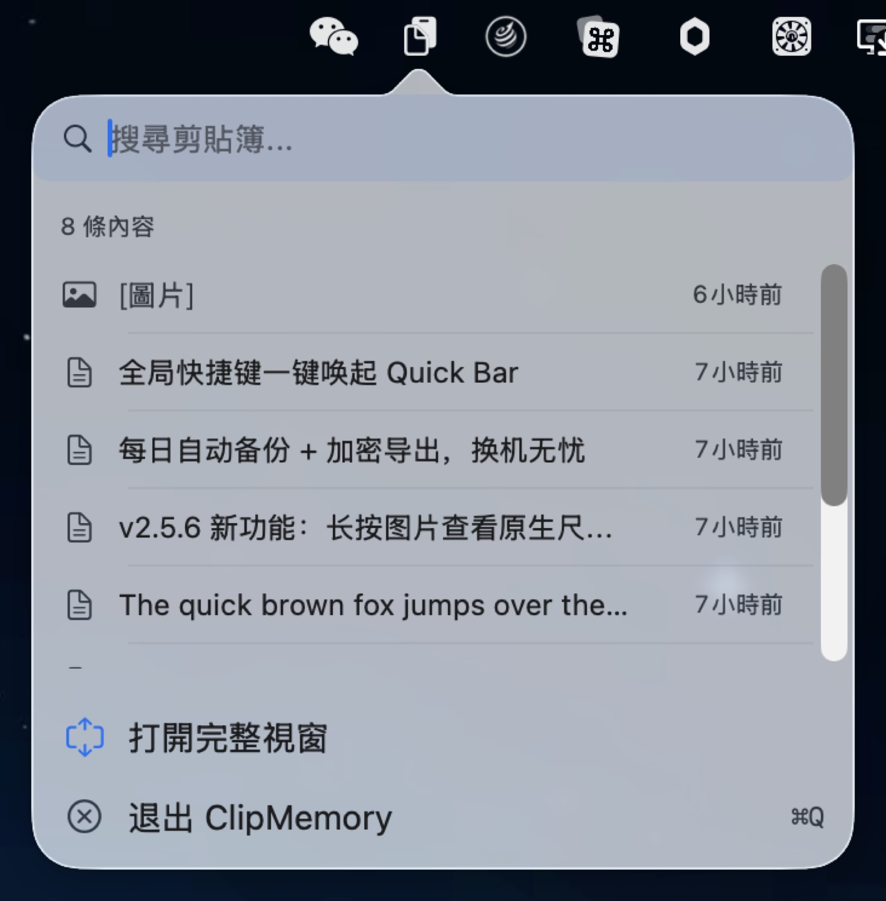
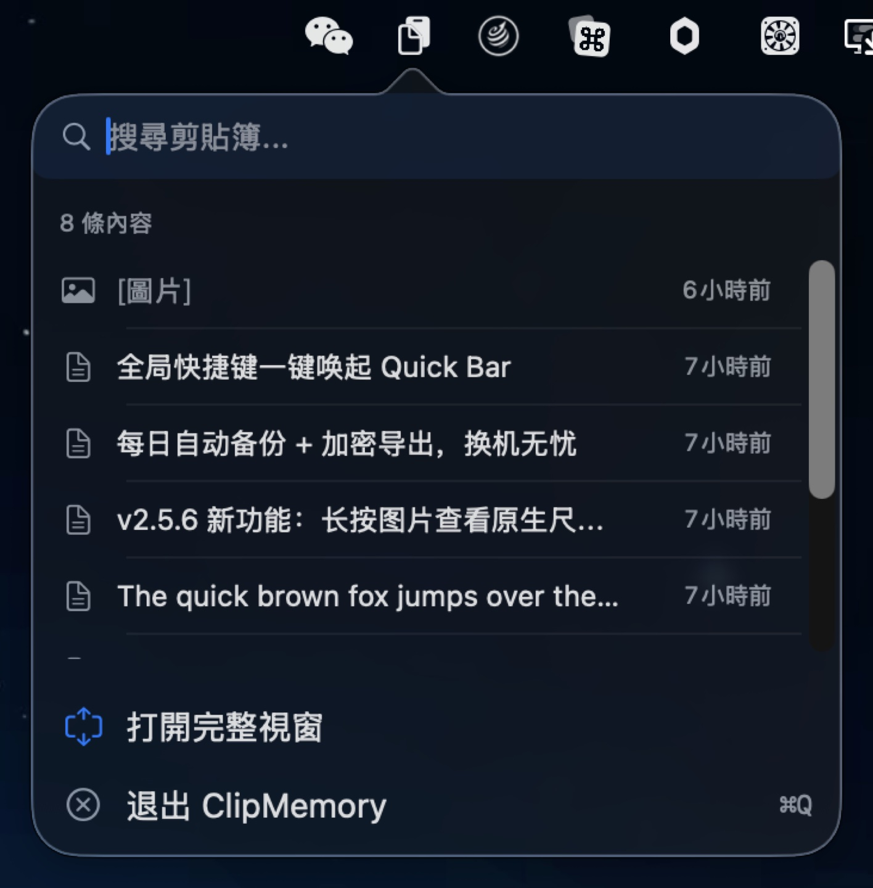
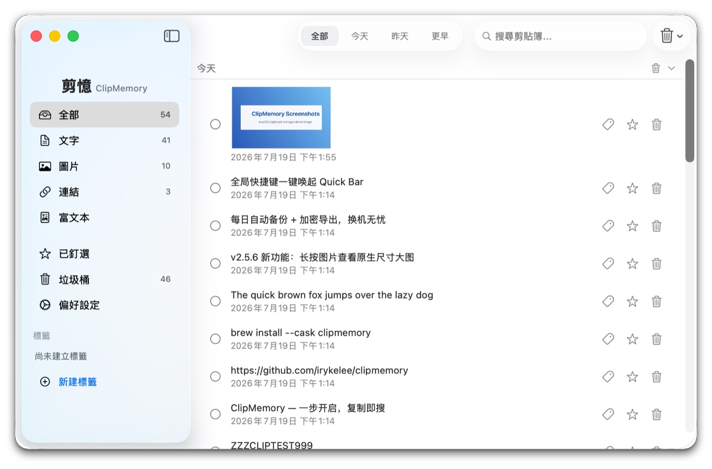
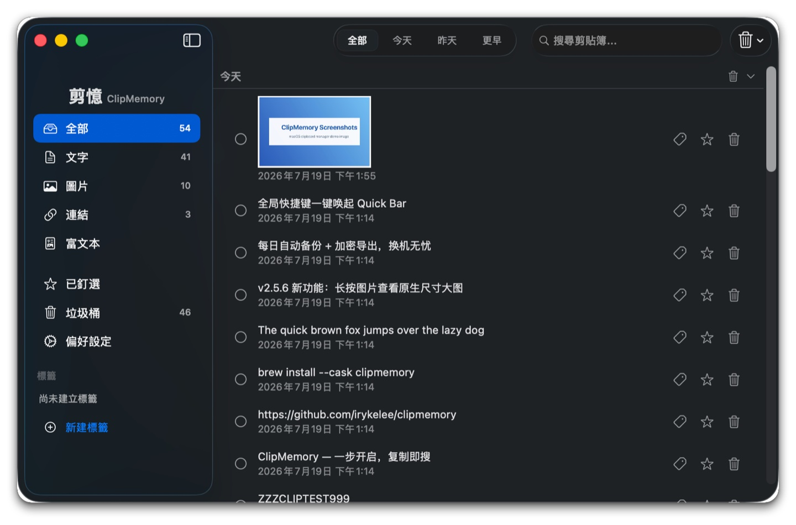

# 剪憶 ClipMemory v2.5.12

**新一代 macOS 剪貼簿管理器 — 一步開啟，複製即搜**

[English](./README_EN.md) · [简体中文](./README.md) · [繁體中文](./README_ZH-HANT.md) · [日本語](./README_JA.md) · [한국어](./README_KO.md) · [Español](./README_ES.md) · [Português](./README_PT.md)

---

<p align="center">
  <br>
  <em>選單列一鍵喚起 Quick Bar — 最近 8 條，即搜即複製（淺色）</em>
</p>

<p align="center">
  <br>
  <em>選單列一鍵喚起 Quick Bar — 最近 8 條，即搜即複製（深色）</em>
</p>

<p align="center">
  <br>
  <em>主視窗：類型側邊欄 × 時間分組 × 搜尋高亮（淺色）</em>
</p>

<p align="center">
  <br>
  <em>主視窗：類型側邊欄 × 時間分組 × 搜尋高亮（深色）</em>
</p>

---

## v1 → v2 核心升級

| 維度 | v1 | v2 |
|------|----|----|
| **互動入口** | 選單 → 選單 → 視窗（三步） | Quick Bar 彈窗（一步） |
| **主介面** | 固定寬度，無側邊欄 | 固定側邊欄，隨時切換類型 |
| **全域快捷鍵** | 僅 Cmd+Ctrl+V | 支援自訂錄製 |
| **Quick Bar** | 無 | 最近 8 條彈窗，即搜即複製 |
| **搜尋高亮** | 文字覆蓋高亮 | 不區分大小寫，不亂碼 |
| **長按預覽** | 無 | 0.4s 揭示全文 / 敏感 / 圖片原圖 |
| **時間分組** | 無 | 今天 / 昨天 / 更早，可折疊 |
| **標籤系統** | 無 | 建立 / 刪除 / 自訂顏色，側邊欄過濾 + 智慧建議 |
| **垃圾桶** | 刪除即銷毀 | 刪除進垃圾桶可復原，保留期可配 |
| **自動更新** | 手動下載 | 背景自動檢查，一鍵安裝重啟 |
| **本機備份** | 無 | 每日自動備份 + 加密備份包匯出 / 匯入 |

---

## 📋 更新日誌

### v2.5.12 (2026-07-24) — 穩定性與資料安全大修

- **🛡 資料安全集中修復** — 全面程式碼審查後的 30+ 項修復：剪貼簿歷史不再因金鑰初始化競態整會話靜默遺失（STOR-1）；更新源探測不再自我取消導致鏡像容災完全失效（UPD-1）；富文字條目恢復按內容搜尋（CLIP-1）；圖片條目支援去重，同一張截圖重複複製不再產生重複檔案和列表項
- **🖼 OCR 文字不再遺失** — 複製圖片條目、匯入備份、舊版圖片遷移都不再清掉已辨識的 OCR 文字（STOR-2）
- **⚡ 啟動與操作更流暢** — 舊版圖片遷移移出啟動主執行緒；QuickBar 搜尋結果快取不再每次渲染重複過濾；標籤面板開啟只跑一遍分詞管線；JSON 持久化編碼移入背景佇列
- **🔔 錯誤提示不再洗版** — 加密失敗彈窗按來源 60 秒聚合計數，OCR 回填失敗時不再連環彈窗
- **💾 備份匯入更安全** — 備份包解壓驗證符號連結與路徑越界、JSON 讀取加 100 MB 上限；`.incomplete` 標記刪除失敗不再靜默吞錯
- 完整 changelog: https://github.com/irykelee/clipmemory/releases/tag/v2.5.12

### v2.5.11 (2026-07-23) — ContentView 拆分 + 16 項 bug 修復

### 主要更新 (Highlights)

- **🏗 ContentView 拆分 (NEW-7 Phase 4)** — 主列表 / 選擇 / 批量操作 / 刪除 alerts 全部從 ContentView 抽出到獨立 `ItemListView`（287 行）；ContentView 1178 → 995 行（-15.5%）。解耦 list render + list-related state，但保留 view 層的搜尋 / filter / 滾動 cache 在 ContentView（避免一次性 refactor 風險）。後續 Phase 6+ ViewModel collapse 把 `@State` 收成 `@StateObject` 即可開 ItemListView snapshot baseline
- **🛡 資料安全 4 件套** — `maxItems` setter clamp 1...10_000 防負值/超大；`backupNow()` 序列化（NSLock）防 double-click + auto-backup race；`addTag()` trim 前導/尾部空白防 "  Work  " 跟 "Work" 雙存；`ClipboardItemRow` observe LanguageManager 切語言時立即重新渲染日期
- **🌐 i18n plural support (F-7)** — 6 個 %d plural keys 走 `.stringsdict`（batch.selected / quickbar.recent / trash.emptyConfirm.message / alert.clear.message / settings.max.items.count / clear.conditional.confirm）；英文 "1 item" / "5 items" 不再都是 "1 items"；新增 `Scripts/generate_stringsdict.py` 一鍵 regen 7 lang
- **🛡 Settings "Back Up Now" 錯誤不再靜默吞 (F-4)** — 原來 `try?` 直接 discard every backupNow() 失敗；現在 do/catch + onShowBackupError callback → ContentView 彈 `L10n.settingsBackupError` NSAlert（與 export/import/pre-import snapshot 失敗路徑一致）
- **🛡 QuickBar ⌘F 真的能聚焦搜尋了 (F-9)** — 之前只依賴 KeyCaptureView 的 NSEvent local monitor（popover 視窗上下文裡不可靠）；現在加 `.cmdFFindAction` notification 兜底，與 ContentView 走同一條路徑

### 修復 (Fixes)

按影響排序 (high → medium → low)：

**High impact（架構 / 資料 / UX 關鍵路徑）**

- **NEW-7 Phase 4 ItemListView 提取** — 主列表 / 選擇 / 批量操作 / 刪除 alerts 全部從 ContentView 抽出（287 行）；ContentView 1178 → 995 行（-15.5%）
- **E-1 maxItems setter clamp** — `1...10_000` 範圍內；UserDefaults 不再被 -1 / 999_999_999 污染；新 `minMaxItems` / `maxMaxItems` 常數是唯一 source of truth
- **E-2 backupNow() 序列化** — `NSLock` 包裹；double-click "Back Up Now" + auto-backup 同幀觸發不再 race on `createDirectory` + `copyItem(Images)`
- **E-13 ClipboardItemRow observe LanguageManager** — `@ObservedObject private var languageManager = LanguageManager.shared`；切 Settings → Language 時日期格式立即重新渲染（不再等滾動 off+on）
- **F-9 QuickBar ⌘F 修復** — `.onReceive(NotificationCenter.default.publisher(for: .cmdFFindAction))` 加到 QuickBarView 根 VStack；popover 環境下 ⌘F 也能 focus search field
- **F-4 Settings Back Up Now 錯誤 alert** — `onShowBackupError` callback wired 到 ContentView 的 `showBackupInfo(L10n.settingsBackupError)`；失敗現在可見

**Medium impact（UX 一致性 / a11y / i18n）**

- **F-10 Welcome Enter 綁預設按鈕** — `.keyboardShortcut(.defaultAction)` 加到 `getStartedButton`；Welcome 彈窗按 Enter 直接走 onComplete
- **F-13 TipsView ↑↓ label** — `L10n.quickbarRecent(8)` 改為 `L10n.tipsKeyUpdown` = "Navigate items"；6 lang 全部原生翻譯（zh-Hans 切換條目 / zh-Hant 切換條目 / ja 項目を移動 / ko 항목 이동 / es Navegar por los elementos / pt Navegar pelos itens）
- **F-3 TrashItemRow 按鈕 keyboard 可見** — `@FocusState private var isFocused: Bool` + `.focusable()` + `.focused($isFocused)`；row 焦點狀態時 opacity 也顯示按鈕（之前只 hover 顯示）
- **F-16 TagPickerSheet 鍵盤刪除** — `.contextMenu` + `.onDeleteCommand`；⌫ / Forward Delete 鍵或右鍵選單都能觸發 delete confirmation（之前只能 long-press）
- **F-20 pin/delete accessibilityLabel** — Image-only Button 加 `.accessibilityLabel(...)` 複用現有 `L10n.tooltip*` key；VoiceOver 不再讀 "button" 無上下文的標籤

**Low impact（清理 / 效能 / 邊界正確性 / i18n 完善）**

- **E-6 addTag trim 空白** — `tag.name.trimmingCharacters(in: .whitespacesAndNewlines)` 在 `addTag(_:)` 入口；"  Work  " 跟 "Work" 不再雙存
- **BUG-007 ItemListView header toggle skip during search** — `onTapGesture` 在 `!searchText.isEmpty` 時 no-op；force-expand 顯示規則下，mutate collapsedGroups 反而清空搜尋時冒出意外 collapsed 狀態
- **F-25 UpdateStatusPanelView DateFormatter cached** — `static let dateFormatter`；每次 body re-render 不再 new 一個 DateFormatter
- **F-7 extend .stringsdict 3 plural keys** — `alert.clear.message` / `settings.max.items.count` / `clear.conditional.confirm`；3 multi-arg keys (alert.trim 2x %d / tagPicker & sidebar.deleteTag with %@) 延後到下個 round

### 升級提示 (Upgrade Note)

- v2.4.0 起帶自動更新模組（Sparkle）的版本：等 App 內自動更新，或 `brew upgrade --cask clipmemory`
- 無資料遷移、無一次性彈窗
- **i18n 改進**：切到中文/日文/韓文介面時，"Recent 1 item" / "Recent 5 items" 現在按 plural 形式顯示

### v2.5.10 (2026-07-22) — 備份錯誤可見 + UI 重構 + SwiftUI 警告修復

- **🛡 備份包損壞可見（BUG-024）** — 損壞的 items.json / trash.json / tags.json / 圖片檔案不再靜默匯入 0 條；現在匯入失敗會 throw `corruptedData` 並在設定頁彈窗提示
- **⚡ SidebarView 抽取（NEW-7 Phase 3）** — ContentView 從 1162 行減至 1123 行；側邊欄獨立的 11 參數顯式介面，單測 + 手動驗證 7/7 通過
- **🛡 SwiftUI @State 警告修復（BUG-009）** — `ClipboardItemRow` 高亮快取從 `@State` 字典遷移到 `NSCache`；不再觸發「Modifying state during view update」執行時警告，快取 countLimit=500 上限防記憶體洩漏

### v2.5.9 (2026-07-21) — 卡死偵測 + 全量稽核修復

- **🛡 卡死偵測（HangDetector）** — 主執行緒心跳 + 30s 探針；首次偵測到主執行緒 60s 無回應即記錄 stack 並自動恢復；避免 UI 真正卡死後無聲無息
- **🛡 備份包 PBKDF2 升級** — 600k 輪 PBKDF2-SHA256 取代單輪 HKDF，弱密碼離線暴力破解成本提升 ~10⁵ 倍（OWASP 2023 合規）；舊包透明相容
- **⚡ RTF 複製快取橋接** — `copyToClipboard` RTF 分支命中快取後 < 1ms（先前每次重新解析 20-100ms 阻塞主執行緒）；快取跨 list/quickbar 自動橋接
- **🛡 UI 狀態不丟失** — 搜尋列輸入不再因 `@State didSet` 不經 Binding 觸發導致鍵盤高亮殘留；側邊欄標籤徽章不再因標籤增刪 stale
- **🛡 主執行緒 IO 卸載** — `copyToClipboard` image/RTF 路徑不再阻塞剪貼簿輪詢；備份匯出 50MB 大小守衛防 OOM

### v2.5.8 (2026-07-20) — 穩定性稽核 + 23 項修復

- **🛡 備份匯出 / 匯入加固** — 卡住的 `ditto` 不再無限期阻塞 UI（30s 逾時 + 強殺升級）；HKDF 鹽用 OS CSPRNG 失敗時顯式報錯，不再靜默用零填充
- **⚡ RTF 解析移到背景佇列** — 大體積富文字貼上不再讓剪貼簿輪詢卡頓；OCR/圖片辨識也走背景，主執行緒更順
- **🛡 SwiftUI 渲染警告修復** — 列表項目數變化觸發的「Modifying state during view update」警告消除，無多餘重複渲染
- **🔧 記憶體儲存執行緒安全** — 測試與未來多執行緒 caller 不再因 `MemoryStorageBackend` 陣列 mutation 崩潰 / 漏資料
- **🏷 標籤色 fallback 修復** — 無效 hex 顏色回退到主題色，淺色 / 深色模式下都可見

### v2.5.7 (2026-07-20) — HangDetector 觀測 + 關鍵 bugfix

- **🛰️ HangDetector 觀測模組** — 後台 watchdog 自動偵測主執行緒卡死 >60s 並記錄完整堆疊 + 恢復時間，方便事後定位疑難 bug
- **🛡️ 修復 HMAC 失敗時靜默丟資料** — Keychain 異常時複製內容不再被當重複項丟棄
- **🛡️ 修復 QuickBar 鍵盤導航崩潰** — 選中項被外部刪除後按 ↑↓ 不再 OOB crash
- **🧪 測試 force-unwrap crash 修復** — XCTAssertNotNil + `!` 模式改為 `guard let ... XCTFail(...) return`
- **🖼️ 圖片載入並發競爭修復** — legacy 圖片遷移多執行緒並發，寫入序列化避免資料競爭
- **🛡️ Excluded-app 配置 TOCTOU 修復** — 增原子 `updateExcludedBundleIds` API
- **🧹 主視窗批量選擇工具列狀態殘留修復** — 單行刪除後工具列正確消失

### v2.5.6 (2026-07-19) — 密鑰入鑰匙圈 + 原圖預覽 + 啟動加固

- **🔐 密鑰遷至鑰匙圈** — 加密根密鑰從明文檔案遷入 macOS 鑰匙圈（僅本機、不同步 iCloud），brew 解除安裝（zap）時一併清除
- **🖼 圖片原圖預覽** — 長按圖片彈出原生尺寸浮窗，超寬/超長截圖可捲動查看，文字清晰可辨（取代原 300px 行內放大）
- **🛡 啟動加固** — 密鑰損毀或無法儲存時不再直接當機，改為清晰彈窗：可結束、重試或重置（重置會清空歷史記錄）
- **🌐 鏡像源需確認** — GitHub 更新伺服器不可達時，首次切換 jsDelivr 鏡像前徵求同意並記住選擇；鏡像內容過舊自動拒絕

### v2.5.5 (2026-07-18) — 分類刪除 + 穩定性加固

- **🗑 按條件刪除** — 頂欄 🗑 新增「按條件刪除」：類型 × 時間組合（如只刪更早的圖片、保留今天的）；文本/圖片/連結/富文本 tab 右鍵一鍵刪除全部該類型；每個時間組 header 新增組刪除按鈕
- **🏷️ 刪標籤選項** — 刪除標籤時可選「僅刪除標籤」或「標籤和內容一起進垃圾桶」
- **🔧 備份匯入加固** — 跨機匯入時標籤名正確解密（不再亂碼）；修復包內重複條目重複匯入、解密失敗條目誤匯入、大包匯入卡頓、備份清理誤刪非備份檔案等問題

### v2.5.0 (2026-07-18) — 本機備份 + 匯入匯出

- **💾 本機自動備份** — 每天首次啟動自動備份剪貼歷史（含標籤、垃圾桶、圖片）到本機 Backups 目錄，預設保留 7 份（3/7/14/30 可選），資料遺失兜底
- **📦 備份匯出 / 匯入** — 一鍵匯出 .clipmemory 加密備份包（密碼保護），換機或重裝後匯入即可復原；匯入自動與現有資料合併去重，不覆蓋現有內容
- **⚙️ 設定頁新增「備份」** — 自動備份開關、保留份數、立即備份、打開備份目錄、匯出/匯入入口

### v2.4.2 (2026-07-18) — 穩定性修復 + 更新雙渠道

- **🌐 更新渠道雙保險** — GitHub 不可達時自動切換 jsDelivr 鏡像檢查更新；有更新時 App 自動來到前台並顯示 Dock 角標（gentle reminders），不再靜默錯過
- **💾 資料安全** — 新剪貼內容即時寫入磁碟：此前 500ms 防抖窗口內 kill -9 / 斷電會遺失最新內容
- **🐛 穩定性修復** — SwiftUI「Modifying state during view update」告警洗版（每秒數十次 → 0）；熱鍵被佔用時每次啟動重複刷 -9878 錯誤日誌

### v2.4.1 (2026-07-18) — 更新源修復

- **🌐 修復「檢查更新」報錯** — 更新源從 raw.githubusercontent.com（部分網路不可達）遷移到 GitHub Release 資產，檢查更新秒回。v2.4.0 用戶如遇「更新錯誤」提示，請手動下載一次 v2.4.1，之後恢復自動更新

### v2.4.0 (2026-07-18) — 資源回收筒

- **🗑️ 資源回收筒（Recycle Bin）** — 刪除條目不再直接銷毀，而是先進入資源回收筒保留 7 天（可在設定中調整），期間可隨時復原或徹底刪除；清空資源回收筒帶確認彈窗；自動清理過期條目
- **✨ 自動更新（Sparkle 2）** — 應用內自動檢查更新：背景每日檢查 + 設定頁手動檢查；更新包經 EdDSA 簽章驗證後一鍵安裝重啟；Homebrew Cask 已宣告 auto_updates
- **資料安全** — 圖片檔案隨資源回收筒條目保留，徹底清除時才刪除；自動清理（trim/expire）不進入資源回收筒，避免誤留垃圾
- **UI 更新** — 側邊欄新增「資源回收筒」入口（badge 顯示數量）；刪除確認彈窗文案更新為「移至資源回收筒」；資源回收筒條目顯示刪除時間
- **測試** — 新增 12 項資源回收筒專項測試，全部通過

### v2.3.0 (2026-07-17) — 標籤系統與資料完整性

- **🏷️ 標籤系統（Tag System）** — 完整標籤生命週期：建立 / 刪除 / 自訂顏色；側邊欄 tag section + 跨 section AND / in-section OR 過濾；智慧 tag 建議（基於 NLTagger：程式碼 / 郵件 / 憑證 / 敏感）；TagPicker sheet（行內 chips + 長按彈選擇器）；刪除確認對話框
- **6 個資料完整性嚴重修復** — saveTimer 執行緒競爭 UB；FileStorageBackend 同步落盤；flushPendingSaves 同步 flush tag；legacy image items 錯誤加密標記修復；contentHash backfill；ImageStorage 部分失敗 recovery
- **UI 改進** — Welcome window dedupe；Esc 取消 hotkey recording（返回 event 給 responder）；跨午夜自動重新整理 currentDate；Search 模式 force-expand groups（鍵盤導覽同步）；pendingMaxItemsReduction typo 修復
- **重構 + 效能** — RTF NSCache；L10n bundle cache；WindowManager 狀態穩定化（@State 跨 close/reopen 保持）；windowDidMove/Resize debounce 0.5s；+9 net new tests（241 → 250）

### v2.2.4 (2026-07-16) — 發布衛生修復

- **版本號與發布標籤同步** — `project.yml` 的 `MARKETING_VERSION` 與 `CURRENT_PROJECT_VERSION` 升級到 `2.2.4`，重新生成 `project.pbxproj`。修正 v2.2.3 切標籤但未同步版本號導致下遊 cask 拿到舊版本的問題
- **Quick Bar 標籤修正** — 移除 Quick Bar「打開完整窗口」項上誤導性的 `⌘⌃V` 快捷鍵標籤。全域快捷鍵打開的是完整主窗口，Quick Bar 由菜單欄 📋 圖標左鍵打開
- **文檔快捷鍵說明更正** — 8 種語言 README 中關於 `Cmd+Ctrl+V` 的描述重寫，明確該快捷鍵打開主窗口而非 Quick Bar
- **打包腳本安全加固** — `Scripts/package.sh` 默認版本號改為從 `project.yml` 讀取 `MARKETING_VERSION`（含讀取失敗的防護），避免在不帶參數調用時靜默打包一個舊版本號的 tarball

### v2.2.1 (2026-05-19) — 圖片敏感邏輯修復

- **圖片敏感判斷修復** — 圖片不再按大小（50KB）自動標記敏感，存儲由 maxItems 和手動清理控制
- **組件拆分重構** — ContentView 拆分為 FlowLayout、LogoView、DateFilterButton、AppPickerRow、ClipboardItemRow
- **共享工具類** — 提取 FontScaling.swift（sz()）和 DateHelpers.swift（日期格式化）
- **NSCache 內存壓力處理** — 添加系統內存警告監聽，觸發緩存清理

### v2.2.0 (2026-05-15) — 富文本支持

- **RTF 剪貼簿捕獲** — 自動識別並保存富文本內容
- **富文本渲染** — NSAttributedString → AttributedString 轉換
- **複製回粘** — 同時寫入 .rtf 和 .string 兩種剪貼簿類型
- **側邊欄標籤** — 新增「富文本」分類，含圖示、計數徽章和類型篩選
- **Quick Bar 展示** — 富文本圖示 + 純文本預覽
- **敏感內容遮罩** — 富文本條目同样支持敏感資訊掩碼
- **85 項測試** — 含 4 項富文本往返測試
- **搜尋優化** — 修復富文本搜尋功能

### v2.1.5 (2026-05-11) — 協議抽象與交互優化

- **協議抽象** — StorageBackend 協議 + MemoryStorageBackend 測試後端
- **81 項測試** — 完整測試基礎設施
- **最大條數裁剪對話方塊** — 超出歷史上限時彈窗確認
- **圖片佔位符** — 載入失敗時顯示優雅的佔位圖
- **分組操作** — 支援分組級別取消固定/清空

### v2.1.0 (2026-05-09) — Liquid Glass UI

- Liquid Glass 設計語言 — NavigationSplitView 側邊欄 + QuickBar 玻璃彈窗
- 鍵盤導航優化 — 滾動和搜尋框方向鍵處理修復

---

## 功能亮點

### Quick Bar — 一步即達

點擊選單列圖示 → NSPopover 彈出最近 8 條 → 點擊複製 / 搜尋 / 開啟完整視窗

### 長按 0.4s — 預覽無限制

| 內容類型 | 預設顯示 | 長按後 |
|---------|---------|--------|
| 一般文字 | 前 200 字元，3 行 | 全文顯示 |
| 敏感內容 | 遮罩 `ab••••••yz` | 揭示原文 |
| 圖片 | 縮圖 80px | 原生尺寸浮窗（超過螢幕可捲動）|

### 智能安全 — 加密 + 敏感檢測

- AES-256-GCM 加密（v2），相容舊版 AES-CBC+HMAC-SHA256
- 35 條規則自動識別敏感內容（密碼 / API 金鑰 / Slack/Discord/OpenAI 等 token / 身份證號等）
- 密碼管理員在前台時自動暫停，不從 App 內複製
- 加密失敗時內容不落地，拒絕明文儲存

---

## 功能列表

- 📋 剪貼簿歷史（文字 / 圖片 / 連結 / **富文本 RTF**）
- ⭐ 釘選重要條目，不自動清理
- 💾 圖片加密儲存，單張上限 50MB
- 🔍 即時搜尋，所有語言高亮（含中日韓等多位元組字元）
- ⚡ 智慧去重，相同內容只更新時間戳
- 🔄 複製循環攔截，從 App 內複製自動跳過
- 🧹 孤立檔案清理，啟動時自動清理無引用圖片
- 🌍 7 種語言（簡體中文 / 繁體中文 / English / 日本語 / 한국어 / Español / Português）
- ☑️ 多選批次釘選 / 刪除
- ✅ 複製成功綠色閃爍回饋
- ⚙️ 首次啟動自動檢測快捷鍵衝突
- ⌨️ 全域快捷鍵 `Cmd+Ctrl+V`
- 🖥 開機自啟（設定中開啟）
- 📐 字體縮放（小 / 中 / 大）
- 🎨 外觀（淺色 / 深色 / 跟隨系統）
- 🗂️ 類型篩選（全部 / 文字 / 圖片 / 連結 / 富文本）
- ⌨️ 鍵盤導航優化（方向鍵滾動、搜尋框焦點處理）

---

## 使用方法

| 操作 | 方式 |
|------|------|
| 開啟完整視窗 | `Cmd+Ctrl+V` |
| 彈出 Quick Bar | 左鍵點擊選單列 📋 圖示 |
| 複製條目 | 點擊條目 / 鍵盤 ↑↓ + Enter |
| 搜尋 | 輸入關鍵詞，匹配處高亮 |
| 釘選 / 取消釘選 | 點擊 ⭐ 或雙擊條目 |
| 刪除 | 點擊 🗑 或右鍵選單 |
| 預覽全文 / 敏感內容 / 圖片 | 按住 0.4s，鬆開恢復 |
| 多選批次操作 | 單擊核取方塊進入多選模式 |
| 清空歷史 | 頂欄 🗑（保留釘選條目） |
| 按條件刪除 | 頂欄 🗑 →「按條件刪除」，類型 × 時間組合；類型 tab 右鍵刪除全部該類型 |
| 切換類型篩選 | 側邊欄點擊「文字/圖片/連結/富文本」 |

> 💡 釘選的條目不會被自動清理。複製相同內容不重複記錄，只更新時間戳。

---

## 安全特性

- **AES-256-GCM（v2）+ 相容舊版 AES-CBC+HMAC-SHA256** — 所有文字和圖片存入磁碟前自動加密
- **智慧檢測** — 35 條規則（關鍵詞 + 正規式），自動識別密碼、API 金鑰、Slack/Discord/OpenAI 等 token、私鑰、身份證號、銀行卡號等
- **自動清理** — 敏感內容可設定 1 小時 / 24 小時 / 48 小時 / 7 天後自動清除，或不自動清除

---

## 偏好設定

- 歷史記錄最大條數（50 / 100 / 200 / 500 條）
- 敏感資訊清除策略（1 小時 / 24 小時 / 48 小時 / 7 天 / 不自動清除）
- 語言切換（7 種語言）
- 全域快捷鍵錄製
- 外觀（淺色 / 深色 / 跟隨系統）
- 排除應用（自訂不監控的 App）
- 富文本捕獲開關
- 字體縮放（小 / 中 / 大）
- 開機自啟
- 垃圾桶保留期（3 / 7 / 14 / 30 天）
- 備份（每日自動備份 / 保留份數 / 匯出 / 匯入）
- 自動更新（自動檢查 / 立即檢查）

---

## 系統需求

- macOS 13.0 (Ventura) 或更高版本

---

## 數據遷移

歷史記錄（含加密密鑰）位於 ~/Library/Application Support/ClipMemory/。
建議透過 設定 → 備份 → 匯出備份 產生 .clipmemory 加密備份包，在新 Mac 上匯入即可遷移；也可以直接備份此目錄手動遷移。
刪除 App 前，可點擊主視窗頂欄 🗑 按鈕清除歷史記錄。

---

## 安裝

```bash
brew tap irykelee/clipmemory
brew trust irykelee/clipmemory
brew install --cask clipmemory
```

安裝後 App 在 `/Applications/ClipMemory.app`。啟動後看**螢幕右上角選單列**的 📋 圖示，點擊即可使用。

或從 [GitHub Releases](https://github.com/irykelee/clipmemory/releases) 下載 `.tar.gz` 手動解壓到 `/Applications/`。

> **首次打開若提示「Apple 無法驗證…」**：這是 macOS 對未公證應用的常規攔截，不是病毒。任選一種：① 右鍵點 App →「打開」→ 再點「打開」；② 系統設定 → 隱私與安全性 → 找到 ClipMemory 點「仍要打開」。僅需操作一次，之後正常。（透過 `brew install` 安裝不會遇到此提示）

---

## 開發

```bash
brew install swiftlint xcodegen
xcodegen generate
xcodebuild -scheme ClipMemory -configuration Release
```

---

## 聯絡方式

- GitHub: https://github.com/irykelee/clipmemory
- 回饋：偏好設定 → 關於 → 傳送回饋 → GitHub Issues
