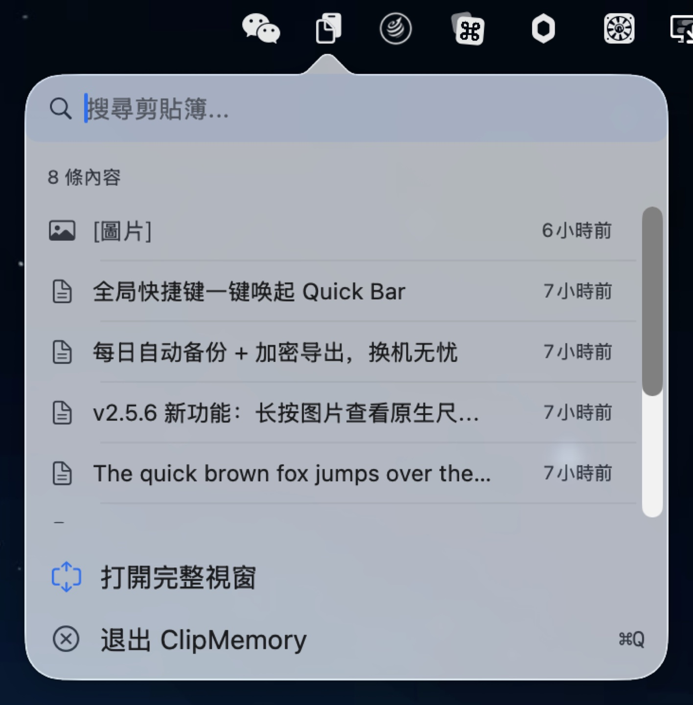
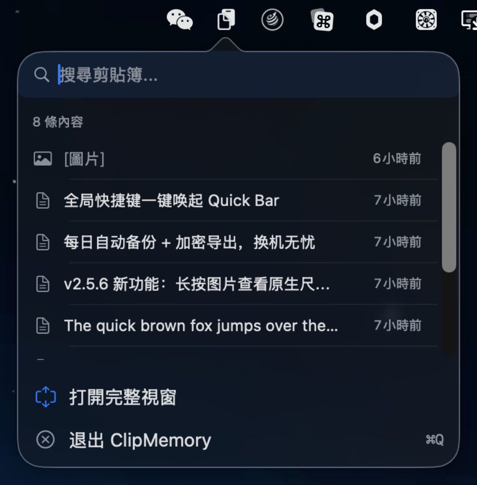
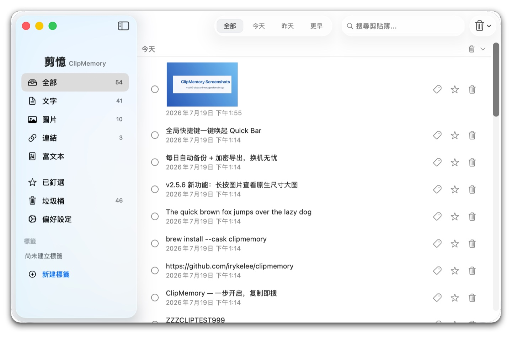
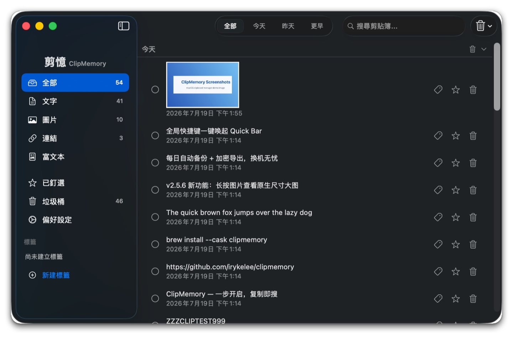

# 剪憶 ClipMemory v2.8.4

**新一代 macOS 剪貼簿管理器 — 一步開啟，複製即搜**

[English](./README_EN.md) · [简体中文](./README.md) · [繁體中文](./README_ZH-HANT.md) · [日本語](./README_JA.md) · [한국어](./README_KO.md) · [Español](./README_ES.md) · [Português](./README_PT.md)

---

<p align="center">
  <br>
  <em>選單列一鍵喚起 Quick Bar — 最近 8 條，即搜即複製（淺色）</em>
</p>

<p align="center">
  <br>
  <em>選單列一鍵喚起 Quick Bar — 最近 8 條，即搜即複製（深色）</em>
</p>

<p align="center">
  <br>
  <em>主視窗：類型側邊欄 × 時間分組 × 搜尋高亮（淺色）</em>
</p>

<p align="center">
  <br>
  <em>主視窗：類型側邊欄 × 時間分組 × 搜尋高亮（深色）</em>
</p>

---

## v1 → v2 核心升級

| 維度 | v1 | v2 |
|------|----|----|
| **互動入口** | 選單 → 選單 → 視窗（三步） | Quick Bar 彈窗（一步） |
| **主介面** | 固定寬度，無側邊欄 | 固定側邊欄，隨時切換類型 |
| **全域快捷鍵** | ⌘⇧V（預設） | 支援自訂錄製 |
| **Quick Bar** | 無 | 最近 8 條彈窗，即搜即複製 |
| **搜尋高亮** | 文字覆蓋高亮 | 不區分大小寫，不亂碼 |
| **長按預覽** | 無 | 0.4s 揭示全文 / 敏感 / 圖片原圖 |
| **時間分組** | 無 | 今天 / 昨天 / 更早，可折疊 |
| **標籤系統** | 無 | 建立 / 刪除 / 自訂顏色，側邊欄過濾 + 智慧建議 |
| **垃圾桶** | 刪除即銷毀 | 刪除進垃圾桶可復原，保留期可配 |
| **自動更新** | 手動下載 | 背景自動檢查，一鍵安裝重啟 |
| **本機備份** | 無 | 每日自動備份 + 加密備份包匯出 / 匯入 |

---

## 📋 更新日誌

### v2.8.4 (2026-08-12) — 隱私清單 + 安全升級 + 潛在 bug 修復 + 防回歸門

- **🔒 Sparkle 升級 2.9.4 → 2.9.5 (ID-CI-0001)** — 升級含 symlink 安全修復 (delta patching 路徑硬防 symbolic link 攻擊)。Sparkle 自動升級通道預設開啟，使用者無感；修復防 delta patch 路徑攻擊向量。
- **🍎 隱私清單 (PrivacyInfo.xcprivacy, ID-PRIVACY-0001)** — Apple 2024+ 要求新建 `PrivacyInfo.xcprivacy`。本 release 新增此檔案，宣告 Tracking=false + 剪貼簿/OCR 資料用途 + 4 類 required-reason API。使用者透明，但消除開源分發到 Mac App Store 路徑的合規壁壘。
- **🛠 4 項 latent bug 修復 (PR #61)** — 4 項真潛在 bug 修復：PR54-H chokepoint helper (itemIndex staleness window bounds check) + PR54-M1 locale pinning (Turkish/German diacritic cache poisoning 修復) + PR56-M dead code 刪 (XCTest 隔離後 no-op) + PR56-L1 countLimit assert (防未來 didSet 偷砍 cache rescale)。
- **📋 7 README 統一快捷鍵 + L10n 閉環 (ID-DOCS-0001)** — 7 語種 README 14 處 `Cmd+Ctrl+V` 殘餘 → `⌘⇧V` (匹配 `HotKeyManager.swift:10` defaultConfig `cmdKey | shiftKey`) + 7 L10n `settings.hotkey.footer` 「open QuickBar」→「open main window」統一。
- **🛡 Hotkey drift CI lint 上線 (ID-CI-0002)** — `Scripts/lint-hotkey-drift.sh` 自動校驗 7 README + 7 L10n footer 與 `HotKeyManager.swift:10` defaultConfig 一致性，禁歷史 drift forms。下次 hotkey 改 → CI 紅 → 強制 6 層同步。

- v2.4.0 起帶自動升級模組（Sparkle）的版本：等 App 內自動更新，或 `brew upgrade --cask clipmemory`
- 完整 changelog: https://github.com/irykelee/clipmemory/releases/tag/v2.8.4

### v2.8.3 (2026-08-11) — 搜尋效能最佳化 + 簽名前向衛生

- **⚡ 搜尋效能大幅提升（PR #54, ID-PERF-0025/0026）** — 新增 `normalizedCache` 鏡像既有 pinyin 快取模式：`FuzzySearchMatcher.matches()` 現在對相同 content 重用 lowercase + Unicode folding 結果，避免每次輸入搜尋都重新跑 ICU bridge。同時 `ClipboardStore.item(forID:)` 重用 versioned itemIndex 取代表達式 computed property，row 渲染同步受益（實測 11× 加速）。5000+ 條目搜尋從約 250ms 降至約 15ms。一般使用者（約 100 條目）幾乎無感，power user 受益明顯。
- **🔒 release 簽名現在帶有 RFC 3161 secure timestamp（PR #55, ID-SECURITY-0009）** — `release.yml:130` 的 Release 分支加入 `OTHER_CODE_SIGN_FLAGS=--timestamp`，Apple Development 簽名現在帶有 Apple TSA secure timestamp（Personal Team 時間戳記最佳實務）。Cert 於 2027-07-19 到期後，簽名仍保持有效（forward-defense）。注意：此變更不影響 provisioning profile 過期問題。
- **🔧 Gitee 鏡像同步可靠性 5 項修復（PR #48 / #49 / #51 / #53 + hotfix `da1c7fd`）** — 修復 sync 失敗時不再 silent success (#53 part 1)、告警 issue 依 version 去重 (#51)、告警 issue 開前 label 已建立 (#53 part 2)、告警鏈 timeout 與權限拓寬 (#49)、2→4 retry + 失敗自動開 GH issue (#48)；加入 hotfix `da1c7fd` 修正 `sync-gitee.yml` 的 step-level `needs: [sync]` YAML 錯誤（直接推送到 main，**無 PR 關聯**，單獨標示 hotfix，不混入 PR 列表）。Gitee 渠道升級更可靠，不再出現 mirror 靜默失敗。
- **🔧 發版自動回滾（PR #50）** — `appcast.xml` 與 Homebrew tap Cask 在發布失敗時會自動回滾到上一個 release 狀態，不留 stale asset；防止 release commit push 成功但 appcast/tap push 只完成一半所導致的下游污染。
- 自 v2.4.0 起帶自動更新模組（Sparkle）的版本：等待 App 內自動更新，或執行 `brew upgrade --cask clipmemory`
- 完整 changelog: https://github.com/irykelee/clipmemory/releases/tag/v2.8.3

### v2.8.2 (2026-08-10) — 垃圾桶批次還原 + 5 項資料安全加固

- **🆕 垃圾桶批次還原（NEW-batch-restore）** — 垃圾桶頁籤現支援多選 + 一鍵還原：行內核取方塊 + 頂部主控核取方塊（全選/全不選/部分選中三態）+ Shift+點擊選區 + Restore 按鈕根據選中數動態顯示「Restore N items」。「一條一條點」已成歷史。
- **🛡 修正開發版污染正式版導致的剪貼簿資料遺失（ID-STORE-0014, CRITICAL）** — `ClipboardStore.swift:129` 的 `maxItems` didSet 之前寫 `UserDefaults.standard` 而非注入 defaults；XCTest 測試會將使用者正式 `com.clipmemory.app` 域的 cap 靜默設為 3，下次啟動時舊條目會被裁剪。修復使用 `xcTestDefaults` 靜態 seam + XCTestObservation 每測試清 isolated suite + 4 個 sibling didSets + 4 個 init reads 全切換至注入 defaults。這是使用者原話「以後開發版不要影響正式版的使用」的根本修復。
- **🛠 import 溢出走垃圾桶（M-2）** — `importBackupItems` 偵測到匯入後條目數 > maxItems 時，溢出的條目經 `moveToTrash` 走垃圾桶（保留可還原）而非直接丟棄。
- **🛠 7 項 audit 驅動的「用系統預設」重構（PR #40-#47）** — SelectCheckbox/CloseButton 共用元件抽取 + NSWindow.setFrameAutosaveName + Notification.Name 註冊表補漏 + 4 處 keyCode → Carbon `kVK_*` + 搜尋防抖統一 250ms + sz() clamp 註解 + L24 sweep。
- 完整 changelog: https://github.com/irykelee/clipmemory/releases/tag/v2.8.2

### v2.8.1 (2026-08-08) — 修正 saveItems 靜默失敗 + 5 項稽核強化

- **� 修正 saveItems 靜默吞錯導致剪貼簿資料遺失（ID-SILENT-0021 HIGH）** — `ClipboardStore.flushSave()` 現在會捕獲 `saveItems()` 拋出的錯誤，並以 `needsSave = true` 保留重試狀態，加上 post `.clipboardSaveFailed` 通知 UI 通道；先前若磁碟已滿 / 權限錯誤 / iCloud 衝突持續 ≥ 500ms debounce 視窗，且使用者在結束前沒有後續 mutation，本次 session 的剪貼簿擷取內容會**永久遺失**（使用者無法重建）。觸發條件已嚴格化（不是每次失敗都會遺失）：磁碟錯誤持續 + 500ms 視窗 + 期間無 mutation 觸發 `saveImmediately` 重存 + 使用者結束 → 4 個條件全部成立才會真正遺失；任一條件不滿足就會被掩蓋。新增 `Notification.Name.clipboardSaveFailed` 作為 UI 通道的兜底。
- **🛠 修正 key re-ready 後 session 內永久空白行（ID-SILENT-0019 MEDIUM）** — `handleCryptoKeyPrepared(success:)` 分支現在除了清除 `pendingFailedIDs` 之外，會額外重置所有 `items[].decryptionFailed = false`；先前 `mergePendingDecryptionFailures` 把 flag 寫下去之後，即使用戶後續收到 key 就緒通知，session 內仍一直空白，必須重新啟動 app 才會恢復。配合 v2.8.0 (ID-STORE-0010) 形成完整對稱：負向快取清 + `pendingFailedIDs` 清 + `decryptionFailed` flag 重置 = cold-start key-not-ready 視窗的資料遺失徹底閉環。
- **🛠 修正 release-config XCTest 隔離失效（ID-SYNC-0006 MEDIUM）** — `NoOpFeedProbeEngine` class + `_sharedDefault` 的 `if isRunningTests` guard 移出 `#if DEBUG`。XCTest framework 設定 `XCTestConfigurationFilePath` env var 與 build config 無關，release-config XCTest 執行測試時 guard 之前會被 `#if DEBUG` 編譯掉、真實 `SPUStandardUpdaterController` 啟動 + 真實 appcast HTTP probe → 重新觸發 NEW-3 想阻止的污染路徑。class 安全（`@unchecked Sendable` + 無 mutable state）移出 DEBUG 後 release production 零成本。
- **🛠 7 項 LOW doc/log 收緊（MISC-0008/0009/0013 + SHELL-0001/0002 + SECURITY-0008 + SILENT-0022）**
- **🛠 7 處 XCTest notification test 改為 observer-driven 等待（ID-TEST-0001）** — `CryptoKeyPreparedNotificationTests` + `ClipboardStoreDecryptionFlagResetTests` 共 7 個 case 把 `DispatchQueue.main.asyncAfter(deadline: .now() + 0.1) { exp.fulfill() }` 的 100ms 時間等待換成 `NotificationCenter.addObserver(forName:object:queue:.main) { exp.fulfill() }` + `defer { removeObserver }` 的 observer-driven 模式。CI 負載下 100ms 視窗可能不夠 → flaky；idle 機器 100ms 是浪費。observer 註冊同步 → wait 在 observer 觸發的瞬間返回（典型 <1ms）。
- 完整 changelog: https://github.com/irykelee/clipmemory/releases/tag/v2.8.1

### v2.8.0 (2026-08-07) — 新增 Gitee 鏡像通道 + 測試與品質強化

- **🆕 新增 Gitee 鏡像更新通道** — 中國大陸下載加速器：設定 → 更新來源 → Gitee（中國鏡像），現與既有 jsDelivr 備援並行運作。完整的 Sparkle 中國大陸推送路徑現已全面上線。
- **🛡 加密安全強化** — 於 `.cryptoKeyPrepared(success)` 時，一併清除 `pendingFailedIDs`，以與既有 `negativeCache` 清除行為一致（ID-STORE-0010，HIGH）。先前僅清除 `negativeCache`，導致剛解密失敗的條目會持續被壓制直到重新啟動。
- **🛠 測試基礎設施強化 (NEW-1..9 + CI 閘門)** — 生產環境 UserDefaults 套件隔離 + 測試中 hermetic UpdateService + ZZZ canary 校準 + 強制 CI 最低測試執行數量
- **🛠 更新來源備援正確性 (NEW-5/6/7)** — `latestVersionString` 取最後一項 + `FeedProbeEngine` 備援依 id 綁定 + 5 處 zh-Hant 鏡像/映像 鏡像修正
- **🛠 發布工具鏈強化** — `Scripts/release.sh` `grep -c` 零匹配算術錯誤修正 + `Scripts/rollback-release.sh` Confirm 閘門防止 agent 沙箱掛死

- 完整 changelog: https://github.com/irykelee/clipmemory/releases/tag/v2.8.0

### v2.7.9 (2026-08-05) — 設定頁新增版本對照

- **🆕 設定頁的更新源新增「目前版本 vs 最新版本」對照** — 一眼就能看出是否需要升級；尚未完成首次更新檢查時僅顯示目前版本，不顯示「已是最新」標記，避免假綠
- **🛠 發佈流程強化（REL-24..28 五輪最佳化）** — AI agent 5 條硬性規則腳本開頭註解、`--yes` 非 TTY 雙因子防護、發佈回滾工具（`Scripts/rollback-release.sh`）、發佈後手動步驟確認關卡、release notes 預設描述自動填入、bash 5.3 全形括號 unbound 變數 bug 修復
- **🛠 Homebrew tap CI 上線** — `irykelee/homebrew-clipmemory` 新增 `cask-audit.yml`（brew audit + brew style），從此 Cask 縮排 / stanza 順序 / 格式錯誤都能在發佈前抓出，避免再次發生「tap Cask 不合格」事故
- **🛠 發佈工具鏈實體化納入主儲存庫** — `Scripts/release.sh` + `Scripts/rollback-release.sh` + `Scripts/README-release.md` + `Scripts/test/test_release.sh` 現已正式由 git 追蹤（原本是 symlink 指向本機平行儲存庫 `ClipMemory-local`，任何人 clone 主儲存庫都會得到斷裂的 symlink；該平行儲存庫已於 2026-08-05 封存）
- **🛠 Tap Cask 模板化** — 新增 `Scripts/cask-template.rb`（rubocop-clean），Release workflow 使用模板 + 佔位符產生 tap Cask，告別內聯 heredoc 造成的 YAML 縮排洩漏
- **🌏 國內使用者可切換 Gitee 鏡像源** — 設定 → 更新與關於 → 更新源 → 鏡像 (Gitee)；Gitee 鏡像完整託管 appcast + 安裝包，國內網路無需翻牆即可檢查更新

- 完整 changelog: https://github.com/irykelee/clipmemory/releases/tag/v2.7.9

### v2.7.8 (2026-08-04) — 搜尋與設定體驗最佳化

- **設定頁 6 處新增使用說明（快速鍵、歷史、OCR、排除應用程式、備份、更新源），不再靠截圖猜操作** — Settings pages now have 6 in-context explanations so users don't need to guess
- **主視窗最小尺寸提升到 850×600，搜尋框樣式貼近 macOS 26 系統預設** — Min window size raised to 850×600; search box matches macOS 26 system default
- **品牌 Logo 字級統一為 sz(18)，跨語種視覺一致** — Brand logo unified at sz(18) across all locales
- **側邊欄搜尋移到主視窗、工具列加入 macOS 風格、整體高度提升** — Sidebar search promoted to main window; macOS-style toolbar with taller min height
- **設定視窗置於主視窗中央，以免看不到** — Settings window now centers on the main window when visible
- 完整 changelog: https://github.com/irykelee/clipmemory/releases/tag/v2.7.8

### v2.7.7 (2026-08-01) — 搜尋體驗與可靠性修復

- **搜尋不再卡頓** — 搜尋含富文字的歷史時，此前會在主執行緒逐條解密導致明顯卡頓；現在冷快取條目先跳過、背景預熱完成後自動出現在結果中
- **QuickBar 搜尋更完整** — 搜尋時未解密的條目此前會被靜默漏掉且不會補全；現在預熱完成後結果自動重新整理補全
- **重複條目自動合併** — 啟動金鑰就緒後，歷史中的重複條目（含此前啟動視窗期漏網累積的）現在會自動合併清理
- **圖片瀏覽更快** — 圖片讀取不再被背景的舊格式遷移任務阻塞
- **修復垃圾桶條目整段工作階段空白** — 登入自啟動且金鑰鏈尚未解鎖時，垃圾桶的文字/連結條目此前一直空白且不自癒
- 完整 changelog: https://github.com/irykelee/clipmemory/releases/tag/v2.7.7

### v2.7.6 (2026-08-01) — 穩定性與資料安全加固

- **過期自動清理改為進垃圾桶，置頂條目永久豁免** — 達到保留上限的自動清理此前會永久刪除條目；現在改為移入垃圾桶（可隨時找回），且置頂（收藏）條目不再被自動清理
- **加密鏈路加固** — 金鑰鏈讀取出錯時不再誤覆蓋根金鑰（避免極端情況下全部歷史無法解密）；廢棄金鑰檔改為安全覆寫後刪除；備份目錄權限收緊為僅本人可讀
- **OCR 更穩健** — 圖片文字辨識遇到瞬時失敗（如系統資源緊張）時，下次啟動自動重試，不再永久跳過
- **修復解密失敗條目偶發顯示「無法讀取」並被快取** — 金鑰就緒晚於介面載入時的偶發空白/誤報，現在會自動重試恢復顯示
- **修復 QuickBar 搜尋框鍵盤死區** — 搜尋框聚焦時 Enter（複製選取項）與 Esc（關閉）此前無效，現已恢復
- 完整 changelog: https://github.com/irykelee/clipmemory/releases/tag/v2.7.6

### v2.7.5 (2026-07-31) — 緊急修復

- **修復圖片預覽右側空白條** — 直向上開啟接近螢幕高度的長截圖時，預覽面板右側出現大片空白區域，現已依圖片實際寬度自適應顯示
- **修復自動更新偵測器死程式碼** — v2.7.4 的 Sparkle 自動更新偵測器未啟動，導致該版本**無法收到本版本的自動更新推送**。已在 v2.7.5 修復，後續版本自動更新恢復正常
- **修復垃圾桶操作崩潰** — 刪除或還原垃圾桶內項目時可能觸發崩潰（或靜默操作到錯誤的項目），現已修復
- **修復防抖儲存定時器靜默失效** — 標籤編輯、垃圾桶操作等非即時落盤路徑的防抖儲存，在首次觸發後會停止運作；崩潰或強制結束將遺失上次啟動後的全部標籤/垃圾桶變更
- **修復含垃圾桶條目的備份無法匯入** — 任何包含非空垃圾桶的備份檔在匯入時都會失敗，現已相容
- 完整 changelog: https://github.com/irykelee/clipmemory/releases/tag/v2.7.5

### v2.7.4 (2026-07-31) — 寬圖預覽白屏修復 + 6 項 OCR 優化 + 效能提升

- **🔍 6 項 OCR 優化（CJK / 去重 / 逾時 / 記憶體）** — CJK 辨識降級時新增通知與 userLocale 日誌、圖片去重後舊 UUID 的 OCR 結果不丟失、Vision 呼叫 15 秒自動取消、6K HEIC 預覽記憶體從 ~100 MB 降至 ~16 MB（`thumbnailMaxPixelSize=2048`）
- **⚡️ 搜尋 / 複製效能提升（多項背景優化）** — UUID→索引字典 O(1) 查詢、拼音結果按內容快取（1000 次比對從 1340 ms 降至 77 ms）、JSONEncoder 重複使用、cleanup 單次掃描、冷啟動 AES-GCM 預填
- **🖼️ 寬圖長按預覽不再白屏** — 主螢幕旋轉為直向時複製 16:9 截圖，1 像素超出 cap 寬度的邊界情況不再產生 2000+ 像素白底（panel 自動貼合圖片尺寸）
- **🔇 OCR 路徑加入最小文字高度閾值** — `minimumTextHeight = 0.01`（預設 0.02 是為印刷文件調校的），小字號終端機截圖 / 12-pt 視網膜截圖現在能被辨識
- **🌐 7 語言在地化補齊** — 標籤徽章無障礙、tag picker 新增建議、加密失敗提示等多項 L10n 修復
- 完整 changelog: https://github.com/irykelee/clipmemory/releases/tag/v2.7.4

### v2.7.3 (2026-07-30) — Audit-Driven Fixes & 7-Language VoiceOver

- **🚀 效能提升（多項背景優化）** — JSONEncoder 重複使用、快取預熱並發上限、清理任務單次掃描、冷啟動 AES-GCM 解密預填；數千條歷史下貼上與搜尋明顯更順暢
- **🌐 7 語言 VoiceOver 無障礙** — 主選單 / 搜尋框 / 歡迎頁 / 標籤 chip / 應用程式排除列表 / 日期篩選按鈕 / 剪貼板項目類型標籤全部在地化；非英語使用者初次可透過 VoiceOver 流暢使用
- **🧹 生命週期強化** — 關閉歡迎/設定視窗不再記憶體洩漏；TrashStore / FeedProbeEngine 在 deinit 時正確清理背景任務；ImageStorage 在 App 退出前 flush 未完成寫入
- **🔇 沉默錯誤改為可見** — 10 處 `try?` 吞錯點現在記錄到日誌並通知 UI（圖片遷移寫入失敗、孤兒檔案殘留、備份暫存目錄清理失敗等），便於排查
- **AES-GCM 解密失敗不再永久污染條目** — Keychain 瞬時鎖定時觸發的解密失敗，現在 key 回復後會自動重試（舊 bug 會永久標記條目不可解密）
- 完整 changelog: https://github.com/irykelee/clipmemory/releases/tag/v2.7.3

### v2.7.2 (2026-07-29) — 模糊搜尋與圖片完整性掃描 + 密碼安全加固

- **拼音感知模糊搜尋** — 「zhongwen」也能匹配「中文文檔」；以空格分隔的多個詞必須全部命中（token AND matching），同時忽略大小寫和音調符號
- **啟動時圖片完整性掃描** — App 啟動後非同步掃描所有圖片條目，標記缺失/損壞檔案，列表項立即顯示狀態（無需等待每次點擊）
- **加密失敗診斷** — Keychain 鎖定時搜尋頁顯示黃色診斷橫幅說明原因，不再靜默空結果
- **快取預熱** — 主執行緒不再同步解密；預熱覆蓋 App 喚醒、新條目捕獲、列表首次顯示
- **Keychain 臨時鎖定不再永久標記條目** — 修了一個潛伏 bug：臨時鎖定後條目曾被永久標記為「不可解密」，現在 key 恢復後可自動重試
- 完整 changelog: https://github.com/irykelee/clipmemory/releases/tag/v2.7.2

### v2.7.0 (2026-07-28) — F-1 @MainActor 遷移

- **啟動時語言 picker 與 UI 文案一致性修正** — 之前如果儲存的是非英語語言，啟動後 Settings 視窗內的 UI 文案仍然是英文（Language picker 顯示正確）。v2.7.0 修正後，啟動即生效。
- **核心類別全面 Swift 並行相容** — `LanguageManager` / `TrashStore` / `ClipboardStore` 三個核心類別加 `@MainActor`，由型別系統保護 main-thread contract，避免未來回歸。
- **657 個測試全過，0 失敗** — 內部架構加固無功能回歸。
- **啟動時非英語語言 UI 文案仍顯示英文** — Swift `didSet` 在 `init()` 內不觸發，新增的 `currentLanguageCode` 鏡像需明確 seed 才能從啟動時刻起可用。
- **`LanguageManager` 改用 `nonisolated` 鏡像** — `L10n.string()` 等 off-main reader（來自 `CryptoService.prepareKey` failure handler 等 `Task.detached`）讀語言代碼不再跨 main-actor 邊界。
- 完整 changelog: https://github.com/irykelee/clipmemory/releases/tag/v2.7.0

### v2.6.2 (2026-07-27) — 圖片搜尋高亮與標籤篩選

- **圖片搜尋結果直接顯示 OCR 文字**：主列表和快速彈出框中，截圖條目下方會出現青色高亮的辨識片段，符合搜尋詞的部分醒目可見。設定 → 歷史記錄中可關閉（僅關閉顯示，篩選仍生效）。
- **標籤篩改為「同時包含」語意**：勾選多個標籤時（如「中國大陸」+「2026」），只顯示同時被打上這兩個標籤的條目，不再是任一標籤即命中。
- **標籤篩選時主列表頂部出現提示條**：當前啟用的標籤以膠囊形式列出，每個膠囊右側 × 可單獨移除，右側「全部清除」可一鍵清空；同時顯示「顯示 X / 共 Y 條」數量，一眼看出篩選生效。
- **搜尋框右側增加 × 一鍵清空按鈕**：搜完一個關鍵詞後點 × 直接清空，無需逐字刪除；搜尋框自動取得焦點，可立即輸入下一個關鍵詞。
- **垃圾桶刪除後列表即時重新整理**：之前刪除垃圾桶條目後需要觸發其他操作才能看到列表重新整理，現在點完「永久刪除」/「清空」立即生效。
- 完整 changelog: https://github.com/irykelee/clipmemory/releases/tag/v2.6.2

### v2.6.1 (2026-07-26) — Audit Fixes & QuickBar Repair

- 修復了快捷欄「開啟完整視窗」按鈕第二次點擊無反應的問題，選單列體驗恢復流暢
- 全面程式碼稽核後修復了 15 項潛在問題：加密金鑰故障彈窗不再侵入底層服務、垃圾桶獨立模組化、OCR 錯誤可診斷、設定頁視覺回歸有守護
- **快捷欄「開啟完整視窗」第二次無反應** — 視窗關閉後 @State 被重置，現在視窗實例保持穩定，每次點擊都能正常開啟
- **全新安裝時加密金鑰就緒前擷取的內容可能跨執行緒崩潰** — 極端情況下（首次啟動的數毫秒內複製）不再觸發並發異常
- **標籤和垃圾桶儲存每次新建背景佇列** — 批次操作（匯入 100 個標籤、清空垃圾桶）不再產生資源抖動
- 完整 changelog: https://github.com/irykelee/clipmemory/releases/tag/v2.6.1

### v2.6.0 (2026-07-25) — 獨立設定視窗

- **⚙️ 全新獨立設定視窗** — 設定從主視窗側邊欄遷出，改為獨立視窗，頂部按「一般 / 歷史與擷取 / 備份 / 更新與關於」四組分頁；`⌘,`、選單列圖示、Quick Bar 選單均可直達，視窗不再隨主視窗開關而遺失
- **🖥 全面相容 macOS 26 Tahoe** — 主視窗標題欄恢復與側邊欄融合的磨砂質感（不再是突兀的白色條帶）；修復 Tahoe 上設定下拉式選單選項全部顯示 `(null)` 的系統 stringsdict 渲染問題
- **🔤 字型大小設定即時生效** — 小/中/大切換後所有列表、標籤、彈窗文字立即重新排列，不再需要重新啟動 App
- **🛡 34 項稽核修復落地** — 全新安裝首次複製不再因金鑰初始化競態遺失條目；OCR 辨識結果改為隨儲存節奏寫入磁碟，斷電不再整批遺失；備份匯入在合併資料前先校驗清單，損壞包更早報錯
- **獨立設定視窗（4 組分頁）** — 設定項目依主題分組，頁面不再無限變長；支援 `⌘,` 快速鍵與選單列入口
- 完整 changelog: https://github.com/irykelee/clipmemory/releases/tag/v2.6.0

### v2.5.13 (2026-07-25) — 稽核修復收尾

- **🛡 歷史資料更抗損** — 未來版本新增條目類型後，舊版本開啟不再整個清空歷史（未知類型降級為純文字保留）；備份包清單新增計數/鹽長度/版本下限校驗，損壞的備份包明確報錯而非靜默匯入一半
- **🔒 密碼管理器內容不再被擷取** — 識別 `ConcealedType`/`TransientType` 剪貼簿標記，1Password 等應用程式複製的內容依系統約定直接跳過
- **⚡ 複製圖片不再卡頓** — 複製未快取圖片時磁碟讀取與解密移至背景，主執行緒不再被阻塞
- **🌐 更新源狀態面板說人話** — 「最近切換」不再顯示英文列舉原文，改為 7 語言在地化文案，且只有真正發生切換時才記錄
- **🇰🇷 韓語 README 修正** — 兩處混入的日語殘句改回韓語
- 完整 changelog: https://github.com/irykelee/clipmemory/releases/tag/v2.5.13

### v2.5.12 (2026-07-24) — 穩定性與資料安全大修

- **🛡 資料安全集中修復** — 全面程式碼審查後的 30+ 項修復：剪貼簿歷史不再因金鑰初始化競態整會話靜默遺失（STOR-1）；更新源探測不再自我取消導致鏡像容災完全失效（UPD-1）；富文字條目恢復按內容搜尋（CLIP-1）；圖片條目支援去重，同一張截圖重複複製不再產生重複檔案和列表項
- **🖼 OCR 文字不再遺失** — 複製圖片條目、匯入備份、舊版圖片遷移都不再清掉已辨識的 OCR 文字（STOR-2）
- **⚡ 啟動與操作更流暢** — 舊版圖片遷移移出啟動主執行緒；QuickBar 搜尋結果快取不再每次渲染重複過濾；標籤面板開啟只跑一遍分詞管線；JSON 持久化編碼移入背景佇列
- **🔔 錯誤提示不再洗版** — 加密失敗彈窗按來源 60 秒聚合計數，OCR 回填失敗時不再連環彈窗
- **💾 備份匯入更安全** — 備份包解壓驗證符號連結與路徑越界、JSON 讀取加 100 MB 上限；`.incomplete` 標記刪除失敗不再靜默吞錯
- 完整 changelog: https://github.com/irykelee/clipmemory/releases/tag/v2.5.12

### v2.5.11 (2026-07-23) — ContentView 拆分 + 16 項 bug 修復

- **🏗 ContentView 拆分 (NEW-7 Phase 4)** — 主列表 / 選擇 / 批量操作 / 刪除 alerts 全部從 ContentView 抽出到獨立 `ItemListView`（287 行）；ContentView 1178 → 995 行（-15.5%）。解耦 list render + list-related state，但保留 view 層的搜尋 / filter / 滾動 cache 在 ContentView（避免一次性 refactor 風險）。後續 Phase 6+ ViewModel collapse 把 `@State` 收成 `@StateObject` 即可開 ItemListView snapshot baseline
- **🛡 資料安全 4 件套** — `maxItems` setter clamp 1...10_000 防負值/超大；`backupNow()` 序列化（NSLock）防 double-click + auto-backup race；`addTag()` trim 前導/尾部空白防 "  Work  " 跟 "Work" 雙存；`ClipboardItemRow` observe LanguageManager 切語言時立即重新渲染日期
- **🌐 i18n plural support (F-7)** — 6 個 %d plural keys 走 `.stringsdict`（batch.selected / quickbar.recent / trash.emptyConfirm.message / alert.clear.message / settings.max.items.count / clear.conditional.confirm）；英文 "1 item" / "5 items" 不再都是 "1 items"；新增 `Scripts/generate_stringsdict.py` 一鍵 regen 7 lang
- **🛡 Settings "Back Up Now" 錯誤不再靜默吞 (F-4)** — 原來 `try?` 直接 discard every backupNow() 失敗；現在 do/catch + onShowBackupError callback → ContentView 彈 `L10n.settingsBackupError` NSAlert（與 export/import/pre-import snapshot 失敗路徑一致）
- **🛡 QuickBar ⌘F 真的能聚焦搜尋了 (F-9)** — 之前只依賴 KeyCaptureView 的 NSEvent local monitor（popover 視窗上下文裡不可靠）；現在加 `.cmdFFindAction` notification 兜底，與 ContentView 走同一條路徑

按影響排序 (high → medium → low)：

**High impact（架構 / 資料 / UX 關鍵路徑）**

- **NEW-7 Phase 4 ItemListView 提取** — 主列表 / 選擇 / 批量操作 / 刪除 alerts 全部從 ContentView 抽出（287 行）；ContentView 1178 → 995 行（-15.5%）
- **E-1 maxItems setter clamp** — `1...10_000` 範圍內；UserDefaults 不再被 -1 / 999_999_999 污染；新 `minMaxItems` / `maxMaxItems` 常數是唯一 source of truth
- **E-2 backupNow() 序列化** — `NSLock` 包裹；double-click "Back Up Now" + auto-backup 同幀觸發不再 race on `createDirectory` + `copyItem(Images)`
- **E-13 ClipboardItemRow observe LanguageManager** — `@ObservedObject private var languageManager = LanguageManager.shared`；切 Settings → Language 時日期格式立即重新渲染（不再等滾動 off+on）
- **F-9 QuickBar ⌘F 修復** — `.onReceive(NotificationCenter.default.publisher(for: .cmdFFindAction))` 加到 QuickBarView 根 VStack；popover 環境下 ⌘F 也能 focus search field
- **F-4 Settings Back Up Now 錯誤 alert** — `onShowBackupError` callback wired 到 ContentView 的 `showBackupInfo(L10n.settingsBackupError)`；失敗現在可見

**Medium impact（UX 一致性 / a11y / i18n）**

- **F-10 Welcome Enter 綁預設按鈕** — `.keyboardShortcut(.defaultAction)` 加到 `getStartedButton`；Welcome 彈窗按 Enter 直接走 onComplete
- **F-13 TipsView ↑↓ label** — `L10n.quickbarRecent(8)` 改為 `L10n.tipsKeyUpdown` = "Navigate items"；6 lang 全部原生翻譯（zh-Hans 切換條目 / zh-Hant 切換條目 / ja 項目を移動 / ko 항목 이동 / es Navegar por los elementos / pt Navegar pelos itens）
- **F-3 TrashItemRow 按鈕 keyboard 可見** — `@FocusState private var isFocused: Bool` + `.focusable()` + `.focused($isFocused)`；row 焦點狀態時 opacity 也顯示按鈕（之前只 hover 顯示）
- **F-16 TagPickerSheet 鍵盤刪除** — `.contextMenu` + `.onDeleteCommand`；⌫ / Forward Delete 鍵或右鍵選單都能觸發 delete confirmation（之前只能 long-press）
- **F-20 pin/delete accessibilityLabel** — Image-only Button 加 `.accessibilityLabel(...)` 複用現有 `L10n.tooltip*` key；VoiceOver 不再讀 "button" 無上下文的標籤

**Low impact（清理 / 效能 / 邊界正確性 / i18n 完善）**

- **E-6 addTag trim 空白** — `tag.name.trimmingCharacters(in: .whitespacesAndNewlines)` 在 `addTag(_:)` 入口；"  Work  " 跟 "Work" 不再雙存
- **BUG-007 ItemListView header toggle skip during search** — `onTapGesture` 在 `!searchText.isEmpty` 時 no-op；force-expand 顯示規則下，mutate collapsedGroups 反而清空搜尋時冒出意外 collapsed 狀態
- **F-25 UpdateStatusPanelView DateFormatter cached** — `static let dateFormatter`；每次 body re-render 不再 new 一個 DateFormatter
- **F-7 extend .stringsdict 3 plural keys** — `alert.clear.message` / `settings.max.items.count` / `clear.conditional.confirm`；3 multi-arg keys (alert.trim 2x %d / tagPicker & sidebar.deleteTag with %@) 延後到下個 round

- v2.4.0 起帶自動更新模組（Sparkle）的版本：等 App 內自動更新，或 `brew upgrade --cask clipmemory`
- 無資料遷移、無一次性彈窗
- **i18n 改進**：切到中文/日文/韓文介面時，"Recent 1 item" / "Recent 5 items" 現在按 plural 形式顯示

### v2.5.10 (2026-07-22) — 備份錯誤可見 + UI 重構 + SwiftUI 警告修復

- **🛡 備份包損壞可見（BUG-024）** — 損壞的 items.json / trash.json / tags.json / 圖片檔案不再靜默匯入 0 條；現在匯入失敗會 throw `corruptedData` 並在設定頁彈窗提示
- **⚡ SidebarView 抽取（NEW-7 Phase 3）** — ContentView 從 1162 行減至 1123 行；側邊欄獨立的 11 參數顯式介面，單測 + 手動驗證 7/7 通過
- **🛡 SwiftUI @State 警告修復（BUG-009）** — `ClipboardItemRow` 高亮快取從 `@State` 字典遷移到 `NSCache`；不再觸發「Modifying state during view update」執行時警告，快取 countLimit=500 上限防記憶體洩漏

### v2.5.9 (2026-07-21) — 卡死偵測 + 全量稽核修復

- **🛡 卡死偵測（HangDetector）** — 主執行緒心跳 + 30s 探針；首次偵測到主執行緒 60s 無回應即記錄 stack 並自動恢復；避免 UI 真正卡死後無聲無息
- **🛡 備份包 PBKDF2 升級** — 600k 輪 PBKDF2-SHA256 取代單輪 HKDF，弱密碼離線暴力破解成本提升 ~10⁵ 倍（OWASP 2023 合規）；舊包透明相容
- **⚡ RTF 複製快取橋接** — `copyToClipboard` RTF 分支命中快取後 < 1ms（先前每次重新解析 20-100ms 阻塞主執行緒）；快取跨 list/quickbar 自動橋接
- **🛡 UI 狀態不丟失** — 搜尋列輸入不再因 `@State didSet` 不經 Binding 觸發導致鍵盤高亮殘留；側邊欄標籤徽章不再因標籤增刪 stale
- **🛡 主執行緒 IO 卸載** — `copyToClipboard` image/RTF 路徑不再阻塞剪貼簿輪詢；備份匯出 50MB 大小守衛防 OOM

### v2.5.8 (2026-07-20) — 穩定性稽核 + 23 項修復

- **🛡 備份匯出 / 匯入加固** — 卡住的 `ditto` 不再無限期阻塞 UI（30s 逾時 + 強殺升級）；HKDF 鹽用 OS CSPRNG 失敗時顯式報錯，不再靜默用零填充
- **⚡ RTF 解析移到背景佇列** — 大體積富文字貼上不再讓剪貼簿輪詢卡頓；OCR/圖片辨識也走背景，主執行緒更順
- **🛡 SwiftUI 渲染警告修復** — 列表項目數變化觸發的「Modifying state during view update」警告消除，無多餘重複渲染
- **🔧 記憶體儲存執行緒安全** — 測試與未來多執行緒 caller 不再因 `MemoryStorageBackend` 陣列 mutation 崩潰 / 漏資料
- **🏷 標籤色 fallback 修復** — 無效 hex 顏色回退到主題色，淺色 / 深色模式下都可見

### v2.5.7 (2026-07-20) — HangDetector 觀測 + 關鍵 bugfix

- **🛰️ HangDetector 觀測模組** — 後台 watchdog 自動偵測主執行緒卡死 >60s 並記錄完整堆疊 + 恢復時間，方便事後定位疑難 bug
- **🛡️ 修復 HMAC 失敗時靜默丟資料** — Keychain 異常時複製內容不再被當重複項丟棄
- **🛡️ 修復 QuickBar 鍵盤導航崩潰** — 選中項被外部刪除後按 ↑↓ 不再 OOB crash
- **🧪 測試 force-unwrap crash 修復** — XCTAssertNotNil + `!` 模式改為 `guard let ... XCTFail(...) return`
- **🖼️ 圖片載入並發競爭修復** — legacy 圖片遷移多執行緒並發，寫入序列化避免資料競爭
- **🛡️ Excluded-app 配置 TOCTOU 修復** — 增原子 `updateExcludedBundleIds` API
- **🧹 主視窗批量選擇工具列狀態殘留修復** — 單行刪除後工具列正確消失

### v2.5.6 (2026-07-19) — 密鑰入鑰匙圈 + 原圖預覽 + 啟動加固

- **🔐 密鑰遷至鑰匙圈** — 加密根密鑰從明文檔案遷入 macOS 鑰匙圈（僅本機、不同步 iCloud），brew 解除安裝（zap）時一併清除
- **🖼 圖片原圖預覽** — 長按圖片彈出原生尺寸浮窗，超寬/超長截圖可捲動查看，文字清晰可辨（取代原 300px 行內放大）
- **🛡 啟動加固** — 密鑰損毀或無法儲存時不再直接當機，改為清晰彈窗：可結束、重試或重置（重置會清空歷史記錄）
- **🌐 鏡像源需確認** — GitHub 更新伺服器不可達時，首次切換 jsDelivr 鏡像前徵求同意並記住選擇；鏡像內容過舊自動拒絕

### v2.5.5 (2026-07-18) — 分類刪除 + 穩定性加固

- **🗑 按條件刪除** — 頂欄 🗑 新增「按條件刪除」：類型 × 時間組合（如只刪更早的圖片、保留今天的）；文本/圖片/連結/富文本 tab 右鍵一鍵刪除全部該類型；每個時間組 header 新增組刪除按鈕
- **🏷️ 刪標籤選項** — 刪除標籤時可選「僅刪除標籤」或「標籤和內容一起進垃圾桶」
- **🔧 備份匯入加固** — 跨機匯入時標籤名正確解密（不再亂碼）；修復包內重複條目重複匯入、解密失敗條目誤匯入、大包匯入卡頓、備份清理誤刪非備份檔案等問題

### v2.5.0 (2026-07-18) — 本機備份 + 匯入匯出

- **💾 本機自動備份** — 每天首次啟動自動備份剪貼歷史（含標籤、垃圾桶、圖片）到本機 Backups 目錄，預設保留 7 份（3/7/14/30 可選），資料遺失兜底
- **📦 備份匯出 / 匯入** — 一鍵匯出 .clipmemory 加密備份包（密碼保護），換機或重裝後匯入即可復原；匯入自動與現有資料合併去重，不覆蓋現有內容
- **⚙️ 設定頁新增「備份」** — 自動備份開關、保留份數、立即備份、打開備份目錄、匯出/匯入入口

### v2.4.2 (2026-07-18) — 穩定性修復 + 更新雙渠道

- **🌐 更新渠道雙保險** — GitHub 不可達時自動切換 jsDelivr 鏡像檢查更新；有更新時 App 自動來到前台並顯示 Dock 角標（gentle reminders），不再靜默錯過
- **💾 資料安全** — 新剪貼內容即時寫入磁碟：此前 500ms 防抖窗口內 kill -9 / 斷電會遺失最新內容
- **🐛 穩定性修復** — SwiftUI「Modifying state during view update」告警洗版（每秒數十次 → 0）；熱鍵被佔用時每次啟動重複刷 -9878 錯誤日誌

### v2.4.1 (2026-07-18) — 更新源修復

- **🌐 修復「檢查更新」報錯** — 更新源從 raw.githubusercontent.com（部分網路不可達）遷移到 GitHub Release 資產，檢查更新秒回。v2.4.0 用戶如遇「更新錯誤」提示，請手動下載一次 v2.4.1，之後恢復自動更新

### v2.4.0 (2026-07-18) — 垃圾桶

- **🗑️ 垃圾桶** — 刪除條目不再直接銷毀，而是先進入垃圾桶保留 7 天（可在設定中調整），期間可隨時復原或徹底刪除；清空垃圾桶帶確認彈窗；自動清理過期條目
- **✨ 自動更新（Sparkle 2）** — 應用內自動檢查更新：背景每日檢查 + 設定頁手動檢查；更新包經 EdDSA 簽章驗證後一鍵安裝重啟；Homebrew Cask 已宣告 auto_updates
- **資料安全** — 圖片檔案隨垃圾桶條目保留，徹底清除時才刪除；自動清理（trim/expire）不進入垃圾桶，避免誤留垃圾
- **UI 更新** — 側邊欄新增「垃圾桶」入口（badge 顯示數量）；刪除確認彈窗文案更新為「移至垃圾桶」；垃圾桶條目顯示刪除時間
- **測試** — 新增 12 項垃圾桶專項測試，全部通過

### v2.3.0 (2026-07-17) — 標籤系統與資料完整性

- **🏷️ 標籤系統（Tag System）** — 完整標籤生命週期：建立 / 刪除 / 自訂顏色；側邊欄 tag section + 跨 section AND / in-section OR 過濾；智慧 tag 建議（基於 NLTagger：程式碼 / 郵件 / 憑證 / 敏感）；TagPicker sheet（行內 chips + 長按彈選擇器）；刪除確認對話框
- **6 個資料完整性嚴重修復** — saveTimer 執行緒競爭 UB；FileStorageBackend 同步落盤；flushPendingSaves 同步 flush tag；legacy image items 錯誤加密標記修復；contentHash backfill；ImageStorage 部分失敗 recovery
- **UI 改進** — Welcome window dedupe；Esc 取消 hotkey recording（返回 event 給 responder）；跨午夜自動重新整理 currentDate；Search 模式 force-expand groups（鍵盤導覽同步）；pendingMaxItemsReduction typo 修復
- **重構 + 效能** — RTF NSCache；L10n bundle cache；WindowManager 狀態穩定化（@State 跨 close/reopen 保持）；windowDidMove/Resize debounce 0.5s；+9 net new tests（241 → 250）

### v2.2.4 (2026-07-16) — 發布衛生修復

- **版本號與發布標籤同步** — `project.yml` 的 `MARKETING_VERSION` 與 `CURRENT_PROJECT_VERSION` 升級到 `2.2.4`，重新生成 `project.pbxproj`。修正 v2.2.3 切標籤但未同步版本號導致下遊 cask 拿到舊版本的問題
- **Quick Bar 標籤修正** — 移除 Quick Bar「打開完整窗口」項上誤導性的 `⌘⌃V` 快捷鍵標籤。全域快捷鍵打開的是完整主窗口，Quick Bar 由菜單欄 📋 圖標左鍵打開
- **文檔快捷鍵說明更正** — 8 種語言 README 中關於 `Cmd+Ctrl+V` 的描述重寫，明確該快捷鍵打開主窗口而非 Quick Bar
- **打包腳本安全加固** — `Scripts/package.sh` 默認版本號改為從 `project.yml` 讀取 `MARKETING_VERSION`（含讀取失敗的防護），避免在不帶參數調用時靜默打包一個舊版本號的 tarball

### v2.2.1 (2026-05-19) — 圖片敏感邏輯修復

- **圖片敏感判斷修復** — 圖片不再按大小（50KB）自動標記敏感，存儲由 maxItems 和手動清理控制
- **組件拆分重構** — ContentView 拆分為 FlowLayout、LogoView、DateFilterButton、AppPickerRow、ClipboardItemRow
- **共享工具類** — 提取 FontScaling.swift（sz()）和 DateHelpers.swift（日期格式化）
- **NSCache 內存壓力處理** — 添加系統內存警告監聽，觸發緩存清理

### v2.2.0 (2026-05-15) — 富文本支持

- **RTF 剪貼簿捕獲** — 自動識別並保存富文本內容
- **富文本渲染** — NSAttributedString → AttributedString 轉換
- **複製回粘** — 同時寫入 .rtf 和 .string 兩種剪貼簿類型
- **側邊欄標籤** — 新增「富文本」分類，含圖示、計數徽章和類型篩選
- **Quick Bar 展示** — 富文本圖示 + 純文本預覽
- **敏感內容遮罩** — 富文本條目同样支持敏感資訊掩碼
- **85 項測試** — 含 4 項富文本往返測試
- **搜尋優化** — 修復富文本搜尋功能

### v2.1.5 (2026-05-11) — 協議抽象與交互優化

- **協議抽象** — StorageBackend 協議 + MemoryStorageBackend 測試後端
- **81 項測試** — 完整測試基礎設施
- **最大條數裁剪對話方塊** — 超出歷史上限時彈窗確認
- **圖片佔位符** — 載入失敗時顯示優雅的佔位圖
- **分組操作** — 支援分組級別取消固定/清空

### v2.1.0 (2026-05-09) — Liquid Glass UI

- Liquid Glass 設計語言 — NavigationSplitView 側邊欄 + QuickBar 玻璃彈窗
- 鍵盤導航優化 — 滾動和搜尋框方向鍵處理修復

---

## 🌏 國內使用者鏡像源

設定 → 更新與關於 → 更新源 → **鏡像 (Gitee)** — GitHub 無法連線時，國內網路環境也能正常檢查更新與下載。Gitee 鏡像完整託管 appcast + 安裝包（不同於 jsDelivr 僅鏡像 appcast），不需要翻牆、不需要鏡像 URL 維護。所有功能與 GitHub 來源完全一致，EdDSA 簽章驗證同樣有效。

---

## 功能亮點

點擊選單列圖示 → NSPopover 彈出最近 8 條 → 點擊複製 / 搜尋 / 開啟完整視窗

| 內容類型 | 預設顯示 | 長按後 |
|---------|---------|--------|
| 一般文字 | 前 200 字元，3 行 | 全文顯示 |
| 敏感內容 | 遮罩 `ab••••••yz` | 揭示原文 |
| 圖片 | 縮圖 80px | 原生尺寸浮窗（超過螢幕可捲動）|

- AES-256-GCM 加密（v2），相容舊版 AES-CBC+HMAC-SHA256
- 35 條規則自動識別敏感內容（密碼 / API 金鑰 / Slack/Discord/OpenAI 等 token / 身份證號等）
- 密碼管理員在前台時自動暫停，不從 App 內複製
- 加密失敗時內容不落地，拒絕明文儲存

---

## 功能列表

- 📋 剪貼簿歷史（文字 / 圖片 / 連結 / **富文本 RTF**）
- ⭐ 釘選重要條目，不自動清理
- 💾 圖片加密儲存，單張上限 50MB
- 🔍 即時搜尋，所有語言高亮（含中日韓等多位元組字元）
- ⚡ 智慧去重，相同內容只更新時間戳
- 🔄 複製循環攔截，從 App 內複製自動跳過
- 🧹 孤立檔案清理，啟動時自動清理無引用圖片
- 🌍 7 種語言（簡體中文 / 繁體中文 / English / 日本語 / 한국어 / Español / Português）
- ☑️ 多選批次釘選 / 刪除
- ✅ 複製成功綠色閃爍回饋
- ⚙️ 首次啟動自動檢測快捷鍵衝突
- ⌨️ 全域快捷鍵 `⌘⇧V`
- 🖥 開機自啟（設定中開啟）
- 📐 字體縮放（小 / 中 / 大）
- 🎨 外觀（淺色 / 深色 / 跟隨系統）
- 🗂️ 類型篩選（全部 / 文字 / 圖片 / 連結 / 富文本）
- ⌨️ 鍵盤導航優化（方向鍵滾動、搜尋框焦點處理）

---

## 使用方法

| 操作 | 方式 |
|------|------|
| 開啟完整視窗 | `⌘⇧V` |
| 彈出 Quick Bar | 左鍵點擊選單列 📋 圖示 |
| 複製條目 | 點擊條目 / 鍵盤 ↑↓ + Enter |
| 搜尋 | 輸入關鍵詞，匹配處高亮 |
| 釘選 / 取消釘選 | 點擊 ⭐ 或雙擊條目 |
| 刪除 | 點擊 🗑 或右鍵選單 |
| 預覽全文 / 敏感內容 / 圖片 | 按住 0.4s，鬆開恢復 |
| 多選批次操作 | 單擊核取方塊進入多選模式 |
| 清空歷史 | 頂欄 🗑（保留釘選條目） |
| 按條件刪除 | 頂欄 🗑 →「按條件刪除」，類型 × 時間組合；類型 tab 右鍵刪除全部該類型 |
| 切換類型篩選 | 側邊欄點擊「文字/圖片/連結/富文本」 |

> 💡 釘選的條目不會被自動清理。複製相同內容不重複記錄，只更新時間戳。

---

## 安全特性

- **AES-256-GCM（v2）+ 相容舊版 AES-CBC+HMAC-SHA256** — 所有文字和圖片存入磁碟前自動加密
- **智慧檢測** — 35 條規則（關鍵詞 + 正規式），自動識別密碼、API 金鑰、Slack/Discord/OpenAI 等 token、私鑰、身份證號、銀行卡號等
- **自動清理** — 敏感內容可設定 1 小時 / 24 小時 / 48 小時 / 7 天後自動清除，或不自動清除

---

## 偏好設定

- 歷史記錄最大條數（50 / 100 / 200 / 500 條）
- 敏感資訊清除策略（1 小時 / 24 小時 / 48 小時 / 7 天 / 不自動清除）
- 語言切換（7 種語言）
- 全域快捷鍵錄製
- 外觀（淺色 / 深色 / 跟隨系統）
- 排除應用（自訂不監控的 App）
- 富文本捕獲開關
- 字體縮放（小 / 中 / 大）
- 開機自啟
- 垃圾桶保留期（3 / 7 / 14 / 30 天）
- 備份（每日自動備份 / 保留份數 / 匯出 / 匯入）
- 自動更新（自動檢查 / 立即檢查）

---

## 系統需求

- macOS 13.0 (Ventura) 或更高版本

---

## 數據遷移

歷史記錄（含加密密鑰）位於 ~/Library/Application Support/ClipMemory/。
建議透過 設定 → 備份 → 匯出備份 產生 .clipmemory 加密備份包，在新 Mac 上匯入即可遷移；也可以直接備份此目錄手動遷移。
刪除 App 前，可點擊主視窗頂欄 🗑 按鈕清除歷史記錄。

---

## 安裝

```bash
brew tap irykelee/clipmemory
brew trust irykelee/clipmemory
brew install --cask clipmemory
```

安裝後 App 在 `/Applications/ClipMemory.app`。啟動後看**螢幕右上角選單列**的 📋 圖示，點擊即可使用。

或從 [GitHub Releases](https://github.com/irykelee/clipmemory/releases) 下載 `.tar.gz` 手動解壓到 `/Applications/`。

> **首次打開若提示「Apple 無法驗證…」**：這是 macOS 對未公證應用的常規攔截，不是病毒。任選一種：① 右鍵點 App →「打開」→ 再點「打開」；② 系統設定 → 隱私與安全性 → 找到 ClipMemory 點「仍要打開」。僅需操作一次，之後正常。（透過 `brew install` 安裝不會遇到此提示）

---

## 開發

```bash
brew install swiftlint xcodegen
xcodegen generate
xcodebuild -scheme ClipMemory -configuration Release
```

---

## 聯絡方式

- GitHub: https://github.com/irykelee/clipmemory
- 回饋：偏好設定 → 關於 → 傳送回饋 → GitHub Issues
